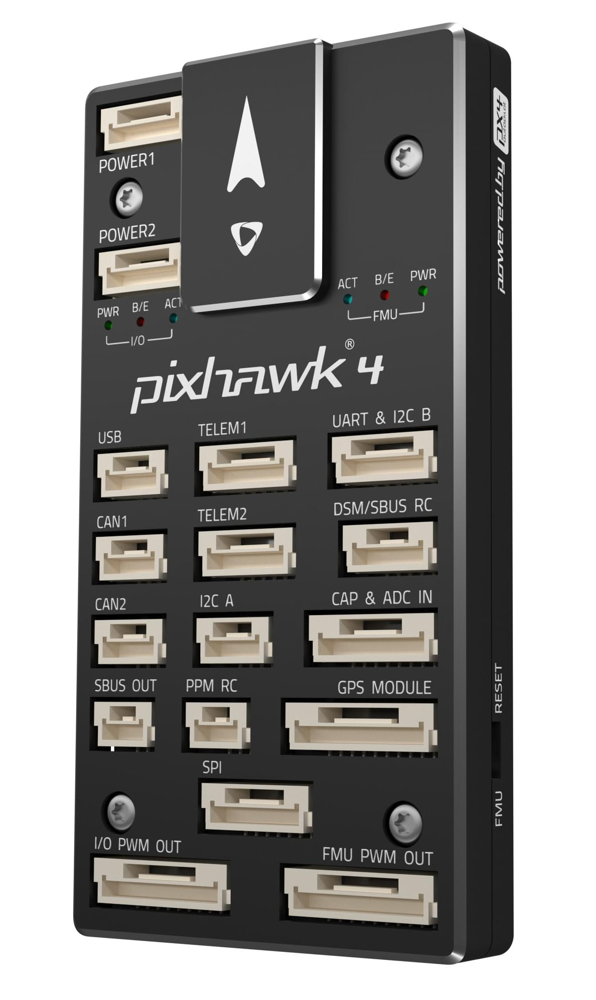
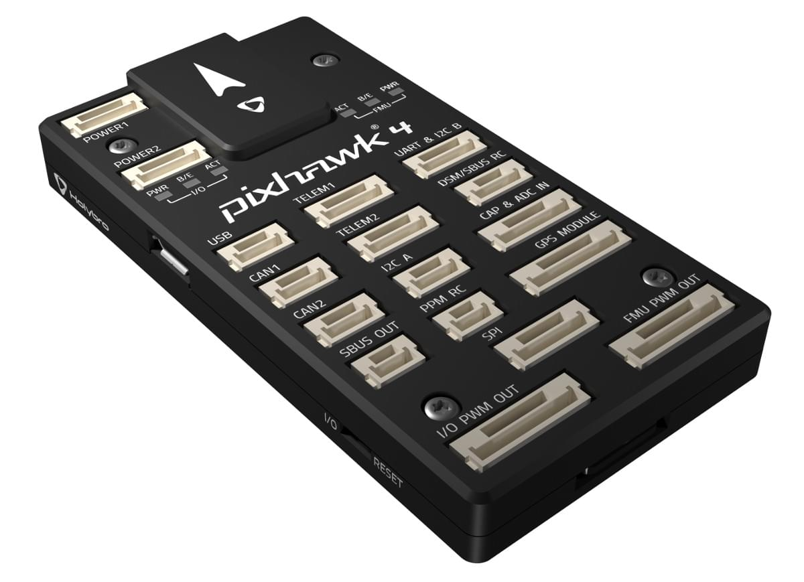
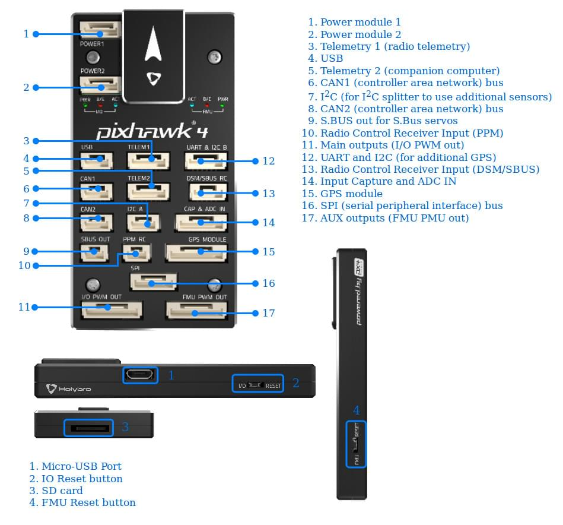
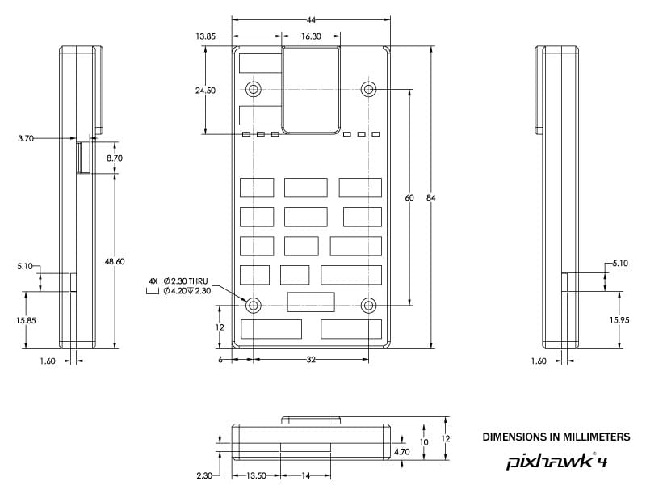
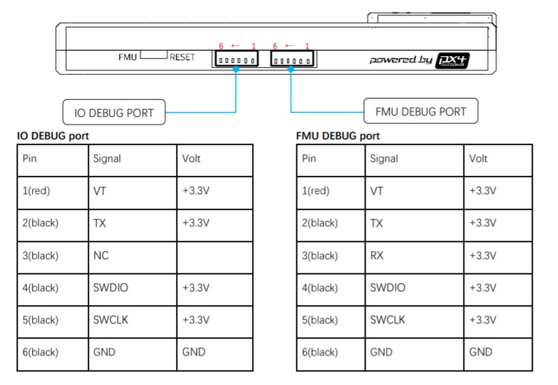

# Pixhawk 4

:::warning PX4에서는 이 제품을 제조하지 않습니다. 하드웨어 지원과 호환 문제는 [제조사](https://shop.holybro.com/)에 문의하십시오.
:::

*Pixhawk 4*&reg;는 Holybro&reg;와 PX4 팀이 협력하여 설계 및 제작한 고급 자동조종장치입니다. PX4 v1.7 이상의 버전 실행에 최적화되어 있으며, 학계와 업계 개발자에게 적합합니다.

[Pixhawk-project](https://pixhawk.org/) **FMUv5** 개방형 하드웨어 설계를 기반으로 [NuttX](https://nuttx.apache.org/) OS에서 PX4를 실행합니다.

 

:::tip
이 자동조종장치는 PX4 유지관리 및 테스트 팀에서 [지원](../flight_controller/autopilot_pixhawk_standard.md)합니다.
:::

## 요약

* 메인 FMU 프로세서: STM32F765 
  * 32 Bit Arm® Cortex®-M7, 216MHz, 2MB memory, 512KB RAM
* IO 프로세서: STM32F100 
  * 32 Bit Arm® Cortex®-M3, 24MHz, 8KB SRAM
* 온보드 센서 : 
  * 가속도/자이로: ICM-20689
  * 가속/자이로: BMI055
  * 자력계 : IST8310
  * 기압계: MS5611
* GPS : u-blox Neo-M8N GPS/GLONASS 수신기; 통합 자력계 IST8310
* 인터페이스: 
  * PWM 출력 8-16개(IO에서 8개, FMU에서 8개)
  * FMU의 전용 PWM / 캡처 입력 3 개
  * CPPM 전용 RC 입력
  * 아날로그/PWM RSSI 입력이있는 Spektrum/DSM 및 S.Bus 전용 RC 입력
  * 전용 S.Bus 서보 출력
  * 범용 시리얼 포트 5개
  * I2C 포트 3개
  * SPI 버스 4개
  * 직렬 ESC를 사용하는 듀얼 CAN에 최대 2 개의 CAN 버스
  * 배터리 2 개의 전압 / 전류에 대한 아날로그 입력
* 전원시스템 
  * 전원 모듈 출력: 4.9~5.5V
  * USB 전원 입력: 4.75~5.25V
  * 서보 전원 입력: 0~36V
* 중량 및 크기 
  * 무게: 15.8g
  * 크기: 44x84x12mm 
* 기타 특성: 
  * 작동 온도: -40 ~ 85°c

추가적인 정보는 [Pixhawk 4 Technical Data Sheet](https://github.com/PX4/px4_user_guide/raw/master/assets/flight_controller/pixhawk4/pixhawk4_technical_data_sheet.pdf)을 참고하십시오.

## 구매처

[Holybro](https://shop.holybro.com/pixhawk-4beta-launch_p1089.html)에서 주문 가능합니다.

## 커넥터

:::warning
**DSM/SBUS RC** 와 **PPM RC** 포트들은 RC 수신기 전용 입니다. 이 포트들에는 전원이 공급됩니다. 서보를 전원공급장치나 배터리(또는 연결된 수신기)에 절대 연결하지 마십시오.
:::

## 핀배열

*Pixhawk 4* 핀배열은 [여기](http://www.holybro.com/manual/Pixhawk4-Pinouts.pdf)에서 다운로드 하십시오.

:::note
커넥터 핀 할당은 왼쪽에서 오른쪽입니다(즉, 핀 1은 가장 왼쪽에있는 핀). 예외는 [디버그 포트](#debug_port)입니다. 아래에 표시된 것처럼 1번 핀이 맨 오른쪽에 있습니다.
:::

## 시리얼 포트 매핑

| UART   | 장치         | 포트             |
| ------ | ---------- | -------------- |
| UART1  | /dev/ttyS0 | GPS            |
| USART2 | /dev/ttyS1 | TELEM1 (흐름 제어) |
| USART3 | /dev/ttyS2 | TELEM2 (흐름 제어) |
| UART4  | /dev/ttyS3 | TELEM4         |
| USART6 | /dev/ttyS4 | RC SBUS        |
| UART7  | /dev/ttyS5 | 디버깅 콘솔         |
| UART8  | /dev/ttyS6 | PX4IO          |

## 크기

## 정격 전압

*Pixhawk 4*는 3 개의 전원이 공급되는 경우에는 전원 공급 장치의 3중 중복이 가능합니다. 이 세개의 파워 레일은: **POWER1**, **POWER2** 그리고 **USB** 입니다.

:::note
출력 전원 레일인 **FMU PWM OUT** 과 **I/O PWM OUT** (0V to 36V) 은 비행제어보드에 전원을 공급하지 않습니다.(공급받지도 않습니다). **POWER1**, **POWER2** 또는 **USB**중 하나에서 전원을 공급하여야 합니다.
:::

**정상 작동 최대 등급**

이러한 조건에서 전원은 아래의 순서대로 시스템에 전원을 공급하여야합니다.

1. **POWER1**과 **POWER2** 입력 (4.9V ~ 5.5V)
2. **USB**에 4.75V ~ 5.25V 입력

**절대 최대 등급**

아래의 조건에서 시스템은 전원을 사용하지 않지만(작동하지 않음), 그대로 유지됩니다.

1. **POWER1**과 **POWER2** 입력 (작동 범위 4.1V ~ 5.7V, 0V ~ 10V 손상되지 않음)
2. **USB** 입력(작동 범위: 4.1V ~ 5.7V, 비손상 범위: 0V ~ 6V)
3. 서보 입력 : **FMU PWM OUT** 및 **I/O PWM OUT**의 VDD_SERVO 핀 (0V ~ 42V 손상되지 않음)

## 조립 및 설정

[Pixhawk 4 배선 개요](../assembly/quick_start_pixhawk4.md)는 GPS, 전원 관리 보드 등을 포함한 필수 주변 장치 조립방법을 설명합니다.

## 펌웨어 빌드

::::tip 대부분의 사용자들은 펌웨어를 빌드할 필요는 없습니다. 하드웨어가 연결되면 *QGroundControl*에 의해 사전 구축되고 자동으로 설치됩니다.
:::

이 대상에 대한 [PX4 빌드](../dev_setup/building_px4.md) :

    make px4_fmu-v5_default
    

## 디버그 포트

[PX4 시스템 콘솔](../debug/system_console.md)과 [SWD 인터페이스](../debug/swd_debug.md)는 **FMU 디버그** 포트에서 실행되며 I/O 콘솔 및 SWD 인터페이스는 ** I/O 디버그** 포트를 통하여 액세스할 수 있습니다.. 이 포트에 액세스하려면 * Pixhawk 4* 케이스를 제거하여야 합니다.

핀배열은 표준 [Pixhawk 디버그 커넥터 핀배열](https://pixhawk.org/pixhawk-connector-standard/#dronecode_debug)을 사용합니다. 배선 정보는 다음을 참조하십시오.

* [시스템 콘솔 &gt; Pixhawk 디버그 포트](../debug/system_console.md#pixhawk_debug_port)

## 주변 장치

* [디지털 대기속도 센서](https://store-drotek.com/848-sdp3x-airspeed-sensor-kit-sdp33.html)
* [텔레메트리 라디오 모듈](../telemetry/README.md)
* [거리계/거리 센서](../sensor/rangefinders.md)

## 지원 플랫폼 및 기체

일반 RC 서보 또는 Futaba S-Bus 서보로 제어 가능한 모든 멀티콥터/비행기/로버 또는 보트. 지원되는 운송체의 설정은 [기체 프레임 정의서](../airframes/airframe_reference.md)를 참고하십시오.

## 추가 정보

* [Pixhawk 4 기술 데이터 시트](https://github.com/PX4/px4_user_guide/raw/master/assets/flight_controller/pixhawk4/pixhawk4_technical_data_sheet.pdf)
* [FMUv5 참조 설계 핀배열](https://docs.google.com/spreadsheets/d/1-n0__BYDedQrc_2NHqBenG1DNepAgnHpSGglke-QQwY/edit#gid=912976165).
* [Pixhawk 4 배선 개요](../assembly/quick_start_pixhawk4.md)
* [Pixhawk 4 핀배열](http://www.holybro.com/manual/Pixhawk4-Pinouts.pdf) (Holybro)
* [Pixhawk 4 빠른 시작 가이드 (Holybro)](http://www.holybro.com/manual/Pixhawk4-quickstartguide.pdf)