# Holybro Pixhawk Mini (Discontinued)

:::warning PX4에서는 이 제품을 제조하지 않습니다. Contact the [manufacturer](https://holybro.com/) for hardware support or compliance issues. :::

The Holybro *Pixhawk<sup>&reg;</sup> Mini* autopilot is a next-generation evolution of the Pixhawk. 원래 Pixhawk의 약 1/3 크기이며 더 강력한 프로세서와 센서를 제공합니다.

Pixhawk 미니는 PX4 오픈 하드웨어 프로젝트를 기반으로하며 PX4 플라이트 스택에 최적화되었습니다.

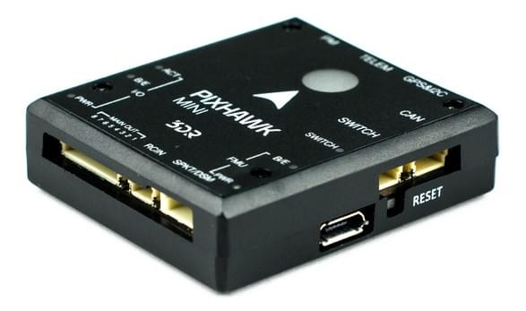

배선 방법은 [여기](#wiring)를 참고하십시오.

:::note
이 비행 컨트롤러는 HobbyKing<sup>&reg;</sup>와 3DR에서 공동으로 설계하였습니다. It was formerly known as the 3DR Pixhawk Mini. :::

:::tip
이 자동조종장치는 PX4 유지관리 및 테스트 팀에서 [지원](../flight_controller/autopilot_pixhawk_standard.md)합니다. :::

## 사양

**프로세서:**

- **주 프로세서:** STM32F427 Rev 3
- **IO 프로세서:** STM32F103

**센서:**

- **가속/자이로/자력:** MPU9250
  - PX4 펌웨어에서 [지원 중단](https://github.com/PX4/PX4-Autopilot/pull/7618)
- **가속/자이로:** ICM20608
- **기압계:** MS5611

**정격 전압:**

- **전원 모듈 출력:** 4.1\~5.5V
- **최대 입력 전압:** 45V (10S LiPo)
- **최대 전류 감지:** 90A
- **USB 전원 입력:** 4.1\`5.5V
- **서보 레일 입력:** 0\~10V

**인터페이스:**

- UART 직렬 포트 (GPS 용) 1개
- Spektrum DSM/DSM2/DSM-X® Satellite 호환 입력
- Futaba S BUS® 호환 RC 입력
- PPM 합계 신호 RC 입력
- I2C (디지털 센서용)
- CAN (for digital motor control with compatible controllers)
- ADC (for analog sensors)
- 마이크로 USB 소켓

**중량과 크기 :**

- **크기:** 38x43x12mm
- **중량:** 15.8g

**GPS 모듈 (키트와 함께 제공) :**

- **GNSS 수신기:** u-blox<sup>&reg;</sup> Neo-M8N; 나침반 HMC5983
- **중량:** 22.4g
- **크기:** 37x37x12mm

## 구매처

Discontinued.

## 커넥터 할당

`<To be added>`

## 특징

Pixhawk 미니의 주요 특징은 다음과 같습니다.

- NuttX RTOS 실행 고급 32 비트 ARM Cortex® M4 프로세서
- PWM/Servo 출력 8개
- Multiple connectivity options for additional peripherals (UART, I2C, CAN)
- 중복 전원공급장치 및 자동 장애 조치
- 간편한 모터 활성화를 위한 통합 안전 스위치 및 옵션 외부 안전 버튼
- 다색 LED 표시기
- 통합 멀티톤 피에조 오디오 표시기
- 장기간 고속 로깅을 위한 microSD 카드
- Easy-to-use Micro JST connectors

Pixhawk 미니는 새로운 **GPS 모듈**과 함께 제공됩니다.

- u-blox M8N 기반
- 최대 3 개의 GNSS(GPS, Galileo, GLONASS, BeiDou) 동시 수신
- Industry leading -167 dBm navigation sensitivity
- 보안 및 무결성 보호
- 모든 위성 증강 시스템 지원
- 고급 재밍 및 스푸핑 감지
- 성능 및 비용 요구 사항을 충족하는 제품 변형

## 키트 패키지

The _Pixhawk Mini_ is shipped with the following contents:

| 부품                                                                 | 이미지                                                                                                                      |
| ------------------------------------------------------------------ | ------------------------------------------------------------------------------------------------------------------------ |
| 픽스호크 미니 자동항법장치                                                     | 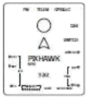                                         |
| GPS 모듈                                                             | 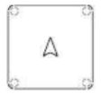                        |
| 쿼드 배전 보드                                                           | 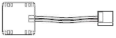          |
| 8 채널 PWM 브레이크 아웃 보드                                                | 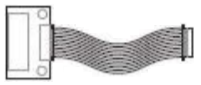 |
| 4 핀 케이블 (I2C 용)                                                    | 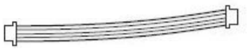                      |
| PPM/SBUS용 RC-in 케이블                                                | 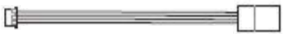                 |
| GPS 및 추가 I2C 장치용 6 ~ 6/4 ‘Y’ 어댑터                                   | 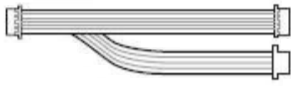         |
| 6 pin cable (2) (for power distribution board and for compass/gps) | 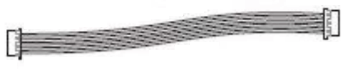                             |
| 레거시 원격 측정 라디오를 위한 6 핀 JST-DF13                                     | 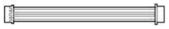             |
| 안전 스위치                                                             | 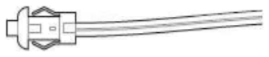                            |
| 8 채널 PWM 브레이크아웃 케이블                                                | 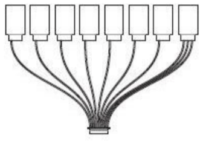 |
| 장착 폼                                                               |                                              |
| I2C 브레이크 아웃 보드? - not listed parts on handout                      | -                                                                                                                        |

## 옵션 액세서리

- 텔레메트리 라디오 세트 : 915MHz (미국), 433MHz (유럽) :::note
3DR 텔레메트리 설치시 함께 제공되는 커넥터가 아닌 Pixhawk Mini와 함께 제공되는 커넥터를 사용하십시오.
:::

- 3DR 10S 전원 모듈
- WiFi 텔레메트리
- 디지털 대기속도 센서

## 호환성

### RC 라디오

- PPM 출력 RC 수신기
- Spektrum DSM RC 수신기
- Futaba S BUS RC 수신기

### ESC

- All standard PWM input ESCs

## 커넥터 핀 할당(핀 배열)

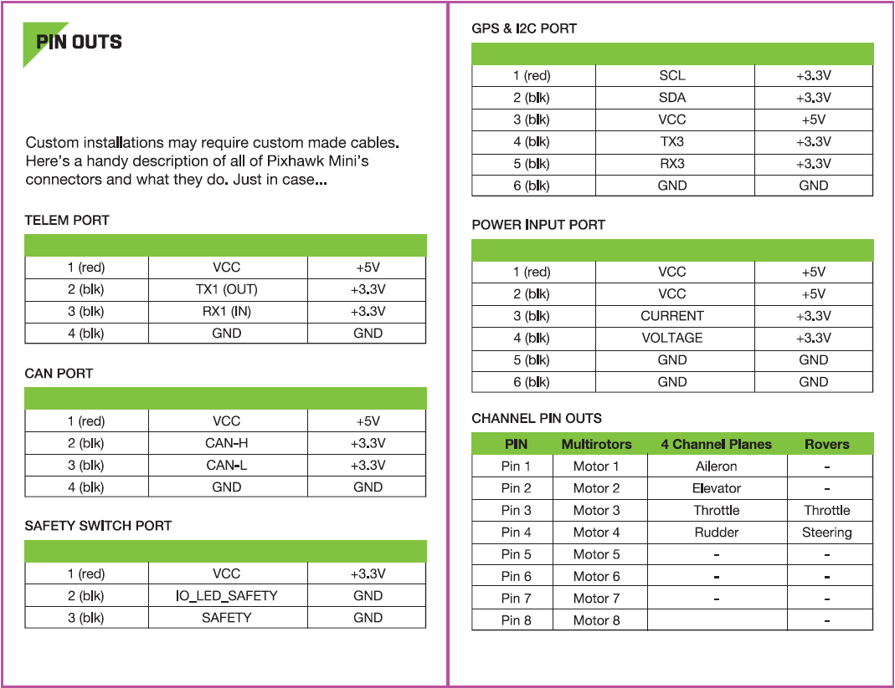

## 제품 비교

### Pixhawk 미니와 Pixhawk(원본) 비교

- 크기의 1/3 - 50x81.5x15.5mm에서 38x43x12mm까지.
- 2MB 플래시 메모리를 최대한 활용하기위한 Rev 3 프로세서.
- 1차 및 2차 IMU MPU9250 및 ICM20608 모두 개선된 센서. The result is more stable, more reliable flight and navigation.
- GPS + 나침반 모듈이 포함되어 있습니다. GLONASS를 지원하는 Neo M8N이 특징입니다. 나침반 HMC5983. 더 빠르고 강력한 GPS 잠금을 기대하십시오.
- DF-13 대체 마이크로 JST 커넥터. 작업이 훨씬 용이합니다.
- 통합 피에조 스피커 및 안전 스위치.
- 기본적으로 포함된 PDB로 4S 배터리를 지원합니다.

### Pixhawk 미니와 Pixfalcon 비교

- 1차 및 2차 IMU MPU9250 및 ICM20608 모두 개선된 센서. 더 나은 진동 처리와 신뢰성을 기대하십시오.
- UAVCAN 지원 CAN 인터페이스.
- 전력 PWM 출력이 필요한 비행기와 기타 차량용 8 채널 브레이크아웃 서보 레일이 포함되어 있습니다.
- 총 5 개의 I2C 연결용 I2C 브레이크아웃 보드를 포함합니다.
- 유사 크기.

Pixhawk 미니는 ST Microelectronics®의 고급 프로세서 및 센서 기술과 NuttX 실시간 운영체제로 자율 주행 차량을 제어에 뛰어난 성능, 유연성 및 안정성을 제공합니다.

## 알려진 문제

- 일부 Pixhawk 미니에는 내부 MPU9250 IMU를 신뢰할 수 없게 만드는 [하드웨어 결함](https://github.com/PX4/PX4-Autopilot/issues/7327#issuecomment-317132917)이 있습니다.
  - 이 문제는 [제조업체에 의해 수정되었으며](https://github.com/PX4/PX4-Autopilot/issues/7327#issuecomment-372393609), 이전 하드웨어 버전에만 존재합니다.
  - 특정 보드가 영향 여부를 확인하려면, 보드를 잠시 분리한 상태에서 전원을 켜고 PX4 명령 줄에서 mpu9250 드라이버를 시작하십시오. 보드가 영향을 받으면, 드라이버가 시작되지 않습니다.
  - MPU9250은 PX4 펌웨어에서 [기본적으로 비활성화되어 있습니다](https://github.com/PX4/PX4-Autopilot/pull/7618).
  - 결함이 존재하는 Pixhawk 미니는 실내에서도 외부 자력계 또는 부착된 GPS 없이는 보정되지 않습니다.
  - 외부 GPS를 사용하는 경우 보조 ICM20608은 가속도계와 자이로를 제공하고 외부 GPS는 자력계를 제공하므로 [문제가 되지않습니다](https://github.com/PX4/PX4-Autopilot/pull/7618#issuecomment-320270082).

<a id="wiring"></a>

## 배선 개요

:::warning
The _Pixhawk Mini_ is no longer manufactured or available from 3DR. :::

This quick start guide shows how power the [Pixhawk Mini](../flight_controller/pixhawk_mini.md) and connect its most important peripherals.

### 배선 개요 챠트

The image below shows standard _quadcopter_ wiring using the _Pixhawk Mini Kit_ and 3DR Telemetry Radios (along with ESC, motor, battery and a ground control station running on a phone). 다음 섹션에서 각 장치에 대해 자세히 설명합니다.


:::note
출력 배선/전원은 차량 유형에 따라 약간의 차이가 있습니다. VTOL, Plane, Copter에 대해서는 아래에서 자세히 설명합니다.
:::

### 콘트롤러 장착 및 장착 방향

The _Pixhawk Mini_ should be mounted on the frame using vibration-damping foam pads (included in the kit). It should be positioned as close to your vehicle's center of gravity as possible, oriented top-side up with the arrow points towards the front of the vehicle.

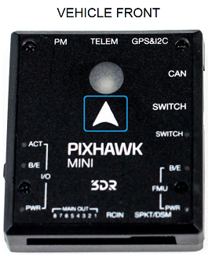


:::note
If the controller cannot be mounted in the recommended/default orientation (e.g. due to space constraints) you will need to configure the autopilot software with the orientation that you actually used: [Flight Controller Orientation](../config/flight_controller_orientation.md). :::

### GPS와 나침반

제공된 6핀 케이블을 사용하여 3DR GPS + Compass를 Pixhawk 미니의 **GPS & I2C** 포트(오른쪽 상단)에 연결합니다. GPS/나침반은 차량 전명 방향 표시를 사용하여 가능한 한 다른 전자 장치에서 멀리 떨어진 프레임에 장착해야합니다 (나침반을 다른 전자 장치와 분리하면 간섭이 줄어듦).

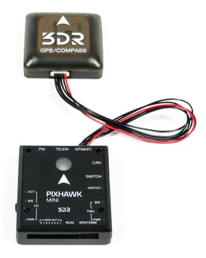

참고 - 두 포트를 모두 표시하는 삽입 이미지? 또는 GPS & I2C의 전면 이미지

The compass must be calibrated before it is first used: [Compass Calibration](../config/compass.md)

### 전원

The image below shows typical power-supply wiring when using _Pixhawk Mini_ in a Quadcopter. This uses the _Quad Power Distribution Board_ that comes in the kit to supply both the Pixhawk Mini and the ESC/Motor from the battery (and can also power other accessories).

:::note
The _Quad Power Distribution Board_ includes a power module (PM) that is suitable for batteries <= 4S. The _3DR 10S Power Module_ (Discontinued) is recommended if you need more power. :::

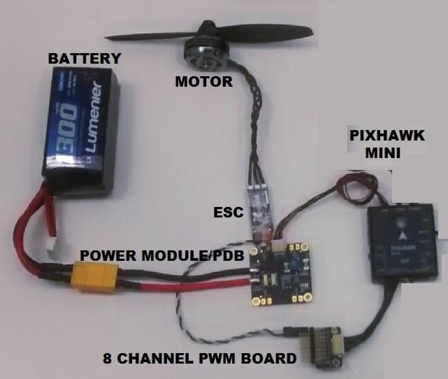

The _Pixhawk Mini_ is powered through the **PM** port. 전원 모듈 시용시 포트를 통하여 아날로그 전압과 전류를 측정합니다.

배전반에서 최대 4 개의 ESC에 개별적으로 전원을 공급할 수 있습니다 (이 경우 하나만 연결되어 있음).

제어 신호는 MAIN OUT에서 나옵니다. In this case there is only one control channel, which is connected to the ESC via the _8 Channel PWM Breakout Board_.

Pixhawk 미니 출력 레일 (MAIN OUT)은 연결된 장치에 전원을 공급할 수 없습니다(그림과 같이 회로에 필요하지 않음). MAIN OUT이 전력을 끌어 오는 장치(예 : 비행기에서 사용되는 서보)에 연결된 차량의 경우 BEC (배터리 제거 회로)를 사용하여 레일에 전원을 공급하여야 합니다. The included breakout board allows one channel to provide power on the other outputs.

### Radio Control

Pixhawk 미니는 다양한 무선 수신기 모델을 지원합니다.

- Spektrum 및 DSM 수신기는 **SPKT/DSM** 포트에 연결하여야 합니다.

  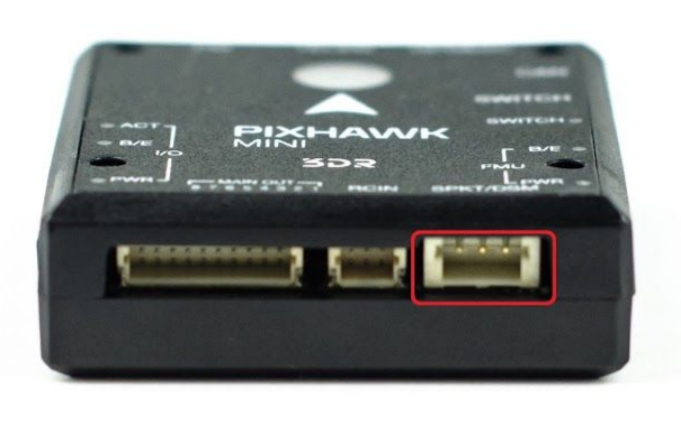

- PPM-SUM과 S.버스 수신기는 **RCIN** 포트에 연결합니다.

  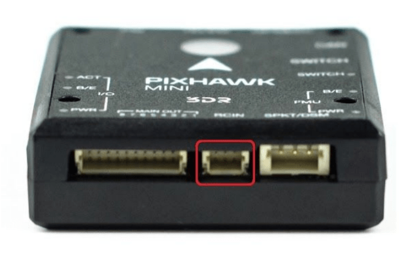

- PPM and PWM receivers that have an _individual wire for each channel_ must connect to the **RCIN** port _via a PPM encoder_ [like this one](http://www.getfpv.com/radios/radio-accessories/holybro-ppm-encoder-module.html) (PPM-Sum receivers use a single signal wire for all channels).

For more information about selecting a radio system, receiver compatibility, and binding your transmitter/receiver pair, see: [Remote Control Transmitters & Receivers](../getting_started/rc_transmitter_receiver.md).

### 안전 스위치(선택 사항)

컨트롤러에는 자동조종장치가 이륙 준비가 되면 모터 활성화를 위한 안전 스위치가 있습니다. 특정 기체에서 이 스위치에 접근하기 어려운 경우에는 아래와 같이 외부 안전 버튼(선택 사항)을 장착할 수 있습니다.

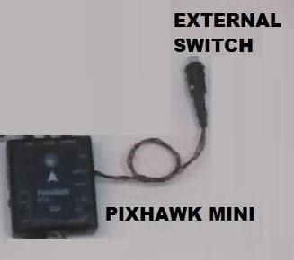

### Telemetry Radios

### 모터

지원되는 모든 기체의 MAIN/AUX 출력 포트와 모터/서보 간의 매핑은 [기체 정의서](../airframes/airframe_reference.md)에 기술되어 있습니다.

:::warning
The mapping is not consistent across frames (e.g. you can't rely on the throttle being on the same output for all plane frames).
가지고 있는 기체의 프레임에 대해 올바르게 모터를 제대로 연결하였는지 다시 한 번 확인하십시오.
:::

:::tip
프레임이 기체 참조 목록에 없으면, 올바른 유형의 "일반"기체를 사용하십시오.
:::

참고:

- 출력 레일은 위의 [전원](#power) 섹션에 설명과 같이 별도의 전원이 공급되어야 합니다.
- Pixhawk 미니는 QuadPlane VTOL 기체에 사용할 수 없습니다. 이는 QuadPlane에 9 개의 출력(메인 4 개, AUX 5 개)이 필요하고, Pixhawk 미니에는 8 개의 출력 (8 메인)만 필요하기 때문입니다.

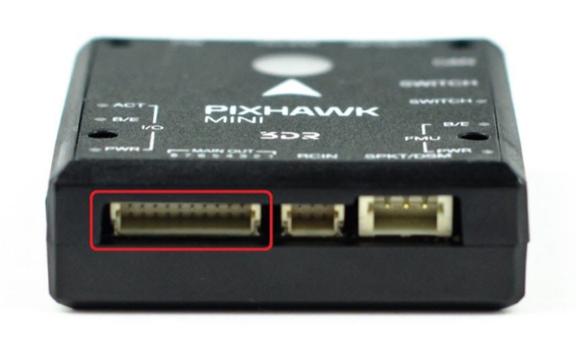

### 기타 주변 장치

선택적인 주변 장치의 배선과 설정은 개별 [주변 장치](../peripherals/README.md)에서 기술합니다.

### 설정

더 자세한 일반 설정 방법은 [자동항법장치 설정](../config/README.md)을 참고하십시오.

QuadPlane에 대한 자세한 설정은 [QuadPlane VTOL 설정](../config_vtol/vtol_quad_configuration.md)에서 다룹니다.

## 펌웨어 빌드

::::tip 대부분의 사용자들은 펌웨어를 빌드할 필요는 없습니다. It is pre-built and automatically installed by _QGroundControl_ when appropriate hardware is connected. :::

이 대상에 대한 [PX4 빌드](../dev_setup/building_px4.md) 방법 :

```
make px4_fmu-v3_default
```

## 디버그 포트

This board does not have a debug port (i.e it does not have a port for accessing the [System Console](../debug/system_console.md) or [SWD interface](../debug/swd_debug.md)).

개발자는 SWD용 보드 테스트 패드와 STM32F4 (IC) TX와 RX에 와이어를 납땜하여 콘솔을 획득할 수 있습니다.
