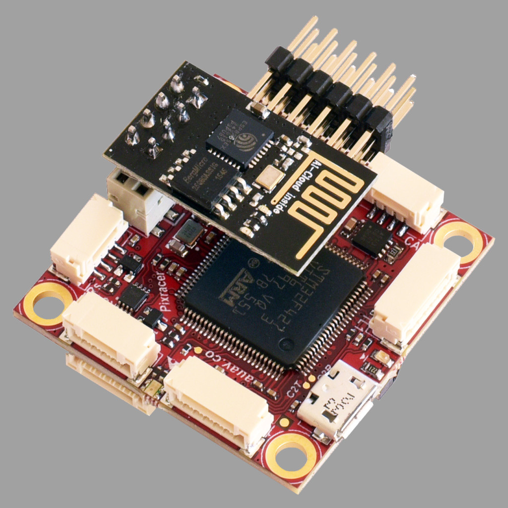
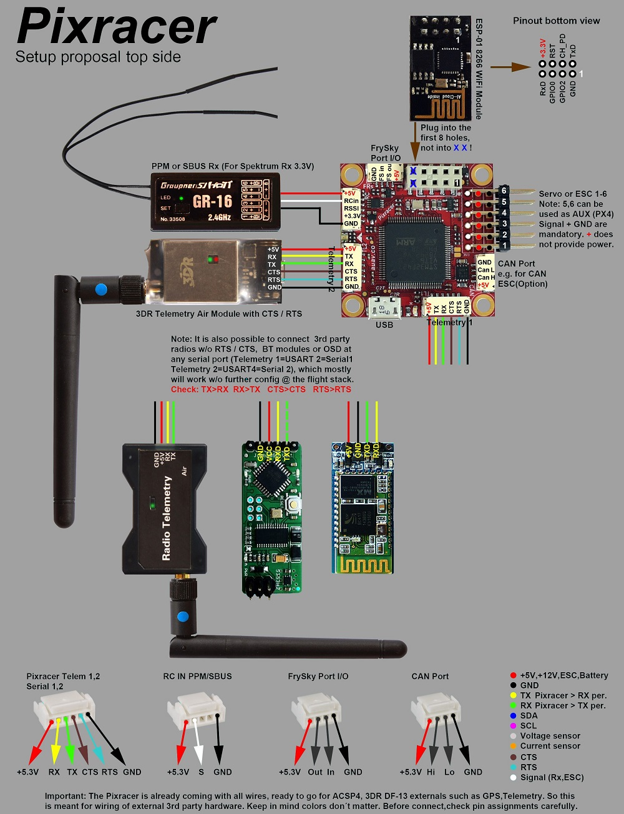
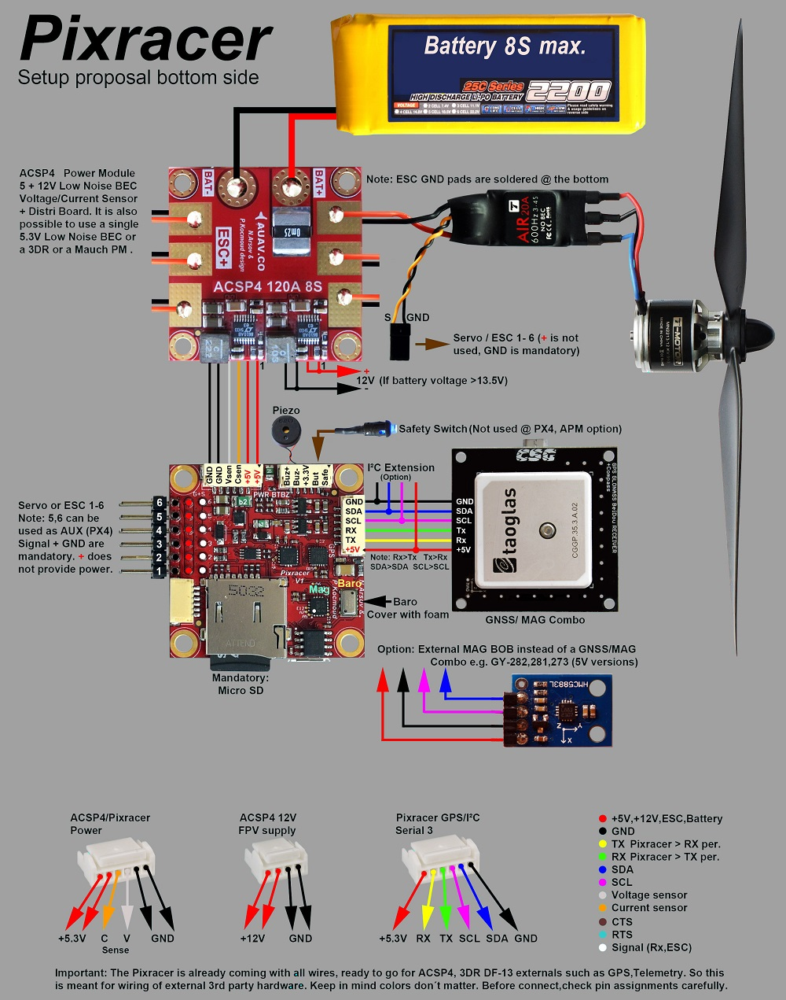
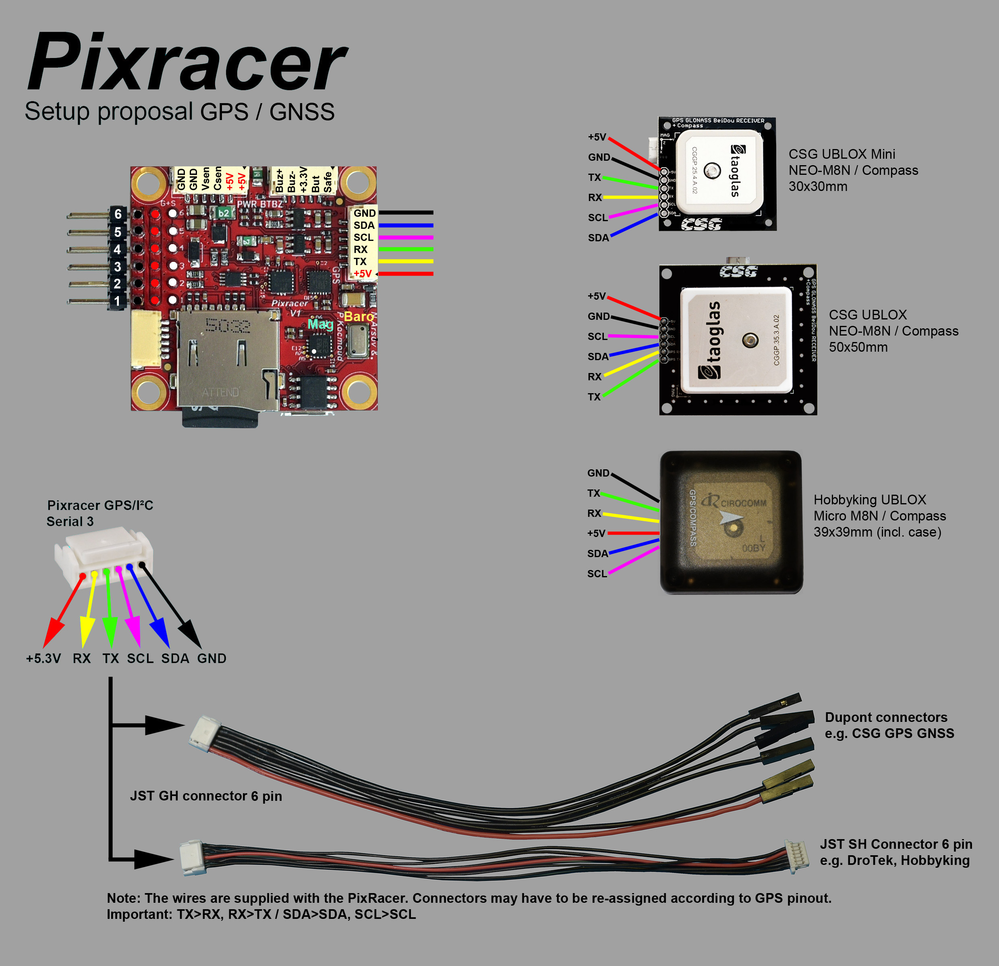
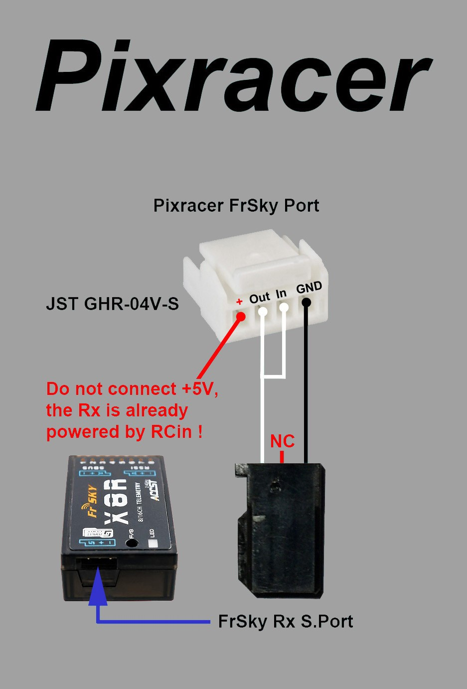
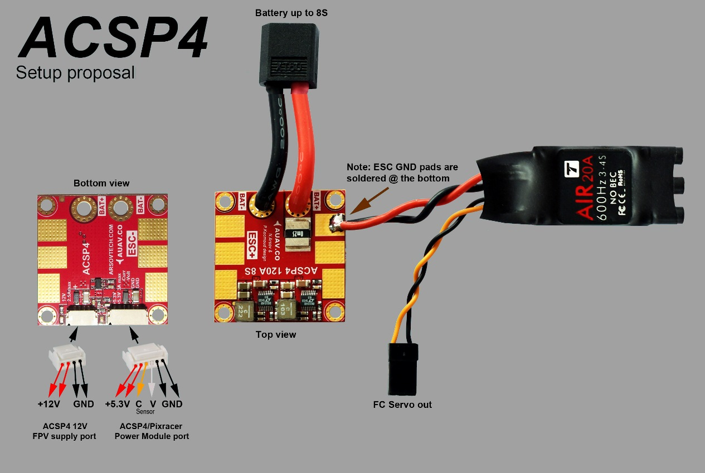
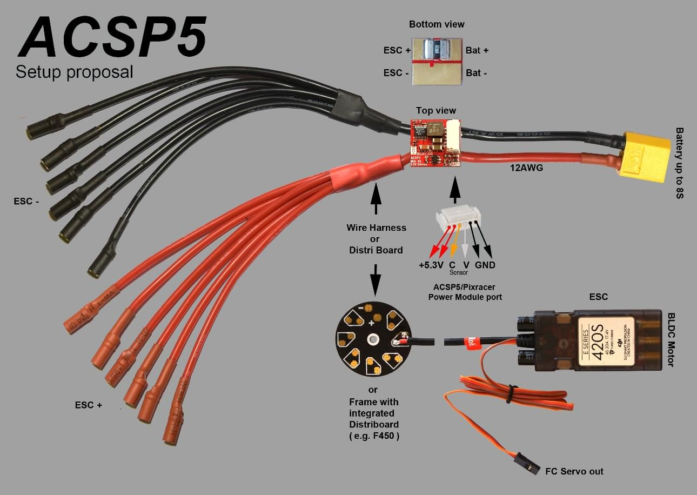
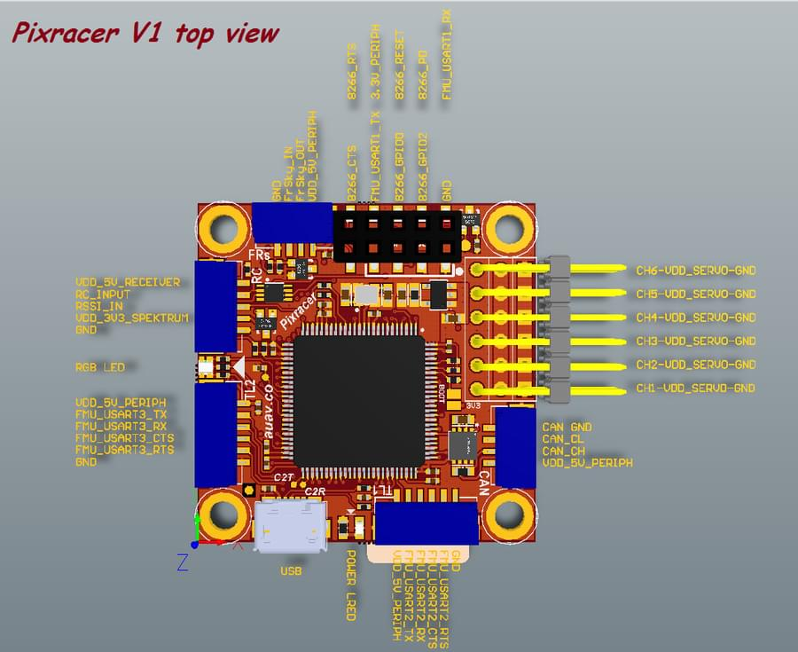
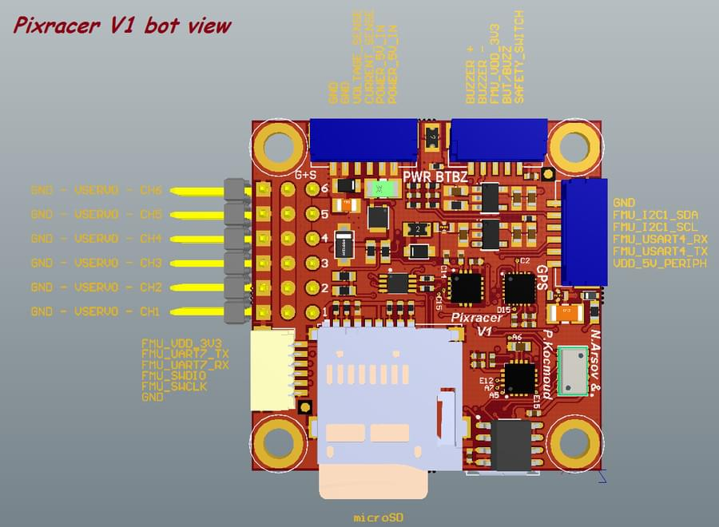
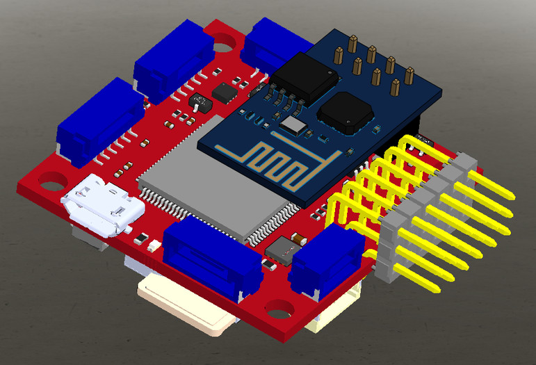

# mRo Pixracer

:::warning PX4에서는 이 제품을 제조하지 않습니다. 하드웨어 지원과 호환 문제는 [제조사](https://store.mrobotics.io/)에 문의하십시오.
:::

Pixhawk&reg; XRacer 보드 제품군은 소형 레이싱 쿼드와 비행기에 최적화되어 있습니다. [Pixfalcon](../flight_controller/pixfalcon.md)과 [Pixhawk](../flight_controller/pixhawk.md)와 달리 와이파이, 새로운 센서, 편리한 전체 서보 헤더, CAN 및 2M 플래시를 지원합니다.

:::tip
이 자동조종장치는 PX4 유지관리 및 테스트 팀에서 [지원](../flight_controller/autopilot_pixhawk_standard.md)합니다.
:::

## 주요 특징

* 메인 시스템 온 칩 : [STM32F427VIT6 rev.3](http://www.st.com/web/en/catalog/mmc/FM141/SC1169/SS1577/LN1789) 
  * CPU : 단정밀도 FPU의 180MHz ARM Cortexex&reg; M4
  * RAM : 256KB SRAM (L1)
* 표준 FPV 폼 팩터 : 36x36mm, 표준 30.5mm 구멍 패턴
* Invensense&reg; ICM-20608 가속 / 자이로 (4KHz) / MPU9250 가속 / 자이로 / 마그 (4KHz)
* 온도 보상 기능 HMC5983 자력계
* Measurement Specialties MS5611 기압계
* JST GH 커넥터
* microSD (로깅)
* Futaba S.BUS 및 S.BUS2 / Spektrum DSM2 및 DSMX / Graupner SUMD / PPM 입력 / Yuneec ST24
* FrSky&reg; 텔레메트리 포트
* OneShot PWM 출력 (구성 가능)
* 옵션 : 안전 스위치 및 부저

## 구매처

Pixracer는 [mRobotics.io](https://store.mrobotics.io/mRo-PixRacer-R15-Official-p/auav-pxrcr-r15-mr.htm)에서 사용할 수 있습니다.

액세서리에는 다음이 포함됩니다.

* [디지털 대기속도 센서](https://hobbyking.com/en_us/hkpilot-32-digital-air-speed-sensor-and-pitot-tube-set.html)
* [HK 텔레프레전스 세트 V2 (915Mhz - US 텔레메트리)](https://hobbyking.com/en_us/hkpilot-transceiver-telemetry-radio-set-v2-915mhz.html)
* [Hobbyking&reg; OSD + EU 텔레메트리 (433 MHz)](https://hobbyking.com/en_us/micro-hkpilot-telemetry-radio-module-with-on-screen-display-osd-unit-433mhz.html)

## 키트

Pixracer는 별도의 항공전자기기 전원공급장치를 사용하도록 설계되었습니다. 이는 모터 또는 ESC의 전류 서지가 비행 컨트롤러로 다시 흐르고 섬세한 센서를 방해하는 것을 방지하는 데 필요합니다.

* 전원 모듈(전압 및 전류 감지 포함)
* I2C 스플리터(AUAV, Hobbyking 및 3DR&reg; 주변 장치 지원)
* 모든 일반 주변기기용 케이블 키트

## Wi-Fi(USB 필요 없음)

보드의 주요 기능중 하나는 새 펌웨어, 시스템 설정과 기내 원격 측정을 위해 Wi-Fi를 사용할 수 있는 것입니다. 이를 통해 데스크탑 시스템이 필요없습니다.

::note ToDo 설정 및 원격 측정이 사용 가능하며, 펌웨어 업그레이드는 기본 부트로더에서 지원되지만, 아직 활성화되지 않았습니다.
:::

* [ESP8266 Wifi](../telemetry/esp8266_wifi_module.md)
* [맞춤형 ESP8266 MAVLink 펌웨어](https://github.com/dogmaphobic/mavesp8266)

## 배선 다이어그램

## 커넥터

모든 커넥터는 [Pixhawk 커넥터 표준](https://pixhawk.org/pixhawk-connector-standard/)을 준수합니다. 명시된 것이 없으면, 모든 커넥터는 JST GH입니다.

## 핀배열

#### TELEM1, TELEM2+OSD 포트

| 핀     | 신호       | 전압    |
| ----- | -------- | ----- |
| 1 (적) | VCC      | +5V   |
| 2 (흑) | TX (출력)  | +3.3V |
| 3 (흑) | RX (입력)  | +3.3V |
| 4 (흑) | CTS (입력) | +3.3V |
| 5 (흑) | RTS (출력) | +3.3V |
| 6 (흑) | GND      | GND   |

#### GPS 포트

| 핀     | 신호       | 전압    |
| ----- | -------- | ----- |
| 1 (적) | VCC      | +5V   |
| 2 (흑) | TX (출력)  | +3.3V |
| 3 (흑) | RX (입력)  | +3.3V |
| 4 (흑) | I2C1 SCL | +3.3V |
| 5 (흑) | I2C1 SDA | +3.3V |
| 6 (흑) | GND      | GND   |

#### FrSky 텔레메트리/SERIAL4

| 핀     | 신호      | 전압    |
| ----- | ------- | ----- |
| 1 (적) | VCC     | +5V   |
| 2 (흑) | TX (출력) | +3.3V |
| 3 (흑) | RX (입력) | +3.3V |
| 4 (흑) | GND     | GND   |

#### RC 입력(PPM/S.BUS/Spektrum/SUMD/ST24 허용)

| 핀     | 신호      | 전압    |
| ----- | ------- | ----- |
| 1 (적) | VCC     | +5V   |
| 2 (흑) | RC 입력   | +3.3V |
| 3 (흑) | RSSI 입력 | +3.3V |
| 4 (흑) | VDD 3V3 | +3.3V |
| 5 (흑) | GND     | GND   |

#### CAN

| 핀     | 신호    | 전압   |
| ----- | ----- | ---- |
| 1 (적) | VCC   | +5V  |
| 2 (흑) | CAN_H | +12V |
| 3 (흑) | CAN_L | +12V |
| 4 (흑) | GND   | GND  |

#### 전원

| 핀     | 신호  | 전압    |
| ----- | --- | ----- |
| 1 (적) | VCC | +5V   |
| 2 (흑) | VCC | +5V   |
| 3 (흑) | 전류  | +3.3V |
| 4 (흑) | 전압  | +3.3V |
| 5 (흑) | GND | GND   |
| 6 (흑) | GND | GND   |

#### 스위치

| 핀     | 신호               | 전압    |
| ----- | ---------------- | ----- |
| 1 (적) | SAFETY           | GND   |
| 2 (흑) | !IO_LED_SAFETY | GND   |
| 3 (흑) | VCC              | +3.3V |
| 4 (흑) | BUZZER-          | -     |
| 5 (흑) | BUZZER+          | -     |

#### 디버그 포트

[Pixhawk 디버그 포트](https://pixhawk.org/pixhawk-connector-standard/#dronecode_debug)(JST SM06B 커넥터)입니다.

| 핀     | 신호               | 전압    |
| ----- | ---------------- | ----- |
| 1 (적) | VCC TARGET SHIFT | +3.3V |
| 2 (흑) | CONSOLE TX (출력)  | +3.3V |
| 3 (흑) | CONSOLE RX (입력)  | +3.3V |
| 4 (흑) | SWDIO            | +3.3V |
| 5 (흑) | SWCLK            | +3.3V |
| 6 (흑) | GND              | GND   |

이 포트의 배선과 사용 정보는 다음을 참조하십시오.

* [PX4 시스템 콘솔](../debug/system_console.md#pixhawk_debug_port)(참고, FMU 콘솔은 UART7에 매핑됨).
* [SWD (JTAG) 하드웨어 디버깅 인터페이스](../debug/swd_debug.md#pixhawk_debug_port_6_pin_sh)

## 시리얼 포트 매핑

| UART   | 장치         | 포트             |
| ------ | ---------- | -------------- |
| UART1  | /dev/ttyS0 | WiFi (ESP8266) |
| USART2 | /dev/ttyS1 | TELEM1 (흐름 제어) |
| USART3 | /dev/ttyS2 | TELEM2 (흐름 제어) |
| UART4  |            |                |
| UART7  | 콘솔         |                |
| UART8  | SERIAL4    |                |

<!-- Note: Got ports using https://github.com/PX4/px4_user_guide/pull/672#issuecomment-598198434 -->

## 회로도

참고 문서는 [Altium Design Files](https://github.com/AUAV-OpenSource/FMUv4-PixRacer)에서 제공합니다. 

다음 PDF 파일은 *편의*를 위해서 제공됩니다.

* [pixracer-rc12-12-06-2015-1330.pdf](https://github.com/PX4/px4_user_guide/raw/master/assets/flight_controller/pixracer/pixracer-rc12-12-06-2015-1330.pdf)
* [pixracer-r14.pdf](https://github.com/PX4/px4_user_guide/raw/master/assets/flight_controller/pixracer/pixracer-r14.pdf) - R14 또는 RC14는 SDCard 소켓 옆에 인쇄됩니다.

## 펌웨어 빌드

::::tip 대부분의 사용자들은 펌웨어를 빌드할 필요는 없습니다. 하드웨어가 연결되면 *QGroundControl*에 의해 사전 구축되고 자동으로 설치됩니다.
:::

이 대상에 대한 [PX4 빌드](../dev_setup/building_px4.md) :

    make px4_fmu-v4_default
    

## 개발진

이 디자인은 Nick Arsov와 Phillip Kocmoud가 만들고, Lorenz Meier, David Sidrane와 Leonard Hall이 설계하였습니다.