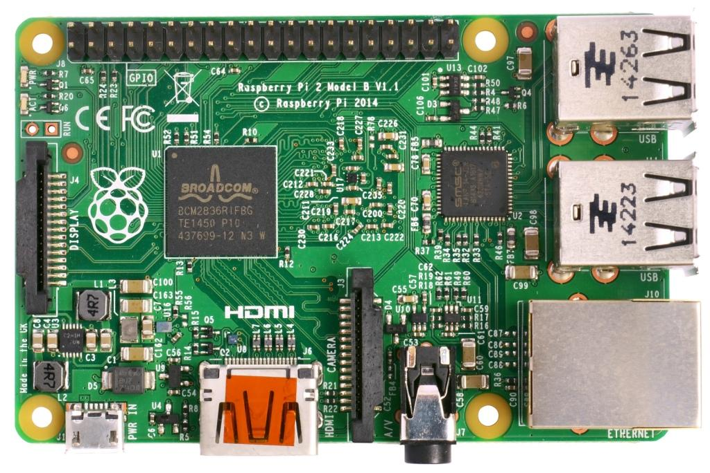

# Raspberry Pi 2/3/4 Navio2 Autopilot

:::warning PX4에서는 이 제품을 제조하지 않습니다. 하드웨어 지원과 호환 문제는 [제조사](https://emlid.com/)에 문의하십시오.
:::

:::warning
이 비행 콘트롤러에 대한 PX4는 [테스트 단계](../flight_controller/autopilot_experimental.md)입니다.
:::

This is the developer "quickstart" for Raspberry Pi 2/3/4 Navio2 autopilots. 이를 통해 PX4를 빌드하고 Raspberry Pi로 전송하거나 빌드할 수 있습니다.



## 운영체제 이미지

Use the preconfigured [Emlid Raspberry Pi OS image for Navio 2](https://docs.emlid.com/navio2/configuring-raspberry-pi). 기본 이미지에는 아래 표시된 대부분의 설정이 완료되어 있습니다.

:::warning
시스템  커널을 업그레이드 하지마십시오. 업그레이드하면 필요한 HW 지원이 없는 새 커널을 설치할 수 있습니다. `ls /sys/class/pwm`으로 확인할 수 있습니다. 디렉토리가 비어 있으면 안됩니다.
:::

## 접근 설정

The Raspberry Pi OS image has SSH setup already. 사용자 이름은 "pi"이고, 비밀번호는 "raspberry"입니다. 이 가이드에서는 사용자 이름과 암호가 기본값으로 유지된다고 가정합니다.

To setup the Pi to join your local wifi, follow [this guide](https://www.raspberrypi.org/documentation/configuration/wireless/wireless-cli.md), or connect it via an ethernet cable.

To connect to your Pi via SSH, use the default username (`pi`) and hostname (`navio`). Alternatively (if this doesn't work), you can find the IP address of your RPi and specify it.

```sh
ssh pi@navio.local
```

또는

```sh
ssh pi@<IP-ADDRESS>
```

## 파일시스템 확장

Expand the file system to take advantage of the entire SD card by running:

```sh
sudo raspi-config --expand-rootfs
```

## Navio RGB 오버레이 비활성화

기존 Navio RGB 오버레이는 PX4에서 RGB Led 용으로 사용하는 GPIO를 요구합니다. `navio-rgb` 오버레이를 활성화하는 줄에 주석을 달아 `/boot/config.txt`를 편집합니다.

```
#dtoverlay=navio-rgb
```

## 파일 전송 테스트

SCP를 사용하여 네트워크(WiFi 또는 이더넷)를 통하여 개발 컴퓨터에서 대상 보드로 파일을 전송합니다.

설정을 테스트하려면 지금 네트워크를 통해 개발 PC에서 라즈베리파이로 파일을 푸시해보십시오. 라즈베리파이에 네트워크 접근 권한이 있는 지 확인후, SSH를 사용할 수 있습니다.

```sh
echo "Hello" > hello.txt
scp hello.txt pi@navio.local:/home/pi/
rm hello.txt
```

This should copy over a "hello.txt" file into the home folder of your Pi. 파일이 실제로 복사되었는지 확인후, 다음 단계로 진행합니다.

## 코드 빌드

:::note
PX4 binaries for Navio 2 can only be built on Ubuntu 18.04.
Ubuntu 20.04 and later do not currently work (as of September 2023). 
:::

Follow the instructions below to build the source code on your development machine and transfer the compiled program to the Pi. Note that earlier versions allowed code to be built natively (on the Pi), but this option is no longer available.

### 크로스 컴파일러 빌드

First install the [standard PX4 developer environment](../dev_setup/dev_env_linux_ubuntu.md#raspberry-pi) on your Ubuntu 18.04 development computer.

Specify the IP (or hostname) of your Pi using:

```sh
export AUTOPILOT_HOST=navio.local
```

또는

```sh
export AUTOPILOT_HOST=192.168.X.X
```

:::note
The value of the environment variable should be set before the build, or `make upload` will fail to find your Pi.
:::

Build the executable file on your development machine:

```sh
cd PX4-Autopilot
make emlid_navio2
```

px4 실행 파일은 **build/emlid_navio2_native/** 디렉토리에 위치합니다. Make sure you can connect to your Pi over SSH, see [instructions how to access your Pi](#setting-up-access) following the instructions for armhf under Raspberry Pi.

다음 명령으로 업로드하십시오.

```sh
cd PX4-Autopilot
make emlid_navio2 upload
```

Then, connect over ssh and run it on the Pi (as root):

```sh
cd ~/px4
sudo ./bin/px4 -s px4.config
```

px4를 실행한 성공적인 빌드 화면은 다음과 같습니다:

```sh

______  __   __    ___
| ___ \ \ \ / /   /   |
| |_/ /  \ V /   / /| |
|  __/   /   \  / /_| |
| |     / /^\ \ \___  |
\_|     \/   \/     |_/

px4 starting.


pxh>
```

## 자동 실행

px4를 자동으로 시작하려면 **/etc/rc.local** 파일의 `exit 0` 앞 줄에 아래 내용을 추가합니다. 네이티브 빌드를 사용하는 경우 적절하게 변경하십시오.

```sh
cd /home/pi && ./bin/px4 -d -s px4.config > px4.log
```
