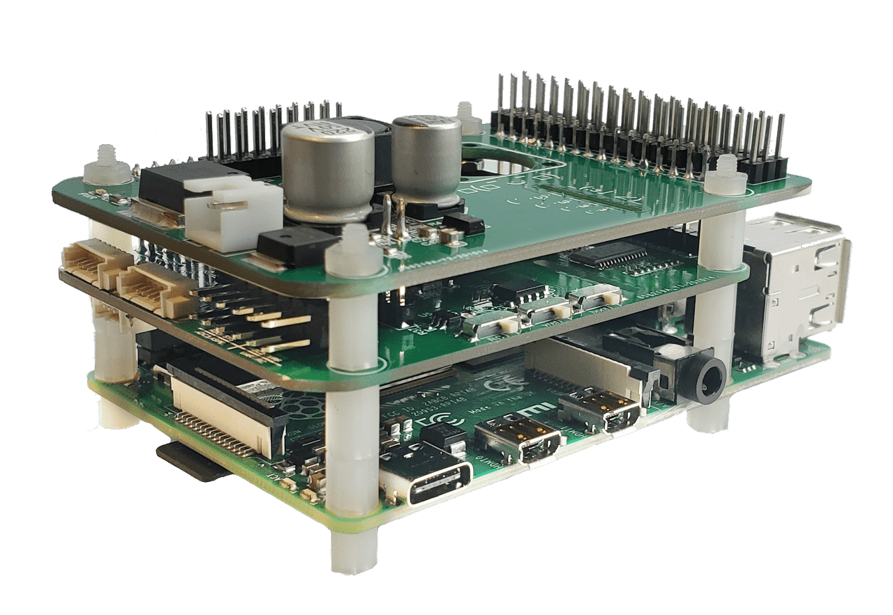
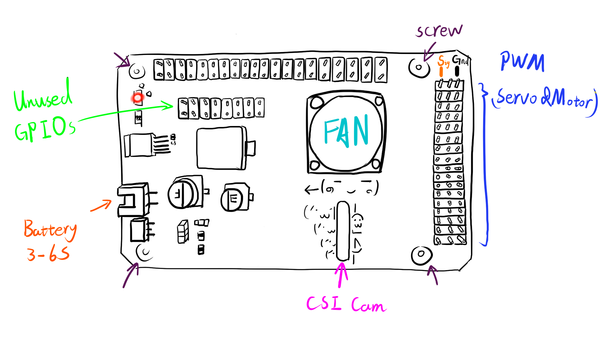
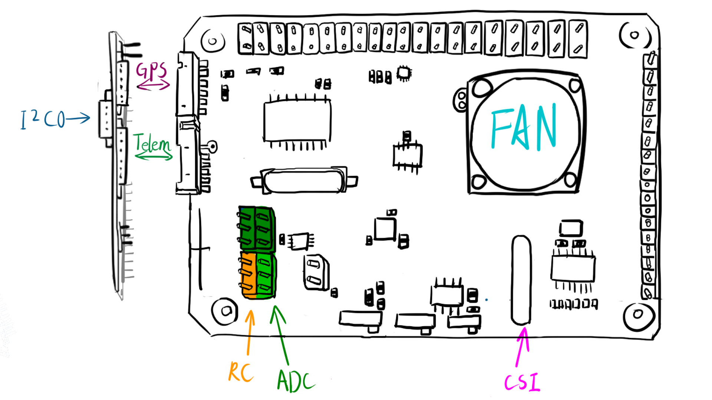

# 라즈베리파이 PilotPi 실드

:::warning PX4에서는 이 제품을 제조하지 않습니다. 하드웨어 지원과 호환 문제는 [제조사](mailto:lhf2613@gmail.com)에 문의하십시오.
:::

:::warning
이 비행 콘트롤러에 대한 PX4는 [테스트 단계](../flight_controller/autopilot_experimental.md)입니다.
:::

*PilotPi* 실드는 라즈베리파이에서 직접 PX4 자동조종장치를 실행하는 솔루션입니다. 리눅스와 PX4 측면에서 지속적으로 업데이트되고 있는, 저비용 고확장성의 플랫폼입니다. 모든 구성 요소가 라즈베리파이와 PX4 커뮤니티의 업스트림 지원을 제공하므로, 독점 드라이버가 필요하지 않습니다. PCB와 회로도도 오픈 소스입니다.

## 요약

* 지원 라즈베리파이 보드:
  * 라즈베리파이 2B/3B/3B+/4B
* 지원 운영체제:
  * 라즈베리파이 OS
  * 우분투 서버 (armhf/arm64)
* 가속도계/자이로
  * ICM42688P
* 자력계:
  * IST8310
* 기압계:
  * MS5611
* PWM:
  * PCA9685
* ADC:
  * ADS1115
* 전원:
  * 전압감지기능이 내장 3~6S 배터리.
  * USB 케이블 전원 공급
* 구매처: *배송 준비중*

## 연결성

Shield provides:

* 16x PWM outputting channels
* GPS connector
* Telemetry connector
* External I2C bus connector (**Note:** conflicts with CSI camera)
* RC input port (SBUS)
* 3x ADC channels range 0~5V
* 2\*8 2.54mm unused GPIO connector

Direct accessible from RPi:

* 4x USB connector
* CSI connector(**Note:** conflict with external I2C bus)
* etc.

## Recommended Wiring

## Pinout

:::warning
It still uses old GH1.25 connectors. Wiring is compatible with Pixhawk 2.4.8
:::

### Connectors

#### GPS connector

Mapped to `/dev/ttySC0`

| Pin | Signal | Volt |
| --- | ------ | ---- |
| 1   | VCC    | +5V  |
| 2   | TX     | +3v3 |
| 3   | RX     | +3v3 |
| 4   | NC     | +3v3 |
| 5   | NC     | +3v3 |
| 6   | GND    | GND  |

#### Telemetry connector

Mapped to `/dev/ttySC1`

| Pin | Signal | Volt |
| --- | ------ | ---- |
| 1   | VCC    | +5V  |
| 2   | TX     | +3v3 |
| 3   | RX     | +3v3 |
| 4   | CTS    | +3v3 |
| 5   | RTS    | +3v3 |
| 6   | GND    | GND  |

#### External I2C connector

Mapped to `/dev/i2c-0`

| Pin | Signal | Volt          |
| --- | ------ | ------------- |
| 1   | VCC    | +5V           |
| 2   | SCL    | +3v3(pullups) |
| 3   | SDA    | +3v3(pullups) |
| 4   | GND    | GND           |

#### RC & ADC2/3/4

RC is mapped to `/dev/ttyAMA0` with signal inverter switch on RX line.

| Pin | Signal | Volt     |
| --- | ------ | -------- |
| 1   | RC     | +3V3~+5V |
| 2   | VCC    | +5V      |
| 3   | GND    | GND      |

- ADC1 is internally connected to voltage divider for battery voltage monitoring.
- ADC2 is left unused.
- ADC3 can be connected to an analog airspeed sensor.
- ADC4 has a jumper cap between ADC and VCC, to monitor system voltage level.

| Pin | Signal | Volt   |
| --- | ------ | ------ |
| 1   | ADCx   | 0V~+5V |
| 2   | VCC    | +5V    |
| 3   | GND    | GND    |

:::note ADC3 & 4 have an alternative VCC source When 'Vref' switch is on, 'VCC' pin is driven by REF5050.
:::

#### Unused GPIO available on top of the board

| Shield Pin | BCM | WiringPi | RPi Pin |
| ---------- | --- | -------- | ------- |
| 1          | 3V3 | 3v3      | 3V3     |
| 2          | 5V  | 5V       | 5V      |
| 3          | 4   | 7        | 7       |
| 4          | 14  | 15       | 8       |
| 5          | 17  | 0        | 11      |
| 6          | 27  | 2        | 13      |
| 7          | 22  | 3        | 15      |
| 8          | 23  | 4        | 16      |
| 9          | 7   | 11       | 26      |
| 10         | 5   | 21       | 29      |
| 11         | 6   | 22       | 31      |
| 12         | 12  | 26       | 32      |
| 13         | 13  | 23       | 33      |
| 14         | 16  | 27       | 36      |
| 15         | 26  | 25       | 37      |
| 16         | GND | GND      | GND     |

### Switches

#### RC Inverter

This switch will decide the signal polarity of RX line: `UART_RX = SW xor RC_INPUT`

* On: suitable with SBUS (signal inverted)
* Off: preserved

#### Vref

ADC 3 & 4 will have VCC driven by:
* Vref output from REF5050 if on
* 5V pin directly from RPi if off

#### Boot Mode

This switch is connected to Pin22(BCM25). System rc script will check its value and decide whether PX4 should start alongside with system booting or not.

* On: start PX4 automatically
* Off: don' t start PX4

## Developer Quick Start

Refer to specific instructions for the OS running on your RPi:
- [Raspberry Pi OS Lite (armhf)](raspberry_pi_pilotpi_rpios.md)
- [Ubuntu Server (arm64 & armhf)](raspberry_pi_pilotpi_ubuntu_server.md)
