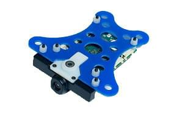

# Snapdragon 비행 자동조종장치 (단종됨)

:::warning
이 비행 컨트롤러는 [단종](../flight_controller/autopilot_experimental.md)되었습니다. 사용 방법에 대한 자세한 내용은 [PX4 사용자 가이드 v1.11](https://docs.px4.io/v1.11/en/flight_controller/snapdragon_flight.html)을 참고하십시오.

PX4에서는 이 제품을 만들지 않습니다. 하드웨어 지원과 호환 문제는 [제조사](https://www.intrinsyc.com/)에 문의하십시오.
:::

The _Qualcomm Snapdragon Flight_ platform is a high-end autopilot / onboard computer which runs the PX4 Flight Stack on the DSP on the QuRT real time operating system using the [DSPAL API](https://github.com/ATLFlight/dspal) for POSIX compatibility. [Pixhawk](../flight_controller/pixhawk.md)에 비교하여, 카메라와 WiFi, 고급 처리 능력, 기타 IO가 추가되었습니다.

