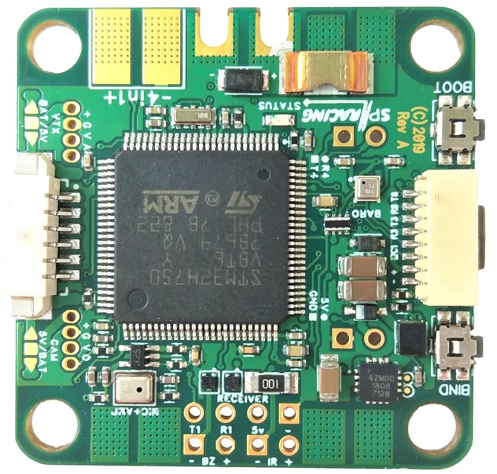

# SPRacingH7EXTREME (PX4 판)

:::warning PX4에서는 이 제품을 제조하지 않습니다. 하드웨어 지원과 호환 문제는 [제조사](https://shop.seriouslypro.com)에 문의하십시오. :::

[SPRacingH7EXTREME](https://shop.seriouslypro.com/sp-racing-h7-extreme)는 DUAL ICM20602 자이로, H7 400/480Mhz (+) CPU, 고정밀 BMP388 기압계, SD 카드 소켓, 전류 센서, 쉽게 액세스 할 수있는 8 개의 모터 출력, OSD, 마이크, 오디오 출력 등이 포함된 FC/PDB입니다.

소형에서 대형 쿼드, 평면, 옥토 콥터 및 고급 프레임에 쉽게 사용할 수 있습니다. 내장형 배전판(PDB)이 특징이므로 별도의 ESC와 함께 사용하는 것이 가장 좋습니다. 4in1 ESC 배선도 쉽습니다.

4 개의 추가 모터 출력, SPI 및 UART 연결을 제공하는 12핀 스택 커넥터도 있습니다.

:::note
이 비행 컨트롤러는 [제조업체의 지원](../flight_controller/autopilot_manufacturer_supported.md)을 받을 수 있습니다. :::

## 주요 특징

* 메인 시스템 온칩: [STM32H750VBT6 rev.y/v](https://www.st.com/en/microcontrollers-microprocessors/stm32h750vb.html)
  * CPU: 400/480Mhz (+) ARM Cortex M7 (단정밀도 FPU 포함). (Rev V CPU 사용시 + 480Mhz)
  * RAM: 1MB
  * 코드와 *설정*에 관한 메모리 매핑 모드의 16MB 외장 플래시 4 비트 QuadSPI.
* 내장 센서 :
  * 듀얼 자이로(각각 1xSPI, 별도의 인터럽트 신호 포함, 32khz 가능, fsync 가능)
  * 고정밀 BMP388 기압계(I2C + 인터럽트)
  * 110A 전류 센서
* 외부 8핀 IO 포트를 통한 GPS.
* 시청각
  * 온스크린 디스플레이 OSD(전용 SPI, 문자 기반, MAX7456)
  * 마이크 센서
  * CPU DAC에서 오디오 출력.
  * 마이크/DAC 출력용 오디오 믹서.
* 인터페이스
  * SD 카드(1 비트 SPI가 아닌 4 비트 SDIO)
  * IR 트랜스폰더(iLAP 호환)
  * 부저 회로
  * RSSI (아날로그/PWM)
  * 12개의 모터 출력(모터 패드에 의해 4개, 중간에 4개, 스태킹 커넥터에 4개).
  * 스태킹 커넥터에 대한 1x SPI 브레이크아웃
  * 직렬 포트 6개 (TX 및 RX 5 개, 텔레메트리 TX 전용 양방향 1 개)
  * 부팅 버튼 (측면 누름)
  * 바인딩/사용자 버튼 (측면 누름)
  * 수신기 포트 (모든 일반적인 프로토콜, 인버터 필요 없음)
  * CAM 소켓의 CAM OSD 제어 및 비디오 입력.
  * SWD 디버깅 포트.
* VTX 소켓의 비디오 출력 + 오디오 출력.
* OTG 기능이 있는 USB (CPU에 연결된 ID 및 VBUS)
* 전원 시스템
  * 통합 PDB.
  * 2-6S BEC
  * TVS 보호 다이오드
  * 자이로 노이즈 필터 커패시터가 있는 자이로 전용 500ma VREG.
  * CPU, Baro, 마이크 등을 위한 두 번째 500ma VREG
* 기타 기능
  * 상태 LED
  * LED 스트립 지지대 (잘 배치된 연결 패드 포함).
  * SD 카드나 외장 플래시에서 부팅 가능.
  * SD 카드에서 플래시 가능.
  * 상단 납땜 설계.
  * 배터리 와이어용 PCB 컷아웃.
  * 나침반 없음, GPS IO 포트에 연결된 자력계/나침반 센서가있는 외부 GPS를 사용하십시오.
  * Betaflight 4.x+, Cleanflight 4.x+도 실행합니다.
  * Cleanflight를 만든 사람인 Dominic Clifton이 디자인했습니다.
* 크기
  * 36x36mm, 30.5 * 30.5 장착 패턴, M4 구멍.
  * 소프트 마운트 M4 ~ M3 그로밋이 제공됩니다.

## 구매처

SPRacingH7EXTREME은 [Seriously Pro 상점](https://shop.seriouslypro.com/sp-racing-h7-extreme)에서 구입할 수 있습니다.

:::note
구매시 PX4 에디션을 선택하십시오.
:::

## 매뉴얼, 핀배열 및 연결 다이어그램

핀배열과 설명서는

여기</ 0>에서 다운로드할 수 있습니다. 다른 다이어그램은 [SPRacingH7EXTREME 웹 사이트](http://seriouslypro.com/spracingh7extreme)를 참조하십시오.
 

## 개발자

이 디자인은 [Dominic Clifton](https://github.com/hydra)에 의해 만들어졌습니다. [Igor-Misic](https://github.com/Igor-Misic)의 초기 PX4 지원.
