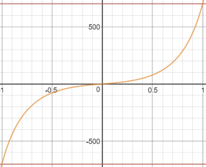
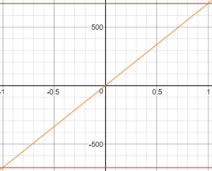
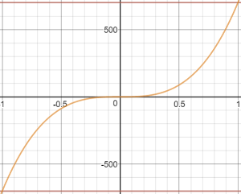

# 아크로 모드(멀티콥터)

&nbsp;&nbsp;

*아크로 모드*는 뒤집기, 롤 및 루프등과 같은 곡예 비행을 위한 RC 모드입니다.

롤, 피치 및 요 스틱은 각 축을 중심으로 한 각도 회전 속도를 제어하고 조절판은 직접 출력 믹서로 전달됩니다. 스틱이 중앙에 놓여지면 기체는 회전을 멈추지만 현재 방향 (측면, 반전 등)과 현재 모멘텀에 따라 움직입니다.

<!-- image above incorrect: https://github.com/PX4/PX4-user_guide/issues/182 -->

## 기술적 설명

곡예 기동(예 : 뒤집기, 롤 및 루프)을 수행하는 RC 수동 모드 .

RC RPY 스틱 입력은 각 축의 회전 각속도를 제어합니다. 스틱이 중앙에 오면 기체의 회전을 멈추고 현재 방향을 유지합니다 (반드시 수 평일 필요는 없음).

## 스틱 입력 매핑

아크로 모드에 대한 기본 롤, 피치 및 요 입력 스틱 매핑은 아래와 같습니다. 곡선은 곡예 기동을 수행하기 위해 최대 스틱 입력에서 높은 회전 속도를 가능하게 하고, 작은 수정을 위해 스틱 중앙에 가까운 낮은 감도 영역을 가능하게 합니다.

이 롤 및 피치 입력 스틱 응답은 [MC_ACRO_EXPO](#MC_ACRO_EXPO) 와 [MC_ACRO_SUPEXPO](#MC_ACRO_SUPEXPO) "지수" 매개 변수를 사용하여 조정할 수 있으며, 요 스틱 입력 응답은 [MC_ACRO_EXPO_Y](#MC_ACRO_EXPO_Y)와 [MC_ACRO_SUPEXPOY](#MC_ACRO_SUPEXPOY)을 사용하여 조정합니다. `MC_ACRO_EXPO`와 `MC_ACRO_EXPO_Y`는 아래와 같이 선형 곡선과 입방 곡선 사이의 곡선을 조정합니다. `MC_ACRO_SUPEXPO`와 `MC_ACRO_SUPEXPOY`를 사용하여 모양을 추가로 조정하여 감도가 낮은 영역의 너비를 수정할 수 있습니다.

 

:::note
수학적 관계는 다음과 같습니다.

$$\mathrm {y} = r(f \cdot x ^ 3 + x(1-f)) (1-g)/(1-g | x |)$$, 여기서 `f = MC_ACRO_EXPO` 또는 `MC_ACRO_EXPO_Y`, `g = MC_ACRO_SUPEXPO` 또는 `MC_ACRO_SUPEXPOY`, `r`은 최대 속도입니다.

[여기](https://www.desmos.com/calculator/yty5kgurmc)에서 관계를 실험할 수 있습니다. :::

## 매개 변수

| 매개 변수                                                                                                               | 설명                                                                                                                                                                                    |
| ------------------------------------------------------------------------------------------------------------------- | ------------------------------------------------------------------------------------------------------------------------------------------------------------------------------------- |
| [MC_ACRO_EXPO](../advanced_config/parameter_reference.md#MC_ACRO_EXPO)             | 롤 및 피치에 대한 스틱 입력 곡선 모양을 조정하기 위한 아크로 모드 "지수"요소. 값 : 0 순수 선형 입력 곡선 1 순수 입방 입력 곡선. Default: 0.69.                                                                                        |
| [MC_ACRO_EXPO](../advanced_config/parameter_reference.md#MC_ACRO_EXPO_Y)         | 요에 대한 스틱 입력 곡선 모양을 조정하기 위한 아크로 모드 "지수"계수. 값 : 0 순수 선형 입력 곡선 1 순수 입방 입력 곡선. Default: 0.69.                                                                                             |
| [MC_ACRO_EXPO](../advanced_config/parameter_reference.md#MC_ACRO_SUPEXPO)       | 롤 및 피치 축 (`MC_ACRO_EXPO`을 사용하여 조정 됨)에 대한 스틱 입력 곡선 모양을 다듬기 위한 아크로 모드 "SuperExpo" 요소. 값 : 0 Pure Expo 기능, 직관적인 스틱 느낌을 위한 0.7 합리적인 모양 향상, 0.95 최대에 가까운 굽은 입력 곡선만 효과가 있습니다. Default: 0.7. |
| [MC_ACRO_SUPEXPOY](../advanced_config/parameter_reference.md#MC_ACRO_SUPEXPOY) | 요 축에 대한 스틱 입력 곡선 모양을 다듬기 위한 아크로 모드 "SuperExpo"요소 (`MC_ACRO_EXPO_Y`를 사용하여 조정됨). 값 : 0 Pure Expo 기능, 직관적인 스틱 느낌을 위한 0.7 합리적인 모양 향상, 0.95 최대에 가까운 굽은 입력 곡선만 효과가 있습니다. Default: 0.7.      |
| [MC_ACRO_P_MAX](../advanced_config/parameter_reference.md#MC_ACRO_P_MAX)          | 최대 아크로 피치 속도. 기본값 : 초당 2 회전 (720.0 deg/s).                                                                                                                                            |
| [MC_ACRO_R_MAX](../advanced_config/parameter_reference.md#MC_ACRO_R_MAX)          | 최대 아크로 롤 속도. 기본값 : 초당 2 회전 (720.0 deg/s).                                                                                                                                             |
| [MC_ACRO_Y_MAX](../advanced_config/parameter_reference.md#MC_ACRO_Y_MAX)          | 최대 아크로 요율. 기본값 : 초당 1.5 회전 (540.0 deg/s).                                                                                                                                             |
