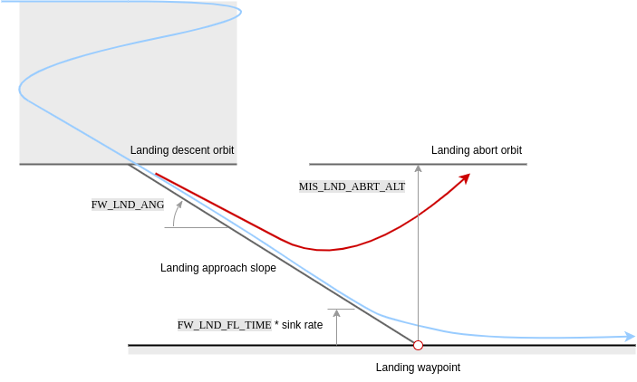
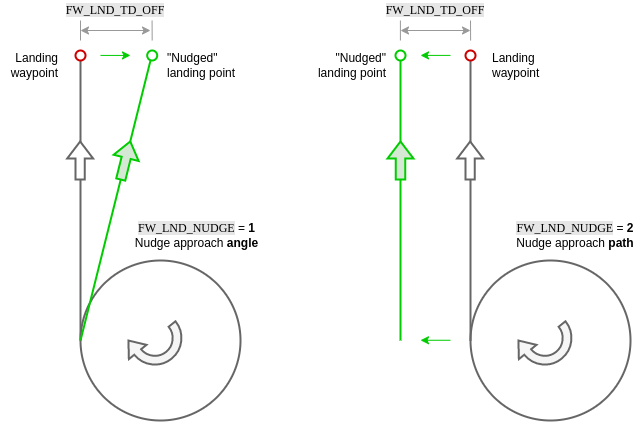
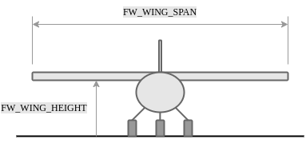

# 임무 모드

*임무 모드*는 비행 제어기에 업로드하여 사전 정의된 자율 [임무](../flying/missions.md) (비행 계획)을 실행합니다. The mission is typically created and uploaded with a Ground Control Station (GCS) application like [QGroundControl](https://docs.qgroundcontrol.com/master/en/) (QGC).

:::note
- This mode requires a global 3d position estimate (from GPS or inferred from a [local position](../ros/external_position_estimation.md#enabling-auto-modes-with-a-local-position)).
- 이 모드를 사용하려면 기체의 시동을 걸어야합니다.
- 이 모드는 자동이며, 기체 제어에 사용자 개입이 *필요하지* 않습니다.
- RC 무선 조종기 스위치는 기체의 비행 모드를 변경할 수 있습니다.
- RC stick movement in a multicopter (or VTOL in multicopter mode) will [by default](#COM_RC_OVERRIDE) change the vehicle to [Position mode](../flight_modes_mc/position.md) unless handling a critical battery failsafe. :::

## 설명

Missions are usually created in a ground control station (e.g. [QGroundControl](https://docs.qgroundcontrol.com/master/en/PlanView/PlanView.html)) and uploaded prior to launch. 개발자 API로 생성하거나 비행중에 업로드 할 수 있습니다.

개별 [미션 명령](#mission_commands)은 기체의 비행 특성에 적합한 방식으로 처리됩니다 (예를 들어 loiter는 헬리콥터의 경우 *hover*로 동작하고, 고정익에는 *circle *로 동작합니다.). VTOL 차량은 고정익모드에서는 고정익, 멀터콥터 모드에서는 헬리콥터의 동작과 매개 변수를 따릅니다.

:::note
임무는 자동조종장치를 부팅하기 **전에** 삽입한 SD 카드에 업로드 됩니다. :::

높은 수준에서 모든 기체 유형은 임무모드가 작동시 동일한 방식으로 작동합니다.

1. If no mission is stored, or if PX4 has finished executing all mission commands, or if the [mission is not feasible](#mission-feasibility-checks):

   - 비행하면 기체는 배회합니다.
   - 착륙하면 기체는 "대기"합니다.
1. 임무가 저장되고 PX4가 비행 이면 현재 단계에서 [미션/비행 계획](../flying/missions.md)을 실행합니다.
   - On copters PX4 will treat a takeoff item as a normal waypoint if already flying.
1. 미션이 저장되고 PX4가 착륙한 경우 :
   - 헬리콥터에서 PX4는 [미션/비행 계획](../flying/missions.md)을 실행합니다. 임무에 `이륙` 명령이 없는 경우 PX4는 현재 단계에서 나머지 비행 계획을 실행하기 전에 기체를 최소 고도로 상승시킵니다.
   - 고정익 차량에서는 PX4가 자동으로 이륙하지 않습니다 (자동조종장치가 움직임 부족을 감지하고 스로틀을 0으로 설정합니다). If the currently active waypoint is a Takeoff, the system will automatically takeoff (see [FW Takeoff/Landing in Mission](#fw-mission-takeoff)).
1. 저장된 임무가 없거나 PX4가 모든 임무 명령 실행을 완료한 경우 :
   * 비행하면 기체는 배회합니다.
   * 착륙하면 기체는 "대기"합니다.
1. *QGroundControl*에서 선택하여 현재 임무 명령을 수동으로 변경할 수 있습니다.

:::note
If you have a *Jump to item* command in the mission, moving to another item will **not** reset the loop counter. 이것은 현재 임무 명령을 1로 변경하면 임무를 "완전히 다시 시작" 하지 않는 것입니다. :::
1. 임무는 기체의 시동이 꺼지거나 새 임무가 업로드된 경우에만 초기화됩니다.

:::tip
To automatically disarm the vehicle after it lands, in *QGroundControl* go to [Vehicle Setup > Safety](https://docs.qgroundcontrol.com/master/en/SetupView/Safety.html), navigate to *Land Mode Settings* and check the box labeled *Disarm after*. 착륙 후 시동 꺼기 대기 시간을 입력하십시오. :::

Missions can be paused by switching out of mission mode to any other mode (such as [Hold mode](../flight_modes_mc/hold.md) or [Position mode](../flight_modes_mc/position.md)). When you switch back to mission mode the vehicle will continue the mission, heading from the _current vehicle position_ to the current active mission item (the same waypoint it as heading towards originally). Note that if you moved the vehicle while the mission was paused you will no longer be following the original track towards the waypoint. A mission can be uploaded while the vehicle is paused, in which which case the current active mission item is set to 1.

:::warning
RC 모드로 전환 전에 스로틀 스틱이 0이 아닌지 확인하십시오 (그렇지 않으면 기체가 충돌합니다).
다른 모드로 전환하기 전에 조종 스틱을 중앙에 두는 것이 좋습니다.
:::

임무 계획에 대한 자세한 내용은 다음을 참조하십시오.

- [임무 계획](../flying/missions.md)
- [Plan View](https://docs.qgroundcontrol.com/master/en/PlanView/PlanView.html) (*QGroundControl* User Guide)

## Mission Feasibility Checks

PX4 runs some basic sanity checks to determine if a mission is feasible when it is uploaded, and when the vehicle is first armed. If any of the checks fail, the user is notified and it is not possible to start the mission.

A subset of the most important checks are listed below:

- First mission item too far away from vehicle ([MIS_DIST_1WP](#MIS_DIST_1WP))
- Any mission item conflicts with a plan or safety geofence
- More than one land start mission item defined ([MAV_CMD_DO_LAND_START](https://mavlink.io/en/messages/common.html#MAV_CMD_DO_LAND_START))
- A fixed-wing landing has an infeasible slope angle ([FW_LND_ANG](#FW_LND_ANG))
- Land start item (`MAV_CMD_DO_LAND_START`) appears in mission before an RTL item ([MAV_CMD_NAV_RETURN_TO_LAUNCH](https://mavlink.io/en/messages/common.html#MAV_CMD_NAV_RETURN_TO_LAUNCH))
- Missing takeoff and/or land item when these are configured as a requirement ([MIS_TKO_LAND_REQ](#MIS_TKO_LAND_REQ))

## QGroundControl 지원

*QGroundControl*은 추가 GCS 수준의 임무 처리 지원을 제공합니다 (비행 컨트롤러에서 제공하는 것 외에도).

더 자세한 정보는 다음을 참고하세요.
- [기체 착륙 후 임무 제거](https://docs.qgroundcontrol.com/master/en/releases/stable_v3.2_long.html#remove-mission-after-vehicle-lands)
- [귀환 모드 후 임무 재개](https://docs.qgroundcontrol.com/master/en/releases/stable_v3.2_long.html#resume-mission)

## 임무 매개변수

임무 동작은 여러 매개 변수의 영향을 받습니다. [매개 변수 참조 > 임무](../advanced_config/parameter_reference.md#mission)에 문서화되어 있습니다. 매우 작은 하위 집합이 아래에 나열되어 있습니다.

General parameters:

| 매개변수                                                                                                    | 설명                                                                                                                                                                                                                 |
| ------------------------------------------------------------------------------------------------------- | ------------------------------------------------------------------------------------------------------------------------------------------------------------------------------------------------------------------ |
| [NAV_RCL_ACT](../advanced_config/parameter_reference.md#NAV_RCL_ACT)         | RC 손실 안전 모드 (RC 연결이 끊어지면 기체가 수행할 작업) - 예 : 홀드 모드 진입, 복귀 모드, 종료 등                                                                                                                                                   |
| [NAV_LOITER_RAD](../advanced_config/parameter_reference.md#NAV_RCL_ACT)      | 고정익 선회 반경                                                                                                                                                                                                          |
| [COM_RC_OVERRIDE](../advanced_config/parameter_reference.md#COM_RC_OVERRIDE) | Controls whether stick movement on a multicopter (or VTOL in MC mode) gives control back to the pilot in [Position mode](../flight_modes_mc/position.md). 자동 모드와 오프보드 모드에 대해 별도로 활성화할 수 있으며, 기본적으로 자동 모드에서 활성화됩니다. |
| [COM_RC_STICK_OV](../advanced_config/parameter_reference.md#COM_RC_STICK_OV) | The amount of stick movement that causes a transition to [Position mode](../flight_modes_mc/position.md) (if [COM_RC_OVERRIDE](#COM_RC_OVERRIDE) is enabled).                                                    |

Parameters related to [mission feasibility checks](#mission-feasibility-checks):

| 매개변수                                                                                                      | 설명                                                                                                                                                      |
| --------------------------------------------------------------------------------------------------------- | ------------------------------------------------------------------------------------------------------------------------------------------------------- |
| [MIS_DIST_1WP](../advanced_config/parameter_reference.md#MIS_DIST_1WP)         | The mission will not be started if the current waypoint is more distant than this value from the home position. Disabled if value is 0 or less.         |
| [FW_LND_ANG](../advanced_config/parameter_reference.md#FW_LND_ANG)             | Maximum landing slope angle.                                                                                                                            |
| [MIS_TKO_LAND_REQ](../advanced_config/parameter_reference.md#MIS_TKO_LAND_REQ) | Mission takeoff/landing requirement configuration. FW and VTOL both have it set to 2 by default, which means that the mission has to contain a landing. |

## 지원되는 임무 명령

PX4는 미션 모드에서 다음 MAVLink 미션 명령을 "수락"합니다 (일부 *caveats* 포함). 달리 명시되지 않는 한 구현은 MAVLink 사양에 정의된 대로입니다.

* [MAV_CMD_NAV_WAYPOINT](https://mavlink.io/en/messages/common.html#MAV_CMD_NAV_WAYPOINT)
  *  *Param3* (플라이 스루)는 무시됩니다. 플라이 스루는 *param 1* (time_inside)> 0 인 경우 항상 활성화됩니다.
* [MAV_CMD_NAV_LOITER_UNLIM](https://mavlink.io/en/messages/common.html#MAV_CMD_NAV_LOITER_UNLIM)
* [MAV_CMD_NAV_LOITER_TIME](https://mavlink.io/en/messages/common.html#MAV_CMD_NAV_LOITER_TIME)
* [MAV_CMD_NAV_LAND](https://mavlink.io/en/messages/common.html#MAV_CMD_NAV_LAND)
* [MAV_CMD_NAV_TAKEOFF](https://mavlink.io/en/messages/common.html#MAV_CMD_NAV_TAKEOFF)
* [MAV_CMD_NAV_LOITER_TO_ALT](https://mavlink.io/en/messages/common.html#MAV_CMD_NAV_LOITER_TO_ALT)
* [MAV_CMD_NAV_VTOL_TAKEOFF](https://mavlink.io/en/messages/common.html#MAV_CMD_NAV_VTOL_TAKEOFF)
  - `MAV_CMD_NAV_VTOL_TAKEOFF.param2 ` (전환 제목)은 무시됩니다. 대신 다음 웨이포인트로의 방향이 전환 방향으로 사용됩니다. <!-- at LEAST until PX4 v1.13: https://github.com/PX4/PX4-Autopilot/issues/12660 -->
* [MAV_CMD_NAV_VTOL_LAND](https://mavlink.io/en/messages/common.html#MAV_CMD_NAV_VTOL_LAND)
* [MAV_CMD_NAV_FENCE_RETURN_POINT](https://mavlink.io/en/messages/common.html#MAV_CMD_NAV_FENCE_RETURN_POINT)
* [MAV_CMD_NAV_FENCE_POLYGON_VERTEX_INCLUSION](https://mavlink.io/en/messages/common.html#MAV_CMD_NAV_FENCE_POLYGON_VERTEX_INCLUSION)
* [MAV_CMD_NAV_FENCE_POLYGON_VERTEX_EXCLUSION](https://mavlink.io/en/messages/common.html#MAV_CMD_NAV_FENCE_POLYGON_VERTEX_EXCLUSION)
* [MAV_CMD_NAV_FENCE_CIRCLE_INCLUSION](https://mavlink.io/en/messages/common.html#MAV_CMD_NAV_FENCE_CIRCLE_INCLUSION)
* [MAV_CMD_NAV_FENCE_CIRCLE_EXCLUSION](https://mavlink.io/en/messages/common.html#MAV_CMD_NAV_FENCE_CIRCLE_EXCLUSION)
* [MAV_CMD_NAV_RALLY_POINT](https://mavlink.io/en/messages/common.html#MAV_CMD_NAV_RALLY_POINT)
* [MAV_CMD_DO_JUMP](https://mavlink.io/en/messages/common.html#MAV_CMD_DO_JUMP)
* [MAV_CMD_NAV_ROI](https://mavlink.io/en/messages/common.html#MAV_CMD_NAV_ROI)
* [MAV_CMD_DO_SET_ROI](https://mavlink.io/en/messages/common.html#MAV_CMD_DO_SET_ROI)
* [MAV_CMD_DO_SET_ROI_LOCATION](https://mavlink.io/en/messages/common.html#MAV_CMD_DO_SET_ROI_LOCATION)
* [MAV_CMD_DO_SET_ROI_WPNEXT_OFFSET](https://mavlink.io/en/messages/common.html#MAV_CMD_DO_SET_ROI_WPNEXT_OFFSET)
* [MAV_CMD_DO_SET_ROI_NONE](https://mavlink.io/en/messages/common.html#MAV_CMD_DO_SET_ROI_NONE)
* [MAV_CMD_DO_CHANGE_SPEED](https://mavlink.io/en/messages/common.html#MAV_CMD_DO_CHANGE_SPEED)
* [MAV_CMD_DO_SET_HOME](https://mavlink.io/en/messages/common.html#MAV_CMD_DO_SET_HOME)
* [MAV_CMD_DO_SET_SERVO](https://mavlink.io/en/messages/common.html#MAV_CMD_DO_SET_SERVO)
* [MAV_CMD_DO_LAND_START](https://mavlink.io/en/messages/common.html#MAV_CMD_DO_LAND_START)
* [MAV_CMD_DO_TRIGGER_CONTROL](https://mavlink.io/en/messages/common.html#MAV_CMD_DO_TRIGGER_CONTROL)
* [MAV_CMD_DO_DIGICAM_CONTROL](https://mavlink.io/en/messages/common.html#MAV_CMD_DO_DIGICAM_CONTROL)
* [MAV_CMD_DO_MOUNT_CONFIGURE](https://mavlink.io/en/messages/common.html#MAV_CMD_DO_MOUNT_CONFIGURE)
* [MAV_CMD_DO_MOUNT_CONTROL](https://mavlink.io/en/messages/common.html#MAV_CMD_DO_MOUNT_CONTROL)
* [MAV_CMD_IMAGE_START_CAPTURE](https://mavlink.io/en/messages/common.html#MAV_CMD_IMAGE_START_CAPTURE)
* [MAV_CMD_IMAGE_STOP_CAPTURE](https://mavlink.io/en/messages/common.html#MAV_CMD_IMAGE_STOP_CAPTURE)
* [MAV_CMD_VIDEO_START_CAPTURE](https://mavlink.io/en/messages/common.html#MAV_CMD_VIDEO_START_CAPTURE)
* [MAV_CMD_VIDEO_STOP_CAPTURE](https://mavlink.io/en/messages/common.html#MAV_CMD_VIDEO_STOP_CAPTURE)
* [MAV_CMD_DO_SET_CAM_TRIGG_DIST](https://mavlink.io/en/messages/common.html#MAV_CMD_DO_SET_CAM_TRIGG_DIST)
* [MAV_CMD_DO_SET_CAM_TRIGG_INTERVAL](https://mavlink.io/en/messages/common.html#MAV_CMD_DO_SET_CAM_TRIGG_INTERVAL)
* [MAV_CMD_SET_CAMERA_MODE](https://mavlink.io/en/messages/common.html#MAV_CMD_SET_CAMERA_MODE)
* [MAV_CMD_DO_VTOL_TRANSITION](https://mavlink.io/en/messages/common.html#MAV_CMD_DO_VTOL_TRANSITION)
* [MAV_CMD_NAV_DELAY](https://mavlink.io/en/messages/common.html#MAV_CMD_NAV_DELAY)
* [MAV_CMD_NAV_RETURN_TO_LAUNCH](https://mavlink.io/en/messages/common.html#MAV_CMD_NAV_RETURN_TO_LAUNCH)
* [MAV_CMD_DO_CONTROL_VIDEO](https://mavlink.io/en/messages/common.html#MAV_CMD_DO_CONTROL_VIDEO)
* [MAV_CMD_DO_GIMBAL_MANAGER_PITCHYAW](https://mavlink.io/en/messages/common.html#MAV_CMD_DO_GIMBAL_MANAGER_PITCHYAW)
* [MAV_CMD_DO_GIMBAL_MANAGER_CONFIGURE](https://mavlink.io/en/messages/common.html#MAV_CMD_DO_GIMBAL_MANAGER_CONFIGURE)
* [MAV_CMD_OBLIQUE_SURVEY](https://mavlink.io/en/messages/common.html#MAV_CMD_OBLIQUE_SURVEY)
* [MAV_CMD_DO_SET_CAMERA_ZOOM](https://mavlink.io/en/messages/common.html#MAV_CMD_DO_SET_CAMERA_ZOOM)
* [MAV_CMD_DO_SET_CAMERA_FOCUS](https://mavlink.io/en/messages/common.html#MAV_CMD_DO_SET_CAMERA_FOCUS)

Note:
- PX4는 위의 메시지를 구문 분석하지만, 반드시 *동작* 할 필요는 없습니다. 예를 들어, 일부 메시지는 기체 유형에 따라 차이가 있습니다.
- PX4는 임무 명령에 대한 로컬 프레임을 지원하지 않습니다 (예 : [MAV_FRAME_LOCAL_NED](https://mavlink.io/en/messages/common.html#MAV_FRAME_LOCAL_NED)).
- 모든 메시지와명령이 *QGroundControl*을 통해 노출되는 것은 아닙니다.
- 메시지가 추가되면 목록이 최신이 아닐 수 있습니다. 코드를 검사하여 현재 설정을 확인할 수 있습니다. 지원은 [/src/modules/mavlink/mavlink_mission.cpp](https://github.com/PX4/PX4-Autopilot/blob/master/src/modules/mavlink/mavlink_mission.cpp)의 `MavlinkMissionManager :: parse_mavlink_mission_item`입니다.

  :::note
누락되거나 잘못된 메시지를 찾으면 문제 보고서 또는 PR을 추가하십시오.
:::

## Rounded turns: Inter-Waypoint Trajectory

PX4는 이전 웨이포인트에서 현재 목표까지 직선을 따라갈 것으로 예상합니다 (웨이포인트 사이에 다른 종류의 경로를 계획하지 않습니다. 필요한 경우 추가 웨이포인트를 추가하여 시뮬레이션 할 수 있습니다).

멀티콥터는 [저크 제한](../config_mc/mc_jerk_limited_type_trajectory.md#auto-mode) 튜닝에 따라 웨이포인트에 접근하거나 이탈할 때 *속도*를 변경합니다. 기체는 허용 반경 ([NAV_ACC_RAD](../advanced_config/parameter_reference.md#NAV_ACC_RAD))에 의해 정의한 다음 웨이포인트 (정의된 경우)를 향해 부드러운 곡선으로 비행합니다. 아래의 다이어그램은 예상 가능한 경로들을 나타냅니다.

기체는 허용 반경에 들어 오자마자 다음 웨이포인트로 전환합니다.
- 멀티콥터의 경우 이 반경은 [NAV_ACC_RAD](../advanced_config/parameter_reference.md#NAV_ACC_RAD)로 정의됩니다.
- 고정익의 경우 허용 반경은 "L1 거리"로 정의됩니다.
  - The L1 distance is computed from two parameters: [NPFG_DAMPING](../advanced_config/parameter_reference.md#NPFG_DAMPING) and [NPFG_PERIOD](../advanced_config/parameter_reference.md#NPFG_PERIOD), and the current ground speed.
  - 기본적으로 약 70 미터입니다.
  - 방정식: $$L_{1_{distance}}=\frac{1}{\pi}L_{1_{damping}}L_{1_{period}}\left \| \vec{v}*{ {xy}*{ground} } \right \|$$

## MC Mission Takeoff

Plan a multicopter mission takeoff by adding a `Takeoff` mission item to the map (this corresponds to the [MAV_CMD_NAV_TAKEOFF](https://mavlink.io/en/messages/common.html#MAV_CMD_NAV_TAKEOFF) MAVLink command).

During mission execution this will cause the vehicle to ascend vertically to the minimum takeoff altitude defined in the [MIS_TAKEOFF_ALT](../advanced_config/parameter_reference.md#MIS_TAKEOFF_ALT) parameter, then head towards the 3D position defined in the mission item.

If a mission with no takeoff mission item is started, the vehicle will ascend to the minimum takeoff altitude and then proceed to the first `Waypoint` mission item.

If the vehicle is already flying when the mission is started, a takeoff mission item is treated as a normal waypoint.

## FW Mission Takeoff

Starting flights with mission takeoff (and landing using a mission landing) is the recommended way of operating a plane autonomously.

Both [runway takeoff](../flight_modes_fw/takeoff.md#runway-takeoff) and [hand-launched takeoff](../flight_modes_fw/takeoff.md#catapult-hand-launch) are supported — for configuration information see [Takeoff mode (FW)](../flight_modes_fw/takeoff.md).

The takeoff behaviour is defined in a Takeoff mission item, which corresponds to the [MAV_CMD_NAV_TAKEOFF](https://mavlink.io/en/messages/common.html#MAV_CMD_NAV_TAKEOFF) MAVLink command. During mission execution the vehicle will takeoff towards this waypoint, and climb until the specified altitude is reached. The mission item is then accepted, and the mission will start executing the next item.

More specifically, the takeoff mission item defines the takeoff course and clearance altitude. The course is the line between the vehicle starting point and the horizontal position defined in the mission item,  while the clearance altitude is the mission item altitude.

For a runway takeoff, the `Takeoff` mission item will cause the vehicle to arm, throttle up the motors and take off. When hand-launching the vehicle will arm, but only throttle up when the vehicle is thrown (the acceleration trigger is detected). In both cases, the vehicle should be placed (or launched) facing towards the takeoff waypoint when the mission is started. If possible, always make the vehicle takeoff into the wind.

:::note
A fixed-wing mission requires a `Takeoff` mission item to takeoff; if however the vehicle is already flying when the mission is started the takeoff item will be treated as a normal waypoint. :::

For more infomormation about takeoff behaviour and configuration see [Takeoff mode (FW)](../flight_modes_fw/takeoff.md).

## FW Mission Landing

Fixed-wing mission landing is the recommended way to land a plane autonomously. This can be planned in *QGroundControl* using [fixed-wing landing pattern](https://docs.qgroundcontrol.com/master/en/PlanView/pattern_fixed_wing_landing.html).

If possible, always plan the landing such that it does the approach into the wind.

The following sections describe the landing sequence, land abort and nudging, safety considerations, and configuration.

### Landing Sequence

A landing pattern consists of a loiter waypoint ([MAV_CMD_NAV_LOITER_TO_ALT](https://mavlink.io/en/messages/common.html#MAV_CMD_NAV_LOITER_TO_ALT)) followed by a land waypoint ([MAV_CMD_NAV_LAND](https://mavlink.io/en/messages/common.html#MAV_CMD_NAV_LAND)). The positions of the two points define the start and end point of the landing approach, and hence the glide slope for the landing approach.

This pattern results in the following landing sequence:

1. **Fly to landing location**: The aircraft flies at its current altitude towards the loiter waypoint.
2. **Descending orbit to approach altitude**: On reaching the loiter radius of the waypoint, the vehicle performs a descending orbit until it reaches the "approach altitude" (the altitude of the loiter waypoint). The vehicle continues to orbit at this altitude until it has a tanjential path towards the land waypoint, at which point the landing approach is initiated.
4. **Landing approach**: The aircraft follows the landing approach slope towards the land waypoint until the flare altitude is reached.
5. **Flare**: The vehicle flares until it touches down.

### Landing Approach

The vehicle tracks the landing slope (generally at a slower speed than cruise) until reaching the flare altitude.

Note that the glide slope is calculated from the 3D positions of the loiter and landing waypoints; if its angle exceeds the parameter [FW_LND_ANG](#FW_LND_ANG) the mission will be rejected as unfeasible on upload.

The parameters that affect the landing approach are listed below.

| 매개변수                                                                                          | 설명                                                                                                                                         |
| --------------------------------------------------------------------------------------------- | ------------------------------------------------------------------------------------------------------------------------------------------ |
| [FW_LND_ANG](../advanced_config/parameter_reference.md#FW_LND_ANG) | The maximum achievable landing approach slope angle. Note that smaller angles may still be commanded via the landing pattern mission item. |
| [FW_LND_EARLYCFG](../advanced_config/parameter_reference.md#FW_LND_EARLYCFG)                | Optionally deploy landing configuration during the landing descent orbit (e.g. flaps, spoilers, landing airspeed).                         |
| [FW_LND_AIRSPD](../advanced_config/parameter_reference.md#FW_LND_AIRSPD)                    | Calibrated airspeed setpoint during landing.                                                                                               |
| [FW_FLAPS_LND_SCL](../advanced_config/parameter_reference.md#FW_FLAPS_LND_SCL)              | Flaps setting during landing.                                                                                                              |
| [FW_LND_THRTC_SC](../advanced_config/parameter_reference.md#FW_LND_THRTC_SC)                | Altitude time constant factor for landing (overrides default [TECS tuning](../config_fw/position_tuning_guide_fixedwing.md)).              |

### Flaring / Roll-out

Flaring consists of a switch from altitude tracking to a shallow sink rate setpoint and constraints on the commandable throttle, resulting in nose up manuevering to slow the descent and produce a softer touchdown.

The flaring altitude is calculated during the final approach via "time-to-impact" ([FW_LND_FL_TIME](#FW_LND_FL_TIME)) and the approach descent rate. An additional safety parameter [FW_LND_FLALT](#FW_LND_FLALT) sets the minimum altitude at which the vehicle will flare (if the time based altitude is too low to allow a safe flare maneuver).

If belly landing, the vehicle will continue in the flaring state until touchdown, land detection, and subsequent disarm. For runway landings, [FW_LND_TD_TIME](#FW_LND_TD_TIME) enables setting the time post flare start to pitch down the nose (e.g. consider tricycle gear) onto the runway ([RWTO_PSP](#RWTO_PSP)) and avoid bouncing. This time roughly corresponds to the touchdown post flare, and should be tuned for a given airframe during test flights only after the flare has been tuned.

The parameters that affect flaring are listed below.

| 매개변수                                                                                                   | 설명                                                                                                                                                                  |
| ------------------------------------------------------------------------------------------------------ | ------------------------------------------------------------------------------------------------------------------------------------------------------------------- |
| [FW_LND_FL_TIME](../advanced_config/parameter_reference.md#FW_LND_FL_TIME)  | Time before impact (at current descent rate) at which the vehicle should flare.                                                                                     |
| [FW_LND_FL_SINK](../advanced_config/parameter_reference.md#FW_LND_FL_SINK) | A shallow sink rate the aircraft will track during the flare.                                                                                                       |
| [FW_LND_FLALT](../advanced_config/parameter_reference.md#FW_LND_FLALT)     | Minimum altitude above ground the aircraft must flare. This is only used when the time-based flare altitude is too low.                                             |
| [FW_LND_FL_PMAX](../advanced_config/parameter_reference.md#FW_LND_FL_PMAX) | Maximum allowed pitch during the flare.                                                                                                                             |
| [FW_LND_FL_PMIN](../advanced_config/parameter_reference.md#FW_LND_FL_PMIN) | Minimum allowed pitch during the flare (often necessary to avoid negative pitch angles commanded to increase airspeed, as the throttle is reduced to idle setting.) |
| [FW_LND_TD_TIME](../advanced_config/parameter_reference.md#FW_LND_TD_TIME) | The time after flare start when the vehicle should pitch the nose down.                                                                                             |
| [RWTO_PSP](../advanced_config/parameter_reference.md#RWTO_PSP)               | Pitch setpoint while on the runway. For tricycle gear, typically near zero. For tail draggers, positive.                                                            |
| [FW_THR_IDLE](../advanced_config/parameter_reference.md#FW_THR_IDLE)       | Idle throttle setting. The vehicle will retain this setting throughout the flare and roll out.                                                                      |

### Abort

#### Operator Abort

The landing may be aborted by the operator at any point during the final approach using the [MAV_CMD_DO_GO_AROUND](https://mavlink.io/en/messages/common.html#MAV_CMD_DO_GO_AROUND) command. On _QGroundControl_ a popup button appears during landing to enable this.

Aborting the landing results in a climb out to an orbit pattern centered above the land waypoint. The maximum of the aircraft's current altitude and [MIS_LND_ABRT_ALT](#MIS_LND_ABRT_ALT) is set as the abort orbit altitude height relative to (above) the landing waypoint. Landing configuration (e.g. flaps, spoilers, landing airspeed) is disabled during abort and the aicraft flies in cruise conditions.

The abort command is disabled during the flare for safety. Operators may still manually abort the landing by switching to any manual mode, such as [Stabilized mode](../flight_modes_fw/stabilized.md)), though it should be noted that this is risky!

#### Automatic Abort

Automatic abort logic is additionally available for several conditions, if configured. Available automatic abort criteria may be enabled via bitmask parameter [FW_LND_ABORT](#FW_LND_ABORT). One example of an automatic abort criteria is the absence of a valid range measurement from a distance sensor.

:::warning
Landing without a distance sensor is **strongly** discouraged. Disabling terrain estimation with [FW_LND_USETER](#FW_LND_USETER) and select bits of [FW_LND_ABORT](#FW_LND_ABORT) will remove the default distance sensor requirement, but consequently falls back to GNSS altitude to determine the flaring altitude, which may be several meters too high or too low, potentially resulting in damage to the airframe. :::

| 매개변수                                                                                                       | 설명                                                                         |
| ---------------------------------------------------------------------------------------------------------- | -------------------------------------------------------------------------- |
| [MIS_LND_ABRT_ALT](../advanced_config/parameter_reference.md#MIS_LND_ABRT_ALT) | The minimum altitude above the land point an abort orbit can be commanded. |
| [FW_LND_ABORT](../advanced_config/parameter_reference.md#FW_LND_ABORT)         | Determines which automatic abort criteria are enabled.                     |
| [FW_LND_USETER](../advanced_config/parameter_reference.md#FW_LND_USETER)       | Enables use of the distance sensor during the final approach.              |

### Nudging

In the case of minor GNSS or map discrepancies causing an offset approach, small manual adjustments to the landing approach and roll out can be made by the operator (via yaw stick) when [FW_LND_NUDGE](../advanced_config/parameter_reference.md#FW_LND_NUDGE) is enabled. Options include either nudging the approach angle or the full approach path.

In both cases, the vehicle remains in full auto mode, tracking the shifted approach vector. [FW_LND_TD_OFF](../advanced_config/parameter_reference.md#FW_LND_TD_OFF) allows determination of how far to the left or right of the landing waypoint the projected touchdown point may be nudged. Yaw stick input corresponds to a nudge "rate". Once the stick is released (zero rate), the approach path or angle will stop moving.

Approach path nudging is frozen once the flare starts. If conducting a runway landing with steerable nose wheel, the yaw stick command passes directly to the nose wheel from flare start, during roll out, until disarm. Note that if the wheel controller is enabled ([FW_W_EN](#FW_W_EN)), the controller will actively attempt to steer the vehicle to the approach path, i.e. "fighting" operator yaw stick inputs.

:::note
Nudging should not be used to supplement poor position control tuning. If the vehicle is regularly showing poor tracking peformance on a defined path, please refer to the [fixed-wing control tuning guide](../flight_modes_fw/position.md) for instruction. :::

| 매개변수                                                                                                 | 설명                                                                                 |
| ---------------------------------------------------------------------------------------------------- | ---------------------------------------------------------------------------------- |
| [FW_LND_NUDGE](../advanced_config/parameter_reference.md#FW_LND_NUDGE)   | Enable nudging behavior for fixed-wing landing.                                    |
| [FW_LND_TD_OFF](../advanced_config/parameter_reference.md#FW_LND_TD_OFF) | Configure the allowable touchdown lateral offset from the commanded landing point. |
| [FW_W_EN](../advanced_config/parameter_reference.md#FW_W_EN)             | Enable the nose wheel steering controller.                                         |

### Near Ground Safety Constraints

In landing mode, the distance sensor is used to determine proximity to the ground, and the airframe's geometry is used to calculate roll contraints to prevent wing strike.

| 매개변수                                                                         | 설명                                                        |
| ---------------------------------------------------------------------------- | --------------------------------------------------------- |
| [FW_WING_SPAN](../advanced_config/parameter_reference.md#FW_WING_SPAN)     | Wing span of the airframe.                                |
| [FW_WING_HEIGHT](../advanced_config/parameter_reference.md#FW_WING_HEIGHT) | Height of wing from bottom of gear (or belly if no gear). |

## VTOL Mission Takeoff

Plan a VTOL mission takeoff by adding a `VTOL Takeoff` mission item to the map.

During mission execution the vehicle will ascend vertically to the minimum takeoff altitude defined in the [MIS_TAKEOFF_ALT](../advanced_config/parameter_reference.md#MIS_TAKEOFF_ALT) parameter, then transition to fixed-wing mode with the heading defined in the mission item. After transitioning the vehicle heads towards the 3D position defined in the mission item.

A VTOL mission requires a `VTOL Takeoff` mission item to takeoff; if however the vehicle is already flying when the mission is started the takeoff item will be treated as a normal waypoint.

