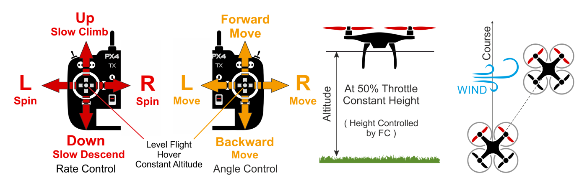

# 고도 모드 (멀티콥터)

&nbsp;&nbsp;

*고도 모드*에서는 *상대적으로* 비행하기 용이한 RC 모드로, 롤 및 피치 스틱이 차량 이동을 좌우 및 앞뒤 방향(차량의 "전면" 기준)으로 제어하고, 요 스틱은 수평면에서 회전 속도를 제어하고 스로틀은 상승 하강 속도를 제어합니다.

스틱을 놓거나 중앙에 놓으면 차량이 수평을 유지하고 현재 *고도*를 유지합니다. 수평면에서 이동하는 경우 차량은 바람 저항에 의해 모멘텀이 소실 될 때까지 계속됩니다. 바람이 불면 기체는 바람의 방향으로 표류합니다.

:::tip

:::tip
*고도 모드< 0>는 초보 비행자에게 가장 안전한 비 GPS 수동 모드입니다. [수동 / 안정화](../flight_modes/manual_stabilized_mc.md) 모드와 비슷하지만 스틱을 놓으면 기체의 고도가 계속 유지됩니다.
:::

아래 다이어그램은 모드 동작을 시각적으로 보여줍니다 ([모드 2 송신기](../getting_started/rc_transmitter_receiver.md#transmitter_modes)의 경우).

## 기술 요약

RC 수동 모드는 [수동/안정화(멀티콥터)](../flight_modes/manual_stabilized_mc.md) 모드와 같지만 *고도 안정화*가 있습니다 (가운데 스틱이 차량을 수평으로 유지하고 고정 고도를 유지).

* 중앙 스틱 (데드밴드 내부) :
  * RPY sticks levels vehicle.
  * 스로틀(~ 50 %)은 현재 고도를 바람에 대해 일정하게 유지합니다.
* 센터  외부:
  * 롤/피치 스틱은 각각의 방향에서 틸트 각도를 제어하여 해당하는 좌우와 전후 방향으로 이동합니다.
  * 스로틀 스틱은 미리 정해진 최대 속도 (및 다른 축의 이동 속도)로 속도를 올리거나 내립니다.
  * 요 스틱은 수평면 위의  회전 각속도를 제어합니다.
* 이륙:
  * 착륙했을 때 스로틀 스틱을 62.5 % (하단에서 전체 범위) 이상으로 올리면 기체가 이륙합니다.

:::note

* 수동 입력이 필요합니다 (RC 컨트롤러 또는 MAVLink를 통한 게임 패드/엄지 스틱).
* 고도는 일반적으로 기압계로 측정되며 극단적인 기상 조건에서는 정확하지 않을 수 있습니다. LIDAR/거리 센서가 장착된 기체는 높은 정확도로 고도를 제어할 수 있습니다.
:::

## 매개 변수

이 모드는 아래의 매개 변수의 영향을받습니다.

| 매개 변수                                                                                                       | 설명                                                                                                                                                                                                                     |
| ----------------------------------------------------------------------------------------------------------- | ---------------------------------------------------------------------------------------------------------------------------------------------------------------------------------------------------------------------- |
| [MPC_Z_VEL_MAX_UP](../advanced_config/parameter_reference.md#MPC_Z_VEL_MAX_UP) | 최대 수직 상승 속도. 기본값: 3 m/s.                                                                                                                                                                                               |
| [MPC_Z_VEL_MAX_DN](../advanced_config/parameter_reference.md#MPC_Z_VEL_MAX_DN) | 최대 수직 하강 속도. 기본값: 1 m/s.                                                                                                                                                                                               |
| `RCX_DZ`                                                                           | 채널 X의 RC 데드 존. 스로틀에 대한 X 값은 [RC_MAP_THROTTLE](../advanced_config/parameter_reference.md#RC_MAP_THROTTLE) 값에 따라 달라집니다. 예를 들어, 스로틀이 채널 4 인 경우 [RC4_DZ](../advanced_config/parameter_reference.md#RC4_DZ)는 데드 존을 지정합니다. |
| `MPC_XXXX`                                                                         | 대부분의 MPC_xxx 매개 변수는이 모드에서 비행 동작에 어느정도 영향을 미칩니다 . 예를 들어, [MPC_THR_HOVER](../advanced_config/parameter_reference.md#MPC_THR_HOVER)는 기체의 호버링 추력을 정의합니다.                                                                 |
