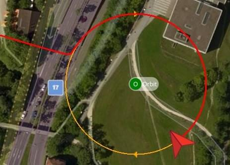

# Orbit (Multicopter)

&nbsp;

The *Orbit* guided flight mode allows you to command a multicopter (or VTOL in multicopter mode) to fly in a circle at a particular location, by [default](https://mavlink.io/en/messages/common.html#ORBIT_YAW_BEHAVIOUR) yawing so that it always faces towards the center.

:::note
* This mode requires a valid global position estimate (from GPS or inferred from a [local position](../ros/external_position_estimation.md#enabling-auto-modes-with-a-local-position)).
* This mode is automatic - no user intervention is *required* to control the vehicle.
* RC stick movement can control ascent/descent and orbit speed and direction.
* The mode can be triggered using the [MAV_CMD_DO_ORBIT](https://mavlink.io/en/messages/common.html#MMAV_CMD_DO_ORBIT) MAVLink command.
:::

## Overview

*QGroundControl* (or other compatible GCS or MAVLink API) is *required* to enable the mode, and to set the center position, initial radius and altitude of the orbit. Once enabled the vehicle will fly as fast as possible to the closest point on the commanded circle trajectory and do a slow (1m/s) clockwise orbit on the planned circle, facing the center.

Instructions for how to start an orbit can be found here: [FlyView > Orbit Location](https://docs.qgroundcontrol.com/master/en/FlyView/FlyView.html#orbit) (*QGroundControl* guide).

:::note
The use of an RC control is *optional*. If no RC control is present the orbit will proceed as described above. RC control cannot be used to start the mode (if you switch to the mode via RC it will sit idle).
:::

RC control can be used to change the orbit altitude, radius, speed, and orbit direction:
- **Left stick:**
  - *up/down:* controls speed of ascent/descent, as in [Position mode](../flight_modes_mc/position.md). When in center deadzone, altitude is locked.
  - *left/right:* no effect.
- **Right stick:**
  - *left/right:* controls acceleration of orbit in clockwise/counter-clockwise directions. When centered the current speed is locked.
    - Maximum velocity is 10m/s and further limited to keep the centripetal acceleration below 2m/s^2.
  - *up/down:* controls orbit radius (smaller/bigger).  When centered the current radius is locked.
    - Minimum radius is 1m. Maximum radius is 100m.

The diagram below shows the mode behaviour visually (for a [mode 2 transmitter](../getting_started/rc_transmitter_receiver.md#transmitter_modes)).

The mode can be stopped by switching to any other flight mode (using RC or QGC).

## Parameters/Limits

There are no orbit mode-specific parameters.

The following limits are hard coded:
- Initial/default rotation is 1 m/s in a clockwise direction.
- The maximum acceleration is limited to 2 m/s^2, with priority on keeping the commanded circle trajectory rather than commanded ground speed (i.e. the vehicle will slow down in order to achieve the correct circle if the acceleration exceeds 2m/s^2).
- Maximum radius is 100m.

## MAVLink Messages (Developers)

Orbit mode uses the following MAVLink commands:

- [MAV_CMD_DO_ORBIT](https://mavlink.io/en/messages/common.html#MAV_CMD_DO_ORBIT) - Start an orbit with specified center point, radius, direction, altitude, speed and [yaw direction](https://mavlink.io/en/messages/common.html#ORBIT_YAW_BEHAVIOUR) (vehicle defaults to faceing centre of orbit).
- [ORBIT_EXECUTION_STATUS](https://mavlink.io/en/messages/common.html#ORBIT_EXECUTION_STATUS) - Orbit status emitted during orbit to update GCS of current orbit parameters (these may be changed by the RC controller).
