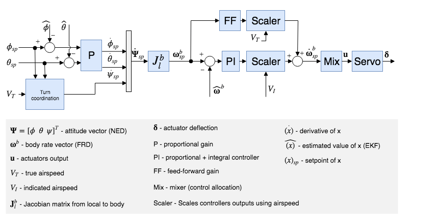

# 콘트롤러 다이어그램

이 섹션에는 PX4 컨트롤러에 대한 주요 다이어그램들이 있습니다.

다이어그램은 표준 [PX4 표기법](../contribute/notation.md)을 사용합니다(각각 주석이 달린 범례가 있음).

<!--    The diagrams were created with LaTeX / TikZ.
        The code can be found in assets/diagrams/mc_control_arch_tikz.tex.
        The easiest way to generate the diagrams and edit them is to copy the code and paste it an Overleaf (www.overleaf.com/) document to see the output.
-->

## 멀티콥터 제어 아키텍처

* 이것은 표준 계단식 제어 아키텍처입니다.
* 컨트롤러는 P 및 PID 컨트롤러를 혼합한 것입니다.
* 추정치는 [EKF2](../advanced_config/tuning_the_ecl_ekf.md)를 사용합니다.
* 모드에 따라 외부(위치) 루프는 바이패스됩니다(외부 루프 뒤에 멀티플렉서로 표시됨). 위치 루프는 위치를 유지하거나, 축에서 요청한 속도가 null인 경우에만 사용됩니다.

### Multicopter 각속도 컨트롤러

* K-PID 컨트롤러. 자세한 내용은 [속도 컨트롤러](../config_mc/pid_tuning_guide_multicopter.md#rate-controller)를 참고하십시오.
* 통합 권한은 종료를 방지를 위하여 제한됩니다.
* 출력은 (믹서에서) 일반적으로 -1과 1로 제한됩니다.
* 저역 통과 필터(LPF)는 파생 경로에 사용되어 노이즈를 줄입니다(자이로 드라이버는 컨트롤러에 필터링된 파생물을 제공함).

:::note IMU
파이프라인은 다음과 같습니다. 자이로 데이터 > 보정 매개변수 적용 > 추정 편향 제거 > 노치 필터(`IMU_GYRO_NF_BW` 및 `IMU_GYRO_NF_FREQ`) > 저역 통과 필터(`IMU_GYRO_CUTOFF`) > 차량_각도_속도(*P 및 I 컨트롤러에서 사용하는 필터링된 각속도*) > 파생상품 -> 저역 통과 필터(`IMU_DGYRO_CUTOFF`) > vehicle_angular_acceleration(*D 컨트롤러에서 사용하는 필터링된 각가속도*)

  
:::
  
  <!-- source for image is https://github.com/PX4/PX4-Autopilot/blob/850d0bc588af79186286652af4c8293daafd2c4c/src/lib/mixer/MultirotorMixer/MultirotorMixer.cpp#L323-L326 -->

### 멀티콥터 자세 컨트롤러

* 자세 컨트롤러는 [쿼터니언](https://en.wikipedia.org/wiki/Quaternion)을 사용합니다.
* 콘트롤러는 이 [문서](https://www.research-collection.ethz.ch/bitstream/handle/20.500.11850/154099/eth-7387-01.pdf)에서 구현됩니다.
* 이 컨트롤러를 조정시 고려할 유일한 매개변수는 P 게인입니다.
* rate 명령은 포화됩니다.

### 멀티콥터 속도 컨트롤러

* 속도를 안정화하는 PID 컨트롤러. 가속을 명령합니다.
* 적분기는 클램핑 방식을 사용하는 ARW(Anti-Reset Windup)를 포함합니다.
* 가속도 명령어는 포화됩니다.

### 멀티콥터 위치 콘트롤러

* 속도를 명령하는 간단한 P 컨트롤러.
* 명령된 속도는 특정 한계에서 속도를 유지하기 위해 포화됩니다.

#### 결합된 위치 및 속도 컨트롤러 다이어그램

<!-- The drawing is on draw.io: https://drive.google.com/open?id=13Mzjks1KqBiZZQs15nDN0r0Y9gM_EjtX
Request access from dev team. -->

## 고정익 위치 콘트롤러

### 총 에너지 제어 시스템(TECS)
총 에너지 제어 시스템(TECS)의 PX4 구현을 통하여 고정익 항공기의 실제 속도와 고도를 동시에 제어할 수 있습니다. 코드는 고정익 위치 제어 모듈에서 사용되는 라이브러리로 구현됩니다.

위의 다이어그램과 같이 TECS는 대기 속도와 고도 설정값을 입력하여 스로틀 및 피치 각도 설정값을 출력합니다. 이 두 개의 출력은 자세 제어 솔루션을 구현하는 고정익 자세 콘트롤러로 전송됩니다. 따라서 TECS의 성능이 피치 제어 루프의 성능에 직접적인 영향을 끼치는 것을 이해하는 것이 중요합니다. 속도와 고도의 잘못된 추적은 종종 항공기 피치 각도의 잘못된 추적으로 인하여 발생합니다.

:::note TECS를 조정하기 전에 자세 컨트롤러를 조정하여야 합니다.
:::

실제 속도와 높이를 동시에 제어하는 것은 쉽지 않습니다. 항공기 피치 각도를 높이면 높이가 증가하지만 속도도 감소합니다. 스로틀을 높이면 속도가 증가하지만, 양력 증가로 인하여 높이도 증가합니다. 따라서 제어 문제를 어렵게 만드는 두 개의 출력(대기 속도 및 고도)에 모두 영향을 미치는 두 개의 입력(피치 각도 및 스로틀)이 존재합니다.

TECS는 원래 설정이 아닌 에너지 측면에서 문제를 표현하여 솔루션을 제공합니다. 항공기의 총 에너지는 운동 에너지와 위치 에너지의 합입니다. 추력(스로틀 제어를 통해)은 항공기의 총 에너지를 증가시킵니다. 주어진 총 에너지 상태는 위치 에너지와 운동 에너지의 조합입니다. 즉, 높은 고도에서 느린 속도로 비행하는 것은 총 에너지 측면에서 낮은 고도에서 더 빠른 속도로 비행하는 것과 동일합니다. 이를 특정 에너지 균형이라고 하며, 현재 고도와 실제 속도 설정값으로 계산합니다. 특정 에너지 균형은 항공기 피치 각도를 통하여 제어됩니다. 피치 각도의 증가는 운동을 위치 에너지로 전달하고, 음의 피치 각도는 그 반대로 전달합니다. The control problem was therefore decoupled by transforming the initial setpoints into energy quantities which can be controlled independently. We use thrust to regulate the specific total energy of the vehicle and pitch maintain a specific balance between potential (height) and kinetic (speed) energy.

#### Total energy control loop

#### Total energy balance control loop

$$\bar{q} = \frac{1}{2} \rho V_T^2$$,

$$E_T = \frac{1}{2} m V_T^2 + m g h$$

$$C_\ell = C_{\ell_0} + C_{\ell_\beta}\:\beta + C_{\ell_p}\:\frac{b}{2V_T}\:p + C_{\ell_{\delta_a}} \:\delta_a$$,

$$\dot{E_T} = m V_T \dot{V_T} + m g \dot{h}$$

$$\ell = \frac{1}{2}\rho V_T^2 S b \left [C_{\ell_{\delta_a}} \:\delta_a + C_{\ell_p}\:\frac{b}{2V_T} \: p \right ]$$.

$$\dot{E} = \frac{\dot{E_T}}{mgV_T}  = \frac{\dot{V_T}}{g} + \frac{\dot{h}}{V_T} = \frac{\dot{V_T}}{g} + sin(\gamma)$$

where $\gamma{}$ is the flight plan angle. For small $\gamma{}$ we can approximate this as:

At a zero rates condition ($$p = 0$$), the damping term vanishes and a constant - instantaneous - torque can be generated using

$$\ell = \frac{1}{2}\rho V_T^2 S b \: C_{\ell_{\delta_a}} \:\delta_a = \bar{q} S b \: C_{\ell_{\delta_a}} \:\delta_a$$.

$$T - D = mg(\frac{\dot{V_T}}{g} + sin(\gamma)) \approx mg(\frac{\dot{V_T}}{g} + \gamma)$$

where T and D are the thrust and drag forces. In level flight, initial thrust is trimmed against the drag and a change in thrust results thus in:

$$\Delta T = mg(\frac{\dot{V_T}}{g} + \gamma)$$

As can be seen, $\Delta T{}$ is proportional to $\dot{E}{}$, and thus the thrust setpoint should be used for total energy control.

Elevator control on the other hand is energy conservative, and is thus used for exchanging potentional energy for kinetic energy and vice versa. To this end, a specific energy balance rate is defined as:

$$\dot{B} = \gamma - \frac{\dot{V_T}}{g}$$

## Fixed-Wing Attitude Controller

<!-- The drawing is on draw.io: https://drive.google.com/file/d/1ibxekmtc6Ljq60DvNMplgnnU-JOvKYLQ/view?usp=sharing
Request access from dev team. -->

The attitude controller works using a cascaded loop method. The outer loop computes the error between the attitude setpoint and the estimated attitude that, multiplied by a gain (P controller), generates a rate setpoint. The inner loop then computes the error in rates and uses a PI (proportional + integral) controller to generate the desired angular acceleration.

The angular position of the control effectors (ailerons, elevators, rudders, ...) is then computed using this desired angular acceleration and a priori knowledge of the system through control allocation (also known as mixing). Furthermore, since the control surfaces are more effective at high speed and less effective at low speed, the controller - tuned for cruise speed - is scaled using the airspeed measurements (if such a sensor is used).

:::note
If no airspeed sensor is used then gain scheduling for the FW attitude controller is  disabled (it's open loop); no correction is/can be made in TECS using airspeed feedback.
:::

The feedforward gain is used to compensate for aerodynamic damping. Basically, the two main components of body-axis moments on an aircraft are produced by the control surfaces (ailerons, elevators, rudders, - producing the motion) and the aerodynamic damping (proportional to the body rates - counteracting the motion). In order to keep a constant rate, this damping can be compensated using feedforward in the rate loop.

The roll and pitch controllers have the same structure and the longitudinal and lateral dynamics are assumed to be uncoupled enough to work independently. The yaw controller, however, generates its yaw rate setpoint using the turn coordination constraint in order to minimize lateral acceleration, generated when the aircraft is slipping. The yaw rate controller also helps to counteract adverse yaw effects (https://youtu.be/sNV_SDDxuWk) and to damp the [Dutch roll mode](https://en.wikipedia.org/wiki/Dutch_roll) by providing extra directional damping.

## VTOL Flight Controller

<!-- The drawing is on draw.io: https://drive.google.com/file/d/1tVpmFhLosYjAtVI46lfZkxBz_vTNi8VH/view?usp=sharing
Request access from dev team. -->

This section gives a short overview on the control structure of Vertical Take-off and Landing (VTOL) aircraft. The VTOL flight controller consists of both the multicopter and fixed-wing controllers, either running separately in the corresponding VTOL modes, or together during transitions. The diagram above presents a simplified control diagram. Note the VTOL attitude controller block, which mainly facilitates the necessary switching and blending logic for the different VTOL modes, as well as VTOL-type-specific control actions during transitions (e.g. ramping up the pusher motor of a standard VTOL during forward transition). The inputs into this block are called "virtual" as, depending on the current VTOL mode, some are ignored by the controller.

For a standard and tilt-rotor VTOL, during transition the fixed-wing attitude controller produces the rate setpoints, which are then fed into the separate rate controllers, resulting in torque commands for the multicopter and fixed-wing actuators. For tailsitters, during transition the multicopter attitude controller is running.

The outputs of the VTOL attitude block are separate torque and force commands for the multicopter (typically `actuator_controls_0`) and fixed-wing (typically `actuator_controls_1`) actuators. These are handled in an airframe-specific mixer file (see [Mixing](../concept/mixing.md)).

For more information on the tuning of the transition logic inside the VTOL block, see [VTOL Configuration](../config_vtol/README.md).

### Airspeed Scaling

The objective of this section is to explain with the help of equations why and how the output of the rate PI and feedforward (FF) controllers can be scaled with airspeed to improve the control performance. We will first present the simplified linear dimensional moment equation on the roll axis, then show the influence of airspeed on the direct moment generation and finally, the influence of airspeed during a constant roll.

As shown in the fixed-wing attitude controller above, the rate controllers produce angular acceleration setpoints for the control allocator (here named "mixer"). In order to generate these desired angular accelerations, the mixer produces torques using available aerodynamic control surfaces (e.g.: a standard airplane typically has two ailerons, two elevators and a rudder). The torques generated by those control surfaces is highly influenced by the relative airspeed and the air density, or more precisely, by the dynamic pressure. If no airspeed scaling is made, a controller tightly tuned for a certain cruise airspeed will make the aircraft oscillate at higher airspeed or will give bad tracking performance at low airspeed.

$$\bar{q} = \frac{1}{2} \rho V_T^2 = \frac{1}{2} V_I^2 \rho_0$$.

The definition of the dynamic pressure is

$$\bar{q} = \frac{1}{2} \rho V_T^2$$

$$\delta_a = \frac{2bS}{C_{\ell_{\delta_a}}\rho_0} \frac{1}{V_I^2} \ell$$.

Taking the roll axis for the rest of this section as an example, the dimensional roll moment can be written

$$\ell = \frac{1}{2}\rho V_T^2 S b C_\ell = \bar{q} S b C_\ell$$

$$\delta_a = -\frac{b \: C_{\ell_p}}{2 \: C_{\ell_{\delta_a}}} \frac{1}{V_T} \: p$$.

The nondimensional roll moment derivative $C_\ell{}$ can be modeled using the aileron effectiveness derivative $C_{\ell_{\delta_a}}{}$, the roll damping derivative $C_{\ell_p}{}$ and the dihedral derivative $C_{\ell_\beta}{}$

$$C_\ell = C_{\ell_0} + C_{\ell_\beta}\:\beta + C_{\ell_p}\:\frac{b}{2V_T}\:p + C_{\ell_{\delta_a}} \:\delta_a$$

$$\delta_{a} = \frac{V_{I_0}^2}{V_I^2} \delta_{a_{PI}} + \frac{V_{T_0}}{V_T} \delta_{a_{FF}}$$,

Assuming a symmetric ($C_{\ell_0} = 0{}$) and coordinated ($\beta = 0{}$) aircraft, the equation can be simplified using only the rollrate damping and the roll moment produced by the ailerons

$$\ell = \frac{1}{2}\rho V_T^2 S b \left [C_{\ell_{\delta_a}} \:\delta_a + C_{\ell_p}\:\frac{b}{2V_T} \: p \right ]$$

This final equation is then taken as a baseline for the two next subsections to determine the airspeed scaling expression required for the PI and the FF controllers.

#### Static torque (PI) scaling

At a zero rates condition ($p = 0{}$), the damping term vanishes and a constant - instantaneous - torque can be generated using:

$$\ell = \frac{1}{2}\rho V_T^2 S b \: C_{\ell_{\delta_a}} \:\delta_a = \bar{q} S b \: C_{\ell_{\delta_a}} \:\delta_a$$

Extracting $\delta_a{}$ gives

$$\delta_a = \frac{2bS}{C_{\ell_{\delta_a}}} \frac{1}{\rho V_T^2} \ell = \frac{bS}{C_{\ell_{\delta_a}}} \frac{1}{\bar{q}} \ell$$

where the first fraction is constant and the second one depends on the air density and the true airspeed squared.

Furthermore, instead of scaling with the air density and the TAS, it can be shown that the indicated airspeed (IAS, $V_I{}$) is inherently adjusted by the air density since at low altitude and speed, IAS can be converted to TAS using a simple density error factor

$$V_T = V_I \sqrt{\frac{\rho_0}{\rho}}$$

, where $\rho_o{}$ is the air density as sea level, 15°C.

Squaring, rearranging and adding a 1/2 factor to both sides makes the dynamic pressure $\bar{q}{}$ expression appear

$$\bar{q} = \frac{1}{2} \rho V_T^2 = \frac{1}{2} V_I^2 \rho_0$$

We can now easily see that the dynamic pressure is proportional to the IAS squared:

$$\bar{q} \propto V_I^2$$

The scaler previously containing TAS and the air density can finally be written using IAS only

$$\delta_a = \frac{2bS}{C_{\ell_{\delta_a}}\rho_0} \frac{1}{V_I^2} \ell$$

#### Rate (FF) scaling

The main use of the feedforward of the rate controller is to compensate for the natural rate damping. Starting again from the baseline dimensional equation but this time, during a roll at constant speed, the torque produced by the ailerons should exactly compensate for the damping such as

$$- C_{\ell_{\delta_a}} \:\delta_a = C_{\ell_p} \frac{b}{2 V_T} \: p$$

Rearranging to extract the ideal ailerons deflection gives

$$\delta_a = -\frac{b \: C_{\ell_p}}{2 \: C_{\ell_{\delta_a}}} \frac{1}{V_T} \: p$$

The first fraction gives the value of the ideal feedforward and we can see that the scaling is linear to the TAS. Note that the negative sign is then absorbed by the roll damping derivative which is also negative.

#### Conclusion

The output of the rate PI controller has to be scaled with the indicated airspeed (IAS) squared and the output of the rate feedforward (FF) has to be scaled with the true airspeed (TAS)

$$\delta_{a} = \frac{V_{I_0}^2}{V_I^2} \delta_{a_{PI}} + \frac{V_{T_0}}{V_T} \delta_{a_{FF}}$$

where $V_{I_0}{}$ and $V_{T_0}{}$ are the IAS and TAS at trim conditions.

Finally, since the actuator outputs are normalized and that the mixer and the servo blocks are assumed to be linear, we can rewrite this last equation as follows:

$$\dot{\mathbf{\omega}}_{sp}^b = \frac{V_{I_0}^2}{V_I^2} \dot{\mathbf{\omega}}_{sp_{PI}}^b + \frac{V_{T_0}}{V_T} \dot{\mathbf{\omega}}_{sp_{FF}}^b$$

and implement it directly in the rollrate, pitchrate and yawrate controllers.

#### Tuning recommendations

The beauty of this airspeed scaling algorithm is that it does not require any specific tuning. However, the quality of the airspeed measurements directly influences its performance.

Furthermore, to get the largest stable flight envelope, one should tune the attitude controllers at an airspeed value centered between the stall speed and the maximum airspeed of the vehicle (e.g.: an airplane that can fly between 15 and 25m/s should be tuned at 20m/s). This "tuning" airspeed should be set in the [FW_AIRSPD_TRIM](../advanced_config/parameter_reference.md#FW_AIRSPD_TRIM) parameter.
