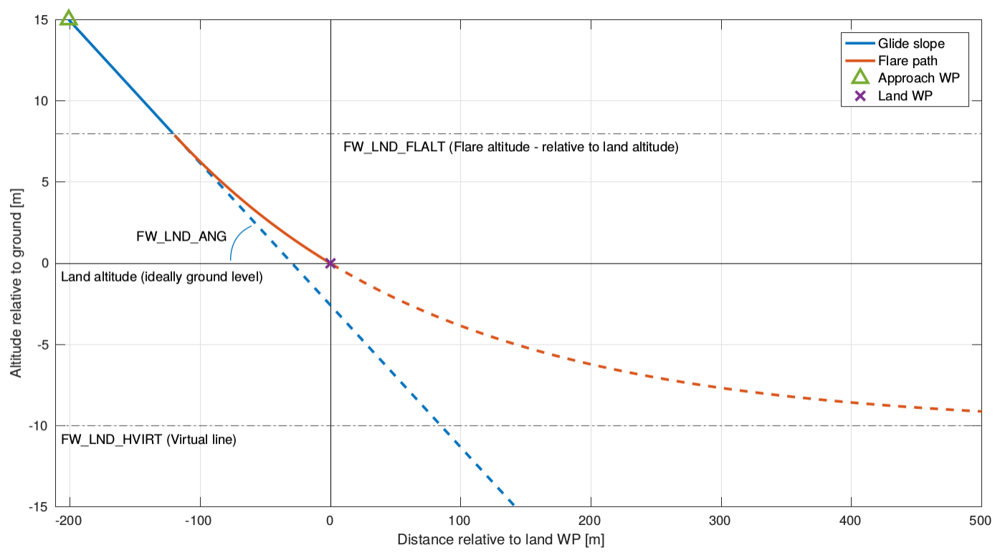

# 고정익 착륙

PX4는 [임수](../flying/missions.md), [착륙 모드](../flight_modes/land.md) 및 [복귀 모드](../flight_modes/return.md)에서 자동 조종 제어 고정익(FW) 착륙이 가능합니다.

랜딩 과정에는 아래와 같이 여러 단계가 있습니다. 첫 번째 단계에서 기체는 지면을 향해 고정된 궤적 ([FW_LND_ANG](#FW_LND_ANG))을 따라 비행합니다. 플레어 착륙 고도 ([FW_LND_FLALT](#FW_LND_FLALT))에서 기체는 플레어 경로를 따르기 시작합니다 (곡선은 [FW_LND_HVIRT](#FW_LND_HVIRT) 값을 기반으로 함).

플레어 착륙 고도는 고정익의 고도와 관련이 있습니다. [착륙 모드](../flight_modes/land.md)에서는지면 고도를 알 수 없으며, 기체는 0m (해수면) 고도에 있다고 가정합니다. 종종 지면이 해수면보다 높기 때문에 기체는 첫 번째 단계에 착륙합니다 (플레어 고도에 도달하기 전에 지면에 착륙합니다).

임무, [복귀 모드](../flight_modes/return.md)에서 또는 차량에 거리 센서가 장착된 경우에는 지면 수준을 정확하게 추정 할 수 있으며 착륙 동작은 앞의 다이어그램에 표시된 것과 같습니다.

착륙은 다음 매개변수의 영향을 많이 받습니다.

| 매개 변수                                                                                                     | 설명                                                                                                      |
| --------------------------------------------------------------------------------------------------------- | ------------------------------------------------------------------------------------------------------- |
| [FW_LND_ANG](../advanced_config/parameter_reference.md#FW_LND_ANG)             | 플레어링전 착륙 경사각                                                                                            |
| [FW_LND_HVIRT](../advanced_config/parameter_reference.md#FW_LND_HVIRT)         | 플레어 궤적을 계산하는 데 사용되는 가상 수평선 / 고도.   
플레어 경로 곡선이 점근 적으로 접근하는 지하 고도를 나타냅니다.                                |
| [FW_LND_FLALT](../advanced_config/parameter_reference.md#FW_LND_FLALT)         | 착륙 플레어 고도 (착륙 고도 기준)                                                                                    |
| [FW_LND_TLALT](../advanced_config/parameter_reference.md#FW_LND_TLALT)         | 착륙 스로틀 제한 고도 (상대 착륙 고도). 기본값 -1.0은 시스템이 플레어 고도의 2/3에서 스로틀 제한을 적용하도록 설정합니다.                              |
| [FW_LND_HHDIST](../advanced_config/parameter_reference.md#FW_LND_HHDIST)       | 착륙 방향은 수평 거리를 유지합니다.                                                                                    |
| [FW_LND_USETER](../advanced_config/parameter_reference.md#FW_LND_USETER)       | 착륙하는 동안 지형 추정 (GPS의 지상 고도)을 사용합니다. 이는 기본적으로 꺼져 있으며 웨이 포인트 또는 복귀 고도가 일반적으로 사용됩니다 (또는 임의의 육지 위치에 대한 해수면). |
| [FW_LND_FL_PMIN](../advanced_config/parameter_reference.md#FW_LND_FL_PMIN)     | 플레어 중 최소 피치. 양의 값은 기수를 위로 향함을 의미합니다. `FW_LND_TLALT`에 도달하면 적용됩니다.                                        |
| [FW_LND_FL_PMAX](../advanced_config/parameter_reference.md#FW_LND_FL_PMAX)     | 플레어중 최대 피치. 양의 값은 기수를 위로 향함을 의미합니다. `FW_LND_TLALT`에 도달하면 적용됩니다.                                         |
| [FW_LND_AIRSPD_SC](../advanced_config/parameter_reference.md#FW_LND_AIRSPD_SC) | 최소 이륙 속도의 스케일링 계수. 이 계수에 비행기의 최소 대기 속도를 곱하면 목표 대기 속도에 착륙 접근을 제공합니다. `FW_AIRSPD_MIN x FW_LND_AIRSPD_SC`  |