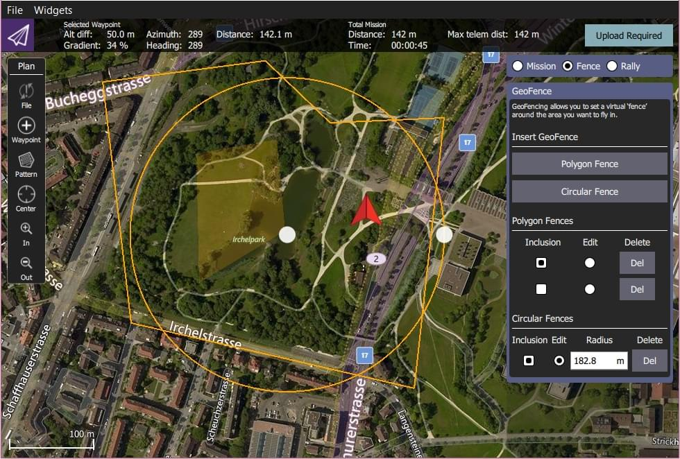
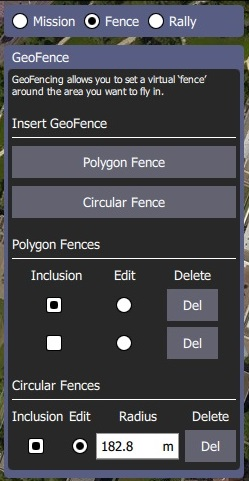

# GeoFence

GeoFence는 기체의 비행 영역을 정의하는 가상 경계입니다. GeoFence는 기체가 RC 무선 조종기의 영향권을 벗어나서 안전하지 않거나 제한된 공역을 비행하는 것을 방지합니다.

두 가지 방법으로 GeoFence를 설정할 수 있습니다.
- 간단한 실린더 형태를 이용한  "사고방지" 지오펜스를 정의할 수 있습니다.
- GeoFence 계획(*QGroundControl*)을 사용하여 복잡한 영역를 정의할 수 있습니다.

:::note
GeoFence는 미션 모드와 수동 비행 모드에 모두 적용됩니다.
:::

## 사고 방지 GeoFence

[사고 방지 GeoFence](../config/safety.md#geofence-failsafe)는 지정된 최대 반경과 고도로 홈 위치를 중심으로 하는 실린더를 정의합니다.

또한 펜스가 위반되는 경우 "사고 방지 액션" 설정이 포함됩니다. 단순히 알람 경고로 설정할 수도 있지만, 일반적으로 기체를 즉시 안전한 위치로 [복귀 ](../flight_modes/return.md) 시킵니다.

자세한 내용은 [안전 > GeoFence 사고 방지](../config/safety.md#geofence-failsafe)를 참조하십시오.

## GeoFence 계획

PX4는 포함 (내부 비행) 또는 제외 (외부 비행) 영역으로 정의되는 여러개의 원형 및 다각형으로 구성된 복잡한 GeoFence 경계를 지원합니다.

GeoFence는 미션 및 랠리 포인트와 함께 *QGroundControl*에서 계획됩니다.

GeoFence 계획은 [Plan View > GeoFence](https://docs.qgroundcontrol.com/en/PlanView/PlanGeoFence.html) (QGroundControl 사용자 가이드)에 자세하게 문서화되어 있습니다.

요약
1. *QGroundControl > 평면도 *를 오픈합니다.
1. *계획 유형* 라디오 버튼 : **울타리**를 선택합니다. 그러면 *GeoFence 편집기*가 표시됩니다. 
1. **다각형 울타리** 또는 **원형 울타리** 버튼을 선택하여 원하는 유형의 *기본 * 울타리를 지도에 추가합니다. 편집기에서 울타리 유형을 추가합니다.
1. 지도를 사용하여 울타리의 모양과 위치를 구성하십시오.
   - 펜스 중앙 마커를 사용하여 펜스를 올바른 위치로 이동할 수 있습니다.
   - 원형 울타리 테두리의 마커를 사용하여 반경을 변경할 수 있습니다.
   - 모서리 (정점)의 마커를 사용하여 다각형의 형상을 변경할 수 있습니다. 기존 마커 사이의 선을 따라 중간을 클릭하면 추가 정점이 생성됩니다.
1. *GeoFence 편집기*를 사용하여 울타리를 포함 또는 제외로 설정하고 울타리 (**편집** 라디오 버튼)하거나 또는 삭제(**Del**버튼) 합니다.
1. 필요한 만큼 울타리를 추가하십시오.
1. **업로드** 버튼 (오른쪽 상단)을 클릭하여 울타리(랠리 포인트 및 임무와 함께)를 차량에 업로드합니다.
1. [GeoFence 사고방지](../config/safety.md#geofence-failsafe)에서 위반 조치를 설정하십시오.

:::note PX4는 GeoFences 지원을 포함하는 MAVLink [Mission Microservice](https://mavlink.io/en/services/mission.html)를 제공합니다.
:::
