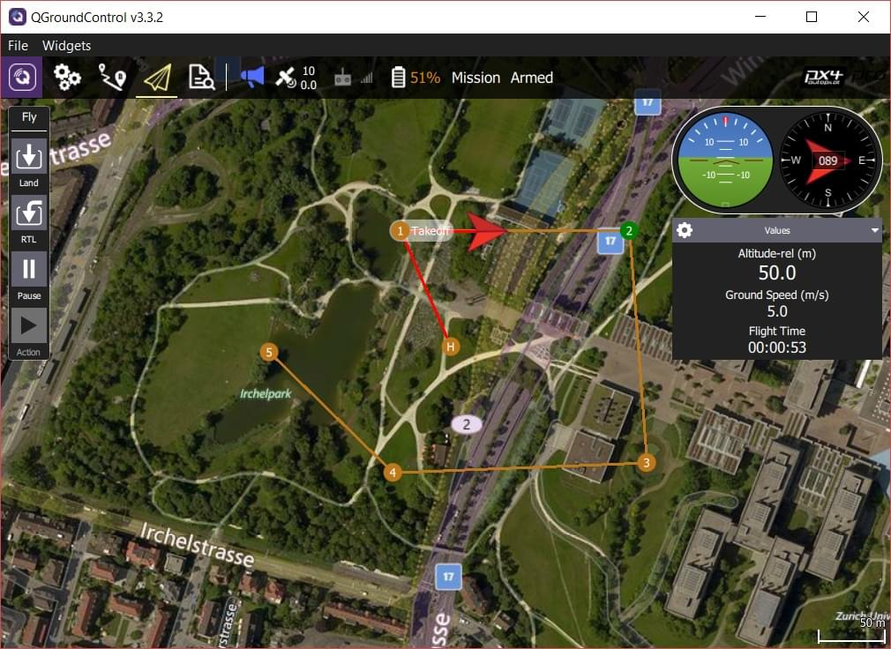

# 임무

## 임무 계획하기

수동으로 임무를 계획하는 것은 간단한 작업입니다.

- 임무 보기로 전환합니다.
- 왼쪽 상단에서 **경유지 추가** ( "더하기") 아이콘을 선택합니다. 
- 지도를 클릭하여 경유지를 추가합니다.
- 경유지 매개 변수와 유형을 수정하려면 오른쪽의 경유지 목록을 사용하십시오. 하단의 고도 표시기는 각 경유지의 상대 고도를 표시합니다.
- **업로드** 버튼 (오른쪽 상단)을 클릭하여 차량에 임무를 전송합니다.

*패턴* 도구를 사용하여 측량 그리드 생성을 자동화 할 수 있습니다.

:::tip
자세한 내용은 [QGroundControl 사용자 가이드](https://docs.qgroundcontrol.com/en/PlanView/PlanView.html)를 참조하십시오.
:::

### 기체 요 각도 설정

요 각도가 설정된 경우 다중 로터는 목표 경유지에 지정된 **방향각** ([ MAV_CMD_NAV_WAYPOINT.param4 ](https://mavlink.io/en/messages/common.html#MAV_CMD_NAV_WAYPOINT)에 해당)을 향하도록 요잉합니다.

경유지 (`param4 = NaN`)의 **방향각**이 명시적으로 설정되지 않은 경우 기체는 매개 변수 [MPC_YAW_MODE](../advanced_config/parameter_reference.md#MPC_YAW_MODE)에 지정된 위치를 향해 요잉합니다. 기본적으로 이것은 다음 경유지입니다.

고정익과 같이 요 및 이동 방향을 제어할 수 없는 기체는 요 설정을 무시합니다.

### Setting Acceptance/Turning Radius

The *acceptance radius* defines the circle around a waypoint within which a vehicle considers it has reached the waypoint, and will immediately switch to (and start turning towards) the next waypoint.

For a multi-rotor drones, the acceptance radius is tuned using the parameter [NAV_ACC_RAD](../advanced_config/parameter_reference.md#NAV_ACC_RAD). By default, the radius is small to ensure that multirotors pass above the waypoints, but it can be increased to create a smoother path such that the drone starts to turn before reaching the waypoint.

The image below shows the same mission flown with different acceptance radius parameters:

The speed in the turn is automatically computed based on the acceptance radius (= turning radius) and the maximum allowed acceleration and jerk (see [Jerk-limited Type Trajectory for Multicopters](../config_mc/mc_jerk_limited_type_trajectory.md#auto-mode)).

:::tip
For more information about the impact of the acceptance radius around the waypoint see: [Mission Mode > Inter-waypoint Trajectory](../flight_modes/mission.md#inter-waypoint-trajectory).
:::

## 임무 비행

Once the mission is uploaded, switch to the flight view. The mission is displayed in a way that makes it easy to track progress (it cannot be modified in this view).

