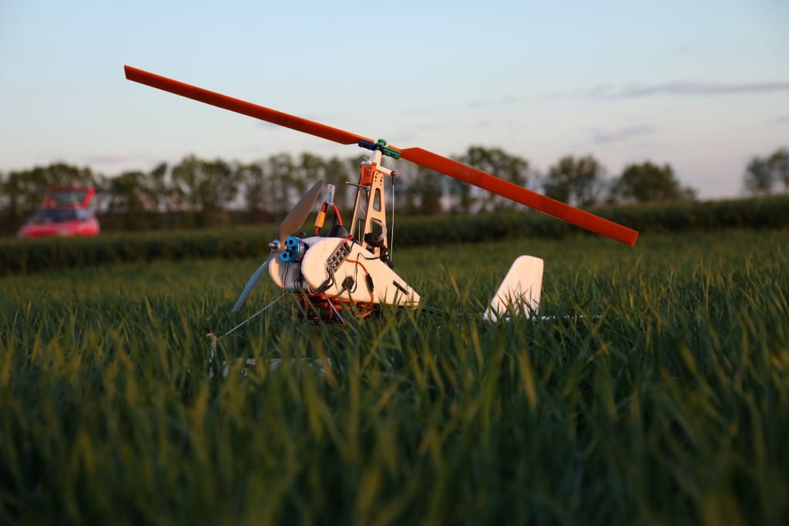
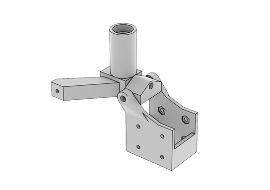
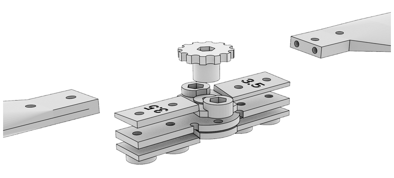
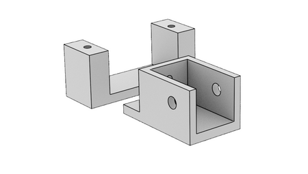
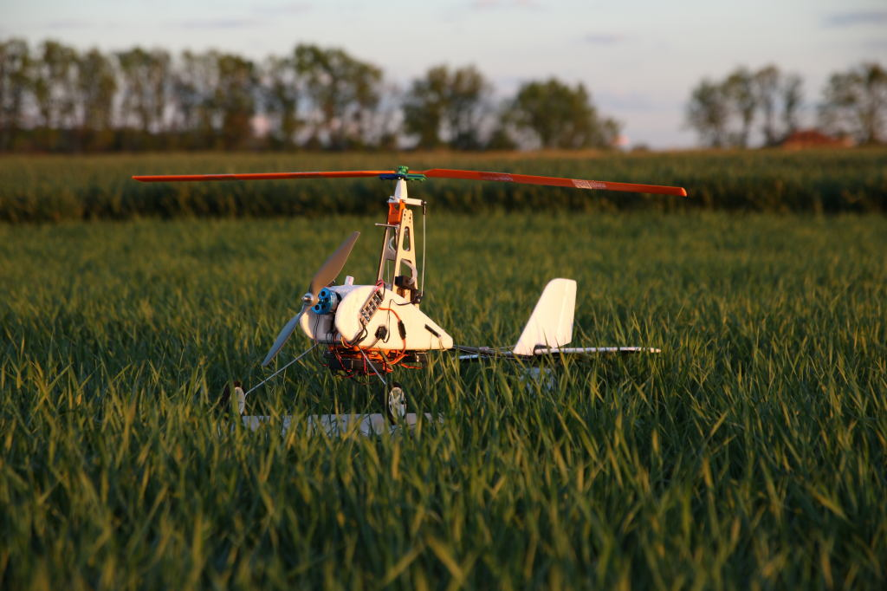
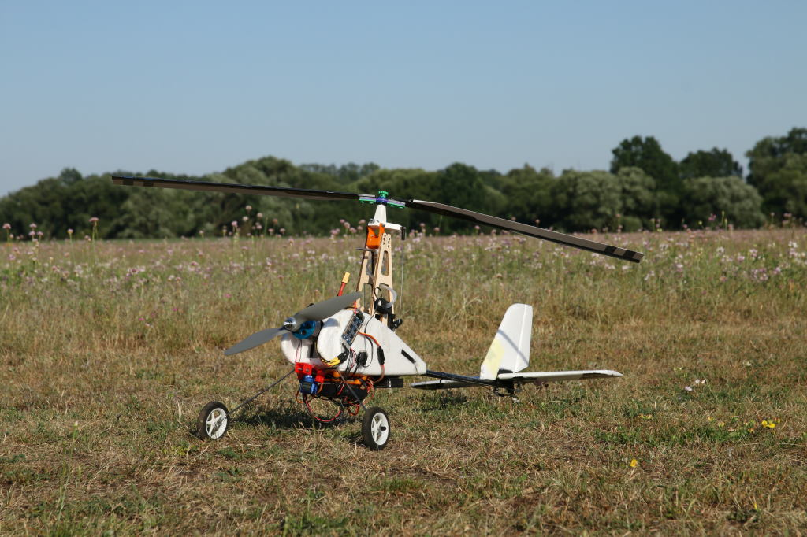
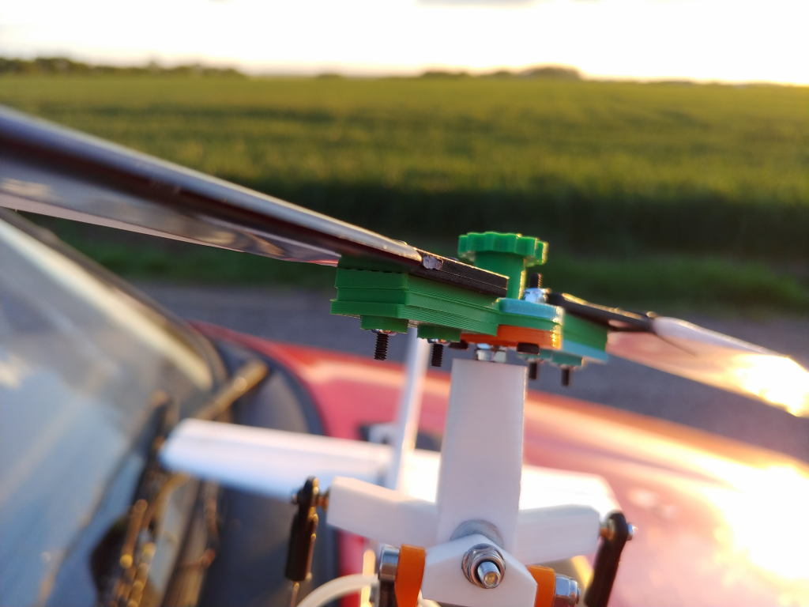
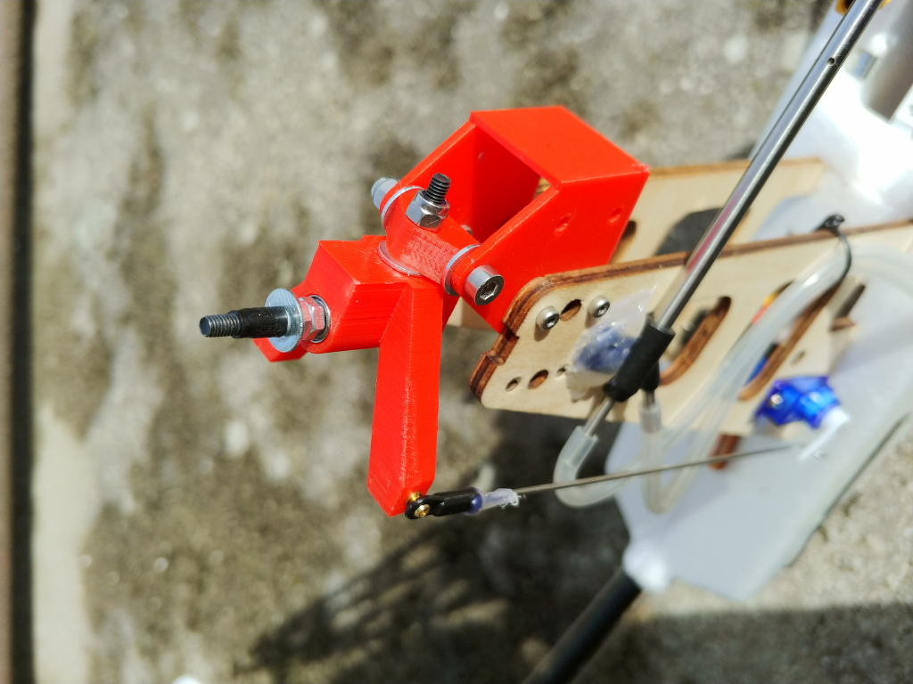

# ThunderFly Auto-G2 오토자이로

*ThunderFly Auto-G2*는 [Durafly ™ Auto-G2 Gyrocopter](https://hobbyking.com/en_us/duraflytm-auto-g2-gyrocopter-w-auto-start-system-821mm-pnf.html) RC 모델을 기반으로 한 자동 조종 제어 자동자이로입니다.  원본 모델의 여러 부분이 3D 인쇄 가능한 모델로 대체되었습니다.

:::note
Auto-G2 오토자이로의 기체는 ThuderFly s.r.o 사에서 개발 및 유지 관리합니다.
:::

추가된 내용들은 [GitHub](https://github.com/ThunderFly-aerospace/TF-G2/)에서 오픈 소스로 제공하고 있습니다. 인쇄된 부품들은 [OpenSCAD](https://www.openscad.org/)로 설계되었습니다.

## 수정 내역

Durafly Auto-G2는 원 디자인에는 CLARK-Y 프로파일을 가진 400mm 길이의 세 개의 블레이드 로터가 있습니다. 로터 헤드는 ROLL 축에서만 기울일 수 있습니다. Autogyro는 방향타와 엘리베이터로 제어됩니다. Durafly Auto-G2 오토 자이로 박스에는 오토 자이로 폴리스티렌 본체, ESC, 모터 (아마 800kV), 4 개의 서보, 테일 에어 포일, 로터 센터 부품이있는 3 개의 블레이드, 와이어 섀시 및 프리 로테이터가 포함되어 있습니다.

Durafly 모델의 수정 내역은 아래와 같습니다.
* 자율 비행 기능 추가
* 두 개의 자유 축(피치, 롤)이있는 로터 헤드
* 안전하게 파손 가능한 로터 플레이트가있는 2 개의 블레이드 로터
* 더 큰 랜딩 기어

### 자율 비행

수정된 모델의 항공기의 중량은 상당히 무겁습니다. 따라서 경량 비행 컨트롤러가 권장됩니다 (예 : [Holybro pix32](../flight_controller/holybro_pix32.md) 또는 [CUAV nano](../flight_controller/cuav_v5_nano.md)).

자율비행 장치는 3D 프린트 진도 방지 패드의 오토자이로 하단에 장착되어야 합니다. [Thingiverse](https://www.thingiverse.com/thing:160655)에있는 진동 방지 제품을 사용하였습니다.

### 로터 헤드

로터 헤드는 (원래 오토 자이로와 비교하여)  롤 및 피치 축에서도 작동하도록 수정되었습니다. 헤드 로터는 오토 자이로의 회전과 등반 제어가 모두 가능하게 되었습니다. 오토자이로는  낮은 속도에서도 러더 및 엘리베이터를 제어할 수 있습니다.

인쇄된 로터 헤드는 세 부분으로 구성됩니다. 바닥 부분은 M2.5 나사를 사용하여 원래 합판 철탑에 나사로 고정됩니다. 첫 번째 부품과 두 번째 부품 사이에있는 M3x35 나사는 피치 축 자유도를 만들고, 두 번째 부품과 세 번째 부품 사이의 연결은 롤 축 자유도를 만듭니다. 후자의 축은 나사식 자동 잠금 너트가있는 M3x30 나사로 만들어집니다. 로터 쪽에서 스크류 헤드에는 면적이 넓은 와셔가 있습니다.

M3x50 고강도 나사로 만들어진 로터 축은 세 번째 부분을 통과합니다. 사용된 베어링은 623 2Z C3 SKF입니다. 이 부분의 끝에는 M2.5 나사를 통해 파일론의 바닥 부분에 위치한 서보에 부착된 볼로드가 있습니다. 이 부분의 끝에는 M2.5 나사를 통해 관통 파일론의 바닥에 부착된 볼로드가 있습니다.

### 이중 날 로터

원래 Durafly Auto-G2 오토자이로는 3 날 로터이었으나, 2 날 로터를 사용하도록 수정되었습니다. 주된 이유는 진동이 적고 조립이 간편하기 때문입니다. 인쇄된 중앙 부품은 중국산 Durafly 블레이드 또는 3D 인쇄 블레이드와 함께 사용하도록 설계되었습니다.

로터의 중앙 부분은 다음과 같은 역할을하는 요소들로 구성됩니다.
* 블레이드를 펄럭일 수 있습니다.
* 그들은지면과의 충돌로 부서지는 변형 영역을 가지고 있습니다. 덕분에 일반적으로 하나의 부품만 교체로 로터를 신속하게 수리 할 수 있습니다.
* 블레이드 공격각을 쉽게 설정 가능합니다.

#### HobbyKing 로터 블레이드

원 블레이드와 함께 로터의 인쇄 된 중앙 부분을 사용할 수 있습니다. 이 블레이드는 [HobbyKing](https://hobbyking.com/en_us/duraflytm-auto-g-gyrocopter-821mm-replacement-main-blade-1pcs-bag.html)에서 구입할 수 있습니다. Hobbyking 블레이드는 무게 중심이 다르므로 적절한 균형을 유지하여야 합니다.

#### 3D 프린팅 로터 블레이드

로터 블레이드를 인쇄할 수 있습니다.

인쇄된 로터 블래드는 아직 개발 중이지만, 예비 테스트에서 정확한 모양과 세로 홈이 없기 때문에 품질이 더 우수한 것으로 조사되었습니다. 그러나, 일부 제작 과정은 조정중입니다.

#### 균형 유지

적절한 블레이드 균형은 진동을 최소화하는 데 매우 중요합니다. 블레이드는 무게 중심이 로터 축의 중앙에 위치하도록 균형을 맞춰야합니다.

인쇄된 블레이드는 생산 과정에서 균형을 이미 잡혀있으므로 더 이상 균형을 맞출 필요가 없습니다.

### 릴리스 장치

윈치를 사용하여 자동 자이로를 시작하거나 견인하여 시작하려면 릴리스 장치를 인쇄하여야 합니다. 핀을 빼내고 로프를 풀어주는 서보가 장착된 작은 상자입니다.

전체 부품은 오토 자이로 본체 하단에있는 엔진 아래에 핫멜트 접착제를 사용하여 접착됩니다. 오토 자이로가 로프로 견인되는 경우 엔진이 켜지지 않아야 합니다. 예를 들어, 릴리스 장치 스위치가 닫혀있는 경우 트랜스미터에서 엔진 출력을 무효화하여 처리할 수 있습니다.

## 부품 목록

### 전바 부품

* 자동 조종 장치 ([Holybro pix32](../flight_controller/holybro_pix32.md), [CUAV nano](../flight_controller/cuav_v5_nano.md))
* GPS (GPS 모듈 NEO-6M, 패치 안테나 포함)
* 대기 속도 센서 ([SDP3x](https://www.sensirion.com/en/flow-sensors/differential-pressure-sensors/worlds-smallest-differential-pressure-sensor/))
* 원본을 대체하는 강력한 서보 (옵션), ([BlueBird BMS-125WV](https://www.blue-bird-model.com/products_detail/411.htm))
* 릴리스 장치용 추가 서보 (옵션)

### 기계식 부품

* 로터 헤드 베어링 (623 2Z C3)
* 프로펠러 ([APC 10x7](https://www.apcprop.com/product/10x7e/))
* [프로펠러 어댑터](https://mpjet.com/shop/gb/prop-adapters/184-collet-prop-adapter-19-mm-4-mm-shaft-m629-standard.html)

### 기판 부품

* 로터 헤드:
  * [Pylon end](https://github.com/ThunderFly-aerospace/Auto-G2/blob/master/CAD/stl/111_1001.stl)
  * [피치 부품](https://github.com/ThunderFly-aerospace/Auto-G2/blob/master/CAD/stl/111_1002.stl)
  * [롤 부품](https://github.com/ThunderFly-aerospace/Auto-G2/blob/master/CAD/stl/111_1003.stl)

* 로터:
  * [중앙 부분 와셔 상단](https://github.com/ThunderFly-aerospace/Auto-G2/blob/master/CAD/stl/111_1008.stl)
  * [중앙부 와셔 바닥](https://github.com/ThunderFly-aerospace/Auto-G2/blob/master/CAD/stl/111_1004.stl)
  * [변형 영역이 있는 센터 플레이트](https://github.com/ThunderFly-aerospace/Auto-G2/blob/master/CAD/stl/888_1001.stl)
  * [블레이드 AoA 설정용 와셔](https://github.com/ThunderFly-aerospace/Auto-G2/blob/master/CAD/stl/111_1005.stl)
  * [로터 너트](https://github.com/ThunderFly-aerospace/Auto-G2/blob/master/CAD/stl/888_1002.stl)

* 로터 블레이드 (옵션)
* Autopilot 홀더
* [릴리스 장치](https://github.com/ThunderFly-aerospace/Auto-G2/blob/master/CAD/stl/888_1010.stl)
* [앞 바퀴](https://github.com/ThunderFly-aerospace/Auto-G2/blob/master/CAD/stl/888_1011.stl)

### 권장 예비 부품

* 품질이 향상된 서보 ([BlueBird BMS-125WV](https://www.blue-bird-model.com/products_detail/411.htm) 권장, 원래 서보는 내구성이 낮음))
* 프로펠러 ([APC 10x7](https://www.apcprop.com/product/10x7e/))
* 변형 영역이있는 로터 중앙 플레이트 (3D 인쇄)
* 로터 블레이드 ([HobbyKing](https://hobbyking.com/en_us/duraflytm-auto-g-gyrocopter-821mm-replacement-main-blade-1pcs-bag.html) 또는 3D 프린팅)

## 비디오

@[유투브](https://youtu.be/YhXXSWz5wWs)

## 변경 사진 갤러리

   
