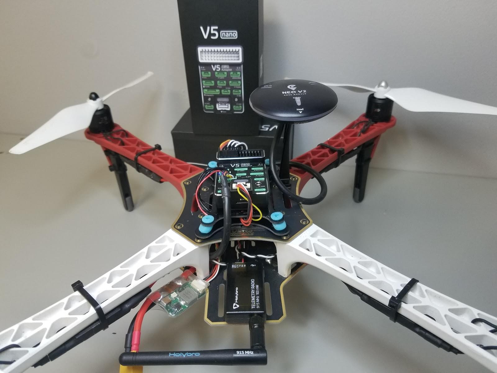
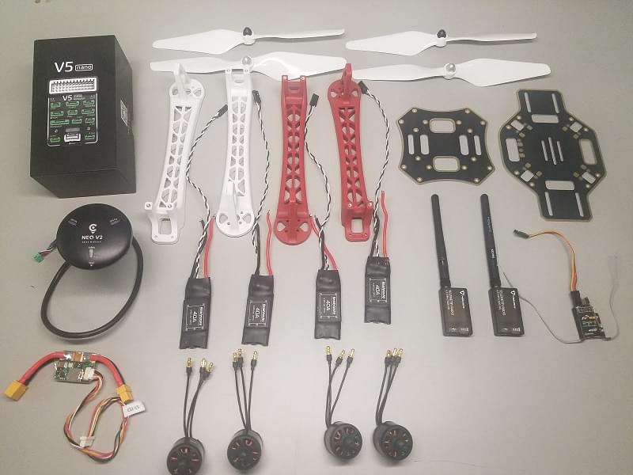

# DJI FlameWheel 450 + CUAV V5 nano 구성

이 주제는 키트의 조립과 *QGroundControl*을 이용하는 PX4 설정에 대한 지침을 제공합니다.

핵심정보

- **프레임:** DJI F450
- **비행 조절장치:** [CUAV V5 nano](../flight_controller/cuav_v5_nano.md)
- **조립 시간 (예상):** 90 분 (프레임 조립에 45분, 오토파일럿 설치와 설정에 45분)

## Bill of materials

이 부품들이 조립에 필요합니다:

- 비행컨트롤러: [CUAV V5 nano](https://store.cuav.net/index.php?id_product=98&id_product_attribute=0&rewrite=cuav-new-pixhack-v5-nano-small-flight-controller-for-ardupilot-px4-drone-parts-free-shipping-whole-sale-&controller=product&id_lang=1): 
  - GPS: [CUAV NEO V2 GPS](https://store.cuav.net/index.php?id_product=97&id_product_attribute=0&rewrite=cuav-new-ublox-neo-m8n-gps-module-with-shell-stand-holder-for-flight-controller-gps-compass-for-pixhack-v5-plus-rc-parts-px4&controller=product&id_lang=1)
  - 전원 모듈
- 프레임: [DJI F450](https://www.amazon.com/Flame-Wheel-Basic-Quadcopter-Drone/dp/B00HNMVQHY)
- 프로펠러: [DJI Phantom Built-in Nut Upgrade Propellers 9.4x5](https://www.masterairscrew.com/collections/all-products/products/dji-phantom-built-in-nut-upgrade-propellers-in-white-mr-9-4x5-prop-set-x4-phantom)
- 배터리: [Turnigy High Capacity 5200mAh 3S 12C Lipo Pack w/XT60](https://hobbyking.com/en_us/turnigy-high-capacity-5200mah-3s-12c-multi-rotor-lipo-pack-w-xt60.html?___store=en_us)
- 텔레메트리: [Holibro Transceiver Telemetry Radio V3](https://shop.holybro.com/transceiver-telemetry-radio-v3_p1103.html)
- RC 수신기: [FrSky D4R-II 2.4G 4CH ACCST Telemetry Receiver](https://www.banggood.com/FrSky-D4R-II-2_4G-4CH-ACCST-Telemetry-Receiver-for-RC-Drone-FPV-Racing-p-929069.html?cur_warehouse=GWTR)
- 모터: [DJI E305 2312E Motor (800kv,CW)](https://www.amazon.com/DJI-E305-2312E-Motor-800kv/dp/B01M7TW3XN)
- ESC: [Hobbywing XRotor 20A APAC Brushless ESC 3-4S For RC Multicopters](https://www.amazon.com/DJI-E305-2312E-Motor-800kv/dp/B01M7TW3XN)

추가적으로 우리는 FrSky Taranis 조종기 사용합니다. 부수적으로 케이블 타이와, 양면테이프, 땜 납도 필요합니다.

아래의 이미지는 프레임과 전자 부품을 보여줍니다.

## 하드웨어

### 프레임

이 섹션은 프레임의 모든 하드웨어를 나열합니다.

| 품목                                 | 수량 |
| ---------------------------------- | -- |
| DJI F450 밑판                        | 1  |
| DJI F450 윗판                        | 1  |
| DJI F450 랜딩기어 역할을 하는 다리            | 4  |
| M3*8 나사                            | 18 |
| M2 5*6 나사                          | 24 |
| 벨크로 배터리 스트랩                        | 1  |
| DJI Phantom 나사 내장 업그레이드 프로펠러 9.4x5 | 1  |

### CUAV v5 nano 패키지

이 섹션은 CUAV v5 nano package의 부품들을 나열합니다.

| 품목                  | 수량 (기본 패키지) | 수량 (+GPS 패키지) |
| ------------------- | ----------- | ------------- |
| V5 nano 비행 제어기      | 1           | 1             |
| 듀퐁 케이블              | 2           | 2             |
| I2C/CAN 케이블         | 2           | 2             |
| ADC 6.6 케이블         | 2           | 2             |
| SBUS 시그널 케이블        | 1           | 1             |
| IRSSI 케이블           | 1           | 1             |
| DSM 시그널 케이블         | 1           | 1             |
| ADC 3.3 케이블         | 1           | 1             |
| Debug 케이블           | 1           | 1             |
| 안전 스위치 케이블          | 1           | 1             |
| 전압 & 전류 케이블         | 1           | 1             |
| PW-Link 모듈 케이블      | 1           | 1             |
| 전원 모듈               | 1           | 1             |
| SanDisk 16GB 메모리 카드 | 1           | 1             |
| I2C 확장 보드           | 1           | 1             |
| TTL Plate           | 1           | 1             |
| NEO GPS             | -           | 1             |
| GPS 브라켓             | -           | 1             |

### 전자부품

| 품목                                                    | 수량 |
| ----------------------------------------------------- | -- |
| CUAV V5 nano                                          | 1  |
| CUAV NEO V2 GPS                                       | 1  |
| Holibro Telemetry                                     | 1  |
| FrSky D4R-II 2.4G 4CH ACCST Telemetry Receiver        | 1  |
| DJI E305 2312E Motor (800kv,CW)                       | 4  |
| Hobbywing XRotor 20A APAC Brushless ESC               | 4  |
| Power Module(CUAV V5 nano 패키지에 포함된)                   | 1  |
| Turnigy High Capacity 5200mAh 3S 12C Lipo Pack w/XT60 | 1  |

### 필요한 공구

아래 공구들이 조립에 필요합니다.

- 2.0mm 육각 스크류드라이버
- 3mm Phillips 스크류드라이버
- Wire 커터
- 정밀 트위저
- 납땜기

## 조립

예상 조립 시간은 약 90 분입니다 (프레임 조립에 약 45 분, 오토파일럿 설치와 구성에 약 45 분).

1. 제공된 나사를 이용하여 밑판에 팔 4개를 결합합니다.
  
    

2. Solder ESC (Electronic Speed Controller) to the board, positive (red) and negative (black).
  
    

3. Solder the Power Module, positive (red) and negative (black).
  
    

4. Plug in the motors to the ESCs according to their positions.
  
    

5. Attach the motors to the corresponding arms.
  
     

6. Add the top board (screw into the top of the legs).
  
    

7. Add damping foam to the *CUAV V5 nano* flight controller.
  
     

8. Attach the FrSky receiver to the bottom board with double-sided tape.
  
    

9. Attach the telemetry module to the vehicle’s bottom board using double-sided tape.
  
     

10. Put the aluminium standoffs on the button plate and attach GPS.
  
    

11. Plug in Telemetry (`TELEM1`), GPS module (`GPS/SAFETY`), RC receiver (`RC`), all 4 ESC’s (`M1-M4`), and the power module (`Power1`) into the flight controller. 
  
  > **Note** The motor order is defined in the [Airframe Reference > Quadrotor x](../airframes/airframe_reference.md#quadrotor-x)

That's it! The final build is shown below:

## 기체 설정/보정 {#configure}

*QGroundControl* 이 PX4 오토파일럿을 설치하고 프레임에 대한 설정과 조정하는데 사용됩니다. *QGroundControl*을 [다운로드하고 설치](http://qgroundcontrol.com/downloads/) 하십시오.

> **Tip** PX4의 설치와 설정에 대한 전체 지침은 [기본 설정](../config/README.md)에서 찾을 수 있습니다.

먼저 펌웨어와 에어프레임을 업데이트 합니다.

* [펌웨어](../config/firmware.md)
* [기체프레임](../config/airframe.md)
  
  > **Note** *Generic Quadrotor X* 에어프레임을 선택합니다.(**Quadrotor x > Generic Quadrotor X**).
  
    

그리고 필수 설치/설정을 수행합니다.

* [센서 보정](../config/flight_controller_orientation.md)
* [지자기 센서](../config/compass.md)
* [가속도 센서](../config/accelerometer.md)
* [수평 보정](../config/level_horizon_calibration.md)
* [무선 설정](../config/radio.md)
* [비행 모드](../config/flight_mode.md) > **Note** 이 구성을 위해 우리는 비행 모드 중 *Stabilized*, *Altitude* 그리고 *Position*를 리시버의 3축 스위치 (단일 채널 - 5번에 맵핑) 에 설정합니다. 이 방법이 초심자를 위한 최소 설정으로 추천됩니다.

이후 다음 작업 역시 수행되어야 합니다:

* [ESC 캘리브레이션](../advanced_config/esc_calibration.md)
* [배터리](../config/battery.md)
* [Safety](../config/safety.md)

## 튜닝

펌웨어 설치과정에서 오토파일럿 파라미터를 선택된 프레임에 맞춘 *기본*값으로 설정합니다. 이 상태로도 비행하기에 충분하지만 특정 프레임 구성에 대한 파라미터를 조정하는 것이 좋습니다.

<!--

The parameters below are recommended for this build (the yellow parameters are the ones that have changed).
These were generated by flight testing.

-->

## 비디오

 https://youtu.be/b0bKNdDqVHw 

## 감사인사

이 빌드 로그는 Dronecode Test Flight Team에서 제공했습니다.