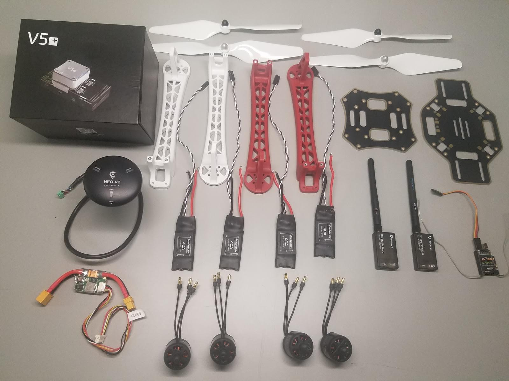
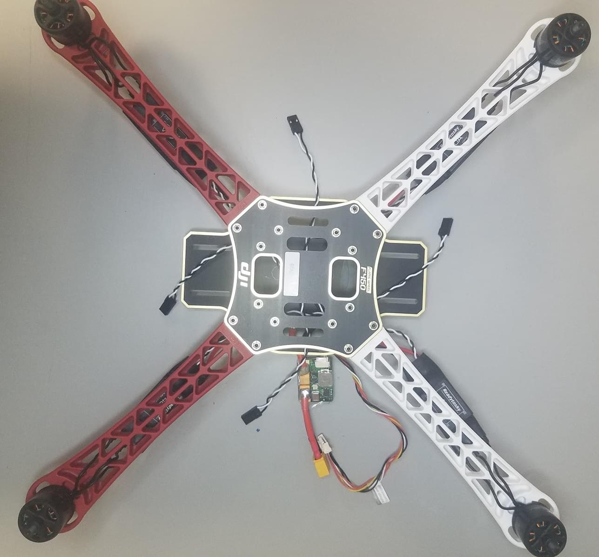

# DJI FlameWheel 450 + CUAV V5 nano 조립

키트 조립법과 *QGroundControl*의 PX4 설정법을 설명합니다.

주요 내용

- **프레임:** DJI F450
- 0>비행 컨트롤러:</strong> [CUAV V5+](../flight_controller/cuav_v5_plus.md)
- **조립 시간 (예상):** 90 분 (프레임 조립에 45분, 오토파일럿 설치와 설정에 45분)

## 부품 명세서

조립에 필요한 부품들입니다.
- 비행컨트롤러: [CUAV V5+](https://store.cuav.net/index.php?id_product=95&id_product_attribute=0&rewrite=cuav-new-pixhack-v5-autopilot-m8n-gps-for-fpv-rc-drone-quadcopter-helicopter-flight-simulator-free-shipping-whole-sale&controller=product&id_lang=1):
  - GPS: [CUAV NEO V2 GPS](https://store.cuav.net/index.php?id_product=97&id_product_attribute=0&rewrite=cuav-new-ublox-neo-m8n-gps-module-with-shell-stand-holder-for-flight-controller-gps-compass-for-pixhack-v5-plus-rc-parts-px4&controller=product&id_lang=1)
  - 전원 모듈
- 프레임: [DJI F450](https://www.amazon.com/Flame-Wheel-Basic-Quadcopter-Drone/dp/B00HNMVQHY)
- 프로펠러: [DJI Phantom Built-in Nut Upgrade Propellers 9.4x5](https://www.masterairscrew.com/collections/all-products/products/dji-phantom-built-in-nut-upgrade-propellers-in-white-mr-9-4x5-prop-set-x4-phantom)
- 배터리: [Turnigy High Capacity 5200mAh 3S 12C Lipo Pack w/XT60](https://hobbyking.com/en_us/turnigy-high-capacity-5200mah-3s-12c-multi-rotor-lipo-pack-w-xt60.html?___store=en_us)
- 텔레메트리: [Holibro Transceiver Telemetry Radio V3](https://shop.holybro.com/transceiver-telemetry-radio-v3_p1103.html)
- RC 수신기: [FrSky D4R-II 2.4G 4CH ACCST Telemetry Receiver](https://www.banggood.com/FrSky-D4R-II-2_4G-4CH-ACCST-Telemetry-Receiver-for-RC-Drone-FPV-Racing-p-929069.html?cur_warehouse=GWTR)
- Motors: [DJI E305 2312E Motor (960kv,CW)](https://www.amazon.com/DJI-E305-2312E-Motor-960kv/dp/B072MBMCZN)
- ESC: Hobbywing XRotor 20A APAC Brushless ESC 3-4S For RC Multicopters

FrSky Taranis 조종기를 사용할 수 있습니다. 부수적으로 케이블 타이와, 양면 테이프, 납땜도 필요합니다.

아래의 이미지는 프레임과 전자 부품을 보여줍니다.

## 하드웨어

### 프레임

이 절에서는 모든 프레임을 나열합니다.

| 설명                                 | 수량 |
| ---------------------------------- | -- |
| DJI F450 하판                        | 1  |
| DJI F450 상판                        | 1  |
| DJI F450 랜딩기어 다리                   | 4  |
| M3*8 나사                            | 18 |
| M2 5*6 나사                          | 24 |
| Velcro Battery Strap               | 1  |
| DJI Phantom 나사 내장 업그레이드 프로펠러 9.4x5 | 1  |

### CUAV v5+ 패키지

이 절에서는 CUAV v5+ 구성 모음의 부품을 나열합니다.

| 설명                  | 수량 (기본 패키지) | 수량 (+GPS 패키지) |
| ------------------- | ----------- | ------------- |
| V5+ AutoPilot       | 1           | 1             |
| 듀퐁 케이블              | 2           | 2             |
| I2C/CAN 케이블         | 2           | 2             |
| ADC 6.6 케이블         | 2           | 2             |
| SBUS 신호 케이블         | 1           | 1             |
| IRSSI 케이블           | 1           | 1             |
| DSM 신호 케이블          | 1           | 1             |
| ADC 3.3 케이블         | 1           | 1             |
| 디버깅 케이블             | 1           | 1             |
| 안전 스위치 케이블          | 1           | 1             |
| 전압 & 전류 케이블         | 1           | 1             |
| PW-Link 모듈 케이블      | 1           | 1             |
| 전원 모듈               | 1           | 1             |
| SanDisk 16GB 메모리 카드 | 1           | 1             |
| I2C 확장 보드           | 1           | 1             |
| TTL 판               | 1           | 1             |
| NEO GPS             | -           | 1             |
| GPS 브라켓             | -           | 1             |

### 전자부품

| 설명                                          | 수량 |
| ------------------------------------------- | -- |
| CUAV V5+                                    | 1  |
| CUAV NEO V2 GPS                             | 1  |
| Holibro 텔레메트리                               | 1  |
| FrSky D4R-II 2.4G 4CH ACCST 텔레메트리 수신기       | 1  |
| DJI E305 2312E 모토(800kv, 시계 방향)             | 4  |
| Hobbywing XRotor 20A APAC Brushless ESC     | 4  |
| 전원모듈(CUAV V5+ 패키지에 포함)                      | 1  |
| Turnigy 고용량 5200mAh 3S 12C Lipo Pack w/XT60 | 1  |

### 필요한 공구

조립시에 필요한 공구들입니다.

- 2.0mm 육각 스크류드라이버
- 3mm Phillips 스크류드라이버
- Wire 커터
- 정밀 트위저
- 납땜기

## 조립

예상 조립 시간은 약 90분입니다 (프레임 조립에 약 45분, 자율비행프로그램 설치와 설정에 약 45분).

1. 제공된 나사를 이용하여 밑판에 팔 4개를 결합합니다.

   

1. ESC (변속기) 의 양극 (빨강)과 음극 (검정)을 보드에 납땜합니다.

   

1. 전원 모듈의 양극 (빨강)과 음극 (검정)을 납땜합니다.

   

1. 위치에 따라 모터를 ESC에 연결합니다.

   

1. 각각의 모터를 해당하는 팔에 고정합니다.

    

1. (다리의 윗부분과 나사로 결합하여) 상판을 장착합니다.

   

1. CUAV V5 + 비행 컨트롤러에 양면 테이프 (3M)를 추가합니다 (내부 진동 감쇠 기능이있어 폼을 사용할 필요가 없음).

   

1. FrSky 수신기를 양면 테이프를 이용하여 아래판에 부착합니다.

   

1. 텔레메트리 모듈을 기체의 아랫판에 양면테이프를 이용하여 부착합니다.

    

1. 알루미늄 GPS 지지대를 밑판에 추가한후 GPS를 부착합니다.

1. 텔레메트리(`TELEM1`) 및 GPS 모듈 (`GPS /SAFETY`)을 비행 컨트롤러에 연결합니다.  

1. RC 수신기(`RC`), 4 개의 ESC(`M1-M4`) 및 전원 모듈(`Power1`)을 비행 컨트롤러에 연결합니다. 

:::note
모터 순서는 [기체 정의서> Quadrotor x](../airframes/airframe_reference.md#quadrotor-x)에 정의되어 있습니다.
:::

이제 됐습니다! 마지막 조립순서가 다음에 이어집니다:

## 기체 설정 및 보정

*QGroundControl*에서 PX4 자율비행 프로그램을 설치하고 프레임에 대한 설정과 보정 작업을 진행합니다. *QGroundControl*을 [다운로드하고 설치](http://qgroundcontrol.com/downloads/) 하십시오.

:::tip PX4 설치 및 성정 매뉴얼은 [기본 설정](../config/README.md)편을 참고하십시오.
:::

먼저 펌웨어와 에어프레임을 업데이트 합니다.
* [펌웨어](../config/firmware.md)
* [기체](../config/airframe.md) :::note *Generic Quadrotor X* 기체 (**Quadrotor x> Generic Quadrotor X**)를 선택해야합니다.

  
:::

그리고, 설치후에 필수적인 설정 작업을 실시합니다.
* [센서 방향](../config/flight_controller_orientation.md)
* [나침반](../config/compass.md)
* [가속도계](../config/accelerometer.md)
* [수평 보정](../config/level_horizon_calibration.md)
* [무선 조종기 설정](../config/radio.md)
* [비행 모드](../config/flight_mode.md)

:::note
이 빌드를 위해 수신기의 3 방향 스위치 (단일 채널에 매핑 됨-5)에 *안정화*, *고도* 및 *위치 * 모드를 설정했습니다. 이 방법이 초심자를 위한 최소 설정으로 추천됩니다.
:::

이후 다음 작업 역시 수행되어야 합니다:
* [ESC 보정](../advanced_config/esc_calibration.md)
* [배터리](../config/battery.md)
* [안전 설정](../config/safety.md)

## 튜닝

펌웨어 설치과정에서 자율비행 파라미터를 선택된 프레임의 *기본*값으로 설정합니다. 이 상태로도 비행하기에 충분하지만 특정 프레임 구성에 대한 파라미터를 조정하는 것이 좋습니다.

<!--

The parameters below are recommended for this build (the yellow parameters are the ones that have changed).
These were generated by flight testing.

-->

## 비디오

@[유투브](https://youtu.be/r-IkaVpN1Ko)

## 감사의 글

이 빌드 로그는 Dronecode Test Flight Team에서 제공했습니다.
