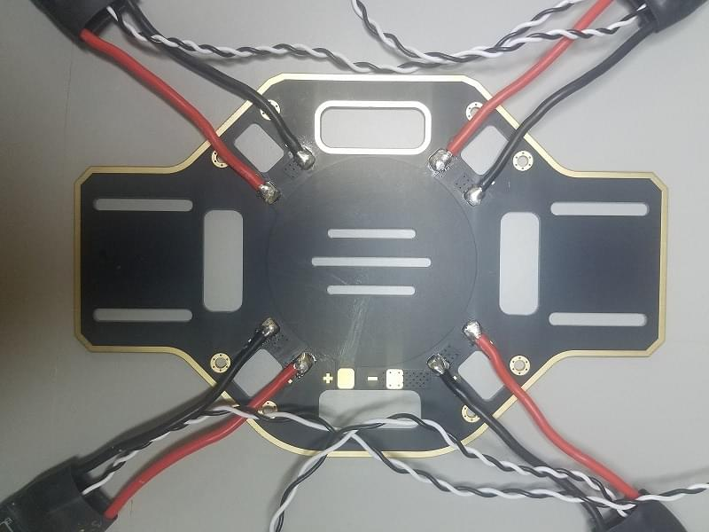

# DJI FlameWheel 450 + CUAV V5 nano 조립

*QGroundControl*을 사용하여 키트를 조립 및 PX4 설정 방법을 설명합니다.

주요 내용

- **프레임:** DJI F450
- 0>비행 컨트롤러:</strong> [CUAV V5+](../flight_controller/cuav_v5_plus.md)
- **조립 시간 (예상):** 90 분 (프레임 조립에 45분, 오토파일럿 설치와 설정에 45분)

## 부품 명세서

조립에 필요한 부품들입니다.

- 비행컨트롤러: [CUAV V5+](https://store.cuav.net/index.php?id_product=95&id_product_attribute=0&rewrite=cuav-new-pixhack-v5-autopilot-m8n-gps-for-fpv-rc-drone-quadcopter-helicopter-flight-simulator-free-shipping-whole-sale&controller=product&id_lang=1): 
  - GPS: [CUAV NEO V2 GPS](https://store.cuav.net/index.php?id_product=97&id_product_attribute=0&rewrite=cuav-new-ublox-neo-m8n-gps-module-with-shell-stand-holder-for-flight-controller-gps-compass-for-pixhack-v5-plus-rc-parts-px4&controller=product&id_lang=1)
  - 전원 모듈
- 프레임: [DJI F450](https://www.amazon.com/Flame-Wheel-Basic-Quadcopter-Drone/dp/B00HNMVQHY)
- 프로펠러: [DJI Phantom Built-in Nut Upgrade Propellers 9.4x5](https://www.masterairscrew.com/collections/all-products/products/dji-phantom-built-in-nut-upgrade-propellers-in-white-mr-9-4x5-prop-set-x4-phantom)
- 배터리: [Turnigy High Capacity 5200mAh 3S 12C Lipo Pack w/XT60](https://hobbyking.com/en_us/turnigy-high-capacity-5200mah-3s-12c-multi-rotor-lipo-pack-w-xt60.html?___store=en_us)
- 텔레메트리: [Holibro Transceiver Telemetry Radio V3](https://shop.holybro.com/transceiver-telemetry-radio-v3_p1103.html)
- RC 수신기: [FrSky D4R-II 2.4G 4CH ACCST Telemetry Receiver](https://www.banggood.com/FrSky-D4R-II-2_4G-4CH-ACCST-Telemetry-Receiver-for-RC-Drone-FPV-Racing-p-929069.html?cur_warehouse=GWTR)
- 모터: [DJI E305 2312E Motor (800kv,CW)](https://www.amazon.com/DJI-E305-2312E-Motor-800kv/dp/B01M7TW3XN)
- ESC: [Hobbywing XRotor 20A APAC Brushless ESC 3-4S For RC Multicopters](https://www.amazon.com/DJI-E305-2312E-Motor-800kv/dp/B01M7TW3XN)

FrSky Taranis 조종기를 사용할 수 있습니다. 부수적으로 케이블 타이와, 양면 테이프, 납땜도 필요합니다.

아래의 이미지는 프레임과 전자 부품을 보여줍니다.

## 하드웨어

### 프레임

이 절에서는 모든 프레임을 나열합니다.

| 설명                                 | 수량 |
| ---------------------------------- | -- |
| DJI F450 하판                        | 1  |
| DJI F450 상판                        | 1  |
| DJI F450 랜딩기어 다리                   | 4  |
| M3*8 나사                            | 18 |
| M2 5*6 나사                          | 24 |
| Velcro Battery Strap               | 1  |
| DJI Phantom 나사 내장 업그레이드 프로펠러 9.4x5 | 1  |

### CUAV v5+ 패키지

이 절에서는 CUAV v5+ 구성 모음의 부품을 나열합니다.

| 설명                       | 수량 (기본 패키지) | 수량 (+GPS 패키지) |
| ------------------------ | ----------- | ------------- |
| V5+ AutoPilot            | 1           | 1             |
| DuPont Cable             | 2           | 2             |
| I2C/CAN Cable            | 2           | 2             |
| ADC 6.6 Cable            | 2           | 2             |
| SBUS Signal Cable        | 1           | 1             |
| IRSSI Cable              | 1           | 1             |
| DSM Signal Cable         | 1           | 1             |
| ADC 3.3 Cable            | 1           | 1             |
| Debug Cable              | 1           | 1             |
| Safety Switch Cable      | 1           | 1             |
| Voltage & Current Cable  | 1           | 1             |
| PW-Link Module Cable     | 1           | 1             |
| Power Module             | 1           | 1             |
| SanDisk 16GB Memory Card | 1           | 1             |
| 12C Expansion Board      | 1           | 1             |
| TTL Plate                | 1           | 1             |
| NEO GPS                  | -           | 1             |
| GPS Bracket              | -           | 1             |

### Electronics

| Description                                           | Quantity |
| ----------------------------------------------------- | -------- |
| CUAV V5+                                              | 1        |
| CUAV NEO V2 GPS                                       | 1        |
| Holibro Telemetry                                     | 1        |
| FrSky D4R-II 2.4G 4CH ACCST Telemetry Receiver        | 1        |
| DJI E305 2312E Motor (800kv,CW)                       | 4        |
| Hobbywing XRotor 20A APAC Brushless ESC               | 4        |
| Power Module(Included in the CUAV V5+ package)        | 1        |
| Turnigy High Capacity 5200mAh 3S 12C Lipo Pack w/XT60 | 1        |

### Tools needed

The following tools are used in this assembly:

- 2.0mm Hex screwdriver
- 3mm Phillips screwdriver
- Wire cutters
- Precision tweezers
- Soldering iron

## Assembly

Estimated time to assemble is approximately 90 minutes (about 45 minutes for the frame and 45 minutes installing the autopilot and configuring the airframe.

1. Attach the 4 arms to the bottom plate using the provided screws.
  
    

2. Solder ESC (Electronic Speed Controller) to the board, positive (red) and negative (black).
  
    

3. Solder the Power Module, positive (red) and negative (black).
  
    

4. Plug in the motors to the ESCs according to their positions.
  
    

5. Attach the motors to the corresponding arms.
  
     

6. Add the top board (screw into the top of the legs).
  
    

7. Add double-sided tape (3M) to the CUAV V5+ flight controller (it has internal vibration damping, so no need to use foam).
  
    

8. Attach the FrSky receiver to the bottom board with double-sided tape.
  
    

9. Attach the telemetry module to the vehicle’s bottom board using double-sided tape.
  
     

10. Put the aluminium standoffs on the button plate.

11. Plug in Telemetry (`TELEM1`) and GPS module (`GPS/SAFETY`) to the flight controller.  

12. Plug in the RC receiver (`RC`), all 4 ESC’s (`M1-M4`), and the power module (`Power1`) into the flight controller. 
  
:::note
The motor order is defined in the [Airframe Reference > Quadrotor x](../airframes/airframe_reference.md#quadrotor-x)
:::

That's it! The final build is shown below:

## Vehicle Configuration/Calibration

*QGroundControl* is used to install the PX4 autopilot and configure/tune it for the frame. [Download and install](http://qgroundcontrol.com/downloads/) *QGroundControl* for your platform.

:::tip
Full instructions for installing and configuring PX4 can be found in [Basic Configuration](../config/README.md).
:::

First update the firmware and airframe:

* [Firmware](../config/firmware.md)
* [Airframe](../config/airframe.md) :::note You will need to select the *Generic Quadrotor X* airframe (**Quadrotor x > Generic Quadrotor X**).
  
    
:::

Then perform the mandatory setup/calibration:

* [Sensor Orientation](../config/flight_controller_orientation.md)
* [Compass](../config/compass.md)
* [Accelerometer](../config/accelerometer.md)
* [Level Horizon Calibration](../config/level_horizon_calibration.md)
* [Radio Setup](../config/radio.md)
* [Flight Modes](../config/flight_mode.md)
  
:::note
For this build we set up modes *Stabilized*, *Altitude* and *Position* on a three-way switch on the receiver (mapped to a single channel - 5). This is the recommended minimal set of modes for beginners.
:::

Ideally you should also do:

* [ESC Calibration](../advanced_config/esc_calibration.md)
* [Battery](../config/battery.md)
* [Safety](../config/safety.md)

## Tuning

Firmware installation sets *default* autopilot parameters that have been configured for the selected frame. These are good enough to fly with, but it is a good idea to tune the parameters for a specific frame build.

<!--

The parameters below are recommended for this build (the yellow parameters are the ones that have changed).
These were generated by flight testing.

-->

## Video

@[youtube](https://youtu.be/r-IkaVpN1Ko)

## Acknowledgments

This build log was provided by the Dronecode Test Flight Team.