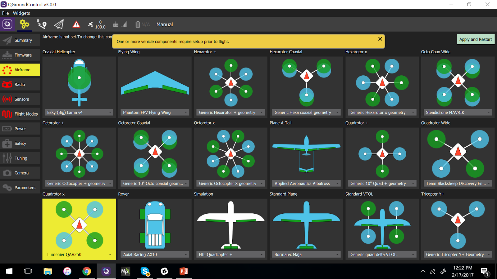

# HolyBro QAV250 + Pixhawk4-Mini 조립

[Holybro Pixhawk 4 Mini QAV250 키트](https://shop.holybro.com/pixhawk-4-mini-qav250-kit_p1125.html)는 Pixhawk 4을 조립 학습에 최적의 키트입니다. 이 키트에는 탄소 섬유 QAV250 레이싱 프레임, *Pixhawk 4 Mini* 및 필요한 거의 모든 구성 요소 (배터리 및 수신기 제외)가 포함되어 있습니다. FPV 지원 유무에 따라 키트가 조금씩 달라집니다.

키트 조립법과 *QGroundControl*의 PX4 설정법을 설명합니다.

주요 정보

* **프레임:** Holybro QAV250
* **비행 컨트롤러:** [Pixhawk 4 Mini](../flight_controller/pixhawk4_mini.md)
* **조립 시간 (예상):** 3.5시간 (프레임 조립에 2시간, 오토파일럿 설치 및 설정에 1.5시간)

## 간단한 가이드

[Pixhawk 4 Mini QAV250 키트 시작 안내서](https://github.com/PX4/px4_user_guide/raw/master/assets/flight_controller/pixhawk4mini/pixhawk4mini_qav250kit_quickstart_web.pdf)

## 부품 명세서

Holybro [Pixhawk 4 Mini QAV250 키트](https://shop.holybro.com/pixhawk-4-mini-qav250-kit_p1125.html)에는 필수 구성 요소가 포함되어 있습니다.

* [Pixhawk 4 Mini](../flight_controller/pixhawk4_mini.md)
* [Holybro Telemetry Radio V3](https://shop.holybro.com/transceiver-telemetry-radio-v3_p1103.html)
* 전원 모듈 holybro
* 조립된 ESC 전원 관리 보드
* 모터- DR2205 KV2300
* 5 인치 플라스틱 프로펠러
* 탄소 섬유 250 기체 (하드웨어 포함)
* Foxer 카메라
* Vtx 5.8ghz

또한, 배터리와 수신기 및 수신기와 호환되는 송신기가 필요합니다. 이 조립 예제에서는 다음의 부품들을 사용합니다.

* 수신기 : [FR SKY D4R-II](http://www.getfpv.com/radios/receivers/frsky-d4r-ii-4ch-2-4ghz-accst-receiver-w-telemetry.html)
* 배터리: [4S 1300 mAh](http://www.getfpv.com/lumenier-1300mah-4s-60c-lipo-battery-xt60.html)

## 하드웨어

프레임 및 자동 조종 장치 설치를 위한 하드웨어들 입니다.

### 프레임 QAV250

| 설명              | 수량 |
| --------------- | -- |
| 유니 바디 프레임 플레이트  | 1  |
| 비행 컨트롤러 커버 플레이트 | 1  |
| PDB             | 1  |
| 카메라 플레이트        | 1  |
| 35mm 스탠드 오프     | 6  |
| 비닐 나사 및 너트      | 4  |
| 15mm 강철 나사      | 8  |
| 강철 너트           | 8  |
| 7mm 강철 나사       | 12 |
| 벨크로 배터리 스트랩     | 1  |
| 배터리용 폼          | 1  |
| 착륙 패드           | 4  |

### 전자부품

| 설명                                                                                                       | 수량 |
| -------------------------------------------------------------------------------------------------------- | -- |
| 모터- DR2205 KV2300                                                                                        | 4  |
| 조립된 ESC 전원 관리 보드                                                                                         | 4  |
| Holybro 전원 모듈                                                                                            | 1  |
| Fr-sky D4R-II 수신기                                                                                        | 1  |
| Pixhawk 4 mini                                                                                           | 1  |
| Holybro GPS Neo-M8N                                                                                      | 1  |
| Holybro [Holybro Telemetry Radio V3](https://shop.holybro.com/transceiver-telemetry-radio-v3_p1103.html) | 1  |
| 배터리 lumenier 1300 mAh 4S 14.8V                                                                           | 1  |
| Vtx 5.8ghz                                                                                               | 1  |
| FPV 카메라 (전체 키트 전용)                                                                                       | 1  |

아래의 이미지는 프레임과 전자 부품들을 나타냅니다.

## 조립

프레임 조립 예상 시간은 2시간이며, *QGroundControl*에서 자동 조종 장치를 설치및 기체 설정 예상 시간은 1.5시간입니다.

### 필요한 공구

조립시에 필요한 공구들입니다.

* 2.0mm 육각 스크류드라이버
* 3mm Phillips 스크류드라이버
* Wire 커터
* 정밀 트위저

### 프레임 조립

1. 그림과 같이 15mm 나사를 사용하여 암을 버튼 플레이트에 부착합니다.
    
    

2. 짧은 판을 팔 위에 올려 놓습니다.
    
    

3. 15mm 나사에 너트를 끼웁니다 (다음 단계 참조).

4. 표시된 구멍에 플라스틱 나사를 삽입합니다 (차량이 완성되면 프레임의이 부분이 아래를 향함을 유의하십시오).
5. 나사에 플라스틱 너트를 추가합니다 (그림과 같이 뒤집음).
6. 전원 모듈을 플라스틱 나사 위로 내린 다음 플라스틱 격리 애자를 추가합니다.
7. 비행 컨트롤러 플레이트를 스탠드 오프에 놓습니다 (전원 모듈 위).
8. 모터를 부착합니다. 모터에는 회전 방향을 나타내는 화살표가 있습니다. 
9. 키트의 양면 테이프를 사용하여 *Pixhawk 4 Mini*를 비행 컨트롤러 플레이트에 부착합니다. 
10. 전원 모듈의 "전원"케이블을 <0 Pixhawk 4 mini</em>에 연결합니다. 
11. 알루미늄 스탠드오프를 버튼 플레이트에 부착합니다.
12. Esc를 모터에 연결합니다. 이 이미지는 모터의 순서와 회전 방향을 나타냅니다. 
    
    ESC의 모터를 연결하고 모터가 올바른 방향으로회전하는 지 확인하십시오. 모터가 반대쪽으로 회전하면 케이블 A를 패드 C로, C를 ESC의 패드 A로 변경하십시오.
    
:::warning
프로펠러를 제거한 상태에서 모터 회전 방향을 테스트합니다.
:::
    
    

13. 신호 ESC 케이블을 Pixhawk의 PWM 출력에 올바른 순서로 연결합니다 (이전 이미지 참조).
    
    

14. 수신기 연결합니다.
    
    * PPM 수신기를 사용하는 경우 PPM 포트에 연결하십시오.
        
        

* SBUS 수신기를 사용하는 경우 RC IN 포트에 연결합니다.
    
    

1. 텔레메트리 모듈을 연결합니다. 이중 테이프로 모듈을 붙여넣고 텔레메트리 포트에 연결합니다.
    
    

2. GPS 모듈 연결
    
    
    
    제공된 3M 테이프 또는 페이스트를 사용하여 상단 플레이트에 모듈을 부착합니다. 그런 다음 그림과 같이 스탠드오프에 상단 플레이트를 놓습니다.
    
    

3. 마지막 "필수"조립 단계는 배터리를 고정하기 위해 벨크로를 추가하는 것입니다.
    
    

이제 "기본"프레임 빌드가 완료되었습니다 (필요한 경우, [Pixhawk 4 Wiring 빠른 시작](../assembly/quick_start_pixhawk4.md)에서 구성 요소 연결에 대한 자세한 정보를 참조).

"기본" 버전의 키트가있는 경우, [PX4 설치/설정](#configure) 방법에 관한 지침으로 이동할 수 있습니다.

### FPV 조립

키트의 "전체" 버전에는 그림과 같이 차량 전면에 장착된 FPV 시스템이 추가로 제공됩니다.

키트를 설치하는 단계는 다음과 같습니다.

1. 프레임에 카메라 브라켓 설치
2. Install the camera on the bracket 
3. The power module on the complete kit comes with wiring ready to connect the Video Transmitter and Camera:  
    * Attach the camera connector  The wires are: blue=voltage sensor, yellow=video out, black=ground, red=+voltage.
    * Connect the Video Transmitter (VTX) connector  The wires are: yellow=video out, black=ground, red=+voltage.
4. Secure the Video Transmitter and OSD board to the frame using tape.

:::note
If you have to wire the system yourself, the diagram below shows all the connections between camera, VTX and power module: 
:::

## Install/Configure PX4

*QGroundControl* is used to install the PX4 autopilot and configure/tune it for the QAV250 frame. [Download and install](http://qgroundcontrol.com/downloads/) *QGroundControl* for your platform.

:::tip
Full instructions for installing and configuring PX4 can be found in [Basic Configuration](../config/README.md).
:::

First update the firmware and airframe:

* [Firmware](../config/firmware.md)
* [Airframe](../config/airframe.md)
    
:::note
You will need to select the *HolyBro QAV250* airframe (**Quadrotor x > HolyBro QAV250**).
    
     ::: Then perform the mandatory setup/calibration:

* [Sensor Orientation](../config/flight_controller_orientation.md)

* [Compass](../config/compass.md)
* [Accelerometer](../config/accelerometer.md)
* [Level Horizon Calibration](../config/level_horizon_calibration.md)
* [Radio Setup](../config/radio.md)
* [Flight Modes](../config/flight_mode.md)

Ideally you should also do:

* [ESC Calibration](../advanced_config/esc_calibration.md)
* [Battery](../config/battery.md)
* [Safety](../config/safety.md)

## Tuning

Airframe selection sets *default* autopilot parameters for the frame. These are good enough to fly with, but it is a good idea to tune the parameters for a specific frame build.

<!-- should state what we want them to use! -->

For general information on tuning see: [Multicopter PID Tuning Guide](../config_mc/pid_tuning_guide_multicopter.md).

## Acknowledgements

This build log was provided by the PX4 Test Team.