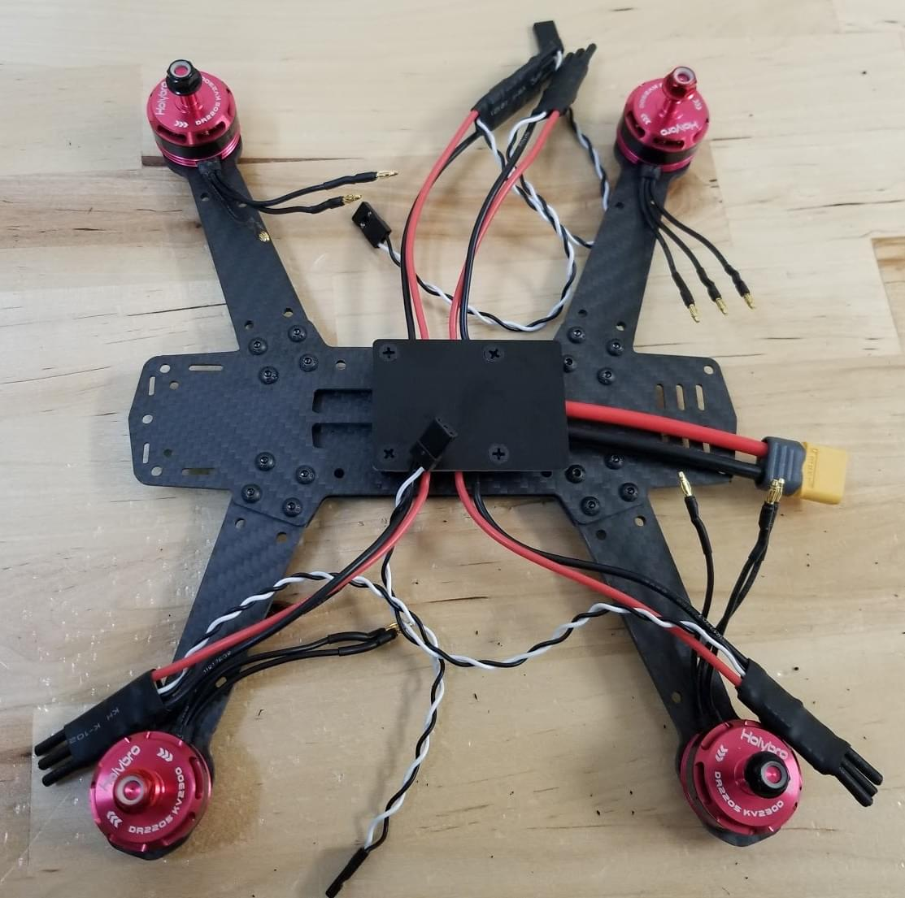

# HolyBro QAV250 + Pixhawk4-Mini 조립

[Holybro Pixhawk 4 Mini QAV250 키트](https://shop.holybro.com/pixhawk-4-mini-qav250-kit_p1125.html)는 Pixhawk 4을 조립법 학습에 매우 좋습니다. 이 키트에는 탄소 섬유 QAV250 레이싱 프레임, *Pixhawk 4 Mini* 및 필요한 거의 모든 구성 요소 (배터리 및 수신기 제외)가 포함되어 있습니다. FPV 지원 유무에 따라 키트가 조금씩 달라집니다.

키트 조립법과 *QGroundControl* PX4 설정법을 제공합니다.

주요 정보

* **프레임:** Holybro QAV250
* **비행 컨트롤러:** [Pixhawk 4 Mini](../flight_controller/pixhawk4_mini.md)
* **조립 시간 (예상):** 3.5시간 (프레임 조립에 2시간, 오토파일럿 설치 및 설정에 1.5시간)

## 간단한 가이드

[Pixhawk 4 Mini QAV250 키트 시작 안내서](https://github.com/PX4/px4_user_guide/raw/master/assets/flight_controller/pixhawk4mini/pixhawk4mini_qav250kit_quickstart_web.pdf)

## 부품 명세서

Holybro [Pixhawk 4 Mini QAV250 키트](https://shop.holybro.com/pixhawk-4-mini-qav250-kit_p1125.html)에는 필수 구성 요소가 포함되어 있습니다.

* [Pixhawk 4 Mini](../flight_controller/pixhawk4_mini.md)
* [Holybro Telemetry Radio V3](https://shop.holybro.com/transceiver-telemetry-radio-v3_p1103.html)
* 전원 모듈 holybro
* 조립된 ESC 전원 관리 보드
* 모터- DR2205 KV2300
* 5 인치 플라스틱 프로펠러
* 탄소 섬유 250 기체 (하드웨어 포함)
* Foxer 카메라
* Vtx 5.8ghz

또한, 배터리와 수신기 및 수신기와 호환되는 송신기가 필요합니다. 이 조립 예제에서는 다음의 부품들을 사용합니다.

* 수신기 : [FR SKY D4R-II](http://www.getfpv.com/radios/receivers/frsky-d4r-ii-4ch-2-4ghz-accst-receiver-w-telemetry.html)
* 배터리: [4S 1300 mAh](http://www.getfpv.com/lumenier-1300mah-4s-60c-lipo-battery-xt60.html)

## 하드웨어

프레임 및 자동 조종 장치 설치를 위한 하드웨어들 입니다.

### 프레임 QAV250

| 설명              | 수량 |
| --------------- | -- |
| 유니 바디 프레임 플레이트  | 1  |
| 비행 컨트롤러 커버 플레이트 | 1  |
| PDB             | 1  |
| 카메라 플레이트        | 1  |
| 35mm 스탠드 오프     | 6  |
| 비닐 나사 및 너트      | 4  |
| 15mm 강철 나사      | 8  |
| 강철 너트           | 8  |
| 7mm 강철 나사       | 12 |
| 벨크로 배터리 스트랩     | 1  |
| 배터리용 폼          | 1  |
| 착륙 패드           | 4  |

### 전자부품

| 설명                                                                                                       | 수량 |
| -------------------------------------------------------------------------------------------------------- | -- |
| 모터- DR2205 KV2300                                                                                        | 4  |
| 조립된 ESC 전원 관리 보드                                                                                         | 4  |
| Holybro 전원 모듈                                                                                            | 1  |
| Fr-sky D4R-II 수신기                                                                                        | 1  |
| Pixhawk 4 mini                                                                                           | 1  |
| Holybro GPS Neo-M8N                                                                                      | 1  |
| Holybro [Holybro Telemetry Radio V3](https://shop.holybro.com/transceiver-telemetry-radio-v3_p1103.html) | 1  |
| 배터리 lumenier 1300 mAh 4S 14.8V                                                                           | 1  |
| Vtx 5.8ghz                                                                                               | 1  |
| FPV 카메라 (전체 키트 전용)                                                                                       | 1  |

아래의 이미지는 프레임과 전자 부품들을 나타냅니다.

## 조립

Estimated time to assemble frame is 2 hours and 1.5 hours installing the autopilot and configuring the airframe in *QGroundControl*.

### Tools needed

The following tools are used in this assembly:

* 2.0mm Hex screwdriver
* 3mm Phillips screwdriver
* Wire cutters
* Precision tweezers

### Frame assembly

1. Attach arms to the button plate with the 15mm screws as shown:
    
    

2. Put the short plate over the arms
    
    

3. Put the nuts on the 15mm screws (shown next step)

4. Insert the plastic screws into the indicated holes (note that this part of the frame faces down when the vehicle is complete). 
5. Add the plastic nuts to the screws (turn over, as shown) 
6. Lower the power module over the plastic screws and then add the plastics standoffs 
7. Put the flight controller plate on the standoffs (over the power module) 
8. Attach the motors. The motors have an arrow indicating the direction of rotation. 
9. Use double sided tape from kit to attach the *Pixhawk 4 Mini* to the flight controller plate. 
10. Connect the power module's "power" cable to *Pixhawk 4 mini*. 
11. Attach the aluminium standoffs to the button plate 
12. Connect the Esc’s with the motors and hold. In this image shown the order of the motors and direction of the rotation. 
    
    Connect the motors on the ESC’s, make sure the motors turns to the correct side, if the motor turns of the opposite side change the cable A to the pad C and C to the pad A of the ESC.
    
:::warning
Test motor directions with propellers removed.
:::
    
    

13. Connect the signal ESC cables to the PWM outputs of the Pixhawk in the correct order (see previous image)
    
    

14. Connect the receiver.
    
    * If using a PPM receiver connect to the PPM port.
        
        

* If using the SBUS receiver connect to the RC IN port
    
    

1. Connect the telemetry module. Paste the module with double tape and connect on the port of the telemetry.
    
    

2. Connect the GPS module
    
    
    
    Attach the module on the top plate (using provided 3M tape, or paste). Then put the top plate on the standoffs as shown
    
    

3. The last "mandatory" assembly step is to add the velcro to hold the battery
    
    

The "basic" frame build is now complete (though if you need them, you can find more information about connecting components in the [Pixhawk 4 Wiring Quickstart](../assembly/quick_start_pixhawk4.md)).

If you have the "basic" version of the kit, you can now jump ahead to instructions on how to [Install/Configure PX4](#configure).

### FPV Assembly

The "Complete" version of the kit additionally comes with an FPV system, which is mounted on the front of the vehicle as shown.

The steps to install the kit are:

1. Install the camera bracket on the frame 
2. Install the camera on the bracket 
3. The power module on the complete kit comes with wiring ready to connect the Video Transmitter and Camera:  
    * Attach the camera connector  The wires are: blue=voltage sensor, yellow=video out, black=ground, red=+voltage.
    * Connect the Video Transmitter (VTX) connector  The wires are: yellow=video out, black=ground, red=+voltage.
4. Secure the Video Transmitter and OSD board to the frame using tape.

:::note
If you have to wire the system yourself, the diagram below shows all the connections between camera, VTX and power module: 
:::

## Install/Configure PX4

*QGroundControl* is used to install the PX4 autopilot and configure/tune it for the QAV250 frame. [Download and install](http://qgroundcontrol.com/downloads/) *QGroundControl* for your platform.

:::tip
Full instructions for installing and configuring PX4 can be found in [Basic Configuration](../config/README.md).
:::

First update the firmware and airframe:

* [Firmware](../config/firmware.md)
* [Airframe](../config/airframe.md)
    
:::note
You will need to select the *HolyBro QAV250* airframe (**Quadrotor x > HolyBro QAV250**).
    
     ::: Then perform the mandatory setup/calibration:

* [Sensor Orientation](../config/flight_controller_orientation.md)

* [Compass](../config/compass.md)
* [Accelerometer](../config/accelerometer.md)
* [Level Horizon Calibration](../config/level_horizon_calibration.md)
* [Radio Setup](../config/radio.md)
* [Flight Modes](../config/flight_mode.md)

Ideally you should also do:

* [ESC Calibration](../advanced_config/esc_calibration.md)
* [Battery](../config/battery.md)
* [Safety](../config/safety.md)

## Tuning

Airframe selection sets *default* autopilot parameters for the frame. These are good enough to fly with, but it is a good idea to tune the parameters for a specific frame build.

<!-- should state what we want them to use! -->

For general information on tuning see: [Multicopter PID Tuning Guide](../config_mc/pid_tuning_guide_multicopter.md).

## Acknowledgements

This build log was provided by the PX4 Test Team.