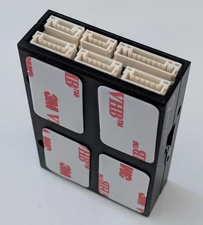

# Holybro QAV250 + Pixhawk 4 Mini Build (Discontinued)

:::note
The _Holybro Pixhawk 4 Mini QAV250 Kit_ is no longer available.

The instructions have been left here because very similar kits based on the Pix32 v6 are [available here](https://holybro.com/products/qav250-kit). These instructions can therefore still be followed (and might be updated to Pix32 v6).
:::

The complete kits include a carbon-fibre QAV250 racing frame, flight controller and almost all other components needed (except battery and receiver). FPV 지원 유무에 따라 키트가 조금씩 달라집니다. 키트 조립법과 *QGroundControl*의 PX4 설정법을 설명합니다.

주요 정보

- **프레임:** Holybro QAV250
- **비행 컨트롤러:** [Pixhawk 4 Mini](../flight_controller/pixhawk4_mini.md)
- **Assembly time (approx.):** 3.5 hours (2 for frame, 1.5 autopilot installation/configuration)

## 퀵 스타트 가이드

[Pixhawk 4 Mini QAV250 키트 퀵 스타트 가이드](https://github.com/PX4/PX4-user_guide/raw/v1.14/assets/flight_controller/pixhawk4mini/pixhawk4mini_qav250kit_quickstart_web.pdf)

## 부품 명세서

The Holybro [QAV250 Kit](https://holybro.com/products/qav250-kit) kits includes almost all required components:
* [Holybro Transceiver Telemetry Radio V3](../telemetry/holybro_sik_radio.md)
* 전원 모듈 holybro
* 조립된 ESC 전원 관리 보드
* 모터- DR2205 KV2300
* 5 인치 플라스틱 프로펠러
* 탄소 섬유 250 기체 (하드웨어 포함)
* Foxer 카메라
* Vtx 5.8ghz

또한, 배터리와 수신기 및 수신기와 호환되는 송신기가 필요합니다. 이 조립 예제에서는 다음의 부품들을 사용합니다.
- Receiver: [FrSSKY D4R-II](https://www.frsky-rc.com/product/d4r-ii/)
- 배터리: [4S 1300 mAh](http://www.getfpv.com/lumenier-1300mah-4s-60c-lipo-battery-xt60.html)

## 하드웨어

프레임 및 자동 조종 장치 설치를 위한 하드웨어들 입니다.

### 프레임 QAV250

| 설명              | 수량 |
| --------------- | -- |
| 유니 바디 프레임 플레이트  | 1  |
| 비행 컨트롤러 커버 플레이트 | 1  |
| PDB             | 1  |
| 카메라 플레이트        | 1  |
| 35mm 스탠드 오프     | 6  |
| 비닐 나사 및 너트      | 4  |
| 15mm 강철 나사      | 8  |
| 강철 너트           | 8  |
| 7mm 강철 나사       | 12 |
| 벨크로 배터리 스트랩     | 1  |
| 배터리용 폼          | 1  |
| 착륙 패드           | 4  |

### 전자부품

| 설명                                                                          | 수량 |
| --------------------------------------------------------------------------- | -- |
| 모터- DR2205 KV2300                                                           | 4  |
| 조립된 ESC 전원 관리 보드                                                            | 4  |
| Holybro 전원 모듈                                                               | 1  |
| Fr-sky D4R-II 수신기                                                           | 1  |
| Pixhawk 4 mini                                                              | 1  |
| Holybro GPS Neo-M8N                                                         | 1  |
| [Holybro Transceiver Telemetry Radio V3](../telemetry/holybro_sik_radio.md) | 1  |
| 배터리 lumenier 1300 mAh 4S 14.8V                                              | 1  |
| Vtx 5.8ghz                                                                  | 1  |
| FPV 카메라 (전체 키트 전용)                                                          | 1  |

아래의 이미지는 프레임과 전자 부품들을 나타냅니다.

## 조립

프레임 조립 예상 시간은 2시간이며, *QGroundControl*에서 자동 조종 장치를 설치및 기체 설정 예상 시간은 1.5시간입니다.

### 필요한 공구

조립시에 필요한 공구들입니다.

- 2.0mm 육각 스크류드라이버
- 3mm Phillips 스크류드라이버
- Wire 커터
- 정밀 트위저

### 프레임 조립

1. 그림과 같이 15mm 나사를 사용하여 암을 버튼 플레이트에 부착합니다.

   
1. 짧은 판을 팔 위에 올려 놓습니다.

   
1. 15mm 나사에 너트를 끼웁니다 (다음 단계 참조).
1. 표시된 구멍에 플라스틱 나사를 삽입합니다 (차량이 완성되면 프레임의이 부분이 아래를 향함을 유의하십시오).
1. 나사에 플라스틱 너트를 추가합니다 (그림과 같이 뒤집음).
1. 전원 모듈을 플라스틱 나사 위로 내린 다음 플라스틱 격리 애자를 추가합니다.
1. 비행 컨트롤러 플레이트를 스탠드 오프에 놓습니다 (전원 모듈 위).
1. 모터를 부착합니다. 모터에는 회전 방향을 나타내는 화살표가 있습니다. 
1. 키트의 양면 테이프를 사용하여 *Pixhawk 4 Mini*를 비행 컨트롤러 플레이트에 부착합니다. 
1. 전원 모듈의 "전원"케이블을 <0 Pixhawk 4 mini</em>에 연결합니다. 
1. 알루미늄 스탠드오프를 버튼 플레이트에 부착합니다.
1. Esc를 모터에 연결합니다. 이 이미지는 모터의 순서와 회전 방향을 나타냅니다. 

   ESC의 모터를 연결하고 모터가 올바른 방향으로회전하는 지 확인하십시오. 모터가 반대쪽으로 회전하면 케이블 A를 패드 C로, C를 ESC의 패드 A로 변경하십시오.

   :::warning
프로펠러를 제거한 상태에서 모터 회전 방향을 테스트합니다.
:::

   
1. 신호 ESC 케이블을 Pixhawk의 PWM 출력에 올바른 순서로 연결합니다 (이전 이미지 참조).

   
1. 수신기 연결합니다.
   * PPM 수신기를 사용하는 경우 PPM 포트에 연결하십시오.

     
   * SBUS 수신기를 사용하는 경우 RC IN 포트에 연결합니다.

     
1. 텔레메트리 모듈을 연결합니다. 이중 테이프로 모듈을 붙여넣고 텔레메트리 포트에 연결합니다.

   
1. GPS 모듈 연결

   

   제공된 3M 테이프 또는 페이스트를 사용하여 상단 플레이트에 모듈을 부착합니다. 그런 다음 그림과 같이 스탠드오프에 상단 플레이트를 놓습니다.

   
1. 마지막 "필수"조립 단계는 배터리를 고정하기 위해 벨크로를 추가하는 것입니다.

   

이제 "기본" 프레임 빌드가 완료되었습니다 (필요한 경우, [Pixhawk 4 Wiring 퀵 스타트](../assembly/quick_start_pixhawk4.md)에서 구성 요소 연결에 대한 자세한 정보를 참조).

If you have the "basic" version of the kit, you can now jump ahead to instructions on how to [Install/Configure PX4](#px4-configuration).

### FPV 조립

키트의 "전체" 버전에는 그림과 같이 차량 전면에 장착된 FPV 시스템이 추가로 제공됩니다.

키트를 설치하는 단계는 다음과 같습니다.

1. 프레임에 카메라 브라켓 설치
1. 브라켓에 카메라 설치
1. 전체 키트의 전원 모듈은 비디오 송신기와 카메라를 연결 배선과 함께 제공합니다.
   - 카메라 커넥터 연결  전선은 파란색 = 전압 센서, 노란색 = 비디오 출력, 검은 색 = 접지, 빨간색 = + 전압입니다.
   - 비디오 송신기 (VTX) 커넥터 연결  전선은 노란색 = 비디오 출력, 검은 색 = 접지, 빨간색 = + 전압입니다.
1. 테이프를 사용하여 비디오 송신기와 OSD 보드를 프레임에 고정합니다.

:::note
시스템을 직접 배선해야하는 경우, 아래 다이어그램은 카메라, VTX 및 전원 모듈 간의 연결 방법을 나타냅니다. 
:::

## PX4 Configuration

*QGroundControl*에서 PX4 자율비행 프로그램을 설치하고 QAV250 프레임 설정과 보정 작업을 진행합니다. [Download and install](http://qgroundcontrol.com/downloads/) *QGroundControl* for your platform.

:::tip PX4 설치 및 설정 매뉴얼은 [기본 설정](../config/README.md)편을 참고하십시오.
:::

First update the firmware, airframe, and actuator mappings:

- [펌웨어](../config/firmware.md)
- [기체](../config/airframe.md)

:::note
*HolyBro QAV250* 기체 (**Quadrotor x > HolyBro QAV250**)를 선택하여야 합니다.

  
:::

- [Actuators](../config/actuators.md)
  - You should not need to update the vehicle geometry (as this is a preconfigured airframe).
  - Assign actuator functions to outputs to match your wiring.
    - For the Pixhawk 4 Mini, and other controllers that do not have an [I/O board](../hardware/reference_design.md#main-io-function-breakdown), you will need to assign actuators to outputs on the `PWM AUX` tab in the configuration screen.
    - The Pix32 v6 has an I/O board, so you can assign to either AUX or MAIN.
  - Test the configuration using the sliders.

Then perform the mandatory setup/calibration:

- [센서 방향](../config/flight_controller_orientation.md)
- [나침반](../config/compass.md)
- [가속도계](../config/accelerometer.md)
- [수평 보정](../config/level_horizon_calibration.md)
- [무선 조종기 설정](../config/radio.md)
- [비행 모드](../config/flight_mode.md)

다음 작업 역시 반드시 진행하여야 합니다.

- [ESC 보정](../advanced_config/esc_calibration.md)
- [배터리](../config/battery.md)
- [안전 설정](../config/safety.md)

## 튜닝

기체 선택은 프레임의 *기본* 자동 조종 매개 변수를 설정합니다. These may be good enough to fly with, but you should tune each frame build.

For instructions on how, start from [Autotune](../config/autotune.md).

## 감사의 글

이 조립 로그는 PX4 테스트 팀에서 제공하였습니다.
