# Holybro S500 V2 + Pixhawk 4 조립

키트 조립법과 *QGroundControl*의 PX4 설정법을 설명합니다.

## 주요 정보

- **프레임:** Holybro S500
- **비행 컨트롤러:** [Pixhawk 4](../flight_controller/pixhawk4.md)
- **예상 조립 시간:** 90분 (기체 조립에 45분, 오토파일럿 설치 및 설정에 45분)

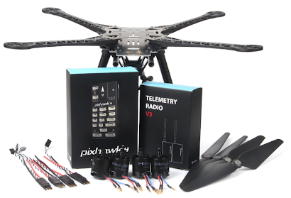

## 부품 명세서

Holybro [S500 V2 키트](https://shop.holybro.com/s500-v2-kitmotor2216-880kv-propeller1045_p1153.html)에는 필수 구성 요소가 포함되어 있습니다.

* Pixhawk 4 autopilot（PM07 미포함)
* 전원 관리 PM02 (조립）
* ARM, 고강도 플라스틱 채택
* 모토 - 2216 KV880（V2 업데이트）
* 프로펠러 1045 (V2 업데이트)
* Pixhawk 4 GPS
* 조립된 ESC 전원 관리 보드
* 433MHz Telemetry Radio / 915MHz Telemetry Radio
* 전원 및 무선 조종기 케이블
* 배터리 혁지
* 치수 - 383*385*240mm
* 축거 : 480mm

:::note
LiPo 배터리는 포함되어 있지 않습니다. FrSky Taranis 무선 조종기를 사용하여 조립하는 경우를 설명합니다.
:::

## 하드웨어

| 품목 설명               | 수량 |
| ------------------- | -- |
| 축거 : 480mm          | 1  |
| 팔                   | 4  |
| 착륙 기어 세트            | 2  |
| M3*8 나사             | 18 |
| M2 5*6 나사           | 24 |
| 배터리 혁지              | 1  |
| 프로펠러 1045 (V2 업데이트) | 1  |

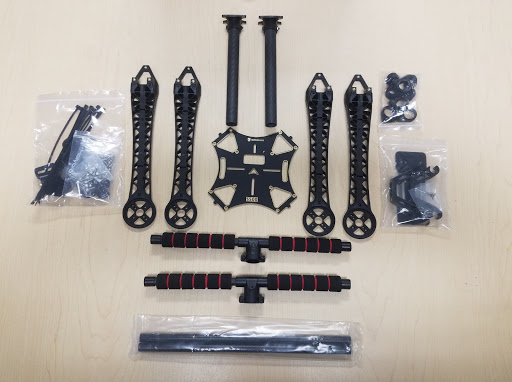

## 패키지
| 항목                  | 패키지 |
| ------------------- | --- |
| Pixhawk 4           | 1   |
| Pixhawk4 GPS 모듈     | 1   |
| I2C 분리 보드           | 2   |
| 6 ~ 6 핀 케이블 (전원)    | 3   |
| 4 ~ 4 핀 케이블 (CAN)   | 2   |
| 6 ~ 4 핀 케이블 (데이터)   | 1   |
| 10 ~ 10 핀 케이블 (PWN) | 2   |
| 8 ~ 8 핀 케이블 (AUX)   | 1   |
| 7 ~ 7 핀 케이블 (SPI)   | 1   |
| 6 ~ 6 핀 케이블 (디버깅)   | 1   |
| PPM/SBUS 출력 케이블     | 1   |
| XSR 수신기 케이블         | 1   |
| DSMX 수신기 케이블        | 1   |
| SBUS 수신기 케이블        | 1   |
| USB 케이블             | 1   |
| 'X'타입 접이식 받침대 마운트   | 1   |
| 70mm 및 140mm 카본 받침대 | 2   |
| 6*3 2.54mm 피치 수평 핀  | 1   |
| 8*3 2.54mm 피치 수평 핀  | 2   |
| 폼 세트                | 1   |
| Pixhawk 4 빠른 시작 가이드 | 1   |
| Pixhawk4 핀아웃        | 1   |
| GPS 빠른 시작 가이드       | 1   |

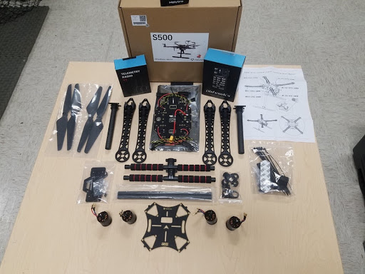

### 전자부품
| 품목 설명                                           | 수량 |
| ----------------------------------------------- | -- |
| Pixhawk 4 autopilot（PM06 미포함)                   | 1  |
| 전원 관리 PM02 (조립)                                 | 1  |
| 모토 - 2216 KV880（V2 업데이트)                        | 4  |
| Pixhawk 4 GPS                                   | 1  |
| 조립된 ESC 전원 관리 보드                                | 1  |
| 433MHz Telemetry Radio / 915MHz Telemetry Radio | 1  |

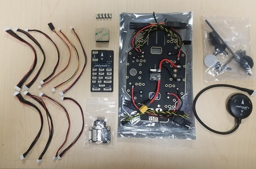

### 필요 공구

조립시에 필요한 공구들입니다.

- 1.5 mm 육각 스크류드라이버
- 2.0 mm 육각 스크류드라이버
- 2.5 mm 육각 스크류드라이버
- 3mm 필립스 스크류드라이버
- 전선 커터
- 정밀 트위저

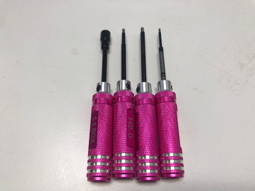

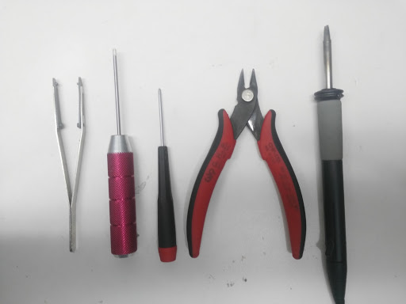

## 조립

조립 예상 시간은 90 분, 프레임 조립에 약 45 분, QGroundControl의 자동조종장치 설정에 45 분입니다.

1. 랜딩 기어 조립. 먼저 착륙 기어를 수직 기둥에 조립합니다. 랜딩 기어 나사를 풀고 수직 기둥을 삽입합니다.

   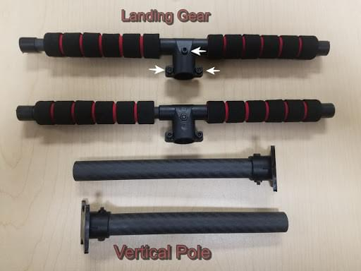

   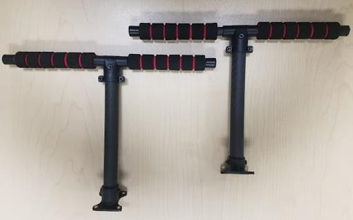

1. 전원 관리 보드를 랜딩 기어에 조립합니다. 조립된 전원 관리 보드에 수직 기둥이 있는 랜딩 기어를 나사로 고정합니다.

  보드에는 4 개의 구멍이 있습니다 (아래 화살표 참조).

  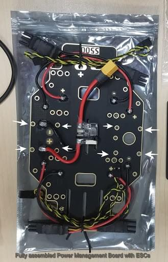

  M3X8 나사 (총 8 개, 각 측면에 4 개)로 연결합니다.

  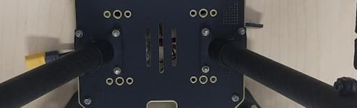

1. 전원 관리 보드에 팔을 조립합니다. 전원 관리 보드에 팔을 조립합니다.

   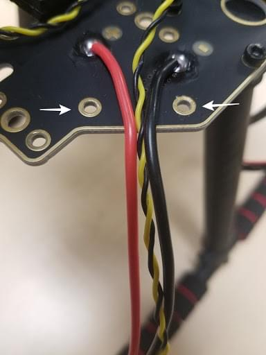

   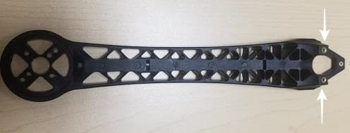

   각 팔에 총 2 개의 M2 5X6 나사를 사용합니다. 플레이트 바닥에서 나사를 삽입합니다.

   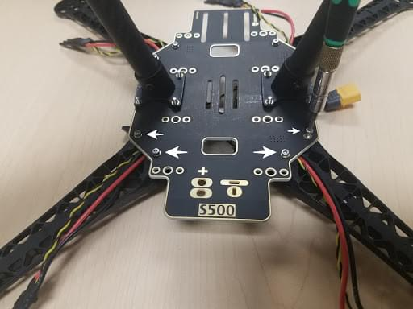

   ESC 케이블이 팔 중앙을 통과하는지 확인하십시오.

   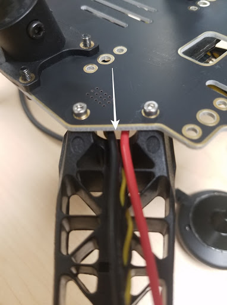

1. 8개의 * 3 2.54mm 피치 수평 핀을 전원 관리 보드의 10 ~ 10 핀 케이블 (PWM)에 조립합니다. 10 ~ 10 핀 케이블 (PWM)을 8 * 3 2.54mm 피치 수평 핀에 연결합니다.

   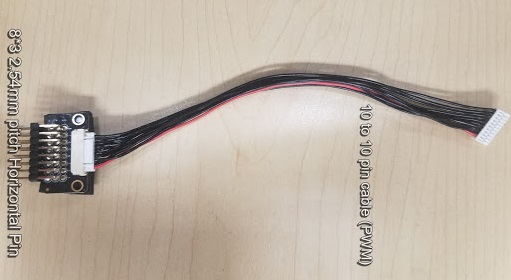

   3M 테이프 조각을 잘라 수평 핀 하단에 부착합니다.

   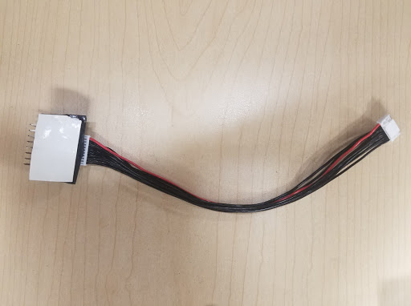

   수평 핀을 전원 관리 보드에 고정 :

   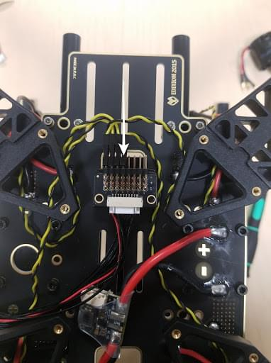

   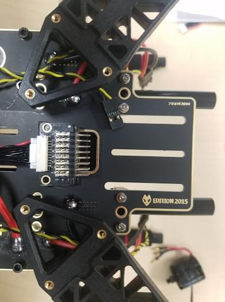

1. 모터를 팔에 조립하십시오. M3X7 나사 16 개, 모터 4 개, 팔 4 개가 필요합니다.

   각 팔에 모터를 장착하고 팔의 바닥을 통해 나사를 넣습니다.

   

   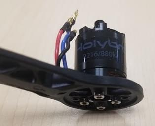

   4 개의 모터를 팔에 장착 한 후 케이블 (빨간색, 파란색, 검은 색)을 잡고 팔 나사산에 끼웁니다. 색상으로 구분된 3 개의 케이블이 ESC에 연결됩니다.

   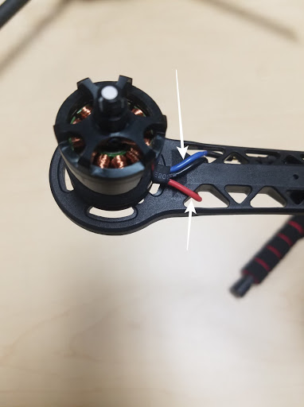

   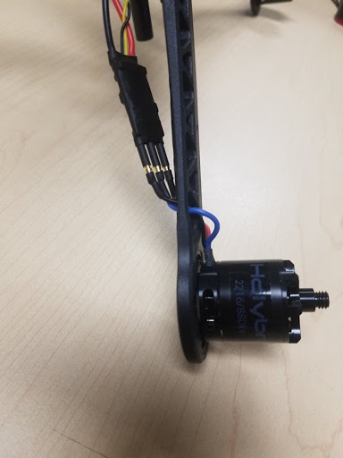

1. 프레임에 GPS를 장착합니다. Pixhawk 4 GPS와 마운팅 플레이트가 필요합니다.

   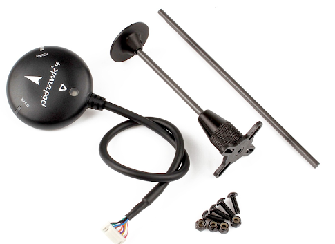

   보드 뒷면에 GPS 마스트를 장착하고 4 개의 나사를 사용합니다.

   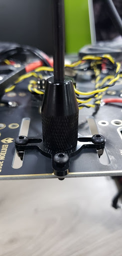

   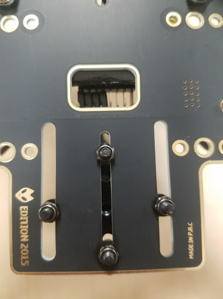

   테이프를 사용하고 GPS를 GPS 마스트 상단에 붙입니다.

   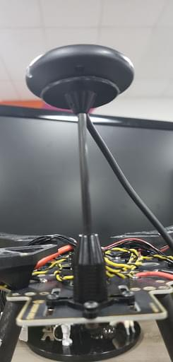

1. FrSky를 보드에 붙여 넣습니다. 양면 테이프 (3M)로 FrSky를 하단 보드에 붙여 넣습니다. FrSky를 프레임에 부착합니다.

   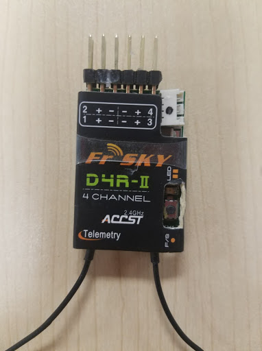

   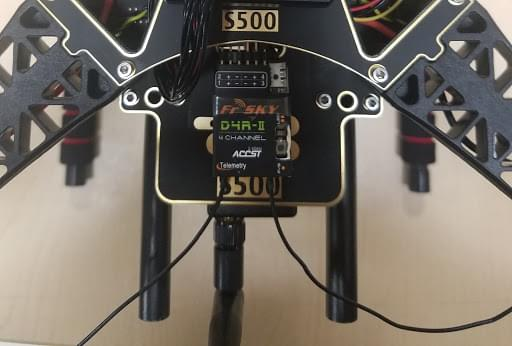

1. 텔레메트리를 프레임에 부착합니다. 다음 단계는 Holybro 텔레메트리를 프레임에 부착하고 3M 테이프를 사용합니다.

   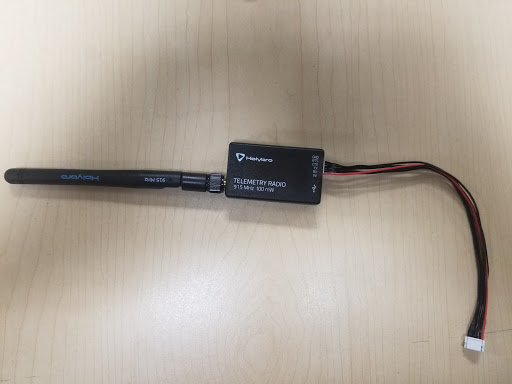

   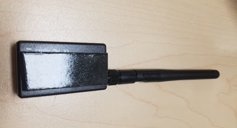

   차량 전방을 향하는 프레임 내부에 부착했습니다. 아래의 사진에는 프레임 하단에있는 라디오가 표시됩니다.

   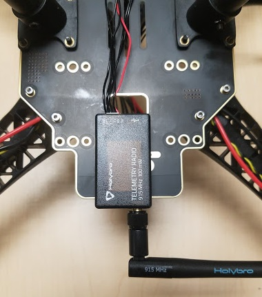

1. Pixhawk 4를 플레이트에 장착합니다. 양면 테이프를 사용하여 Pixhawk 4를 중앙 플레이트에 부착합니다.

   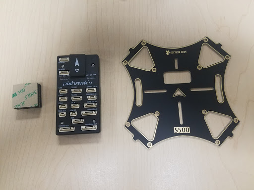

   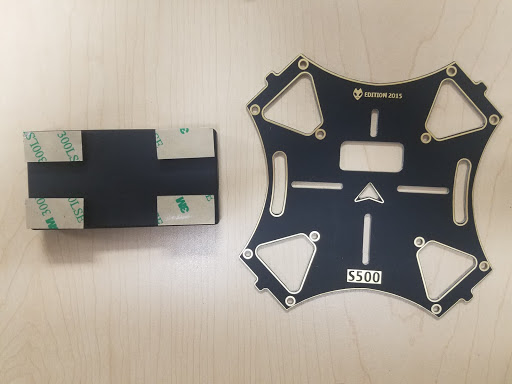

   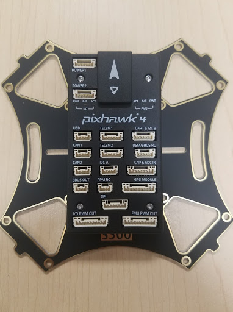

   다음 단계는 플레이트와 함께 Pixhawk 4를 프레임에 장착하는 것입니다. M2 5X6 나사가 필요합니다. 플레이트를 프레임에 맞추고 나사를 삽입합니다. 플레이트를 장착하기 전에 전원 모듈에 테이프를 붙이는 것이 좋습니다 (단단하게 고정됨).

   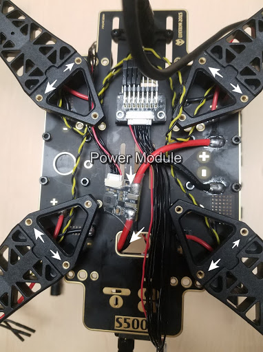

   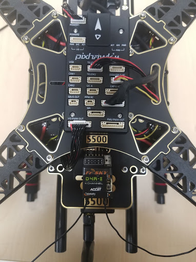

1. 프레임에 배터리 마운트 조립. M2 5X6 나사와 배터리 마운트가 필요합니다.

   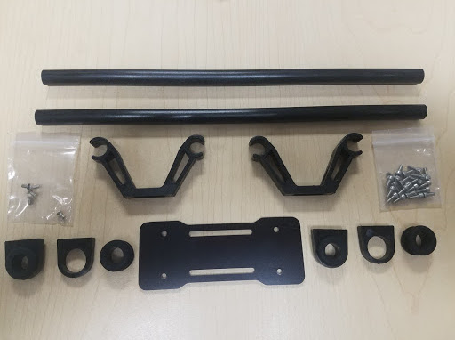

   긴 막대를 작은 링에 삽입합니다.

   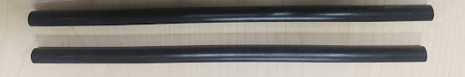

   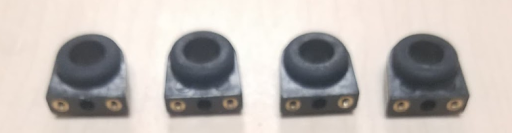

   프레임에 부착하고 나사를 삽입하기 위해 사면이 모두 정렬되어 있는지 확인하십시오.

   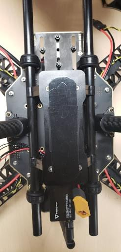

   작은 판을 다리에 조립하고 사면 모두에서 나사로 조입니다.

   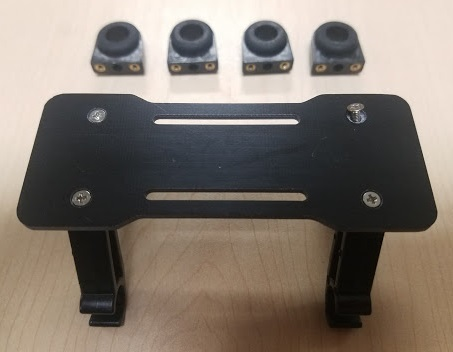

   마지막 단계는 플레이트를 부착하는 것입니다.

   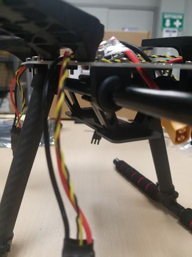

1. Pixhawk 4 배선. Pixhawk 4의 배선 방법은 몇 가지가 다릅니다. 아래에는 Pixhawk에 필요한 모든 전선과 연결시의 모습이 기술되어 있습니다.

1. 플러그인 원격 측정 및 GPS 모듈을 비행 컨트롤러에 연결합니다 (그림 37 참조). RC 수신기, 4 개의 ESC 모두를 비행 컨트롤러와 전원 모듈에 연결합니다.

   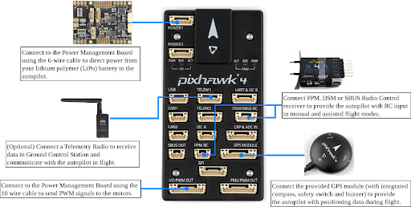

완전히 조립된 키트의 예는 아래와 같습니다.

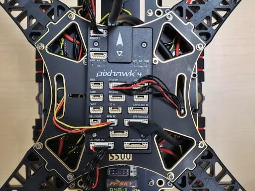

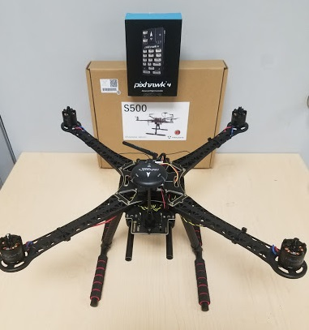

## PX4 설치 및 설정

*QGroundControl*에서 PX4 자율비행 프로그램을 설치하고 QAV250 프레임 설정과 보정 작업을 진행합니다. *QGroundControl*을 [다운로드 후에 설치](http://qgroundcontrol.com/downloads/) 하십시오.

:::tip PX4 설치 및 설정 매뉴얼은 [기본 설정](../config/README.md)편을 참고하십시오.
:::

먼저, 펌웨어와 기체 프레임을 업데이트 합니다.

* [펌웨어](../config/firmware.md)
* [기체](../config/airframe.md)

:::note
*Holybro S500* 기체 (**Quadrotor x > Holybro S500**)를 선택하여야 합니다.
:::

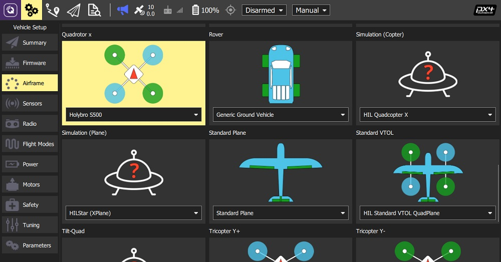

다음에는 필수작업인 설정작업과 보정 작업을 진행합니다.

* [센서 방향](../config/flight_controller_orientation.md)
* [나침반](../config/compass.md)
* [가속도계](../config/accelerometer.md)
* [수평 보정](../config/level_horizon_calibration.md)
* [무선 조종기 설정](../config/radio.md)
* [비행 모드](../config/flight_mode.md)

다음 작업들은 반드시 진행하여야 합니다.

* [ESC 보정](../advanced_config/esc_calibration.md)
* [배터리](../config/battery.md)
* [안전 설정](../config/safety.md)

## 튜닝

기체 선택은 프레임의 자유비행 관련 *기본*적인 매개 변수를 설정합니다. 이 상태로도 비행이 가능하지만, 특정 기체에 관련된 변수들을 조정하는 것이 바람직합니다.

튜닝 정보는 [멀티 콥터 PID 튜닝 가이드](../config_mc/pid_tuning_guide_multicopter.md)를 참조하십시오.

## 감사의 글

이 조립 방법은 Dronecode Test Flight Team에서 제공했습니다.