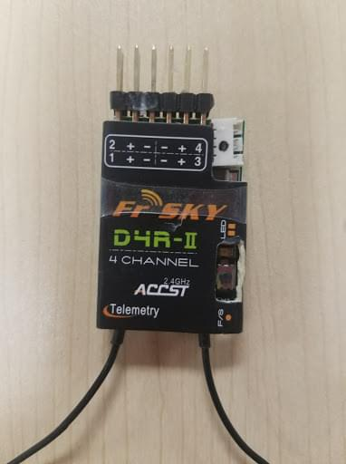
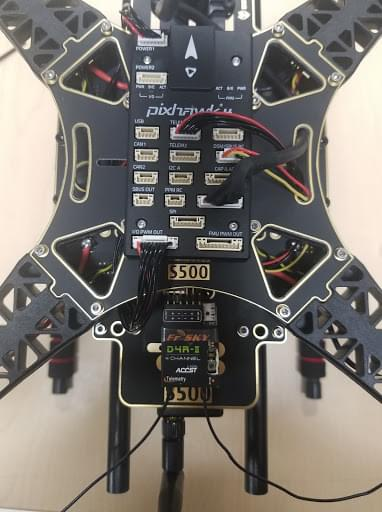
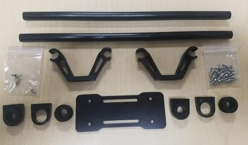
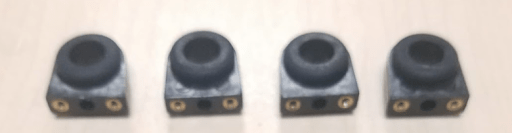

# Holybro S500 V2 + Pixhawk 4 조립

키트 조립법과 *QGroundControl*의 PX4 설정법을 설명합니다.

## 주요 정보

- **프레임:** Holybro S500
- **비행 컨트롤러:** [Pixhawk 4](../flight_controller/pixhawk4.md)
- **예상 조립 시간:** 90분 (기체 조립에 45분, 오토파일럿 설치 및 설정에 45분)

## 부품 명세서

Holybro [S500 V2 키트](https://shop.holybro.com/s500-v2-kitmotor2216-880kv-propeller1045_p1153.html)에는 필수 구성 요소가 포함되어 있습니다.

* Pixhawk 4 autopilot（PM07 미포함)
* 전원 관리 PM02 (조립）
* ARM, 고강도 플라스틱 채택
* 모토 - 2216 KV880（V2 업데이트）
* 프로펠러 1045 (V2 업데이트)
* Pixhawk 4 GPS
* 조립된 ESC 전원 관리 보드
* 433MHz Telemetry Radio / 915MHz Telemetry Radio
* 전원 및 무선 조종기 케이블
* 배터리 혁지
* 치수 - 383*385*240mm
* 축거 : 480mm

:::note
LiPo 배터리는 포함되어 있지 않습니다. FrSky Taranis 무선 조종기를 사용하여 조립하는 경우를 설명합니다.
:::

## 하드웨어

| 품목 설명               | 수량 |
| ------------------- | -- |
| 축거 : 480mm          | 1  |
| 팔                   | 4  |
| 착륙 기어 세트            | 2  |
| M3*8 나사             | 18 |
| M2 5*6 나사           | 24 |
| 배터리 혁지              | 1  |
| 프로펠러 1045 (V2 업데이트) | 1  |

## 패키지
| 항목                  | 패키지 |
| ------------------- | --- |
| Pixhawk 4           | 1   |
| Pixhawk4 GPS 모듈     | 1   |
| I2C 분리 보드           | 2   |
| 6 ~ 6 핀 케이블 (전원)    | 3   |
| 4 ~ 4 핀 케이블 (CAN)   | 2   |
| 6 ~ 4 핀 케이블 (데이터)   | 1   |
| 10 ~ 10 핀 케이블 (PWN) | 2   |
| 8 ~ 8 핀 케이블 (AUX)   | 1   |
| 7 ~ 7 핀 케이블 (SPI)   | 1   |
| 6 ~ 6 핀 케이블 (디버깅)   | 1   |
| PPM/SBUS 출력 케이블     | 1   |
| XSR 수신기 케이블         | 1   |
| DSMX 수신기 케이블        | 1   |
| SBUS 수신기 케이블        | 1   |
| USB 케이블             | 1   |
| 'X'타입 접이식 받침대 마운트   | 1   |
| 70mm 및 140mm 카본 받침대 | 2   |
| 6*3 2.54mm 피치 수평 핀  | 1   |
| 8*3 2.54mm 피치 수평 핀  | 2   |
| 폼 세트                | 1   |
| Pixhawk 4 빠른 시작 가이드 | 1   |
| Pixhawk4 핀아웃        | 1   |
| GPS 빠른 시작 가이드       | 1   |

### 전자부품
| 품목 설명                                           | 수량 |
| ----------------------------------------------- | -- |
| Pixhawk 4 autopilot（PM06 미포함)                   | 1  |
| 전원 관리 PM02 (조립)                                 | 1  |
| 모토 - 2216 KV880（V2 업데이트)                        | 4  |
| Pixhawk 4 GPS                                   | 1  |
| 조립된 ESC 전원 관리 보드                                | 1  |
| 433MHz Telemetry Radio / 915MHz Telemetry Radio | 1  |

### 필요 공구

조립시에 필요한 공구들입니다.

- 1.5 mm 육각 스크류드라이버
- 2.0 mm 육각 스크류드라이버
- 2.5 mm 육각 스크류드라이버
- 3mm 필립스 스크류드라이버
- 전선 커터
- 정밀 트위저

## 조립

조립 예상 시간은 90 분, 프레임 조립에 약 45 분, QGroundControl의 자동조종장치 설정에 45 분입니다.

1. 랜딩 기어 조립. 먼저 착륙 기어를 수직 기둥에 조립합니다. 랜딩 기어 나사를 풀고 수직 기둥을 삽입합니다.

   

   

1. 전원 관리 보드를 랜딩 기어에 조립합니다. 조립된 전원 관리 보드에 수직 기둥이 있는 랜딩 기어를 나사로 고정합니다.

  보드에는 4 개의 구멍이 있습니다 (아래 화살표 참조).

  

  M3X8 나사 (총 8 개, 각 측면에 4 개)로 연결합니다.

  

1. 전원 관리 보드에 팔을 조립합니다. 전원 관리 보드에 팔을 조립합니다.

   

   

   각 암에 총 2 개의 M2 5X6 나사를 사용합니다. Insert the screws from the bottom of the plate.

   

   Make sure the ESC cables run through the middle of the arm.

   

1. Assemble the 8*3 2.54mm pitch Horizontal Pin to the 10 to 10 pin cable (PWM) to the Power Management Board. Connect the 10 to 10 pin cable (PWM) to the 8*3 2.54mm pitch Horizontal Pin.

   

   Cut a piece of 3M Tape and attach to the bottom of the Horizontal Pin:

   

   Stick the Horizontal Pin to the Power Management Board:

   

   

1. Assemble the motors to the arms. For this, we will need the 16 screws M3X7, 4 motors, and the 4 arms.

   Mount the motors in each arm put the screw through the bottom of the arm:

   

   

   After the 4 motors are mounted on the arm grab the cables(red, blue, black) and put them through the arm thread. The 3 cables that are color-coded go connected to the ESC.

   

   

1. Mounting the GPS on the frame. For this, we will need the Pixhawk 4 GPS and the mounting plate.

   

   Mount the GPS mast to the back of the Board, use the 4 screws:

   

   

   Use the tape and stick the GPS to the top of the GPS mast:

   

1. Paste the FrSky to the Board. Paste FrSky with double-sided tape (3M) to the bottom board. Attach the FrSky to the frame:

   

   

1. Attach the Telemetry to the frame. The next step is to take the Holybro telemetry radio and attach it onto the frame, use 3M tape.

   

   

   This assembly attached it inside the frame facing outwards to the front of the vehicle. A picture is shown below of the radio sitting inside the bottom of the frame.

   

1. Mounting the Pixhawk 4 to the plate. Use double-sided tape to attach the Pixhawk 4 to the center plate:

   

   

   

   The next step is to mount the Pixhawk 4 with the plate to the frame. For this, we will need the M2 5X6 screws. Align the plate to the frame and insert the screws. Before you mount the plate we recommend putting tape on the Power Module (that way it's tight).

   

   

1. Assembling the Battery Mount to the frame. For this we will need the M2 5X6 screws and the battery mount:

   

   Insert the long rods to the small rings:

   

   

   Attach that to the frame, make sure all four sides are aligned to insert the screws:

   

   Assemble the small plate to the legs and screw on all four sides.

   

   The final step is to attach the plate:

   

1. Pixhawk 4 wiring. The Pixhawk 4, which has several different wires and connections with it. Included below is a picture of every wire needed with the Pixhawk and how it looks when connected.

1. Plugin Telemetry and GPS module to the flight controller as seen in Figure 37; plug in the RC receiver, all 4 ESCs to the flight controller as well as the power module.

   

Fully assembled, the kit looks as shown below:

## Install/Configure PX4

*QGroundControl* is used to install the PX4 autopilot and configure/tune it for the QAV250 frame. [Download and install](http://qgroundcontrol.com/downloads/) *QGroundControl* for your platform.

:::tip
Full instructions for installing and configuring PX4 can be found in [Basic Configuration](../config/README.md).
:::

First update the firmware and airframe:

* [Firmware](../config/firmware.md)
* [Airframe](../config/airframe.md)

:::note
You will need to select the *Holybro S500* airframe (**Quadrotor x > Holybro S500**).
:::

Then perform the mandatory setup/calibration:

* [Sensor Orientation](../config/flight_controller_orientation.md)
* [Compass](../config/compass.md)
* [Accelerometer](../config/accelerometer.md)
* [Level Horizon Calibration](../config/level_horizon_calibration.md)
* [Radio Setup](../config/radio.md)
* [Flight Modes](../config/flight_mode.md)

Ideally you should also do:

* [ESC Calibration](../advanced_config/esc_calibration.md)
* [Battery](../config/battery.md)
* [Safety](../config/safety.md)

## Tuning

Airframe selection sets *default* autopilot parameters for the frame. These are good enough to fly with, but it is a good idea to tune the parameters for a specific frame build.

For general information on tuning see: [Multicopter PID Tuning Guide](../config_mc/pid_tuning_guide_multicopter.md).

## Acknowledgements

This build log was provided by the Dronecode Test Flight Team.