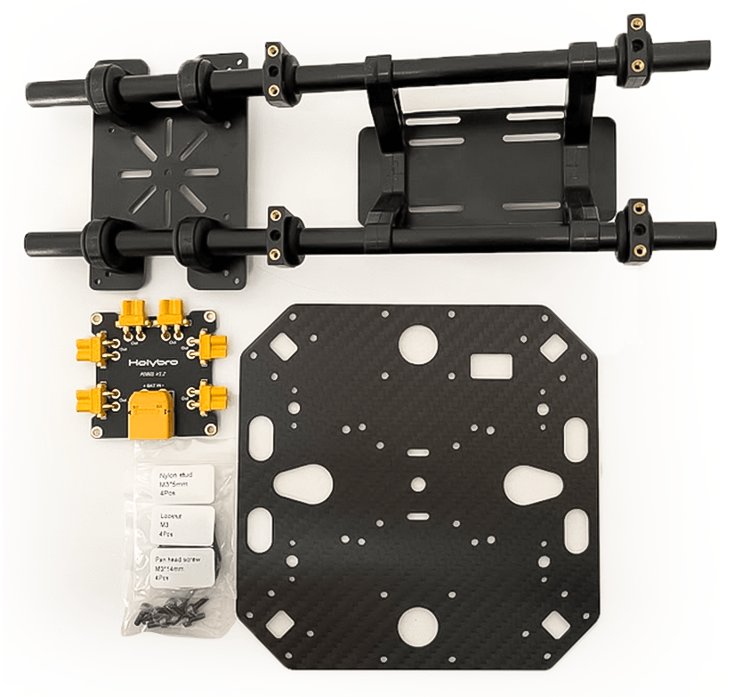
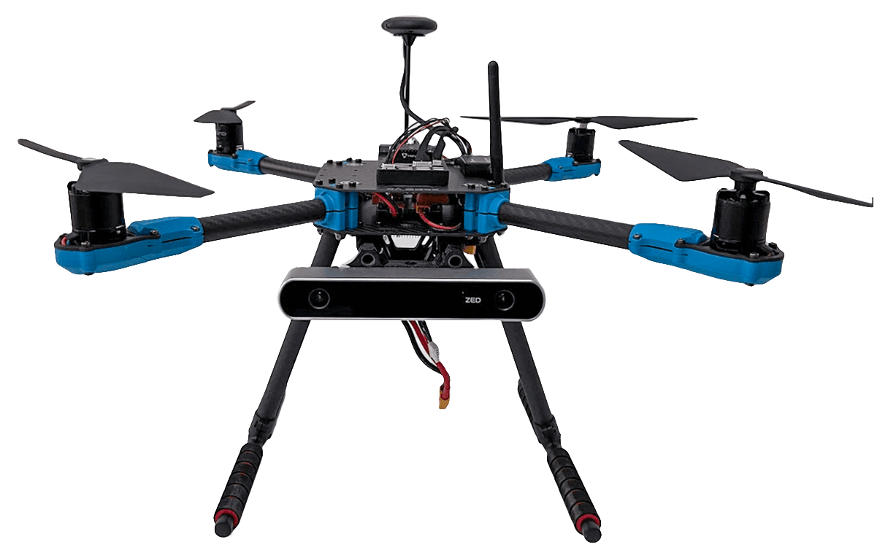

# Holybro X500 V2 (Pixhawk 5X 조립)

이 페이지에서는 [Holybro X500 V2 ARF 키트](http://shop.holybro.com/x500-v2-kit_p1288.html)를 조립 방법과 *QGroundControl*의 PX4 설정 방법을 설명합니다.

ARF("거의 비행 준비 완료") 키트는 하드웨어 설정에 많은 시간을 할애하지 않고, 드론 개발에 입문자들이 간편하고 간단한 조립할 수 있습니다. 여기에는 프레임, 모터, ESC, 프로펠러 및 배전반이 포함됩니다.

키트 외에도 비행 콘트롤러, 무선 송신기, GPS 및 RC 콘트롤러가 필요합니다. ARF 키트는 PX4와 호환되는 대부분의 비행 콘트롤러를 지원합니다.

## 주요 정보

- **키트:** [Holybro X500 V2 ARF 키트](http://shop.holybro.com/x500-v2-kit_p1288.html)
- **비행 콘트롤러:** [Pixhawk 5X](../flight_controller/pixhawk5x.md)
- **조립 시간(약):** 55분(프레임 25분, 자동조종장치 설치/설성은 30분)

## 부품 명세서

Holybro [X500 V2 키트](http://shop.holybro.com/x500-v2-kit_p1288.html)에는 필수 부품들이 포함되어 있습니다.

* X500V2 프레임 키트
  * 바디 - 풀 카본 파이버 탑 & 바닥판(144 x 144mm, 두께 2mm)
  * 암 - 고강도 & 초경량 16mm 탄소 섬유 튜브
  * 랜딩 기어 - 16mm & 10mm 직경의 탄소 섬유 튜브
  * 플랫폼 보드 - GPS & 인기있는 보조 컴퓨터
  * 이중 10mm Ø 로드 x 250mm 롱 레일 마운팅 시스템
  * 2개의 배터리 스트랩이 있는 배터리 마운트
  * 설치용 수공구
* [Holybro 모터 - 2216 KV880 x6](https://shop.holybro.com/motor2216-880kv-1pc_p1154.html)
* [Holybro BLHeli S ESC 20A x4](https://shop.holybro.com/blheli-s-esc-20a_p1143.html)
* [프로펠러 - 1045x4](https://shop.holybro.com/propeller10452pair_p1155.html)
* 배전반 – 배터리 및 배터리용 XT60 플러그 ESC &용 XT30 플러그 주변기기
* 카메라 마운트(선택 사항 및 3D 파일은 [여기](http://www.holybro.com/3D_Print/Holybro_X500_V2_3D%20Print.rar)에서 다운로드할 수 있음)

이 빌드의 다른 부품(**ARF 키트에 포함되지 않음**):
* [Pixhawk 5X 자동조종장치](../flight_controller/pixhawk5x.md)
* [M8N GPS](http://shop.holybro.com/holybro-m8n-gps_p1094.html)
* [전원 모듈 - PM02D](http://shop.holybro.com/pm02d-power-module_p1285.html)
* [433/915 MHz 무선 텔레메트리](http://shop.holybro.com/sik-telemetry-radio-v3_p1103.html)

Additionally you will need a battery (Holybro recommends a 4S 5000mAh) and receiver ([compatible radio system](../getting_started/rc_transmitter_receiver.md)) if you want to control the drone manually.

## 키트 하드웨어

프레임 및 자동조종장치 설치를 위한 하드웨어 목록입니다.

| 항목             | 설명                        | 수량 |
| -------------- | ------------------------- | -- |
| 하판             | 탄소 섬유(두께 2mm)             | 1  |
| 상판             | 탄소 섬유(두께 1.5mm)           | 1  |
| Arm            | 탄소 섬유 튜브(모터 장착 조립)        | 4  |
| 착륙 기어 - 수직 막대  | 탄소 섬유 튜브 + 엔지니어링 플라스틱     | 2  |
| 착륙 기어 - 크로스바   | 탄소 섬유 튜브 + 엔지니어링 플라스틱 + 폼 | 2  |
| 장착 레일          | 직경 : 10mm, 길이 : 250mm     | 2  |
| 배터리 장착 보드      | 두께: 2mm                   | 1  |
| 배터리 패드         | 3mm 실리콘 시트 검정             | 1  |
| 플팻폼 보드         | 두께: 2mm                   | 1  |
| 옷걸이 & 고무 링 개스킷 | 내부 구멍 직경 : 10mm 검정        | 8  |

 

   _그림 1_: X500 V2 ARF 키트 내부

### 전자부품

| 품목 설명                             | 수량 |
| --------------------------------- | -- |
| Pixhawk5x & 다양한 케이블               | 1  |
| M8N GPS 모듈                        | 1  |
| 전원 모듈 PM02D(사전 납땜된 ESC 전원 케이블 포함) | 1  |
| 모터스 2216 KV880(V2 업데이트)           | 4  |
| Holybro BLHeli S ESC 20A x4       | 1  |
| 433MHz 텔레메트리 / 915MHz 텔레메트리       | 1  |

### 필요 공구

조립을 위한 도구가 포함되어 있지만, 아래의 도구들도 필요할 수 있습니다.

- 전선 커터
- 정밀 트위저

## 조립

예상 조립 시간은 55시간(프레임은 25분, 자동 조종 장치 설치/설정은 30분)입니다.

1. Start by assembling the payload & battery holder. Push the rubbers into grippers (Do not use sharp items to push them in!). Next, pass the holders through the holder bars with the battery holder bases as Figure 3.

   

   _Figure 2_: Payload holder components

   

   _Figure 3_: Payload holder assembled

1. The next is to go for attaching the bottom plate to the payload holder.

   You will need the parts as shown in Figure 4. Then mount the base for power distribution board using nylon nuts as Figure 5. Finally using 8 hex screws you can join the bottom plate to the payload holder (Figure 7)

   

   _Figure 4_: Needed Materials

   

   _Figure 5_: PDB mount base

   

   _Figure 6_: Mounted pdb with nylon nuts

   

   _Figure 7_: Mounted Plate on payload holder

1. Let's gather the stuff needed for mounting landing gear as Figure 8. Use the hex screws to join landing gears to the bottom plate. You also need to open three hex screws on each of the leg stands so you can push them into carbon fiber pipes. Do not forget to tighten them back again.

   

   _Figure 8_: Required parts for landing gear attachment

   

   _Figure 9_: Landing gear attachment to the body

1. We will gather all the arms now to mount the top plate. Please pay attention that the motor numbers on arms are a match with the ones mentioned on the top plate. Fortunately, motors are mounted and ESCs have been connected in advance. Start by passing through all the screws as you have the arms fixed in their own places (They have a guide as shown in Figure 11 to ensure they are in place) and tighten all nylon nuts a bit. Then you can connect XT30 power connectors to the power board. Please keep in mind that the signal wires have to be passed through the top plate such that we can connect them later to Pixhawk.

   

   _Figure 10_: Connecting arms needed materials.

   

   _Figure 11_: Guide for the arms mount

1. Tighten all 16 screws and nuts by using both hex wrench and nut driver.

   

   _Figure 12_: Mounted top plate

1. Next you can mount your pixhawk on the top plate by using the stickers. It is recommended to have the direction of your Pixhawk's arrow the same as the one mentioned on the top plate.

   

   _Figure 13_: Sticker tapes on Pixhawk

1. If you want to mount the GPS on the companion computer plate, you can now secure the GPS mount onto it using 4 screws and nuts.

   

   _Figure 14_: Secure GPS mount onto companion plate

1. Use the tape and stick the GPS to the top of the GPS mast and mount the GPS mast. Make sure the arrow on the gps is pointing forward (Figure 15).

   

   _Figure 15_: GPS and mast

1. Finally, you can connect the Pixhawk interfaces such as telemetry radio to 'TELEM1' and motors signal cables accordingly.

자세한 내용은 [Pixhawk  5X 빠른 시작](../assembly/quick_start_pixhawk5x.md)을 참고하십시오.

조립이 완료되었습니다. 마지막으로 Pixhawk TV와 'TELEM1'에 도달하실 수 있습니다.

## PX4 Configuration

:::tip PX4 설치 및 설정 매뉴얼은 [기본 설정](../config/README.md)편을 참고하십시오.
:::

*QGroundControl* is used to install the PX4 autopilot and configure/tune it for the X500 frame. [Download and install](http://qgroundcontrol.com/downloads/) *QGroundControl* for your platform.

First update the firmware, airframe, and actuator mappings:

- [펌웨어](../config/firmware.md)
- [Airframe](../config/airframe.md)

  You will need to select the *Holybro X500 V2* airframe (**Quadrotor x > Holybro 500 V2**)

  

- [Actuators](../config/actuators.md)
  - You should not need to update the vehicle geometry (as this is a preconfigured airframe).
  - Assign actuator functions to outputs to match your wiring.
  - Test the configuration using the sliders.

그리고, 설치후에 필수적인 설정 작업을 실시합니다.

- [센서 방향](../config/flight_controller_orientation.md)
- [나침반](../config/compass.md)
- [가속도계](../config/accelerometer.md)
- [수평 보정](../config/level_horizon_calibration.md)
- [라디오 설정](../config/radio.md)
- [비행 모드](../config/flight_mode.md)

다음 작업 역시 반드시 진행하여야 합니다.

- [ESC 보정](../advanced_config/esc_calibration.md)
- [배터리](../config/battery.md)
- [안전](../config/safety.md)

## 튜닝

기체 선택은 프레임의 *기본* 자동조종장치의 매개 변수를 설정합니다. 이 상태로도 비행이 가능하지만, 특정 기체에 관련된 변수들을 조정하는 것이 바람직합니다.

For instructions on how, start from [Autotune](../config/autotune.md).

## 감사의 글

이 조립 설명서는 PX4 팀에서 제공하였습니다.
