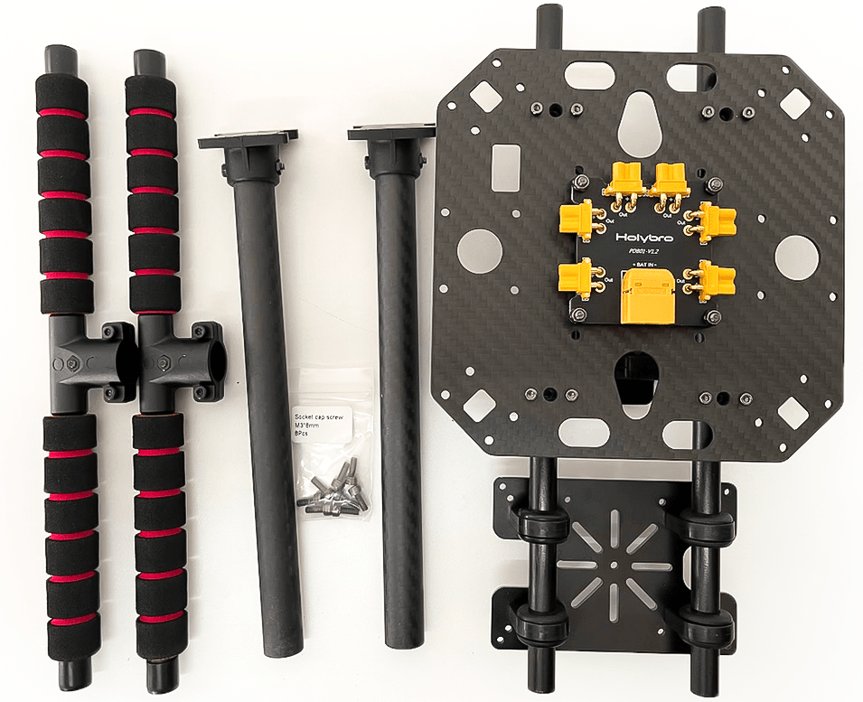
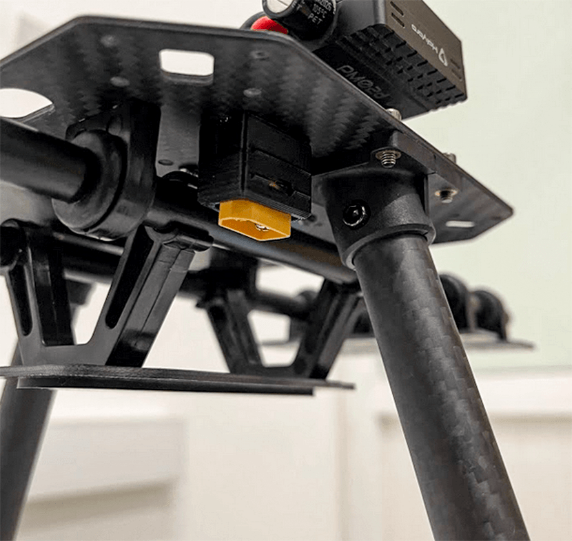
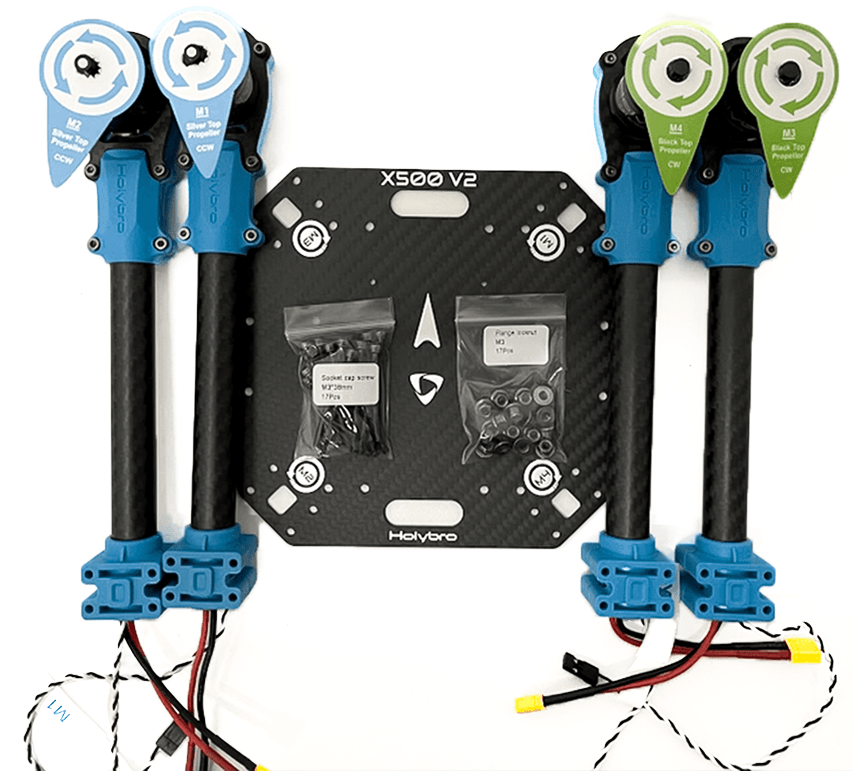

# Holybro X500 V2 (Pixhawk 5X 조립)

이 페이지에서는 [Holybro X500 V2 ARF 키트](http://shop.holybro.com/x500-v2-kit_p1288.html)를 조립 방법과 *QGroundControl*의 PX4 설정 방법을 설명합니다.

ARF("거의 비행 준비 완료") 키트는 하드웨어 설정에 많은 시간을 할애하지 않고, 드론 개발에 입문자들이 간편하고 간단한 조립할 수 있습니다. 여기에는 프레임, 모터, ESC, 프로펠러 및 배전반이 포함됩니다.

키트 외에도 비행 콘트롤러, 무선 송신기, GPS 및 RC 콘트롤러가 필요합니다. ARF 키트는 PX4와 호환되는 대부분의 비행 콘트롤러를 지원합니다.

## 주요 정보

- **키트:** [Holybro X500 V2 ARF 키트](http://shop.holybro.com/x500-v2-kit_p1288.html)
- **비행 콘트롤러:** [Pixhawk 5X](../flight_controller/pixhawk5x.md)
- **조립 시간(약):** 55분(프레임 25분, 자동조종장치 설치/설성은 30분)

## 부품 명세서

Holybro [X500 V2 키트](http://shop.holybro.com/x500-v2-kit_p1288.html)에는 필수 부품들이 포함되어 있습니다.

* X500V2 프레임 키트
  * 바디 - 풀 카본 파이버 탑 & 바닥판(144 x 144mm, 두께 2mm)
  * 암 - 고강도 & 초경량 16mm 탄소 섬유 튜브
  * 랜딩 기어 - 16mm & 10mm 직경의 탄소 섬유 튜브
  * 플랫폼 보드 - GPS & 인기있는 보조 컴퓨터
  * 이중 10mm Ø 로드 x 250mm 롱 레일 마운팅 시스템
  * 2개의 배터리 스트랩이 있는 배터리 마운트
  * 설치용 수공구
* [Holybro 모터 - 2216 KV880 x6](https://shop.holybro.com/motor2216-880kv-1pc_p1154.html)
* [Holybro BLHeli S ESC 20A x4](https://shop.holybro.com/blheli-s-esc-20a_p1143.html)
* [프로펠러 - 1045x4](https://shop.holybro.com/propeller10452pair_p1155.html)
* 배전반 – 배터리 및 배터리용 XT60 플러그 ESC &용 XT30 플러그 주변기기
* 카메라 마운트(선택 사항 및 3D 파일은 [여기](http://www.holybro.com/3D_Print/Holybro_X500_V2_3D%20Print.rar)에서 다운로드할 수 있음)

이 빌드의 다른 부품(**ARF 키트에 포함되지 않음**):
* [Pixhawk 5X 자동조종장치](../flight_controller/pixhawk5x.md)
* [M8N GPS](http://shop.holybro.com/holybro-m8n-gps_p1094.html)
* [전원 모듈 - PM02D](http://shop.holybro.com/pm02d-power-module_p1285.html)
* [433/915 MHz 무선 텔레메트리](http://shop.holybro.com/sik-telemetry-radio-v3_p1103.html)

Additionally you will need a battery (Holybro recommends a 4S 5000mAh) and receiver ([compatible radio system](../getting_started/rc_transmitter_receiver.md)) if you want to control the drone manually.

## 키트 하드웨어

프레임 및 자동조종장치 설치를 위한 하드웨어 목록입니다.

| 항목             | 설명                        | 수량 |
| -------------- | ------------------------- | -- |
| 하판             | 탄소 섬유(두께 2mm)             | 1  |
| 상판             | 탄소 섬유(두께 1.5mm)           | 1  |
| Arm            | 탄소 섬유 튜브(모터 장착 조립)        | 4  |
| 착륙 기어 - 수직 막대  | 탄소 섬유 튜브 + 엔지니어링 플라스틱     | 2  |
| 착륙 기어 - 크로스바   | 탄소 섬유 튜브 + 엔지니어링 플라스틱 + 폼 | 2  |
| 장착 레일          | 직경 : 10mm, 길이 : 250mm     | 2  |
| 배터리 장착 보드      | 두께: 2mm                   | 1  |
| 배터리 패드         | 3mm 실리콘 시트 검정             | 1  |
| 플팻폼 보드         | 두께: 2mm                   | 1  |
| 옷걸이 & 고무 링 개스킷 | 내부 구멍 직경 : 10mm 검정        | 8  |

 

   _그림 1_: X500 V2 ARF 키트 내부

### 전자부품

| 품목 설명                             | 수량 |
| --------------------------------- | -- |
| Pixhawk5x & 다양한 케이블               | 1  |
| M8N GPS 모듈                        | 1  |
| 전원 모듈 PM02D(사전 납땜된 ESC 전원 케이블 포함) | 1  |
| 모터스 2216 KV880(V2 업데이트)           | 4  |
| Holybro BLHeli S ESC 20A x4       | 1  |
| 433MHz 텔레메트리 / 915MHz 텔레메트리       | 1  |

### 필요 공구

조립을 위한 도구가 포함되어 있지만, 아래의 도구들도 필요할 수 있습니다.

- 전선 커터
- 정밀 트위저

## 조립

예상 조립 시간은 55시간(프레임은 25분, 자동 조종 장치 설치/설정은 30분)입니다.

1. 페이로드 & 배터리 홀더. 고무를 그리퍼에 밀어 넣습니다(날카로운 물건을 사용하여 밀어 넣지 마십시오!). 그런 다음, 그림 3과 같이 배터리 홀더 베이스가 있는 홀더 막대를 홀더를 통과시킵니다.

   

   _그림 2_: 페이로드 홀더 구성요소

   

   _그림 3_: 페이로드 홀더 조립

1. 다음은 페이로드 홀더에 하단 플레이트를 부착하는 것입니다.

   그림 4의 부품이 필요합니다. 그런 다음 그림 5와 같이 나일론 너트를 사용하여 배전반용 베이스를 장착합니다. 마지막으로 8개의 육각 나사를 사용하여 하단 플레이트를 페이로드 홀더에 결합할 수 있습니다(그림 7).

   

   _그림 4_: 필요한 재료들

   

   _그림 5_: PDB 마운트 베이스

   

   _그림 6_: 나일론 너트가 있는 마운트된 pdb

   

   _그림 7_: 페이로드 홀더에 장착된 플레이트

1. 그림 8과 같이 랜딩기어 장착에 필요한 재료를 준비합니다. 육각 나사를 사용하여 랜딩 기어를 하단 플레이트에 결합합니다. 또한, 각 다리 받침대에서 3개의 육각 나사를 열어 탄소 섬유 파이프에 밀어넣을 수 있습니다. 다시 조이는 것을 잊지 마십시오.

   

   _그림 8_: 착륙 장치 부착에 필요한 부품

   

   _그림 9_: 차체에 착륙 장치 부착

1. 이제 상판을 장착할 암들을 준비합니다. 암의 모터 번호는 상판의 모터 번호와 일치하므로 주의하십시오. 다행히 모터가 장착되어 있고, ESC가 미리 연결되어 있습니다. 암이 제자리에 고정된 상태에서 모든 나사를 통과시켜 시작하고(제 위치에 있는지 확인하기 위해 그림 11과 같은 가이드가 있음) 모든 나일론 너트를 약간 조입니다. 그런 다음, XT30 전원 커넥터를 전원 보드에 연결할 수 있습니다. 신호 와이어는 나중에 Pixhawk에 연결할 수 있도록 상단 플레이트를 통과하여야 합니다.

   

   _그림 10_: 암 연결에 필요한 재료.

   

   _그림 11_: 암 마운트용 가이드

1. 육각 렌치와 너트 드라이버를 모두 사용하여 16개의 나사와 너트를 모두 조입니다.

   

   _그림 12_: 장착된 상단 플레이트

1. 다음으로, 스티커를 사용하여 상단 플레이트에 픽스호크를 장착합니다. Pixhawk의 화살표 방향을 상판에 표기된 방향에 맞추는 것이 좋습니다.

   

   _그림 13_: Pixhawk의 스티커 테이프

1. 보조 컴퓨터 플레이트에 GPS를 장착하려면, 4개의 나사와 너트를 사용하여 GPS 마운트를 고정할 수 있습니다.

   

   _그림 14_: GPS 마운트를 보조 컴퓨터에 고정

1. 테이프를 사용하여 GPS를 GPS 마스트 상단에 붙이고 GPS 마스트를 장착합니다. GPS의 화살표가 앞쪽을 가리키는지 확인하십시오(그림 15).

   

   _그림 15_: GPS와 마스트

1. 마지막으로, 텔레메트리와 같은 Pixhawk 인터페이스들을 'TELEM1'에 연결하고, 그에 따라 모터 신호 케이블을 연결할 수 있습니다.

자세한 내용은 [Pixhawk  5X 빠른 시작](../assembly/quick_start_pixhawk5x.md)을 참고하십시오.

조립이 완료되었습니다. 마지막으로 Pixhawk TV와 'TELEM1'에 도달하실 수 있습니다.

## PX4 설치 및 설정

:::tip PX4 설치 및 설정 매뉴얼은 [기본 설정](../config/README.md)편을 참고하십시오.
:::

*QGroundControl*에서 PX4 자율비행 프로그램을 설치하고 X500 프레임 설정과 보정 작업을 진행합니다.
1. [Download and install](http://qgroundcontrol.com/downloads/) *QGroundControl* for your platform.
1. Update the firmware and airframe:
   - [펌웨어](../config/firmware.md)
   - [Airframe](../config/airframe.md) - *Holybro S500* 기체(**Quadrotor x > Holybro S500**)를 선택합니다.

     

1. 그리고, 설치후에 필수적인 설정 작업을 실시합니다.
   - [센서 방향](../config/flight_controller_orientation.md)
   - [나침반](../config/compass.md)
   - [가속도계](../config/accelerometer.md)
   - [수평 보정](../config/level_horizon_calibration.md)
   - [라디오 설정](../config/radio.md)
   - [비행 모드](../config/flight_mode.md)

   다음 작업 역시 반드시 진행하여야 합니다.

   - [ESC 보정](../advanced_config/esc_calibration.md)
   - [배터리](../config/battery.md)
   - [안전](../config/safety.md)

## 튜닝

기체 선택은 프레임의 *기본* 자동조종장치의 매개 변수를 설정합니다. 이 상태로도 비행이 가능하지만, 특정 기체에 관련된 변수들을 조정하는 것이 바람직합니다.

For instructions on how, start from [Auto-tune](../config/autotune.md).

## 감사의 글

이 조립 설명서는 PX4 팀에서 제공하였습니다.
