# Holybro X500 + Pixhawk4 조립

키트 조립법과 *QGroundControl*의 PX4 설정법에 대하여 설명합니다.

## 주요 정보

- **프레임:** Holybro X500
- **비행 컨트롤러:** [Pixhawk 4](../flight_controller/pixhawk4.md)
- **조립 시간 (예상):** 2시간 (프레임 조립에 75분, 오토파일럿 설치 및 설정에 45분)
- **조립 시간 (예상):** 3.75시간 (프레임 조립에 180분, 오토파일럿 설치 및 설정에 45분)

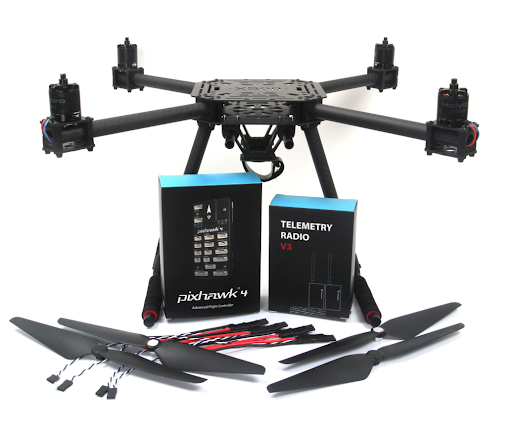

## 부품 명세서

Holybro [X500 키드](https://shop.holybro.com/x500-kit_p1180.html)에는 필수 구성 요소가 포함되어 있습니다.

* [Pixhawk 4 autopilot](../flight_controller/pixhawk4.md)
* [Pixhawk 4 GPS](https://shop.holybro.com/pixhawk-4-gps-module_p1094.html)
* [Power Management - PM07](https://shop.holybro.com/pixhawk-4-power-module-pm07_p1095.html)
* [Holybro Motors - 2216 KV880 x4](https://shop.holybro.com/motor2216-880kv-1pc_p1154.html)
* [Holybro BLHeli S ESC 20A x4](https://shop.holybro.com/blheli-s-esc-20a_p1143.html)
* [Propellers - 1045 x4](https://shop.holybro.com/propeller10452pair_p1155.html)
* 전원 관리 - PM07
* 전원 및 무선 조종기 케이블
* 휠베이스 - 500 mm
* 433 MHz Telemetry Radio/915 MHz Telemetry Radio
* 433 MHz Telemetry Radio/915 MHz Telemetry Radio

드론을 수동 제어에는 배터리와 수신기([호환 무선 시스템](../getting_started/rc_transmitter_receiver.md))가 필요합니다.

## 하드웨어

프레임과 자율비행프로그램 설치를 위한 하드웨어들 입니다.

| 항목              | 설명                           | 수량 |
| --------------- | ---------------------------- | -- |
| 소켓 캡 나사         | 모터 고정에 사용, 스테인레스 스틸 나사 M3*5  | 16 |
| 탄소 섬유 튜브-암      | 직경 : 16mm, 길이 : 200mm        | 16 |
| 모터 베이스          | 6 개의 부품과 4 개의 나사로 구성 4 개의 너트 | 4  |
| 슬라이드 바          | 직경 : 10mm, 길이 : 250mm        | 2  |
| 배터리 장착 보드       | 두께: 2mm                      | 2  |
| 배터리 패드          | 3mm 실리콘 시트 검정                | 4  |
| 철탑              | 구리 너트가 내장된 엔지니어링 플라스틱        | 2  |
| 십자 접시 머리 나사     | 스테인리스  M2.5*5mm              | 16 |
| PAN/TILT 플랫폼 보드 | 두께: 2mm                      | 16 |
| 행거 고무링 개스킷      | 스테인리스  M2.5*5mm              | 16 |
| 헹거              | 구리 너트가 내장된 엔지니어링 플라스틱        | 8  |

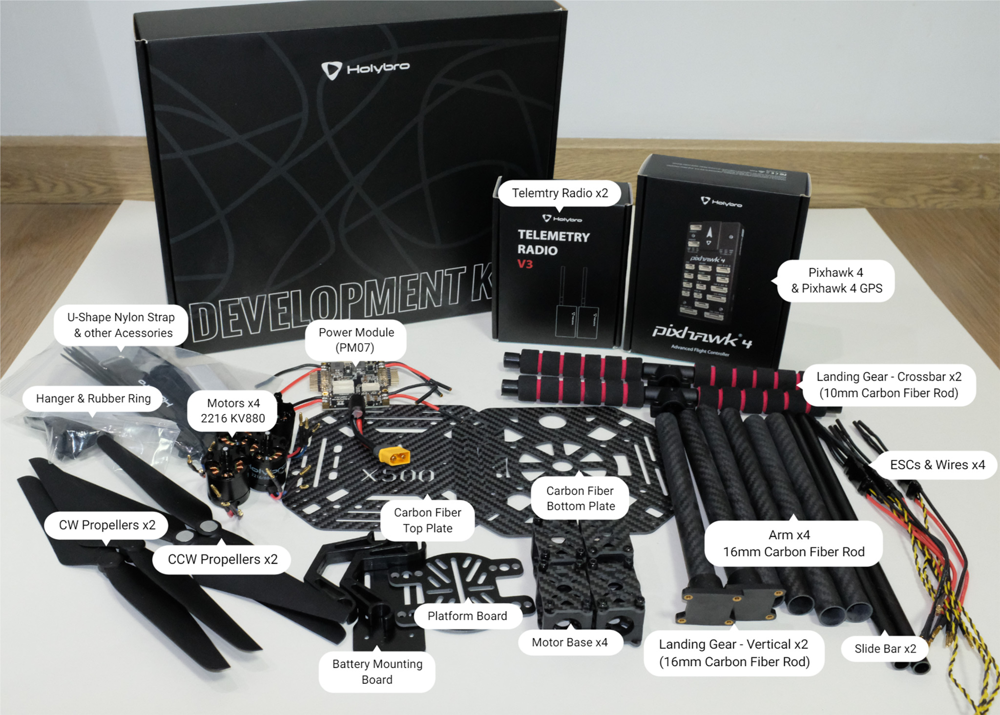

### 전자부품

| 항목                | 패키지 |
| ----------------- | --- |
| Pixhawk 4         | 16  |
| Pixhawk4 GPS 모듈   | 1   |
| I2C 스플리터 보드       | 2   |
| 6 ~ 6 핀 케이블 (전원)  | 3   |
| 4 ~ 4 핀 케이블 (CAN) | 2   |
| 6 ~ 4 핀 케이블 (데이터) | 1   |

### 필요 공구

조립시에 필요한 공구들입니다.

- 수신기: FR SKY Taranis
- 배터리: [4S 1300 mAh](http://www.getfpv.com/lumenier-1300mah-4s-60c-lipo-battery-xt60.html)
- 2.5 mm 육각 스크류드라이버
- 3mm 필립스 스크류드라이버
- 5.5mm 소켓 렌치 또는 작은 파일러
- 전선 커터
- 정밀 트위저

## 조립

예상 조립 시간은 3.75시간(프레임은 180분, 자동 조종 장치 설치/설정은 45분)입니다.

1. 랜딩기어 조립부터 시작합니다. 랜딩 기어 나사를 풀고 수직 기둥을 삽입합니다(그림 1 및 2).

   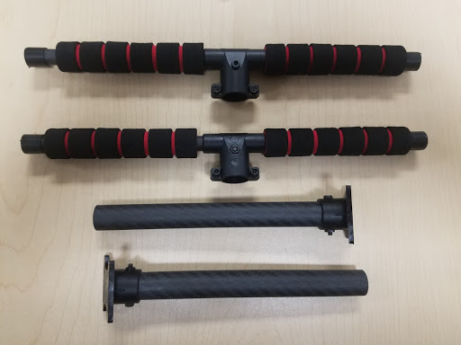

   _그림 2_: 착륙 장치 구성 요소

   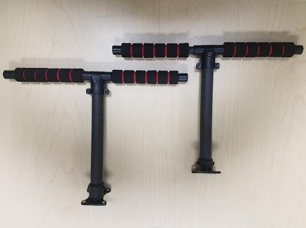

   _그림 2_: 랜딩 기어 조립

1. 그런 다음, 그림 3에 표시된 4개의 모터 베이스를 통해 4개의 암을 넣습니다. 로드가 베이스를 약간 돌출시키고 4개의 암 전체에서 일관성이 있는 지 확인하고 모터 와이어가 바깥쪽을 향하도록 합니다.

   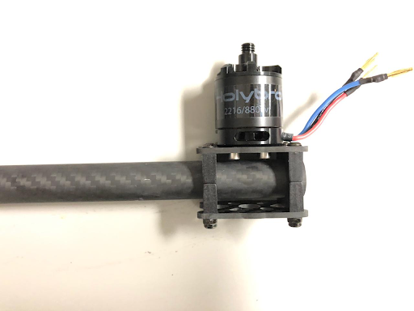

   _그림 3_: 모터 베이스에 암 부착

1. 4개의 나일론 나사와 나일론 스탠드오프를 삽입하고, 그림 4와 같이 4개의 나일론 너트를 사용하여 전원 모듈 PM07을 하단 플레이트에 부착합니다.

   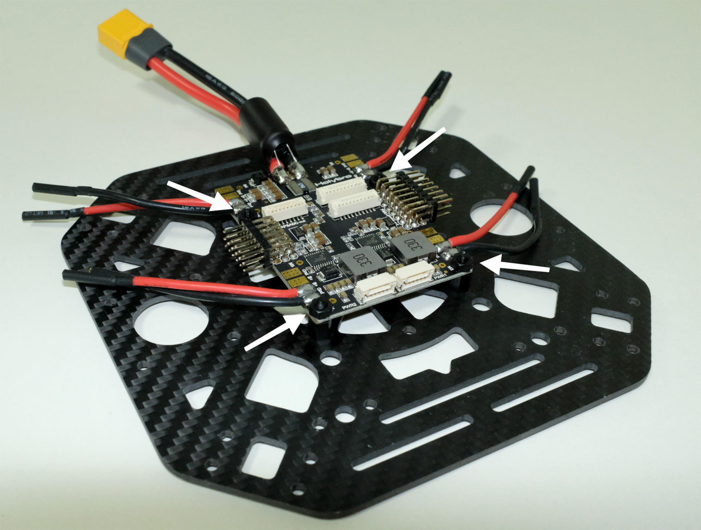

   _그림 4_: 전원 모듈 연결

1. 각 암을 통해 4개의 모터 ESC를 공급하고, 그림 5에 표시된 모터에 3선 끝을 연결합니다.

   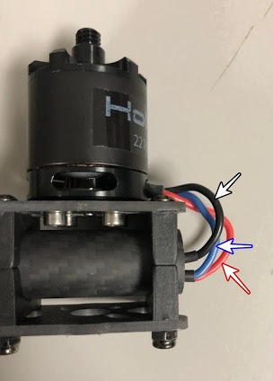

   _그림 5_: 모터 연결

1. ESC 전원선을 전원 모듈 PM07에 연결하고, 검정-검정 및 빨강-빨간색, ESC PWM 신호선을 "FMU-PWM-Out"으로 연결합니다. 모터 ESC PWM 와이어를 올바른 순서로 연결하였는 지 확인하십시오. Refer to Figure 7 for airframe motor number and connect to the corresponding number on the PM07 board.

   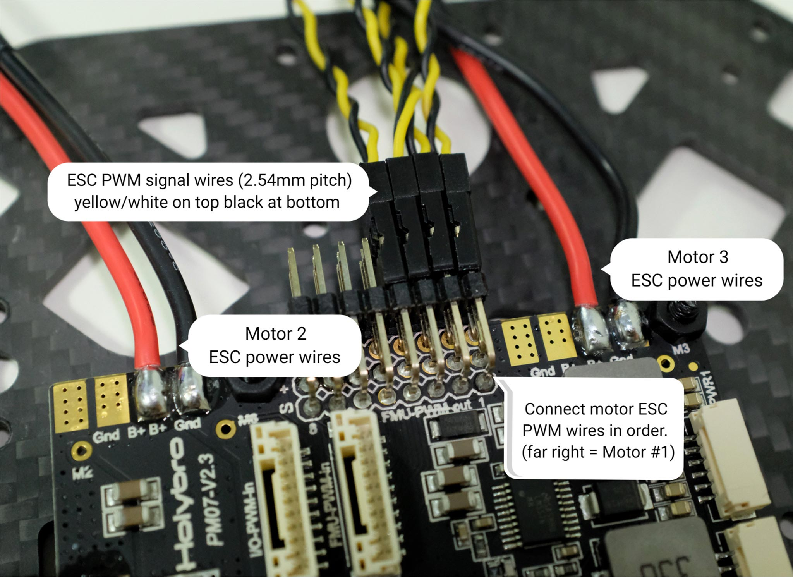 _그림 7_: ESC 전원 모듈 및 신호 배선

   모터 상단의 색상은 회전 방향(그림 7-1)을 나타내며, 검은색 끝은 시계 방향, 흰색 끝은 반시계 방향입니다. 모터 방향은 px4 quadrotor x 기체 정의서를 따라야 합니다(그림 7-2).

   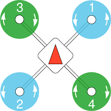

   _그림 7_: 모터 순서/방향 다이어그램

   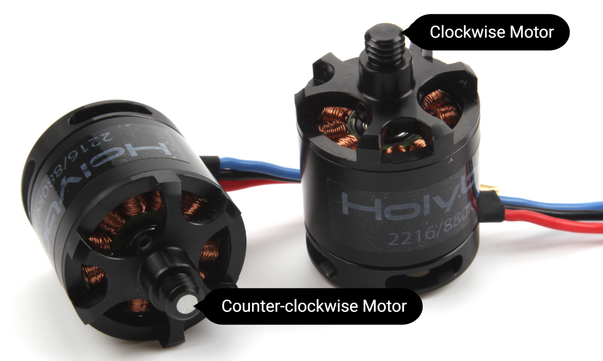

   _그림 7-1_: 모터 방향

1. 10핀 케이블을 FMU-PWM-in에 연결하고, 6핀 케이블을 PM07 전원 모듈의 PWR1에 연결합니다.

   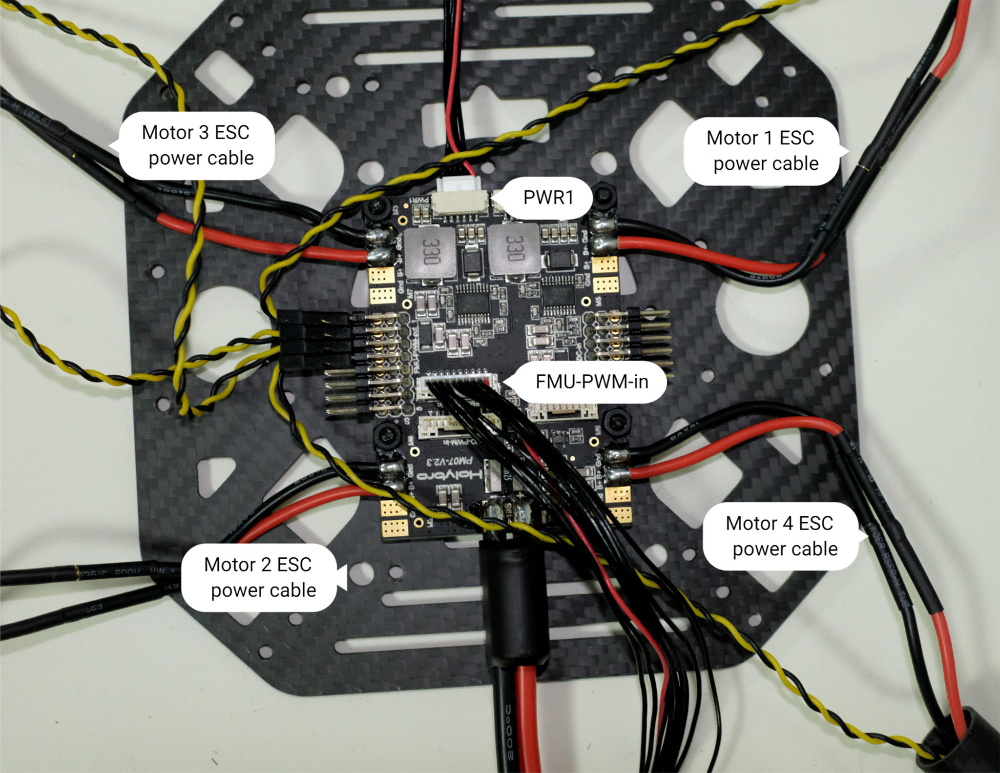

   _그림 8_: 전원 모듈 PWM 및 전원 배선

1. GPS를 상판에 장착하려는 경우 이제 4개의 나사와 너트를 사용하여 GPS 장착을 상판에 고정할 수 있습니다.

   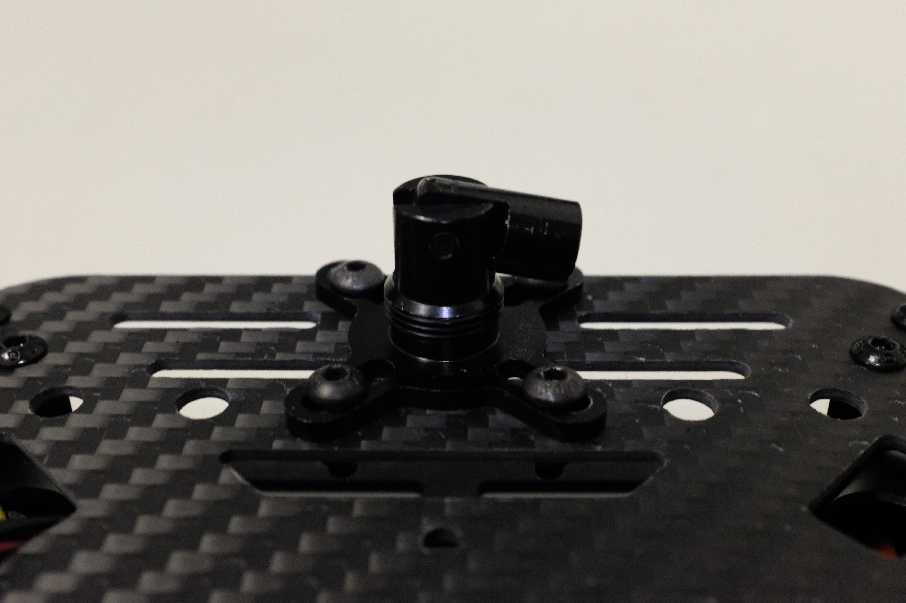

   _그림 9_: GPS 마운트를 상단 플레이트에 고정

1. 상판을 통하여 PM07 케이블을 공급합니다. 양쪽에 4개의 U자형 나일론 스트랩, 나사 및 너트를 사용하여 상단 및 하단 플레이트를 연결하고, 모터 ESC 케이블이 그림 10과 같이 U자형 나일론 스트랩 내부에 있는 지 확인하고 너트를 느슨하게 유지합니다.

   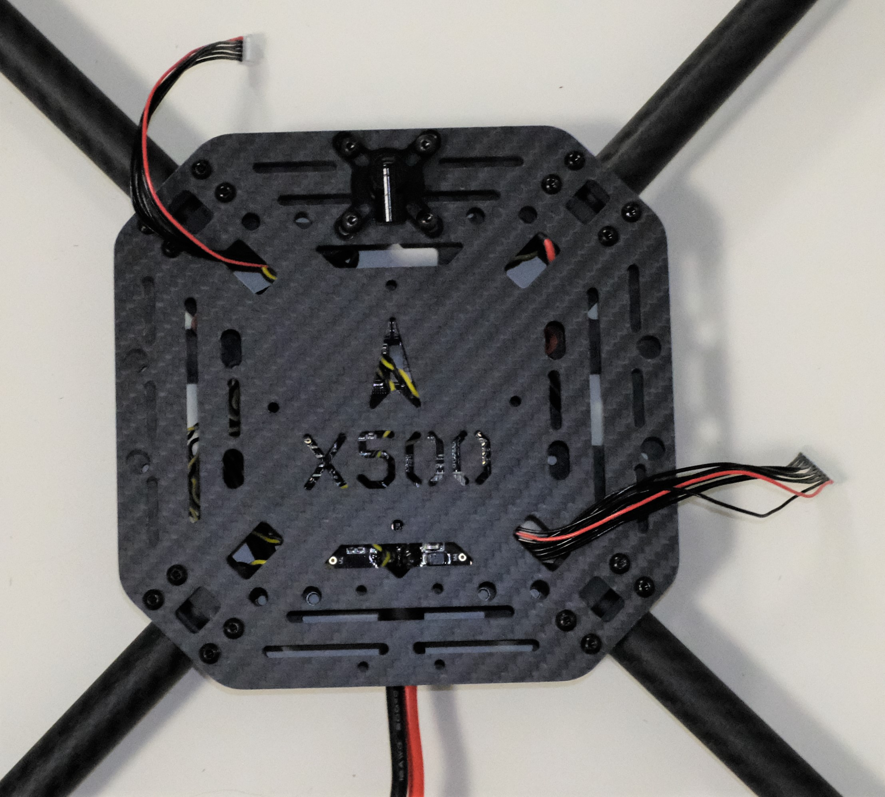

   _그림 10-1_: 상단 플레이트를 통해 전원 모듈 케이블 공급

   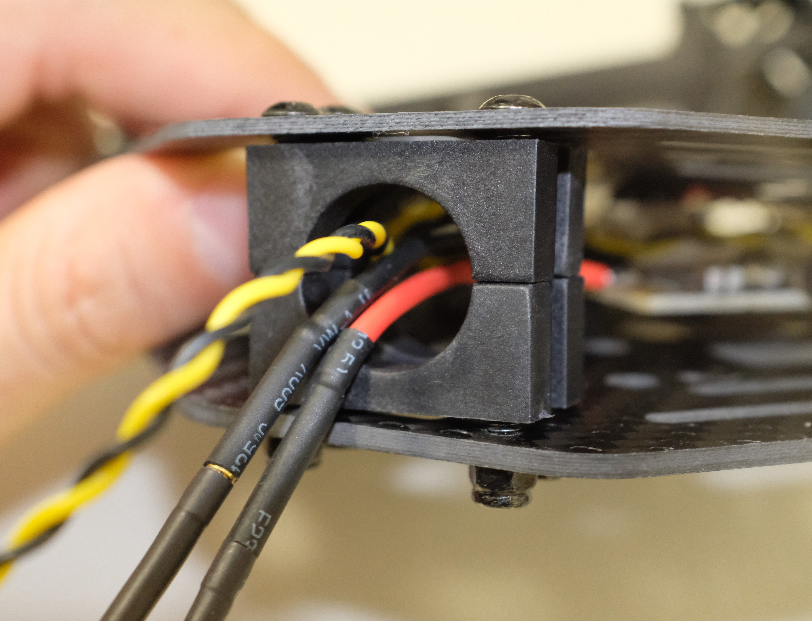

   _그림 10-2_: 상판과 하판 연결

1. 암 튜브를 프레임에 약간 밀어 넣고, 돌출 정도(그림 11의 빨간색 사각형)가 4개의 암 모두에서 일정한 지 확인합니다. 모든 모터가 위를 향하고 있는 지 확인한 다음 모든 너트와 나사를 조입니다.

   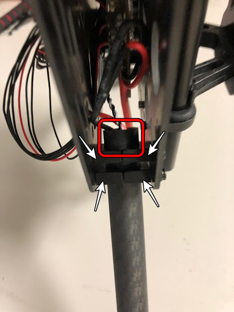

1. 행거 개스킷을 행거 4개에 넣고 육각 나사 8개를 사용하여 하단 플레이트에 장착합니다(그림 11). 나사 구멍은 그림 12에서 흰색 화살표로 표시되어 있습니다. 설치가 더 쉽도록 드론을 옆으로 기울이는 것이 좋습니다.

   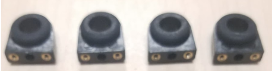

   _그림 11_: 행거 개스킷

   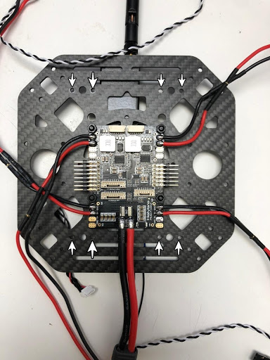

   _그림 12_: 나사 구멍

1. 행거 링에 슬라이드 바를 삽입합니다(그림 13). 배터리 마운트와 플랫폼 보드를 조립하고, 그림 14와 같이 슬라이드 바에 장착합니다.

   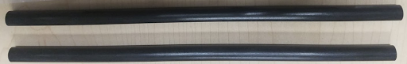

   _그림 13_: 슬라이드 바

   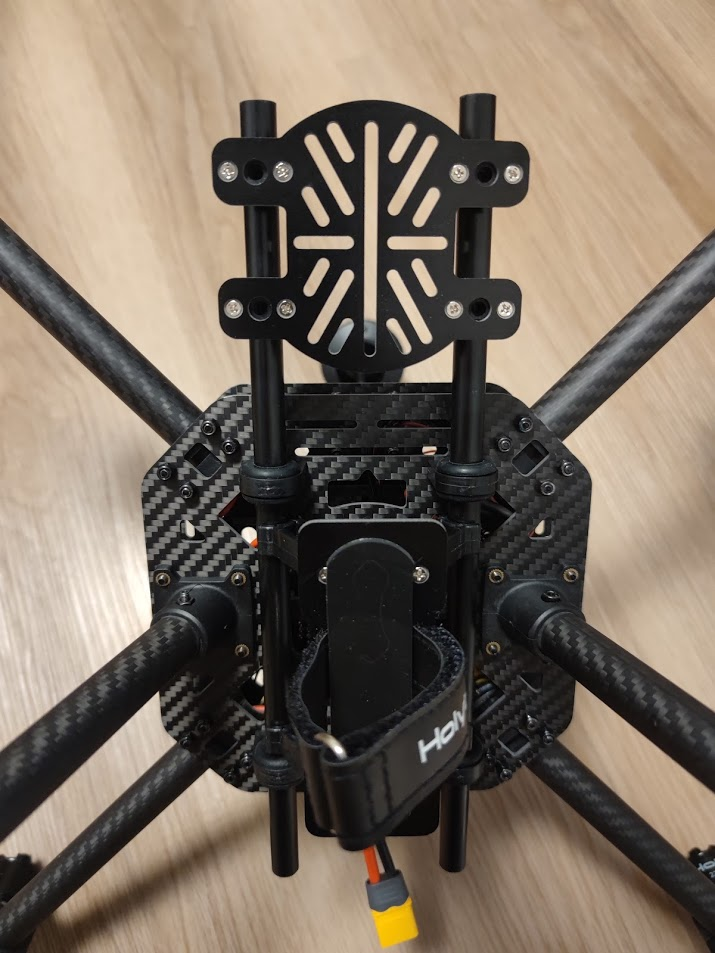

   _그림 14_: 슬라이드 바의 배터리 마운트

1. 랜딩 기어를 바닥판에 장착합니다. 이 설치 과정을 더 쉽게 하려면 드론을 옆으로 기울이는 것이 좋습니다.

   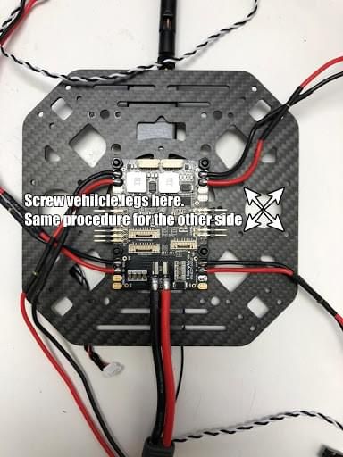

   _그림 15_: 착륙 장치

1. 테이프를 사용하여 GPS를 GPS 마스트 상단에 붙이고 GPS 마스트를 장착합니다. GPS의 화살표가 앞을 가리키는 지 확인하십시오(그림 16).

   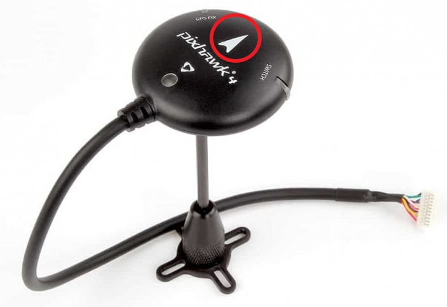

   _그림 16_: GPS 및 마스트

1. 상판에 원격 측정 라디오를 장착합니다. 원격 측정 케이블을 `TELEM1` 포트에 연결하고, GPS 모듈을 비행 콘트롤러의 `GPS MODULE` 포트에 연결합니다. 케이블을 PM07 `FMU-PWM-in`에서 FC의 `I/O-PWM-out`으로 연결하고 PM07 `PWR1`에서 그림 17과 같이 FC의 `POWER1`로 연결합니다.

   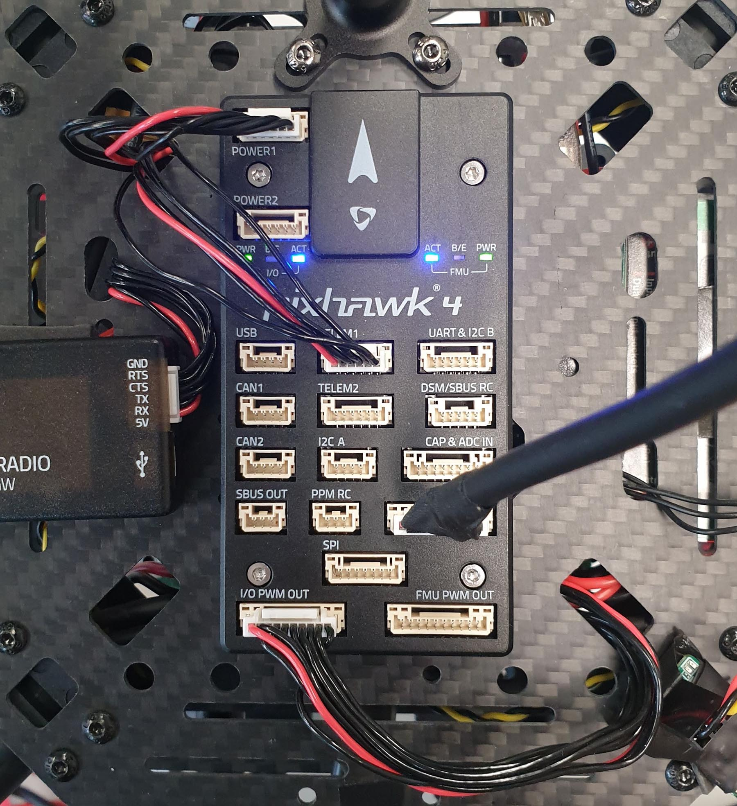

   _그림 17_: 원격 측정 라디오를 장착하고 PWM 및 전원 케이블을 비행 콘트롤러에 연결합니다.

자세한 내용은 [Pixhawk 4 빠른 시작](../assembly/quick_start_pixhawk4.md)을 참고하십시오.

조립이 완료되었습니다. 완전히 조립된 키트는 다음과 같습니다.

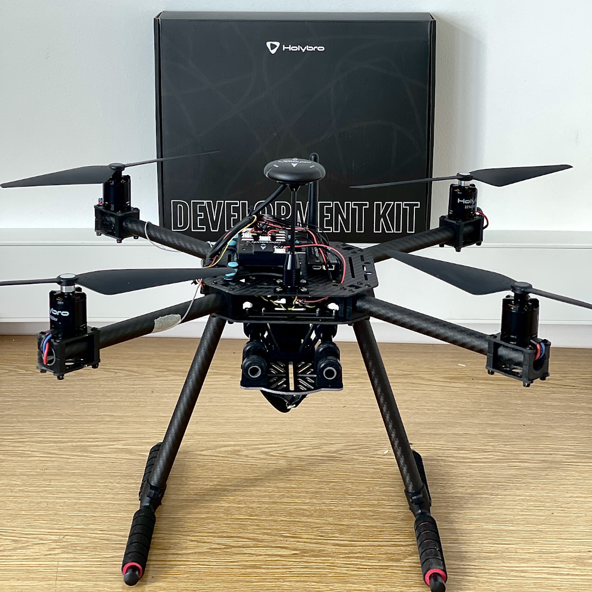

## PX4 설치 및 설정

:::tip PX4 설치 및 성정 매뉴얼은 [기본 설정](../config/README.md)편을 참고하십시오.
:::

*QGroundControl*에서 PX4 자율비행 프로그램을 설치하고 X500 프레임 설정과 보정 작업을 진행합니다. *QGroundControl*을 [다운로드 후에 설치](http://qgroundcontrol.com/downloads/) 하십시오.

먼저, 펌웨어와 기체 프레임을 업데이트 합니다.
* [펌웨어](../config/firmware.md)
* [Airframe](../config/airframe.md) - *Holybro S500* 기체(**Quadrotor x > Holybro S500**)를 선택해야 합니다. 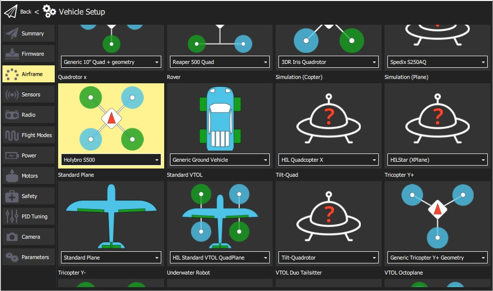

그리고, 설치후에 필수적인 설정 작업을 실시합니다.
* [센서 방향](../config/flight_controller_orientation.md)
* [나침반](../config/compass.md)
* [가속도계 ](../config/accelerometer.md)
* [수평 보정](../config/level_horizon_calibration.md)
* [무선 조종기 설정](../config/radio.md)
* [비행 모드](../config/flight_mode.md)

다음 작업들은 반드시 진행하여야 합니다.
* [ESC 보정](../advanced_config/esc_calibration.md)
* [배터리](../config/battery.md)
* [안전](../config/safety.md)

## 튜닝

기체 선택은 프레임의 자유비행에 관련된 *기본*적인 매개변수를 설정합니다. 이 상태로도 비행이 가능하지만, 특정 기체에 관련된 변수들을 조정하는 것이 바람직합니다. 자세한 방법은 [Multicopter 기본 PID 조정](../config_mc/pid_tuning_guide_multicopter_basic.md)을 참고하십시오.

## 감사의 글

이 조립 방법은 Dronecode 테스트 비행팀에서 제공하였습니다.
