# Holybro X500 + Pixhawk4 조립

키트 조립법과 *QGroundControl*의 PX4 설정법을 설명합니다.

## 주요 정보

- **프레임:** Holybro X500
- **비행 컨트롤러:** [Pixhawk 4](../flight_controller/pixhawk4.md)
- **조립 시간 (예상):** 2시간 (프레임 조립에 75분, 오토파일럿 설치 및 설정에 45분)

## 부품 명세서

Holybro [X500 키드](https://shop.holybro.com/x500-kit_p1180.html)에는 필수 구성 요소가 포함되어 있습니다.

* [Pixhawk 4 autopilot](../flight_controller/pixhawk4.md)
* Pixhawk 4 GPS
* 배터리 스트랩
* 프로펠러 - 1045
* 모터 - 2216 KV880
* 전원 및 무선 조종기 케이블
* 전원 관리 - PM07
* Wheelbase - 500 mm
* 치수 - 410 *410* 300mm
* 433 MHz Telemetry Radio/915 MHz Telemetry Radio

또한 배터리와 수신기([호환 무선 조종기](../getting_started/rc_transmitter_receiver.md))가 필요합니다. 이 조립 예제에서는 다음의 부품들을 사용합니다.

* 수신기: FR SKY Taranis
* 배터리: [4S 1300 mAh](http://www.getfpv.com/lumenier-1300mah-4s-60c-lipo-battery-xt60.html)

## 하드웨어

프레임과 자율비행프로그램 설치를 위한 하드웨어들 입니다.

| 항목              | 설명                           | 수량 |
| --------------- | ---------------------------- | -- |
| 소켓 캡 나사         | 모터 고정에 사용, 스테인레스 스틸 나사 M3*5  | 16 |
| 탄소 섬유 튜브-암      | 직경 : 16mm, 길이 : 200mm        | 4  |
| 모터 베이스          | 6 개의 부품과 4 개의 나사로 구성 4 개의 너트 | 4  |
| 슬라이드 바          | 직경 : 10mm, 길이 : 250mm        | 2  |
| 배터리 장착 보드       | 두께: 2mm                      | 1  |
| 배터리 패드          | 3mm 실리콘 시트 검정                | 1  |
| 철탑              | 구리 너트가 내장된 엔지니어링 플라스틱        | 2  |
| 십자 접시 머리 나사     | 스테인리스  M2.5*5mm              | 12 |
| PAN/TILT 플랫폼 보드 | 두께: 2mm                      | 1  |
| 행거 고무링 개스킷      | 내부 구멍 직경 : 10mm 검정           | 8  |
| 헹거              | 구리 너트가 내장된 엔지니어링 플라스틱        | 8  |
| 탄소 섬유 - 바닥 판    | 두께 2mm                       | 1  |
| 소켓 캡 나사         | 스테인리스  M2.5*6mm              | 8  |
| 나일론 스터드         | 검정 M3*6+6                    | 4  |
| 나일론 나사          | 검정 M3*6                      | 4  |
| 탄소 섬유 - 상판      | 두께: 1.6mm                    | 1  |
| 냄비 머리 나사        | 금속 검정 M3*30mm                | 16 |
| 나일론 스트랩         | 16mm 탄소 섬유 튜브의 U 자형          | 16 |
| 나일론 너트          | 검정 M3                        | 4  |
| Locknut         | 금속 검정 M3                     | 16 |
| 소켓 캡 나사         | 금속 검정 M3*8mm                 | 8  |
| 착륙 기어 - 수직 막대   | 탄소 섬유 튜브 + 엔지니어링 플라스틱 + 패스너  | 2  |
| 착륙 기어 - 크로스바    | 탄소 섬유 튜브와 여러 부품으로 구성         | 2  |

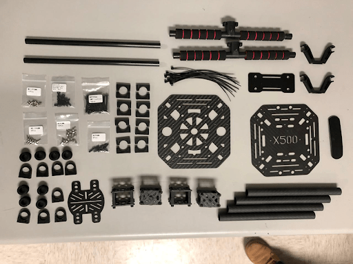

## 패키지

| 항목                  | 패키지 |
| ------------------- | --- |
| Pixhawk 4           | 1   |
| Pixhawk4 GPS 모듈     | 1   |
| I2C 스플리터 보드         | 2   |
| 6 ~ 6 핀 케이블 (전원)    | 3   |
| 4 ~ 4 핀 케이블 (CAN)   | 2   |
| 6 ~ 4 핀 케이블 (데이터)   | 1   |
| 10 ~ 10 핀 케이블 (PWN) | 2   |
| 8 ~ 8 핀 케이블 (AUX)   | 1   |
| 7 ~ 7 핀 케이블 (SPI)   | 1   |
| 6 ~ 6 핀 케이블 (디버깅)   | 1   |
| PPM/SBUS 출력 케이블     | 1   |
| XSR 수신기 케이블         | 1   |
| DSMX 수신기 케이블        | 1   |
| SBUS 수신기 케이블        | 1   |
| USB 케이블             | 1   |
| 'X'타입 접이식 받침대 마운트   | 1   |
| 70mm 및 140mm 카본 받침대 | 2   |
| 6*3 2.54mm 피치 수평 핀  | 1   |
| 8*3 2.54mm 피치 수평 핀  | 2   |
| 폼 세트                | 1   |
| Pixhawk 4 빠른 시작 가이드 | 1   |
| Pixhawk4 핀아웃        | 1   |
| GPS 빠른 시작 가이드       | 1   |

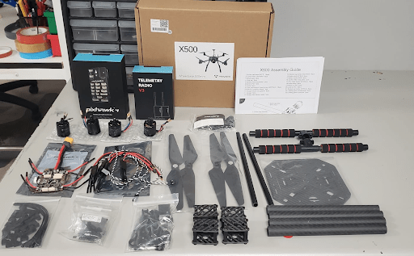

### 전자부품

| 항목 설명                                           | 수량 |
| ----------------------------------------------- | -- |
| Pixhawk 4 autopilot（PM06 not included)          | 1  |
| 전원 관리 PM02 (조립)                                 | 1  |
| 모토 - 2216 KV880（V2 Update)                      | 4  |
| Pixhawk 4 GPS                                   | 1  |
| 조립된 ESC 전원 관리 보드                                | 1  |
| 433MHz Telemetry Radio / 915MHz Telemetry Radio | 1  |

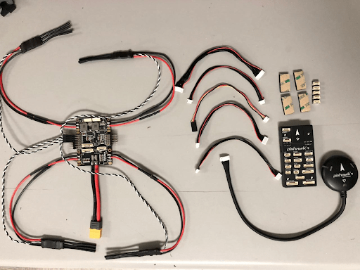

### 필요 공구

조립시에 필요한 공구들입니다.

- 1.5 mm 육각 스크류드라이버
- 2.0 mm 육각 스크류드라이버
- 2.5 mm 육각 스크류드라이버
- 3mm Phillips 스크류드라이버
- 전선 커터
- 정밀 트위저

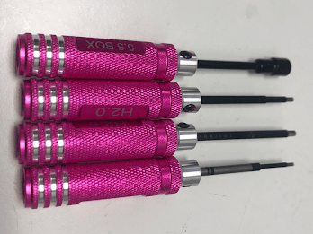

## 조립

조립 예상 시간은 120 분, 프레임 조립의 경우 약 75 분, QGroundControl에서 자동조종장치 설정에 45 분입니다.

**1 단계 :** 먼저 착륙 기어를 수직 기둥에 조립합니다. 랜딩 기어 나사를 풀고 수직 기둥을 삽입합니다 (그림 1 및 2 참조).

(그림 1)

(그림 2)

**2 단계 :** 그림 3과 같이 4 개의 U 자형 나일론 스트랩을 사용하여 홀더를 탄소 섬유 암에 부착하여 모터 홀더를 장착합니다.

(그림 3)

**3 단계 :** 그림 4 및 5와 같이 전원 관리 PM02를 하단 플레이트에 부착합니다.

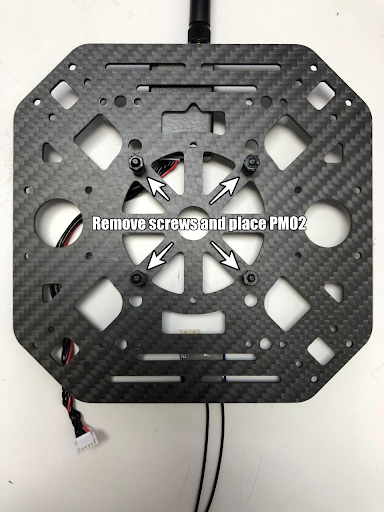

(그림 4)

(그림 5)

**4 단계 :** 하부 플레이트를 랜딩 기어에 조립합니다. 수직 기둥이 있는 랜딩 기어를 바닥 판에 나사로 고정합니다.

하단 플레이트에는 4 개의 구멍이 있습니다 (그림 4 화살표 참조). M3X8 나사를 사용하여 총 8 개, 각 측면에 4 개씩.

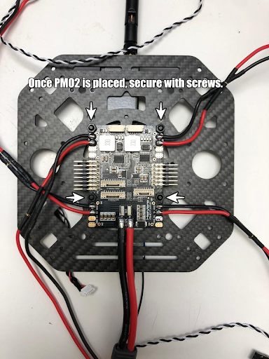

(그림 6)

**5 단계 :** 배터리 마운트를 프레임에 조립합니다. 이를 위해 M2 5X6 나사와 배터리 마운트가 필요합니다 (그림 7 참조).

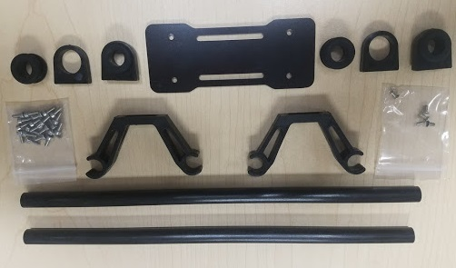

(그림 7)

긴 막대를 작은 링에 삽입합니다 (그림 8 및 9 참조).

(그림 8)

(그림 9)

배터리 홀더가 장착 된 상태에서 그림 10과 같이 이미지에 표시된 화살표 위치에 나사를 조입니다. GPS 모듈이 전방을 향하도록 설치하여야  합니다.

(그림 10)

**6 단계 :** 8 * 3 2.54mm 피치 수평 핀을 전원 관리 보드의 10 ~ 10 핀 케이블 (PWM)에 조립합니다. 10 ~ 10 핀 케이블 (PWM)을 8 * 3 2.54mm 피치 수평 핀에 연결합니다 (그림 11 참조).

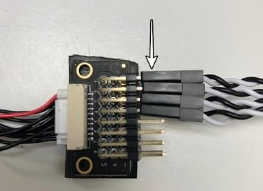

(그림 11)

3M 테이프 조각을 잘라 수평 핀 하단에 부착합니다 (그림 12 참조) 수평 핀을 전원 관리 보드에 부착 (그림 13 참조).

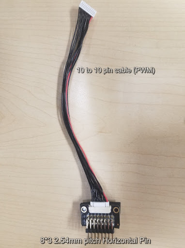

(그림 12)

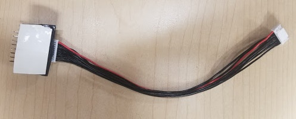

(그림 13)

**7 단계 :** 차량 암을 본체에 설치합니다. ESC를 그림 14와 같이 Arm 튜브에 밀어 넣고, 그림 15와 같이 ESC 케이블을 다시 밀어 넣을 것이기 때문에 ESC 케이블이 너무 길지 않은지 확인합니다.

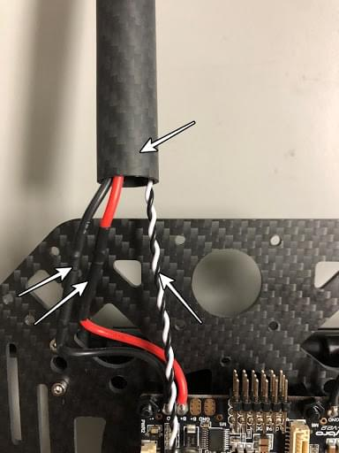

(그림 14)

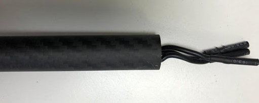

(그림 15)

**Step 8:** Assemble arm to main body.

With 4 more U-shaped nylon straps attach the arm with the motor installed to the body of the vehicle as shown in Figure 16, this way you also attach the bottom plate to the top plate.

Keep in mind to have the arm tube a bit pushed in to that it can be kept securely in place as shown in the Red Square from Figure 16.

(Figure 16)

**Step 9:** Connect Motors cables.

After the 4 arms are mounted on to the main body, connect the cables (red, blue, black) and push them into the arm tube, see Figures 17.

The 3 cables that are color-coded go connected to the ESC.

(Figure 17)

**Step 10:** Mounting the GPS on the frame. For this, we will need the Pixhawk 4 GPS and the mounting plate.

Mount GPS mast to the plate, use the 4 screws see the red circle in Figure 18, keep in mind that the plate is mounted to the battery holder tubes as indicated by the arrows in Figure 18.

(Figure 18)

Use the tape and stick the GPS to the top of the GPS mast, see Figure 19.

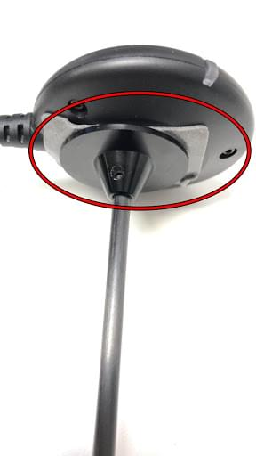

(Figure 19)

**Step 11:** Pixhawk 4 wiring. The Pixhawk 4, which has several different wires and connections with it. Included below is a picture of every wire needed with the Pixhawk and how it looks when connected.

Plugin Telemetry and GPS module to the flight controller as seen in Figure 20; plug in the RC receiver, all 4 ESCs to the flight controller as well as the power module as shown in Figure 21.

(Figure 20)

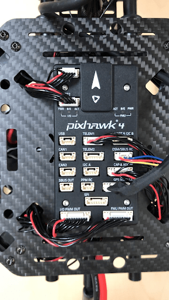

(Figure 21)

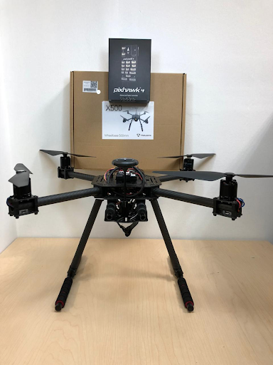

(Fully assembled X500 Kit)

## Install/Configure PX4

*QGroundControl* is used to install the PX4 autopilot and configure/tune it for the QAV250 frame. [Download and install](http://qgroundcontrol.com/downloads/) *QGroundControl* for your platform.

:::tip
Full instructions for installing and configuring PX4 can be found in [Basic Configuration](../config/README.md).
:::

First update the firmware and airframe:
* [Firmware](../config/firmware.md)
* [Airframe](../config/airframe.md)

:::note
You will need to select the *Holybro S500* airframe (**Quadrotor x > Holybro S500**).
:::

Then perform the mandatory setup/calibration:
* [Sensor Orientation](../config/flight_controller_orientation.md)
* [Compass](../config/compass.md)
* [Accelerometer](../config/accelerometer.md)
* [Level Horizon Calibration](../config/level_horizon_calibration.md)
* [Radio Setup](../config/radio.md)
* [Flight Modes](../config/flight_mode.md)

Ideally you should also do:
* [ESC Calibration](../advanced_config/esc_calibration.md)
* [Battery](../config/battery.md)
* [Safety](../config/safety.md)

## Tuning

Airframe selection sets *default* autopilot parameters for the frame. These are good enough to fly with, but it is a good idea to tune the parameters for a specific frame build.

For general information on tuning see: [Multicopter PID Tuning Guide](../config_mc/pid_tuning_guide_multicopter.md).

## Acknowledgements

This build log was provided by the Dronecode Test Flight Team.
