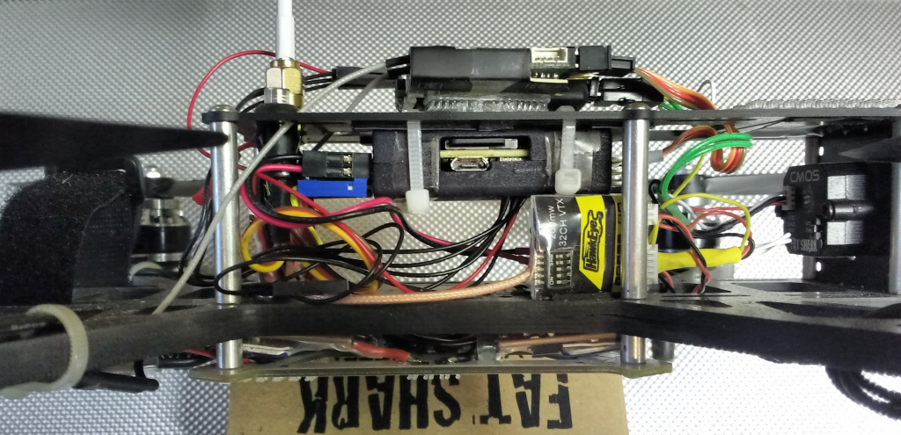

# Lumenier QAV250 Pixhawk & amp; AUAV-X2 조립

[Lumenier QAV250 Mini FPV Quadcopter](https://www.lumenier.com/products/legacy/qav250)는 크기는 소형이지만, 모든 기능이 제공되는 FPV 멀티 콥터 프레임입니다. *Pixhawk* 및 AUAV-X2 비행 컨트롤러와 함께 프레임을 사용하기위한 조립 방법을 제공합니다.

:::note
[HolyBro QAV250 Pixhawk4-Mini 빌드](holybro_qav250_pixhawk4_mini.md)에는 QAV250 작업을위한보다 완전한 조립 방법이 포함되어 있습니다.
:::

주요 정보:

- **프레임:** Lumenier QAV250 CF
- **비행 컨트롤러:** Pixhawk 또는 AUAV-X2
- ** 조립 시간 (대략) : </ 0>-</li> </ul> 
    
    ## 프레임 조립
    
    프레임 조립 가이드는 다음과 같습니다: [제작 매뉴얼](https://www.lumenier.com/products/legacy/build-manual) <!-- QAV250 G10 Build Manual -->
    
    ## Pixhawk 안내
    
    Pixhawk를 세로 방향으로 배치할 공간이 충분하지 않기 때문에, 90도 회전하여 4 개의 폼 장착 패드를 프레임에서 최대한 멀리 배치하였습니다. 매개 변수를 설정시에 정확한 자동조종장치 방향을 지정하십시오.
    
    부저는 서보 테이프로 프레임의 하단 전면에 장착되며, 안전 스위치는 상단 프레임 후면의 구멍 중 하나에 깔끔하게 장착됩니다.
    
    무게를 줄이고 전원 케이블을 쉽게 연결하기 위해서 전원 모듈의 출력 끝에서 XT60을 제거하고 리드를 PDB에 직접 납땜하였습니다.
    
    그림에는 3S/1300mAh Nano-tech LiPo와 Mobius 카메라를 포함한 비행 중량 표시되어있습니다만, FPV 기어를 제외하면 547g이고 호버 스로틀은 약 50%입니다.
    
    
    
    ## AUAV-X2 안내
    
    아래 사진은 Pixhawk 대신 더 작은 폼 팩터 AUAV-X2를 사용한 QAV250을 보여줍니다.
    
    It is mounted underneath the top plate to move it further away from the EMI generated by the PDB and ESCs. This allows flight without an external GPS/compass since the internal compass is usable with the reduced EMI.
    
    The X2 is mounted in a sintered nylon case with a "baro chamber" which reduces sensitivity of the barometer altitude to pressure effects created by wind and turbulence.
    
:::note
Originally this case could be ordered from Phil Kocmoud's Shapeways store: "auav x2 r4 screwless nylon case nylon". It is no longer available (but not "required").
:::
    
    Also note that you must order the top and bottom case halves separately.
    
    