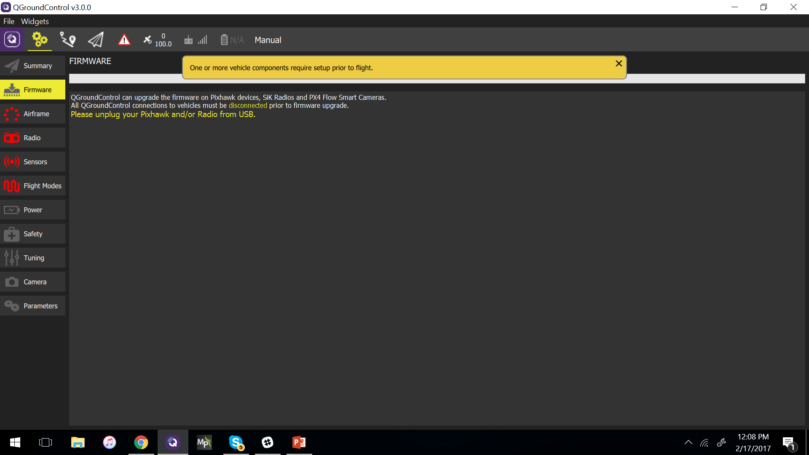
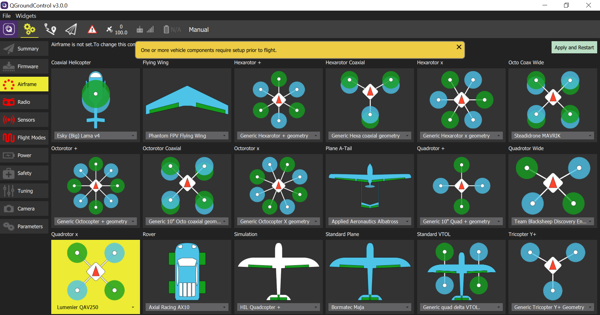
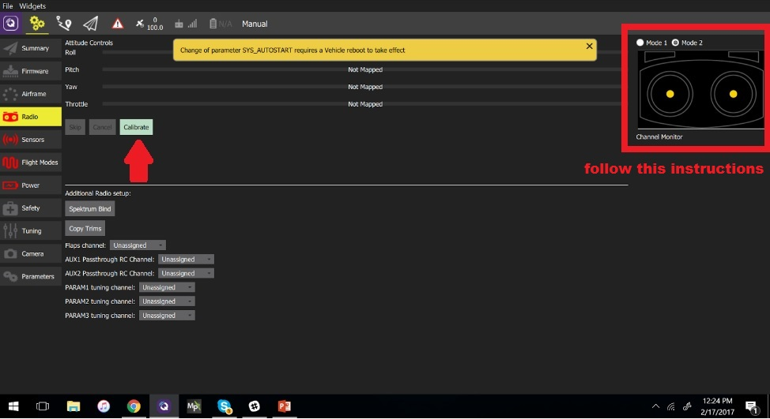
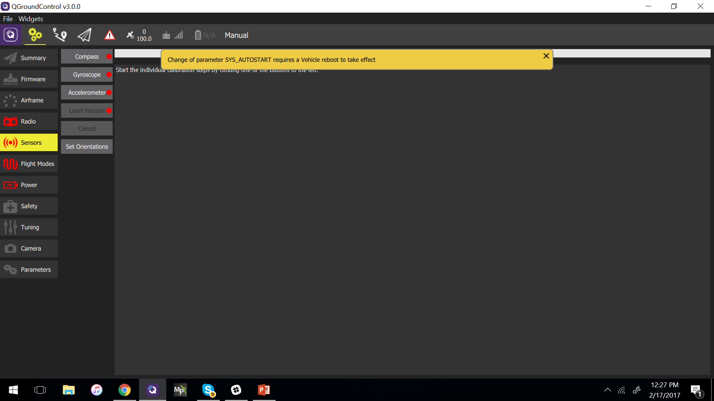
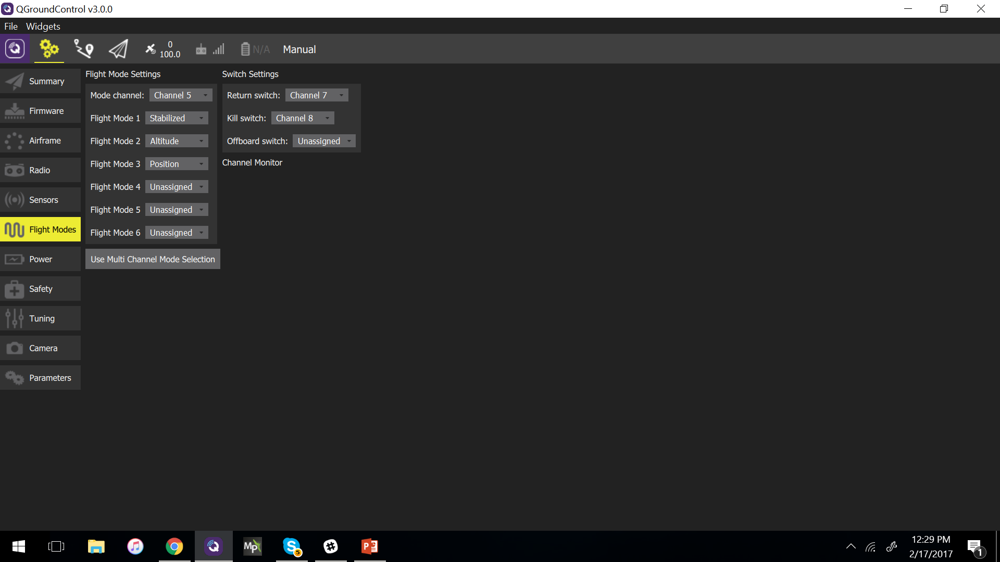
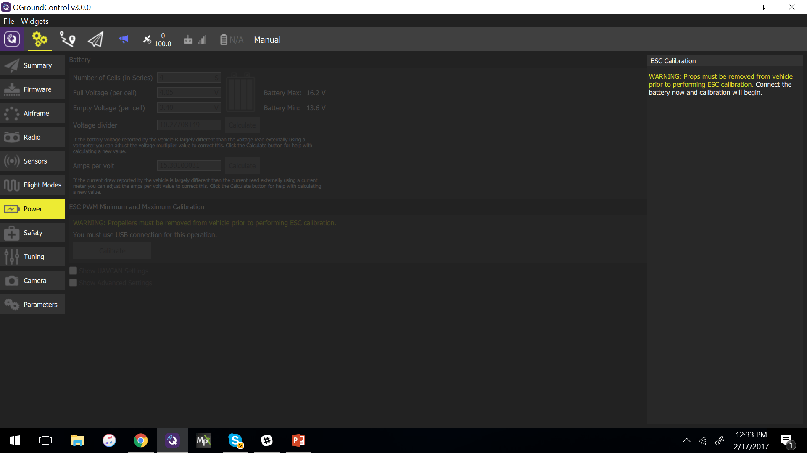
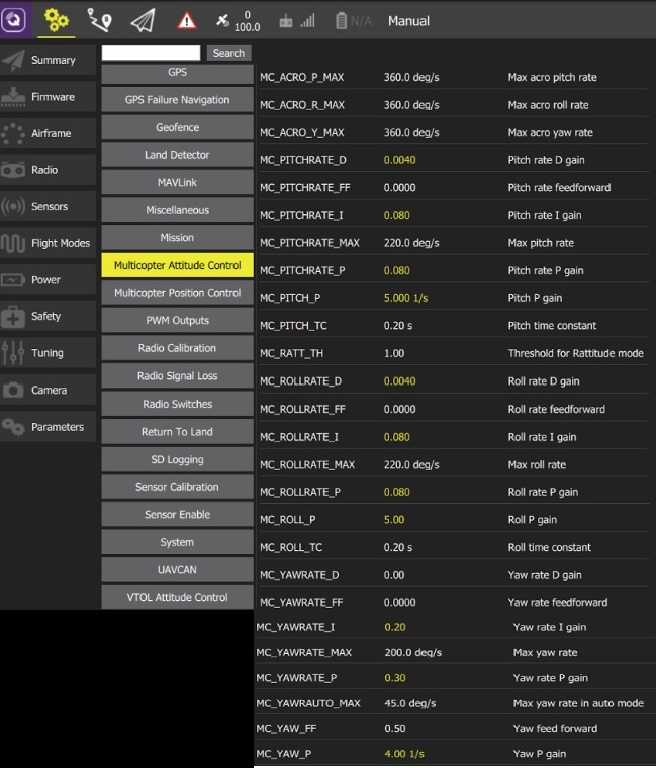

# Lumenier QAV250 Pixhawk Mini 조립

[Lumenier QAV250 Mini FPV Quadcopter](https://www.lumenier.com/products/legacy/qav250)는 작지만 완벽하게 작동하는 FPV 멀티 콥터 프레임입니다. *QGroundControl*을 사용하여 PX4 자동 조종 장치를 설치 및 구성하는 방법을 포함하여 * Pixhawk Mini* 비행 컨트롤러와 함께 프레임을 사용하기위한 전체 조립 방법 및 설정 방법을 설명합니다.

주요 정보

- **프레임:** Lumenier QAV250 CF
- **비행 컨트롤러:** Pixhawk Mini
- **예상 조립 시간:** 3.5시간 (프레임 조립에 2시간, 오토파일럿 설정에 1.5시간)

## 부품 명세서

이 조립에 사용된 부품들은 아래에 구매 링크와 함께 설명되어 있습니다. 일반적으로 제조업체에서 권장하는 비행 컨트롤러와 기체의 하드웨어를 사용하였습니다.

- **비행 컨트롤러:** [Holybro Pixhawk Mini](../flight_controller/pixhawk_mini.md)
- **전원 모듈 :** 3DR 10s 전원 모듈 (단종)
- **ESC :** Blheli가 포함 된 Lumenier f390 ([getfpv.com](http://www.getfpv.com/electronics/electronic-speed-controllers-esc/lumenier-f390-30a-blheli-esc-opto-2-4s.html)). 모터와 함께 제공됩니다.
- **모터:** Lumenier RX2204 -14 2300KV ([getfpv.com](http://www.getfpv.com/motors/lumenier-rx2204-14-2300kv.html))
- **프로펠러:** Lumenier 5x4.5 2 블레이드([getfpv.com](http://www.getfpv.com/propellers/lumenier-5x3-5-2-blade-propeller-set-of-4-black.html))
- **프레임:** Lumenier QAV250 - CF ([getfpv.com](http://www.getfpv.com/multi-rotor-frames/qav250-mini-fpv-quad/qav250-mini-fpv-quadcopter-carbon-fiber-edition.html))
- **수신기:** FR SKY D4R-II ([getfpv.com](http://www.getfpv.com/radios/receivers/frsky-d4r-ii-4ch-2-4ghz-accst-receiver-w-telemetry.html))
- **배터리:** Lumenier 4S 1300 mAh ([getfpv.com](http://www.getfpv.com/lumenier-1300mah-4s-60c-lipo-battery-xt60.html))

참고:

- *Pixhawk Mini*와 함께 제공되는 4S 전원 모듈은 위의 배터리 크기로 사용할 수 있습니다 (10S 전원 모듈 대신). 두 전원 모듈의 조립은 동일합니다.
- 또한 다음 ESC를 권장합니다 : Lumenier 12amp ESC w / SimonK AutoShot (2-4s N-FET) ([getfpv.com](http://www.getfpv.com/lumenier-12a-esc-w-simonk-autoshot-2-4s-n-fet.html)).

## 하드웨어

프레임과 자율비행프로그램 설치를 위한 하드웨어들 입니다.

### 프레임 QAV250

| 설명              | 수량 |
| --------------- | -- |
| 유니바디 프레임 플레이트   | 1  |
| 비행 컨트롤러 커버 플레이트 | 1  |
| PDB             | 1  |
| 카메라 플레이트        | 1  |
| 35mm 스탠드오프      | 6  |
| 25mm 스탠드오프      | 4  |
| 10mm 스탠드오프      | 4  |
| 비닐 캡            | 4  |
| 20mm 강철 나사      | 4  |
| 18mm 강철 나사      | 10 |
| 벨크로 배터리 혁지      | 1  |
| 배터리용 폼          | 1  |
| LED 스트립         | 2  |

### 전자부품

| 품목                             | 수량 |
| ------------------------------ | -- |
| 모터 lumenier Rx2204-14 2300KV   | 4  |
| ESC lumenier 30A               | 4  |
| 3DR 전원 모듈 10S                  | 1  |
| Fr-sky D4R-II 수신기              | 1  |
| 3DR Pixhawk Mini autopilot     | 1  |
| 3DR GPS Neo-M8N                | 1  |
| 8 PWM Servo 출력                 | 1  |
| 외부 안전 스위치                      | 1  |
| 마이크로 SD 카드                     | 1  |
| 배터리 lumenier 1300 mAh 4S 14.8V | 1  |

### 무선 텔레메트리(선택 사항)

선택사항으로, 무선텔레메트리를 사용하여 GCS (지상 관제소) 컴퓨터를 자동 조종 장치와 무선 연결할 수 있습니다. 이를 통하여 비행 중 데이터를 조회하고, 비행 중에 임무를 변경하고, 비행 중에 차량을 조정할 수 있습니다.

PX4/Pixhawk Mini는 다양한 무선 텔레메트리를 지원합니다. 이 조립에 사용되는 라디오(적극 권장) *3DR Telemetry Radio (915MHz)*입니다 (단종 됨).

:::note
무선 텔레메트리는 현지 규정을 적합한 적절한 주파수 대역을 사용하여야 합니다. 해당 지역에 적합한 버전을 선택하십시오 : 미국 - 915MHz, 유럽/호주 - 433MHz
:::

텔레메트리 키트에는 다음과 같은 항목들이 포함되어 있습니다.

- 2 개의 텔레메트리 수신기 (차량 및 GCS 용)
- Micro USB 케이블
- Android OTG 어댑터 케이블
- 양면 테이프

## 조립 도구

조립시에 필요한 공구들입니다.

- 2.0mm 육각 스크류드라이버
- 3mm 필립스 스크류드라이버
- 전선 커터
- 납땜 인두 및 땜납
- 정밀 트위저

## 오프-프레임 조립

이 섹션에서는 전자 장치의 배선 방법과 전자 장치없이 프레임 조립 방법을 설명합니다. 이 정보는 프레임내 스크린 샷이 명확하지 않은 경우 참고용으로 사용할 수 있습니다.

### 전자 장비 배선 / 연결 (오프 프레임)

아래의 이미지는 *Pixhawk Mini*의 *표준* 멀티 콥터 배선을 보여줍니다. *쿼드 전력 분배 보드*를 사용하여 ESC, Pixhawk 및 Pixhawk 전원 레일에 전원을 공급합니다 (보드에는 최대 4S의 배터리를 지원하는 통합 전원 모듈이 포함되어 있습니다).

:::note
이 QAV250 빌드의 경우 대신 별도의 10S 전원 모듈을 사용하여 ESC 및 Pixhawk에 전원을 공급하고 옵션 외부 스위치를 사용하지 않습니다. 그렇지 않은 경우에도 배선 방법은 유사합니다!
:::

### 프레임 조립

:::note
이 섹션에서는 복잡한 전자 장치를 제외한 프레임을 조립 방법을 설명합니다. 아래의 조립 문서에서 참조됩니다.
:::

프레임 조립 방법 :

**1 단계 :** 그림과 같이 PDB 용 10mm 스탠드오프와 20mm 강철 나사를 사용합니다.

**2 단계 :** 스탠드오프에 프레임을 위치시킵니다.

:::note
프레임 플레이트가 정확하게 장착되었는 지 확인하십시오. 아래 표시된 컷은 프레임 하단을 보여줍니다. 
:::

**3 단계 :** 나사에 35mm 스탠드오프를 끼 웁니다 (2.0mm 육각 드라이버가 필요함).

**4 단계 :** 카메라 플레이트를 부착하고 나머지 스탠드오프를 추가합니다.

**5 단계 :** 비행 컨트롤러 커버 플레이트를 스탠드오프에 놓고 나사로 고정합니다.

추가: 제조업체에서 제공하는 조립 방법은 여기에서 찾을 수 있습니다. [Lumenier QAV250 탄소 섬유 조립 매뉴얼 ](https://www.lumenier.com/products/legacy/build-manual-carbon-fiber).

## 전자 장치를 포함한 전체 조립

*Pixhawk Mini*, 모터 및 기타 전자 장치와 함께 QAV250의 전체 조립 방법을 설명합니다.

**1 단계 :** 모터 설치

빨간색 표시는 프레임의 전방을 표시합니다. 프레임에 순서대로 모터를 배치하고 프레임 하단을 통해 케이블을 통과 시키십시오.

**2 단계 :** 4 개의 ESC를 PDB에 납땜

빨간 색 케이블은 양극 패드에 납땜하고, 검은 색 케이블은 음극 패드에 납땜하여야 합니다 (아래는 단일 ESC에 대해 표시됨).

**3 단계 :** 전원 모듈을 PDB에 납땜

빨간 색 케이블은 양극 패드에 납땜하고, 검은 색 케이블은 음극 패드에 납땜하여야 합니다. 조립방법에 맞는 방식으로 납땜하십시오.

**4 단계 :** LED를 PDB에 납땜

빨간 색 케이블은 양극 패드에 연결하고, 검은 색 케이블에는 음극 패드에 연결하여야 합니다. 흰색 LED는 전면용이고 빨간색 LED는 후면용입니다.

**5 단계 :** 모터를 ESC에 납땜

아래 그림과 같이 모터 케이블을 ESC 패드에 납땜하십시오. 모터가 올바른 방향으로 회전하는지 확인하십시오. 모토 회전 방향을 변경하려면, ESC에서 케이블 A와 C의 위치를 바꿉니다.

:::note
케이블이 올바른 순서로 납땜되면 전기 테이프 또는 튜브로 패드를 덮으십시오. 
:::

**6 단계 :** 프레임에 PDB 연결

프레임 조립 섹션에 설명된 단계를 따르십시오.

**7 단계 :** 제공된 Phillips 나사를 사용하여 LED를 프레임에 부착합니다.

:::warning
탄소 섬유는 프레임의 용접과의 접촉을 피하기 위해 사용되는 전도성 실리콘입니다. 
:::

**8 단계 :** 그림과 같이 진동 감쇠 폼을 프레임에 부착합니다 (폼은 *Pixhawk Mini* 키트에 포함되어 있음).

폼은 Pixhawk 성능에 영향을 미칠 수 있는 진동을 줄여줍니다. 폼은 양면이 끈적끈적 합니다.

**9 단계 :** 댐핑 폼을 사용하여 *Pixhawk Mini*를 프레임에 부착합니다.

Pixhawk는 화살표가 프레임 전면을 향하도록 방향을 맞추어야야 합니다.

**10 단계 :** 전원 모듈을 연결합니다.

제공된 6 핀 케이블을 사용하여 전원 모듈과 *Pixhawk Mini*를 연결합니다 (그림 참조). *Pixhawk Mini* 키트의 전원 모듈을 사용하는 경우 동일한 방법으로 연결됩니다.

**11 단계 :** ESC를 PWM 출력에 연결

아래 그림과 같이 PWM 출력 케이블 *또는* PWM 보드를 사용하여 ESC를 *Pixhawk Mini*에 올바른 순서로 연결합니다(둘 다 *Pixhawk Mini*에 제공됨).

 

**12 단계 :** 수신기를 연결합니다.

*FRSky D4-R* 수신기 채널 1을 *Pixhawk Mini*의 **RCIN** 포트에 연결합니다 (그림 참조).

:::note
수신기에 대한 참고 사항 :

- *Pixhawk Mini* **RCIN** 포트는 PPM 입력(예 : 멀티 플렉스 채널)을 수용합니다. PWM 수신기 (각 채널에 대한 개별 케이블 포함)를 사용할 수 있지만, [이와 같은](http://www.getfpv.com/radios/radio-accessories/holybro-ppm-encoder-module.html) PPM 인코더를 통해 연결해야합니다.
- Spektrum 수신기를 사용할 수 있습니다. *Pixhawk Mini*의 **RCIN** 옆에있는 **SPKT/DSM** 입력에 연결됩니다.
- 자세한 내용은 [Pixhawk Mini 수신기 호환성](../flight_controller/pixhawk_mini.md#rc-radio)을 참조하십시오.
:::

**13 단계 :** GPS/콤파스 모듈 연결

아래와 같이 GPS/콤파스 모듈을 *Pixhawk Mini*의 **GPS & amp; I2C** 포트에 연결합니다.

**14 단계 :** GPS/콤파스 모듈 장착

비행 컨트롤러 커버 플레이트 (프레임 조립 지침 참조)를 부착 한 다음 화살표가있는 커버 플레이트에 GPS 모듈을 붙여 넣습니다 (키트에 포함 된 붙여 넣기).

**15 단계 :** 텔레메트리 연결 및 장착 (선택 사항)

그림과 같이 원격 측정 라디오를 *Pixhawk Mini* **TELEM** 포트에 연결합니다.

그런 다음 원격 측정 라디오 키트에 포함 된 양면 테이프를 사용하여 라디오를 장착합니다 (이 조립 경우에는 아래의 그림과 같이 PDB 아래에 무선장치를 장착하였습니다).

**16 단계 :** 팔에 착지 스탠드오프 부착

**17 단계 :** 배터리 폼과 벨크로 배터리 스트랩을 커버 플레이트에 부착합니다 (배터리 스트랩과 폼은 프레임 키트와 함께 제공됨).

이제 프레임의 조립이 완료되었습니다! 다음 단계에서는 PX4 자동조종 장치를 설치하고 구성할 수 있습니다.

## PX4 설치 및 구성

이 섹션에서는 [QGroundControl](http://qgroundcontrol.com/)을 사용하여 PX4 자동 조종 장치를 설치하고 QAV250 프레임에 맞게 구성/조정하는 방법을 설명합니다.

:::note
*QGroundControl*을 사용하여 자동조종 장치를 설치 및 구성하고 임무를 계획하고 기체를 원격으로 제어할 수 있습니다.
:::

*QGroundControl*을 [다운로드후에 설치](http://qgroundcontrol.com/downloads/) 하십시오.

### 펌웨어 업데이트

Lumenier QAV250 용으로 구성된 PX4 펌웨어로 *Pixhawk Mini*를 업데이트합니다.

**1 단계 :** *QGroundControl*의 사이드 바에서 **펌웨어**를 선택합니다. 기체를 USB 포트에 연결합니다.

**2 단계 :** 기체를 선택합니다 (**Quadrotor x > Lumenier QAV250**).

**적용 및 재시작**을 클릭하십시오.

:::note
추가 정보는 다음을 참조하십시오.

- [자동조종장치 설정](../config/README.md)
- [펌웨어 설정](../config/firmware.md)
:::

### 기체 보정/설정

기체의 보정/설정 방법은 대부분 모든 차량에서 유사합니다. 아래 지침을 따르거나, [Autopilot 구성](../config/README.md)을 참조할 수 있습니다.

**3 단계 :** 무선 조종기 보정

1. 리모콘을 켜십시오.
2. 왼쪽 사이드 바에서 **라디오**를 선택합니다.
3. 리모컨의 "모드"를 선택하십시오 (오른쪽 상단).
4. **보정** 버튼을 클릭하고 화면의 지시를 따릅니다.

**4 단계 :** 센서 보정

1. 왼쪽 사이드 바에서 **센서**를 선택합니다.
2. **나침반** 버튼을 선택한 다음 화면의 지시를 따릅니다.
3. **자이로스코프** 버튼을 선택한 다음 화면의 지시를 따릅니다.
4. **가속도계** 버튼을 선택한 다음 화면의 지시를 따릅니다.

**5 단계 :** 비행 모드를 선택합니다.

[비행 모드](../flight_modes/README.md)는 수동 조종 보조 기능 또는 완전 자율 비행 기능을 제공합니다. 신규 사용자는 다음 세 가지 모드를 지원하도록 수신기를 구성하여야 합니다 (이로 인해 차량을 훨씬 쉽게 비행 할 수 있음).

- *안정화 모드*-차량을 뒤집기 어렵고 스틱을 놓으면 수평이됩니다 (정지 위치가 아님).
- *고도* - 상승 및 하강이 최대 속도로 제어됩니다.
- *위치* - 스틱을 놓으면 차량이 정지합니다. (그리고 바람 드리프트에 대한 위치 유지).

[비행 모드를 구성](../config/flight_mode.md)하는 방법에는 여러 가지가 있습니다. 이 경우 단일 채널 (5)에 매핑하는 수신기에 3 방향 스위치가 있습니다.

더 자세한 정보는 다음을 참고하세요.

- [비행 모드 설정](../config/flight_mode.md)
- [비행 모드](../flight_modes/README.md)
- [비행 모드](https://docs.qgroundcontrol.com/master/en/SetupView/FlightModes.html) (QGroundControl)

**6 단계 :** ESC 보정

1. 프로펠러 제거.
    
:::warning ESC
보정을 수행하기 전에 프로펠러를 기체에서 제거하여야 합니다!
:::

2. 왼쪽 사이드 바에서 **전원**을 선택합니다.

3. **보정** 버튼을 선택한 다음 화면의 지침을 따릅니다. 배터리를 연결합니다. 신호음이 멈추면 확인을 누르고 배터리를 분리합니다.
    
    
    
    

### 튜닝

펌웨어 설치는 선택한 프레임 (이 경우 *Lumenier QAV250*의 경우)에 대해 구성된 *기본* 자동조종장치 매개 변수를 설정합니다. 조립 방법에 따라 다른 부품들을 사용하고 다르게 배치 할 수 있으므로, 특정 기체 조립에 관련된 매개 변수를 조정하는 것이 좋습니다.

아래 매개 변수는 이 조립법에 권장됩니다 (노란색 매개 변수는 변경된 매개 변수입니다). 비행 테스트를 통해 생성되었습니다.

튜닝 정보는 [멀티 콥터 PID 튜닝 가이드](../config_mc/pid_tuning_guide_multicopter.md)를 참조하십시오.

## 비디오

아래 비디오는 QAV250 테스트 비행을 보여줍니다.

@[유투브](https://youtu.be/MZzo4DMNkug)

## 감사의 글

이 조립 방법은 *Abimael Suarez, 3DRobotics*에서 제공하였습니다. 비디오는 *Santiago Escala*, *3DRobotics*에서 제공하였습니다.

<!-- Open Questions/ACTIONS - Need to update with cross links to other PX4 docs. At moment many of these do not exist: Pixhawk wiring overviews, receivers, gps etc, flight modes. -Tidy up some of the diagrams do remove unnecessary complication (e.g. remove OS footer from QGroundControl screens) -->