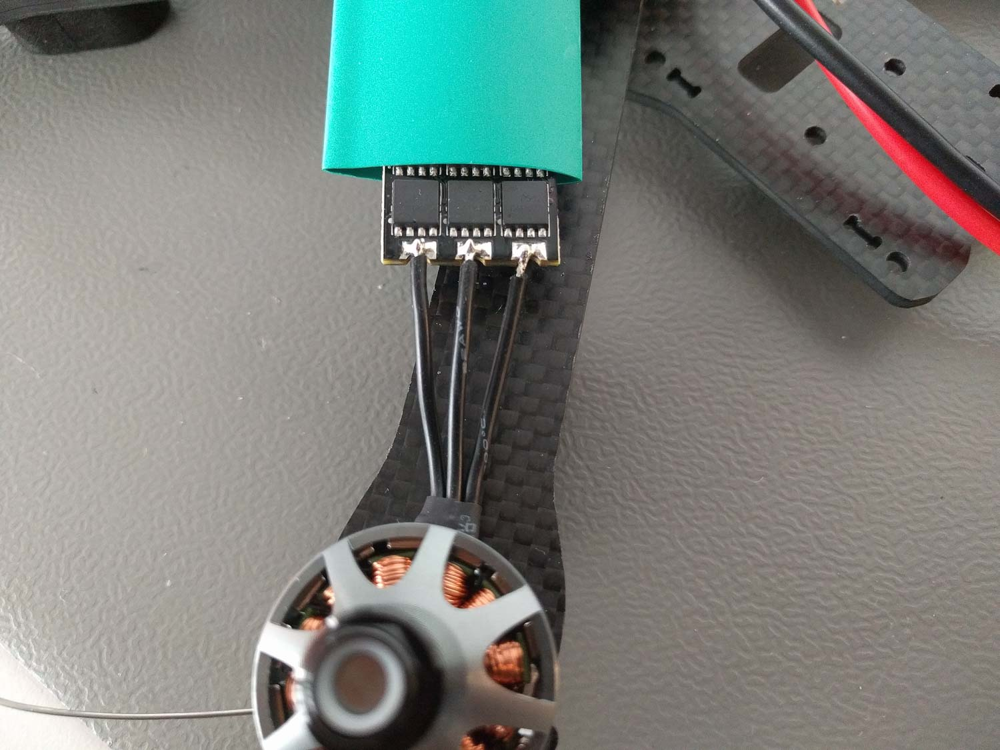
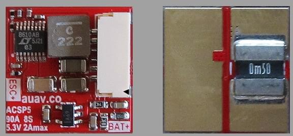
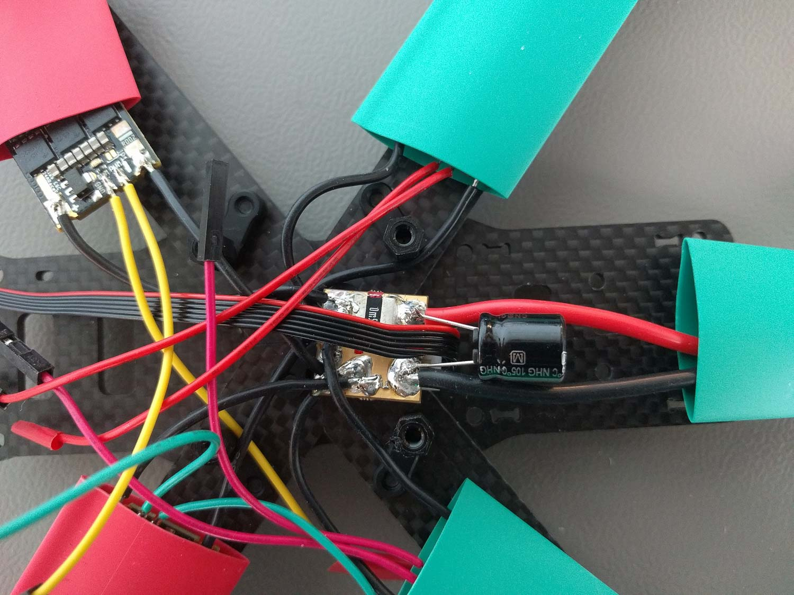
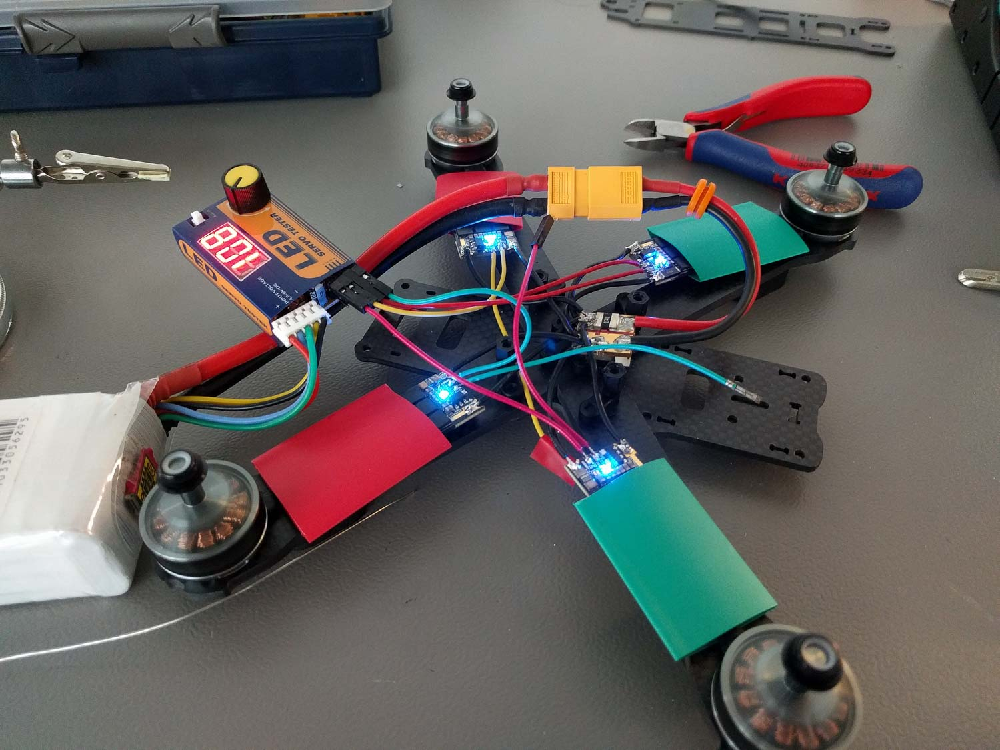
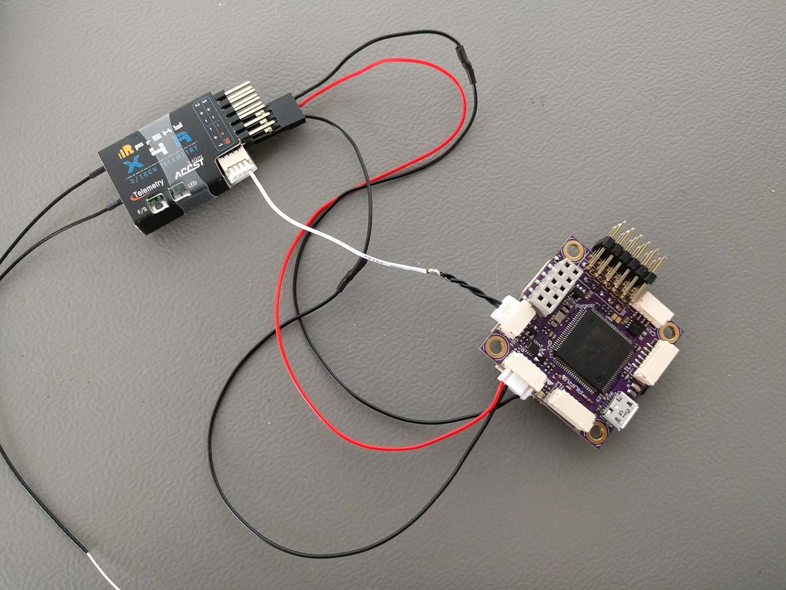
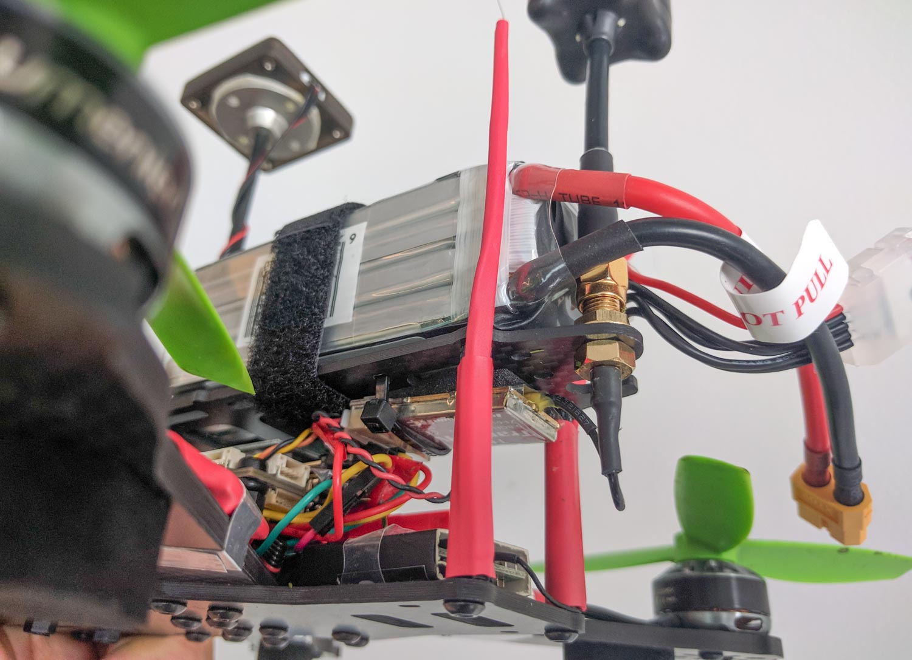

# QAV-R 5" KISS ESC Racer (Pixracer)

Lumenier QAV-R 5 "FPV Racing Quadcopter는 탈착식 암이 있는 견고하고 가벼우면서도 빠른 FPV 레이서입니다. *Pixracer* 비행 컨트롤러, *KISS 24A Race Edition* ESC와 기체를 이용한 조립 방법 및 설정 방법을 설명합니다. 또한 선택항목인 FPV 설정에 대한 정보를 제공합니다.

주요 정보:

- **기체:** Lumenier QAV-R 5"
- **비행 컨트롤러:** [Pixracer](../flight_controller/pixracer.md)

@[유투브](https://youtu.be/wMYgqvsNEwQ)

 

## 부품 목록

### 기체(비행에 필요)
* Autopilot : ESP8266 WiFi 및 [ACSP5](https://store.mrobotics.io/product-p/auav-acsp5-mr.htm) 전원 모듈을 포함한 [AUAV](https://store.mrobotics.io/mRo-PixRacer-R14-Official-p/auav-pxrcr-r14-mr.htm)의 [ Pixracer](../flight_controller/pixracer.md)
* [기체:](http://www.getfpv.com/qav-r-fpv-racing-quadcopter-5.html) Lumenier QAV-R 5"
* 모터: [Lumenier RX2206 -11 2350KV](http://www.getfpv.com/lumenier-rx2206-11-2350kv-motor.html)
* ESCs:  [KISS 24A Race Edition](http://www.getfpv.com/kiss-24a-esc-race-edition-32bit-brushless-motor-ctrl.html)
* 프로펠러: HQProp 5x4.5x3 [시계 방향](http://www.getfpv.com/hqprop-5x4-5x3rg-cw-propeller-3-blade-2-pack-green-nylon-glass-fiber.html) [반시계 방향](http://www.getfpv.com/hqprop-5x4-5x3g-ccw-propeller-3-blade-2-pack-green-nylon-glass-fiber.html)
* GPS / (외장) Mag .: [Pixhawk Mini (판매 중단)](../flight_controller/pixhawk_mini.md) 세트에서 가져온 M8N 및 재배선
* 배터리: [TATTU 1800mAh 4s 75c Lipo](http://www.getfpv.com/tattu-1800mah-4s-75c-lipo-battery.html)
* 무선 수신기: [FrSky X4R-SB](http://www.getfpv.com/frsky-x4r-sb-3-16-channel-receiver-w-sbus.html)
* 무선 송신기: [FrSky Taranis](http://www.getfpv.com/frsky-taranis-x9d-plus-2-4ghz-accst-radio-w-soft-case-mode-2.html)
* FC 감쇠 : [O-링](http://www.getfpv.com/multipurpose-o-ring-set-of-8.html)
* GPS 장착: [GPS mast](http://www.getfpv.com/folding-aluminum-gps-mast-for-dji.html)

### FPV(선택 사항)

* Camera: [RunCam Swift RR Edition](https://www.getfpv.com/runcam-swift-rotor-riot-special-edition-ir-block-black.html) **includes must-have high quality wide angle lens from GoPro!**
* Video Tx: [ImmersionRC Tramp HV 5.8GHz 600mW](https://www.getfpv.com/immersionrc-tramp-hv-5-8ghz-video-tx-us-version.html) (Discontinued).
* Video 안테나: [TBS Triumph 5.8GHz CP](http://www.getfpv.com/fpv/antennas/tbs-triumph-5-8ghz-cp-fpv-antenna-3275.html) (SMA port fits ImmercionRC Tx)
* FPV 전압 소스 플러그: [Male JST Battery Pigtail](http://www.getfpv.com/male-jst-battery-pigtail-10cm-10pcs-bag.html)

:::note
이 부분은 표준 FPV 5.8GHz 아날로그 FM 비디오 송신을 담당합니다. 라이브 비디오 스트림을 사용하려면 호환 수신기 및 디스플레이가 필요합니다.
:::

## 기본 프레임 조립

09:25에서 13:26 사이에이 비디오처럼 기본 센터 플레이트와 암을 조립했습니다.

  <iframe width="560" height="315" src="https://www.youtube.com/embed/7SIpJccXZjM?start=565&end=806" frameborder="0" allowfullscreen></iframe>

네 개의 모터를 프레임 중앙을 향해 나오는 케이블과 함께 프레임에 장착했습니다. 각 모터에 프레임과 함께 제공되는 두 개의 긴 모터 나사를 사용하여 멀리 떨어져있는 두 개의 구멍에 삽입하였습니다.

## 동력 전달 장치 조립

KISS ESC는 성능이 우수하지만, 두 가지의 단점도 있습니다.
- BLHeli와 달리 사용하는 소프트웨어는 오픈 소스가 아닙니다
- 미리 납땜된 전선 또는 플러그가 있는 하드웨어가 없습니다.

즉, 모든 ESC에 최소 6 개의 조인트를 납땜해야 하지만 그만한 가치는 충분합니다.

:::tip
실제로 납땜하기 전에 항상 납땜으로 연결하려는 양면에 주석을 추가하십시오.
이렇게하면 훨씬 편리하게 납땜 할 수 있고, 콜드 솔더링 조인트가 생길 가능성이 줄어 듭니다.
:::

:::tip
배터리에서 모터까지 고전류를 전달하는 전원 연결에 적절한 케이블 게이지를 사용하는지 확인하십시오.
모든 신호 케이블은 타 케이블에 비하여 매우 얇을 수 있습니다.
:::

:::tip
납땜을 시작하기 전에 케이블에 열 수축을 가하십시오!
성공적인 기능 테스트 후 ESC, 전원 모듈 및 자유 부동 비 절연 와이어 솔더링 조인트를 열수축을 하면 먼지, 습기 및 물리적 손상으로부터 보호됩니다.
:::

### 모터
먼저 ESC가 중앙으로 이동 한 암에 장착 될 때 세 개의 모터 케이블을 모두 직접 절단했지만 ,부품을 쉽게 배치하고 케이블에 장력을 발생시키지 않도록 충분한 여유를 둡니다. 그런 다음 모터에서 나오는 순서대로 스위칭 MOS-FET가 위로 향한 ESC의 출력 접점에 납땜하여 비행 중에 공냉 기능이 좋아집니다. 이 케이블 순서를 선택하면 테스트에서 모든 모터가 시계 반대 방향으로 회전했습니다. 필요한 경우 [Quadrotor x 구성](../airframes/airframe_reference.md#quadrotor-x)을 따르도록 전용 [JP1 솔더 점퍼](https://1.bp.blogspot.com/-JZoWC1LjLis/VtMP6XdU9AI/AAAAAAAAAiU/4dygNp0hpwc/s640/KISS-ESC-2-5S-24A-race-edition-32bit-brushless-motor-ctrl.jpg)를 브리징하여 회전 방향을 전환합니다.

### 전원 모듈
먼저 프레임과 함께 제공되는 XT60 커넥터를 Pixracer와 함께 배송 된 *ACSP5 전원 모듈*의 레이블이있는 배터리쪽에 납땜하였습니다. 전원 모듈과 함께 제공되는 elco 커패시터를 동일한쪽에 올바른 극성으로 추가하였습니다.

이제 까다로운 부분이 있습니다. 4 개의 ESC 전압 소스 + 및 - 포트를 전원 모듈의 표시된 ESC 출력 측에있는 해당 패드에 모두 납땜하였습니다. 쿼드콥터가 비행 중에 느슨한 연결이 있으면 안 되기 때문에 여기에 콜드 솔더 조인트가 없는 지 확인하십시오. 프레임의 추가 배전 보드를 사용하면 작업이 훨씬 쉬워 지지만 작은 프레임에서 너무 많은 공간을 차지합니다.

:::tip FPV
부품도 포함하는 경우 JST 수 전원 플러그를 전원 모듈의 출력쪽에 납땜하는 것을 잊지 마십시오. 나중에 [FPV 설정](#fpv-setup)에 필요합니다.
:::

### 신호 케이블

나중에 Pixracer 핀에 쉽게 연결할 수 있기 때문에, ESC 신호에 맞게끔 절반으로 잘린 표준화된 핀 헤더 커넥터가있는 얇은 케이블을 사용했습니다. [KISS ESC](https://1.bp.blogspot.com/-0huvLXoOygM/VtMNAOGkE5I/AAAAAAAAAiA/eNNuuySFeRY/s640/KISS-ESC-2-5S-24A-race-edition-32bit-brushless-motor-ctrl.jpg)에 표시된 `PWM` 포트만 비행에 필요합니다. pixracer의 모터 신호 출력에 연결됩니다. `TLM` 포트는 ESC 원격 측정용이며, 프로토콜이 현재 PX4에서 지원되지 않으므로 향후에 사용하기 위해서 납땜하였습니다.

계속 진행하기 전에 저렴한 PWM 서보 테스터를 사용하여, 모든 ESC 모터쌍의 회전 방향을 테스트하였습니다.

## 전자 부품 조립

:::tip
연결하는 모든 구성 요소의 핀 할당을 다시 확인하십시오.
모든 하드웨어 구성 요소가 눈에 보이는 것과는 달리, 플러그 앤 플레이가 가능하지 않습니다.
:::

이 단계에서 필요한 모든 커넥터를 찾으려면 [Pixracer의 하드웨어 문서](../flight_controller/pixracer.md)가 필요합니다. 나는 Pixracer 보드 아래의 모든 케이블을 깔끔하게 정리하여, 향후 FPV 카메라와 송신기를위한 공간을 확보하고자 하였습니다.

QAV-R 프레임과 함께 제공되는 나일론 스페이서와 나사를 사용하여 Pixracer를 장착했지만 약간의 진동 방지를 목적으로 보드와 스페이서 사이에 **작은 O-링 **을 넣었습니다. **나사를 너무 많이 또는 조금 조이지 않도록**, 보드가 양쪽면에 명확하게 닿지만 팽팽하게 조이지 않도록 하십시오. 보드는 어떤 식으로든 매달리지 있지 않아야 하며, 손가락으로 힘을 가하면 약간 움직일 수 있어야합니다.

:::warning
이는 비행 중에 자이로스코프 및 가속도계 센서가 진동에 큰 영향을 미칠 수 있습니다.
:::

 

### 무선 수신기

Pixracer와 함께 제공된 케이블을 사용하여 FrSky S-BUS 수신기를 연결하고, 불필요한 케이블들을제거하였습니다.

스마트 원격 측정 포트에는 수신기와 함께 제공되는 케이블을 사용하였습니다. 핀셋을 사용하여 커넥터에서 불필요한 핀을 모두 제거하고, "스마트"신호가 연결되도록 흰색의 느슨한 끝 케이블을 커넥터의 올바른 핀으로 전환하였습니다. 그런 다음 이 회로도에 따라 FrSky 포트에 맞는 케이블에 느슨한 끝을 납땜하였습니다.

전압 공급 포지티브 핀처럼 이미 RCin S-BUS 케이블을 통해 연결되어 있기 때문에, 접지 (GND) 핀도 생략하였습니다.

### 무선 조종기 안테나 장착

프로펠러에 안테나가 닿지 않도록, 열 수축 및 지퍼 타이를 사용하는 견고한 마운트 방법을 사용하여 RC 링크를 조립하였습니다.

이 방법에서는 지퍼 타이의 구멍으로 큰 끝을 자르고, 나머지는 긴 열 수축을 통해 안테나 케이블과 함께 놓고 더 크고 더 짧은 열 수축을 사용하여 프레임스페이서에 장착합니다.

### ESC 신호

ESC 신호의 경우 [Pixracer의 하드웨어 문서](../flight_controller/pixracer.md)와 [Quadrotor x 구성](../airframes/airframe_reference.md#quadrotor-x) 모터 번호 지정 방법을 따라 조립하였습니다. 접지 또는 양극 BEC 전압 연결이 없기 때문에 `PWM` ESC 신호 케이블을 해당 출력 커넥터의 맨 위의 핀에 각각 연결합니다.

### GPS / 외부 자력계

사용한 GPS의 커넥터에 맞는 GPS 케이블을 가져와 Pixracer 세트와 함께 조립하였습니다. 안타깝게도 핀 할당이 완전히 잘못되어 [3DR Pixhawk Mini 사용자 설명서](../flight_controller/pixhawk_mini.md#connector-pin-assignments-pin-outs) GPS 포트에 따라 핀셋을 사용하여 커넥터를 다시 배선하였습니다.

#### Pixracer GPS/I2C 포트
| 핀 | 할당  |
| - | --- |
| 1 | GND |
| 2 | SDA |
| 3 | SCL |
| 4 | RX  |
| 5 | TX  |
| 6 | +5V |

#### M8N 3DR Pixhawk mini GPS 커넥터
| 핀      | 할당     | Pixracer 연결 핀 |
| ------ | ------ | ------------- |
| 1(red) | SCL    | 3             |
| 2      | SDA    | 2             |
| 3      | VCC 5V | 6             |
| 4      | RX     | 5             |
| 5      | TX     | 4             |
| 6      | GND    | 1             |

본체에 더 가까이 장착하면 자력계 판독 값을 완전히 사용할 수 없기 때문에, 나열된 일반 멀티 콥터 GPS 마스트를 사용하여 GPS 모듈을 장착했습니다. 모듈을 프레임 상단의 맨 뒤쪽에 직접 장착한 실험에서는 ESC 전류의 자기장으로 인해 발생할 가능성이 가장 높은 6 배의 자력계 크기 노이즈가 나타났습니다. 케이블 길이와 프레임 치수에 더 잘 맞도록 마스트를 ~ 2cm 줄였습니다. GPS 모듈은 마스트의 상단 플레이트에 양면 테이프로 접착됩니다.

## FPV 설정

선택사항인 5.8GHz FPV 라이브 비디오 전송 방법에 관한 지침입니다. 처음에 언급한 추가 FPV 부품이 필요합니다. 여기에 설명 된 FPV 전송은 비행 컨트롤러와 전자적으로 독립적으로 작동하며, 전원 모듈과 같이 배터리 전압만을 사용합니다.

먼저 모든 것이 올바르게 작동하는지 확인하기 위해 벤치 테스트를 수행하였습니다. 송신기와 함께 제공되는 비디오 신호 케이블을 FPV 카메라 뒷면과 송신기의 일치하는 플러그에 연결하십시오. 나사를 조인 다음 JST 전원 플러그를 초안 차량이나 다른 전압 소스에 연결하십시오. 송신기 LED가 켜져야 합니다. 같은 채널에 맞춰진 5.8GHz 수신 장치를 사용하여 비디오를 확인하십시오. 송신기를 다른 채널로 구성하고 전송 전력을 조정하려면, [Tramp HV 사용 설명서](https://www.immersionrc.com/?download=5016)를 참조하십시오.

지퍼를 사용하여 내부에서 프레임의 "지붕"까지 송신기를 장착하였습니다. 이와 같은 전자 장치를 장착 할 때 비행 중 물리적 손상을 방지하기 위하여, 접착 폼 조각을 사이에 끼워두는 것이 좋습니다. 안테나 커넥터가 프레임의 전용 구멍에 맞도록 송신기를 배치하십시오.

부품 목록에있는 웅장한 FPV 카메라 세트는 지금까지 본 최고의 FPV 렌즈와 함께 제공 될뿐만 아니라, 여러 카메라 마운트가 포함되어 있으며 그중 하나는 카메라 각도를 조정하는 데 매우 유연하고 QAV-R 프레임에 잘 맞습니다. 다음의 그림과 같이 장착하였습니다. 카메라 마운트를 프레임에 고정하기 위하여 두 개의 나사와 너트는 프레임 세트에 남아있는 예비 나사에서 가져왔습니다.

## 소프트웨어 설정

:::warning
초기 설정시에는 배터리와 프로펠러를 기체에서 반드시 제거하십시오.
사고의 위험성이 있는 것은 초기에 확실하게 제거하는 것이 좋습니다.
:::

일반적인 설정 방법은 [기본 설정](../config/README.md)을 참조하십시오.

이 조립 방법에서는 "FMU as task"개선 (PX4 v1.7 이후 기본적으로 포함 및 활성화 됨)을 지원하기 때문에 최신 PX4 마스터를 가져와 Pixracer에 플래시하였습니다. [QGC](http://qgroundcontrol.com/) 일일 빌드를 사용하여 다음을 설정하였습니다.
- [Generic 250 Racer 구성](../airframes/airframe_reference.md#copter_quadrotor_x_generic_250_racer) 기체 선택
- 센서 보정
- 충전된 셀 전압 4.15V 및 빈 셀 전압 3.5V로 배터리를 4S(4 셀 LiPo)로 설정합니다.
- Calibrate the voltage divider through typing in the current accurate voltmeter measurement
- 2 개의 추가 스위치 입력에 대해 이미 설정된 Taranis를 사용하여 RC 채널을 보정합니다. 모드 스위치용 Taranis 전면 플레이트의 오른쪽 상단 모서리에있는 하나의 스위치와 암 스위치로 사용되는 전면 플레이트의 왼쪽 상단 모서리에있는 다른 스위치.
- 시동 스위치를 설정할 수 있습니다.

### 튜닝

다음은 모든 기본 지침이 포함된 일반 [튜닝 가이드](../config_mc/pid_tuning_guide_multicopter.md)입니다.

### 조립 예제

[FPV 아크로 비행 로그(최대 값 : 108km/h 속도, 85A 총 전류 소모량)](https://logs.px4.io/plot_app?log=9c311942-bc7c-4b0c-8be8-eeb64fa8192c)

[전체 배터리에 대해 (대부분) 수동 LOS 비행에 관한 로그입니다.](https://logs.px4.io/plot_app?log=6de8b8cd-74f9-4eae-ad2f-76867e916f4f)
