# Robocat 270

Robocat 270은 경주용이 아닌 순항용으로 설계된 소형 쿼드 콥터로 [Pixracer](../flight_controller/pixracer.md) 자동조종장치를위한 최적의 시험용 제품입니다. 일반적인 250 레이서보다 무겁지만, 추가 기능과 최대 3S/2200mAh의 더 큰 배터리를 위한 많은 공간을 제공합니다. 초보자를위한 견고한 소형 쿼드 콥터로, 노년층 전문가에게도 적당합니다. 매우 쉽습니다 : Robocat, PX4 소프트웨어가 포함된 Pixracer 및 QGroundControl Groundstation : 조립, 보정 및 비행!

## 조립 및 배선

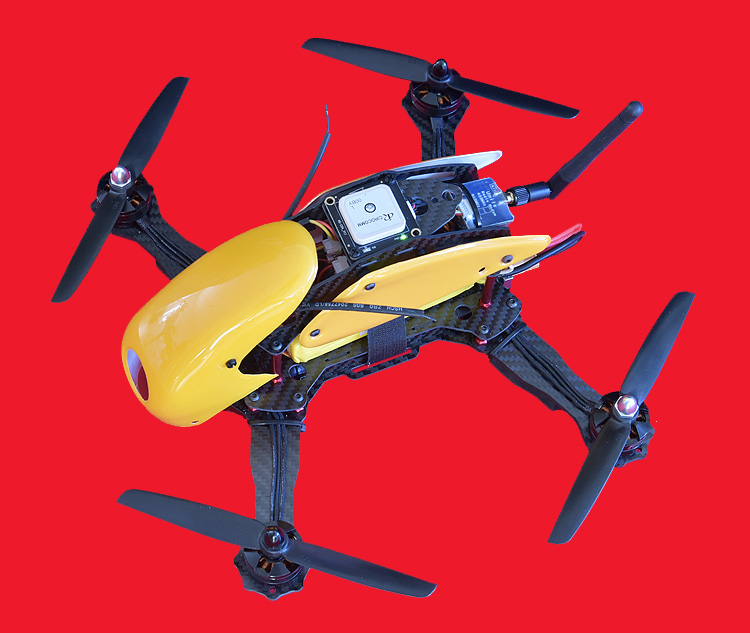

Robocat 270 프레임 키트는 여러 소스에서 사용할 수 있습니다. 두 가지 버전 : 유리 섬유 또는 탄소. 후자는 유리 섬유 버전과 함께 제공되는 깨지기 쉬운 플라스틱 대신 다양한 알루미늄 스탠드오프와 함께 제공됩니다.

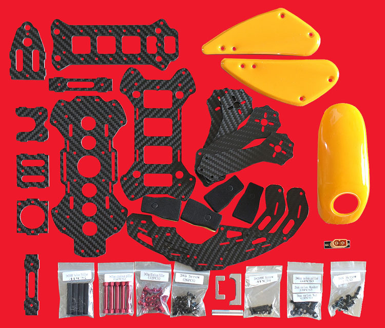

표시된 키트에는 EMAX MT2204 모터, EMAX 12A ESC, SimonK 및 6045 카본 프로펠러가 사전에 플래시됩니다. 이것은 최고 품질보다는 저렴하지만 가격을 고려할 때 꽤 괜찮습니다. 예산이 충분합 숙련된 조종사는 Tiger Motors 및 더 빠른 ESC를 사용합니다. 더불어, CAN 버전도 Pixracer/PX4 스택과 함께 사용할 수 있습니다. 이러한 CAN 기반 FOC/벡터 제어 ESC는 많은 효율성과 신뢰성에서 얻을 수 있습니다.

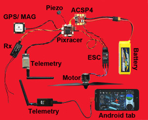

첫 번째 단계는 테스트를 위해 모든 부품을 프레임에 장착하기 전에 조립하는 것입니다. 배선 세부 사항은 [Pixracer 지침](../flight_controller/pixracer.md) 가이드에 나와 있습니다.

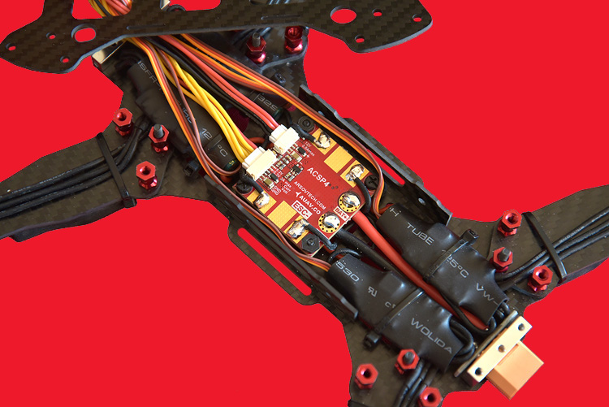

그 후, 36x36mm AUAV ACSP4 전원 모듈/PDB와 ESC가 잘 맞는 바닥 부분을 조립합니다. 히트 싱크가 없는 ESC를 사용하는 경우에는 공기가 잘 통하는 암 상단에 설치하는 것이 좋습니다.

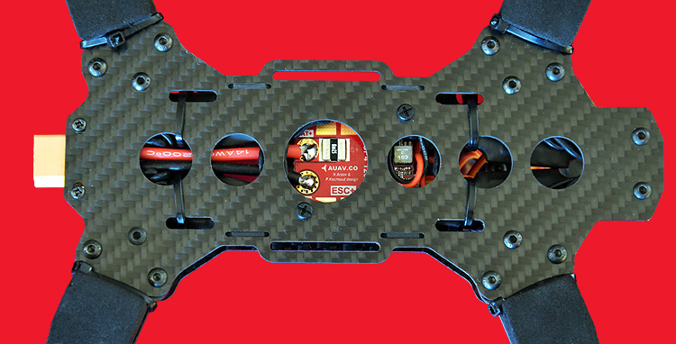

전류 감지를 위해 션트 저항과 함께 ACSP4를 설치하는 것이 좋습니다. 뜨거워 질 수 있으므로 전선이 닿지 않도록 해야합니다. 전도성 탄소가 단락을 일으킬 수 있으므로, 모든 와이어 절연체가 손상되지 않도록 주의하는 것이 매우 중요합니다. 12V 소스/PDB가 필요하지 않은 경우 I/U 감지 및 5V BEC를 제공하는 더 작은 (17x17mm) 새 ACSP5 전원 모듈도 사용할 수 있습니다.

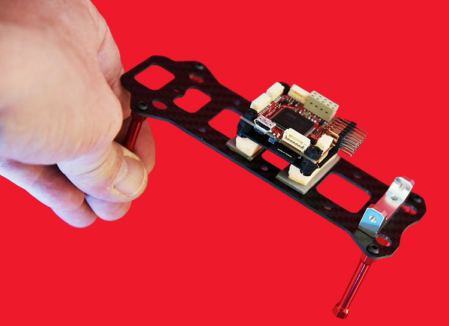

Pixracer는 배터리 칸 위 1 층에 부드럽게 장착합니다. 이것은 공간 낭비처럼 보이지만, 밀접하게 연결된 와이어는 진동 방지에 적절하지 않기 때문에 배선 간격을 위해 약 20mm의 공간이 필요합니다.

Excursus : Althold 및 GPS 모드를 사용하는 모든 고급 비행 스택 및 조종사는 효과적인 댐핑이 필요합니다. 주변에 여전히 *하드 마운터*가 있지만, 대부분의 빌드/컨트롤러/플라이트 스택은 진동의 영향을 받아 Aliasing/Clipping의 핵심 문제로 이어집니다.

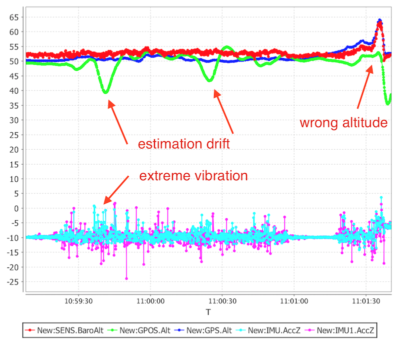

PX4 스택은 이러한 영향도 로깅하므로 분석하기 쉽습니다. 예제 플롯은 진동으로 인한 드롭 아웃 피크가 센서 값 위아래로 상승하는 대신 한 방향으로 가고 있음을 보여줍니다. 이것은 신호의 중심을 이동시켜 비행 컨트롤러가 높이를 올리거나 내리는 것을 잘못 "말"하는 것입니다. 최신 EKF 필터 알고리즘이이를 특정 양으로 처리하도록 설계되었지만, 표시된 소프트 마운트로 인해 이와 같은 영향을 방지하는 것이 좋습니다.

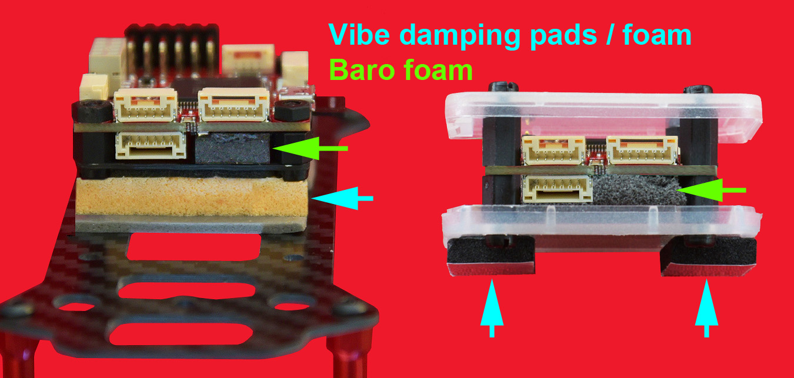

이것은 3DR 폼 패드 또는 HK 오렌지 라텍스에서 제공됩니다. 후자는 자체 접착이 아니지만 3M 5925F와 같은 양면 테이프를 사용하는 것이 좋습니다. Pixracer에 하우징을 사용하지 않는 경우 패드가 36x36mm 섬유 또는 탄소 보드 아래에 달라 붙어 baro 센서 상단의 필수 폼을 압착합니다. 이 폼은 모든 빛과 대부분의 기류가 센서에 미치는 영향을 줄여줍니다.

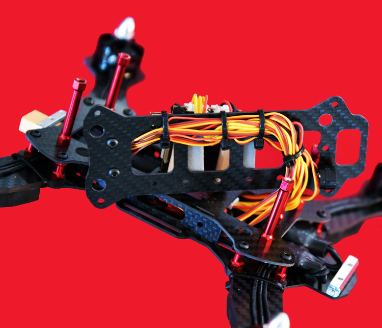

배터리 배치 중 손상이나 재배치를 방지하기 위해 Pixracer 아래에 케이블을 고정하는 것이 좋습니다. 모터 와이어의 지퍼 타이를 사용하는 것도 고려하는 것이 좋습니다. 한쪽 암이 부러지면, 손실이 더 커지게 됩니다. 필요한 X Quad 구성의 경우 아래 표시된 레이아웃에 따라 4 개의 모터를 연결하므로 MAIN1 커넥터는 모터 1의 ESC에 연결되어야 합니다.

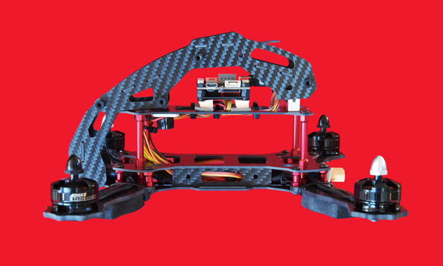

측면보기는 배터리 및 FPV Cam/Tx, RC Rx, OSD 및 3DR 라디오등을 추가할 수 있는 충분한 공간이 있습니다.(Pixracer와 함께 제공되는 ESP 8266 Wifi 보드를 사용하지 않는 경우). Piezo 스피커는 전면 스탠드 근처에 햇볕이 잘 드는 곳에 장착합니다. Pixracer 키트와 함께 제공되는 안전 스위치는 필요하지 않습니다. PX4 스택은 안전 위치를 사용하지 않습니다.

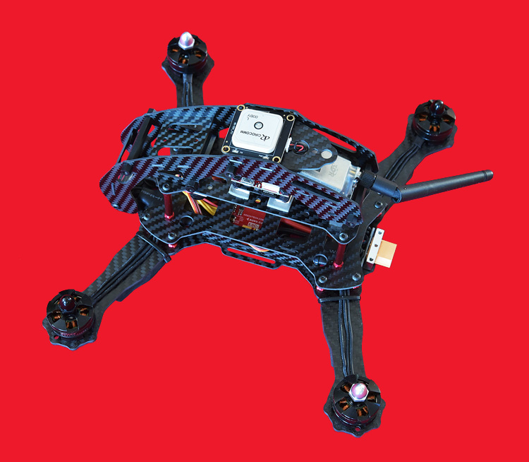

PX4 스택이있는 Pixracer는 Auto Missions, Loiter, Position Control 및 Return to Land와 같은 여러 GPS 종속 비행 모드를 제공합니다. GPS가 후자에만 사용되는 것이 아니라면 동시 GPS/GLONASS 기능이있는 더 나은 GNSS 장치 중 하나를 설치하는 것이 좋습니다. 35x35mm 보드에 u-blox M8N이있는 모든 유형은 2 층에 맞으며 마스트 대체물 역할을 합니다. 비행 컨트롤러의 내부 MAG는 항상 EMI 영향을 미치고 관련 오프셋을 구축하기 때문에 MAG 센서가 내장 된 GNSS 보드를 사용하는 것이 좋습니다. 이로 인해 TBE(변기) 효과가 발생하여 GPS 모드에 영향을 미칠 수 있습니다. 좋은 녹음. Pixhawk는 Pixracer에서도 작동합니다.

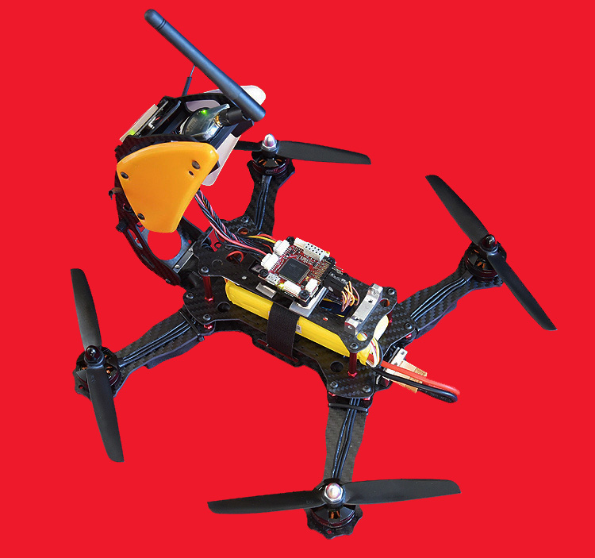

Robocat 프레임의 접이식 상단 부분은 Pixracer 및 기타 외부 구성 요소에 쉽게 접근할 수 있도록 합니다. Pixracer 키트와 함께 제공되는 배선의 길이는 넉넉합니다. 다른 경우에는 JST-GH 커넥터로 새 것을 압착하는 것보다 더 쉽게 늘려야 할 수도 있습니다.

:::note AUAV.CO는 여러 애플리케이션에 대한 다양한 대체품을 제공합니다.
:::

모든 것이 준비되면 QGroundControl로 설정과 보정 작업을 하여야 합니다.

## 기체 설정

아래와 같이 QAV250 구성을 선택합니다. 이것은 PX4를 쿼드 로터 모드로 전환 할뿐만 아니라 적절한 기본 튜닝 게인을로드합니다.

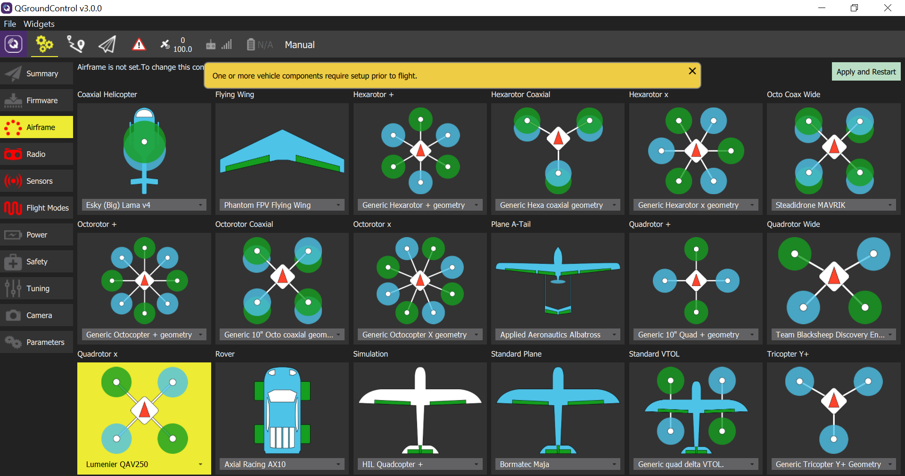