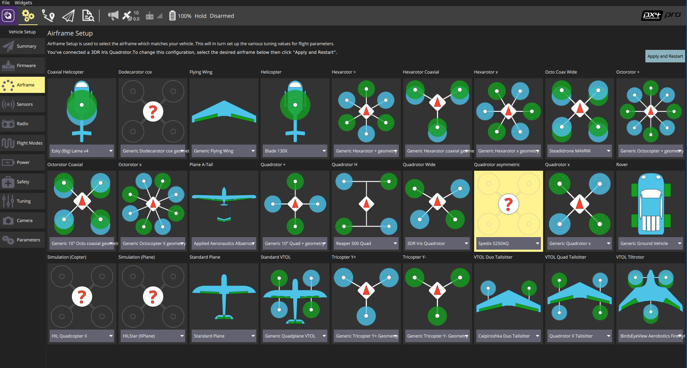

# Spedix S250AQ

The Spedix S250 is a asymmetric racing quadcopter perfectly suited for the [Pixracer](../flight_controller/pixracer.md) autopilot.

## Hardware

The hardware required for this build is displayed below.

## Mounting and Wiring

Connect GPS and the Wifi module as shown in the [Pixracer instructions](../flight_controller/pixracer.md).

Connect the motors in the layout and order defined in the [Airframe Reference](../airframes/airframe_reference.md#quadrotor-asymmetric), and as reproduced below.

   
  
  <table style="float: right; width: 70%; font-size:1.5rem;">
    <colgroup><col></colgroup> <tr>
      <th>
        공통 출력
      </th>
    </tr>
<tr>
 <td style="vertical-align: top;"><ul><li>메인1: 모터1(프론트 우측: CCW)</li><li>메인2: 모터2(좌측 뒤로: CCW)</li><li>메인3: 모터3(프론트 좌측: CW)</li><li>메인4: 모터4(오른쪽 후면: CW)</li><li>메인5: RC AUX1 채널의 피드스루</li><li>메인6: RC AUX2 채널의 피드스루</li></ul></td>
</tr>
  </table>

## Airframe Configuration

Select the Quadrotor asymmetric Spedix S250AQ configuration as shown below. This will not only put PX4 into quadrotor mode, but also load decent default tuning gains.

