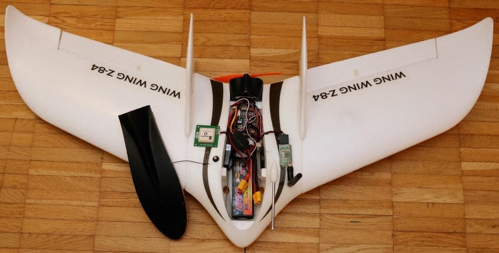
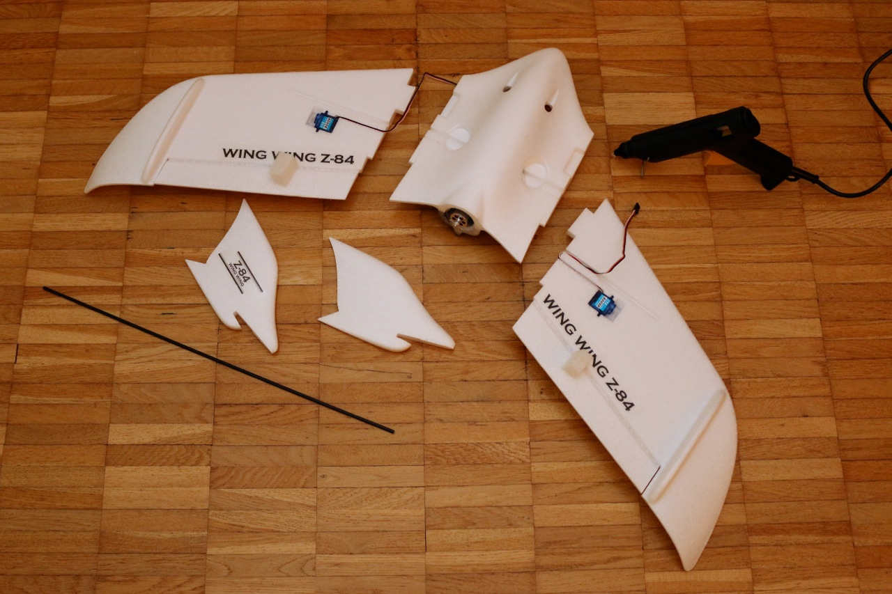
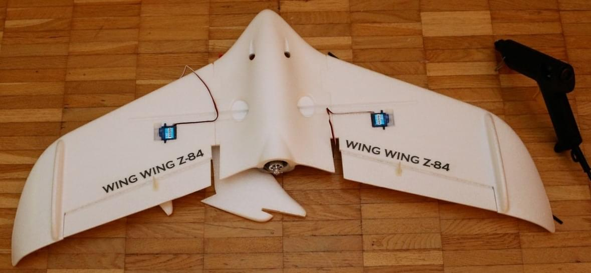
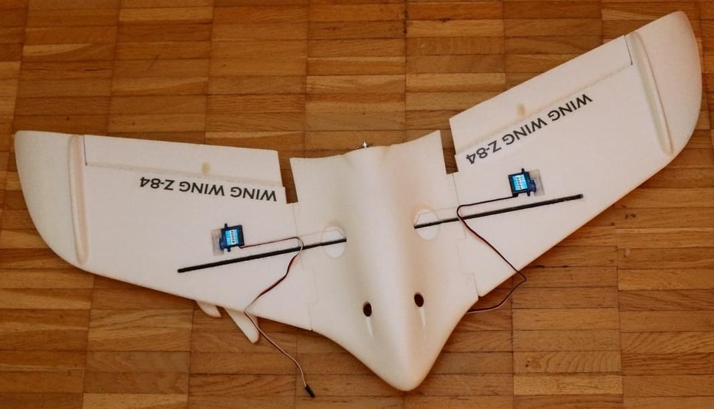
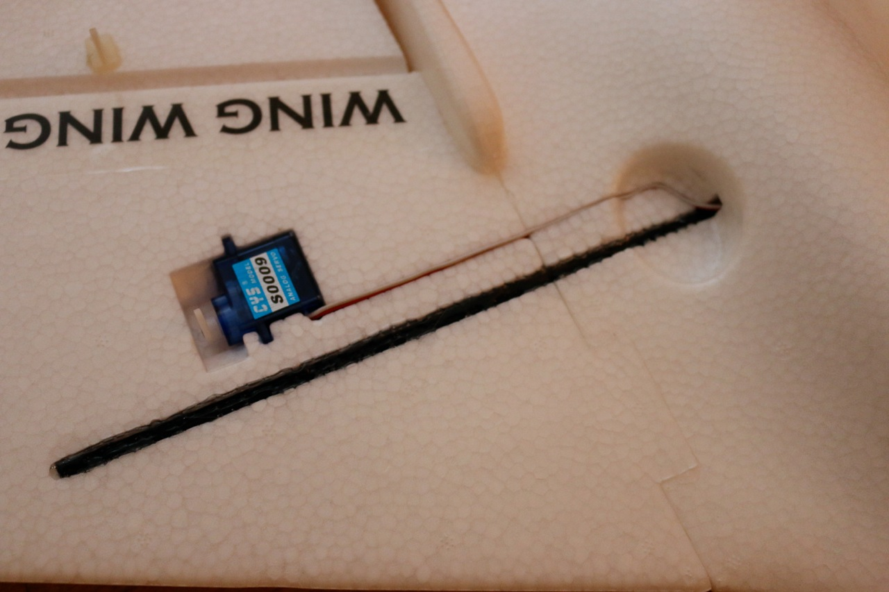
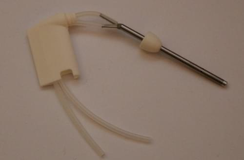
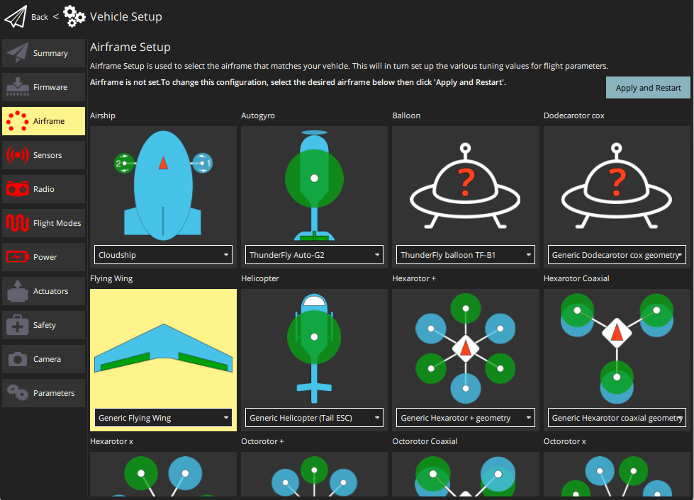
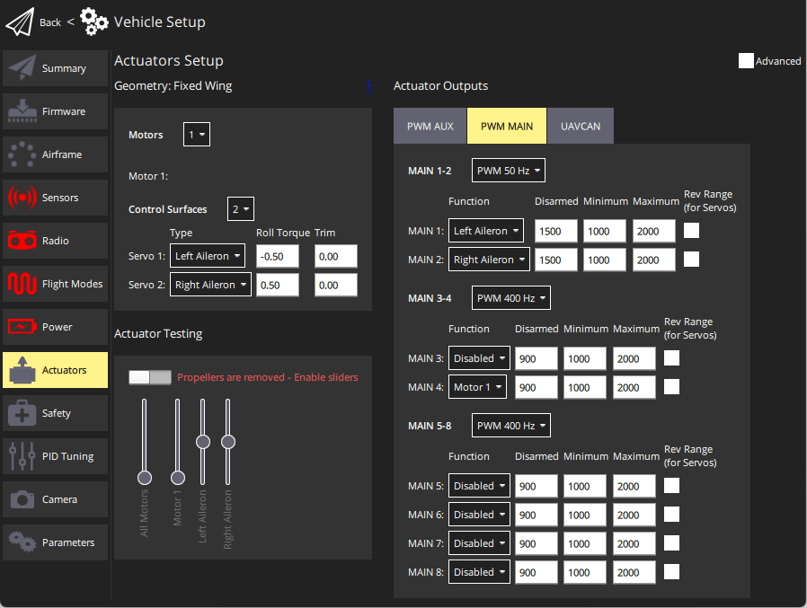

# Wing Wing Z-84 Pixracer 조립

The Wing Wing Z-84 is a flying wing frame. It is small, rugged and just large enough to host a [Pixracer](../flight_controller/pixracer.md).

주요 정보:

- **기체:** Wing Wing Z-84
- **비행 컨트롤러:** Pixracer

## 부품 목록

### Z-84 Plug n' Fly (PNF/PNP) 또는 키트

다음 중 하나 :
- [Banggood](https://www.banggood.com/Wing-Wing-Z-84-Z84-EPO-845mm-Wingspan-Flying-Wing-PNP-p-973125.html)
- [Hobbyking 미국 매장](https://hobbyking.com/en_us/wing-wing-z-84-epo-845mm-kit.html)

:::tip
PNF (또는 "PNP") 버전에는 모터, 프로펠러와 ESC가 포함됩니다.
"키트" 버전에는 이러한 부품들이 포함되어 있지 않아서, 별도로 구매하여야 합니다.
:::

### 전기 속도 컨트롤러 (ESC)

다음 중 하나 (작은 (> = 12A) ESC가 수행함) :

- [Turnigy 20A Brushed ESC ESC](https://hobbyking.com/en_us/turnigy-20a-brushed-esc.html) (Hobbyking)
- [Lumenier Regler 30A BLHeli_S ESC OPTO](https://www.getfpv.com/lumenier-30a-blheli-s-esc-opto-2-4s.html) (GetFPV)

### Autopilot 및 필수 부품들

- [Pixracer](../flight_controller/pixracer.md) kit (including GPS and power module)
- FrSky D4R-II 수신기 또는 동급 (설명서에 따라 PPM 합계 출력으로 점퍼됨)
- Holybro pix32용 [미니 텔레메트리 세트](../flight_controller/pixfalcon.md#availability)
- Holybro pix32 / Pixfalcon용 [디지털 대기 속도 센서](../flight_controller/pixfalcon.md#availability)
- 1800mAh 2S LiPo 배터리 - 예 : [팀 오리온 1800mAh 7.4V 50C 2S1P](https://teamorion.com/en/batteries-en/lipo/soft-case/team-orion-lipo-1800-2s-7-4v-50c-xt60-en/)

### 권장 예비 부품

- 프로펠러 보호용 직경 1cm O - 링 ([Hobbyking](https://hobbyking.com/en_us/wing-wing-z-84-o-ring-10pcs.html))
- 125x110 mm 프로펠러 ([Hobbyking](https://hobbyking.com/en_us/gws-ep-propeller-dd-5043-125x110mm-green-6pcs-set.html))

## 배선

Wire the servos and motors as shown. Use the `MAIN` outputs (not the ones labeled with AUX). 자동조종장치가 서보 레일에 전원을 공급하지 않으므로, 모터 컨트롤러에는 내장 BEC가 있어야합니다.

| 포트     | 연결                          |
| ------ | --------------------------- |
| RC IN  | PPM or S.BUS / S.BUS2 input |
| MAIN 1 | 좌측 보조익                      |
| MAIN 2 | 우측 보조익                      |
| MAIN 3 | 비어있음                        |
| MAIN 4 | Motor 1                     |

## 조립 방법

아래 이미지는 조립 공정에 대한 대략적인 아이디어를 제공합니다. 글루건을 사용하는 것이 좋습니다.

     

## PX4 Configuration

### 기체 설정

Select **Flying Wing > Generic Flying Wing** in the QGroundControl [Airframe Configuration](../config/airframe.md):

### Actuator Mapping

Set up the [Actuator Configuration](../config/actuators.md) to match the wiring for the ailerons and throttle as [indicated above](#wiring).

### Other Configuration

Perform all the the other [Basic Configuration](../config/README.md), including [Autotuning](../config/autotune.md).

Advanced tuning is optional - see [Fixed-wing Vehicle Configuration](../config_fw/README.md).
