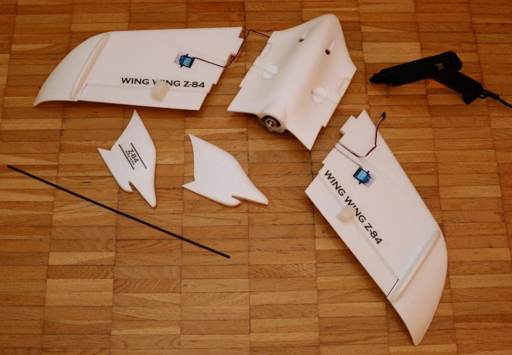
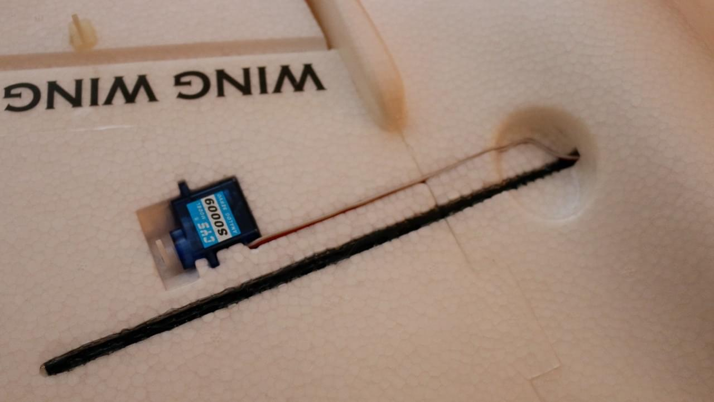

# Wing Wing Z-84 Pixracer 조립

Wing Wing Z-84는 매우 좋은 표준 기체입니다. 작고 튼튼하며 [Pixracer](../flight_controller/pixracer.md)를 장착이 가능합니다.

주요 정보:

- **기체:** Wing Wing Z-84
- **비행 컨트롤러:** Pixracer

## 부품 목록

### Z-84 Plug n' Fly (PNF/PNP) 혹은 키트

One of these:

- [Banggood](https://www.banggood.com/Wing-Wing-Z-84-Z84-EPO-845mm-Wingspan-Flying-Wing-PNP-p-973125.html)
- [Hobbyking US Warehouse](https://hobbyking.com/en_us/wing-wing-z-84-epo-845mm-kit.html)

:::tip PNF
(or "PNP") versions include motor, propeller and electronic speed controller. The "kit" version does not include these components, which must be purchased separately.
:::

### Electronic Speed Controller (ESC)

One of these (any small (>=12A) ESC will do):

- [Blue Series 12A ESC](https://hobbyking.com/en_us/hobbyking-12a-blueseries-brushless-speed-controller.html) (Hobbyking)
- [Lumenier Regler 30A BLHeli_S ESC OPTO](https://www.getfpv.com/lumenier-30a-blheli-s-esc-opto-2-4s.html) (GetFPV)

### Autopilot and Essential Components

- [Pixracer](../flight_controller/pixracer.md) kit (including GPS and power module)
- FrSky D4R-II receiver or equivalent (jumpered to PPM sum output according to its manual)
- [Mini telemetry set](../flight_controller/pixfalcon.md#availability) for Holybro pix32
- [Digital airspeed sensor](../flight_controller/pixfalcon.md#availability) for Holybro pix32 / Pixfalcon
- 1800 mAh 2S LiPo Battery - e.g. [Team Orion 1800mAh 7.4V 50C 2S1P](https://teamorion.com/en/batteries-en/lipo/soft-case/team-orion-lipo-1800-2s-7-4v-50c-xt60-en/)

### Recommended spare parts

- 1 cm diameter O-ring for prop saver ([Hobbyking](https://hobbyking.com/en_us/wing-wing-z-84-o-ring-10pcs.html))
- 125x110 mm propellers ([Hobbyking](https://hobbyking.com/en_us/gws-ep-propeller-dd-5043-125x110mm-green-6pcs-set.html))

## Wiring

The wiring below is valid for Pixhawk and Pixracer. Use the main outputs, not the ones labeled with AUX. The motor controller needs to have an in-built BEC, as the autopilot is not powering the servo rail.

| Port   | Connection                  |
| ------ | --------------------------- |
| RC IN  | PPM or S.BUS / S.BUS2 input |
| MAIN 1 | Left Aileron                |
| MAIN 2 | Right Aileron               |
| MAIN 3 | Empty                       |
| MAIN 4 | Throttle                    |

## Build Log

The images below give a rough idea about the assembly process, which is simple and can be done with a hot glue gun.

     

## Airframe Configuration

Select the Z-84 in the flying wing section of the QGC airframe config:

