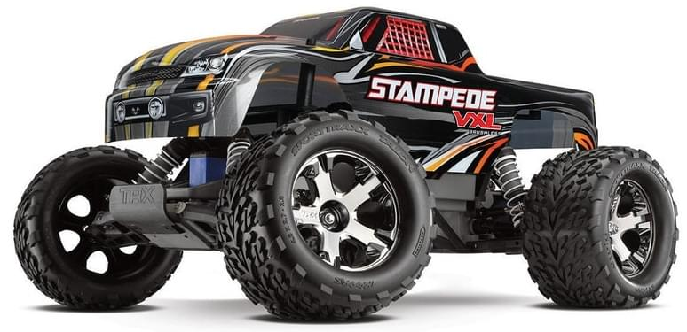
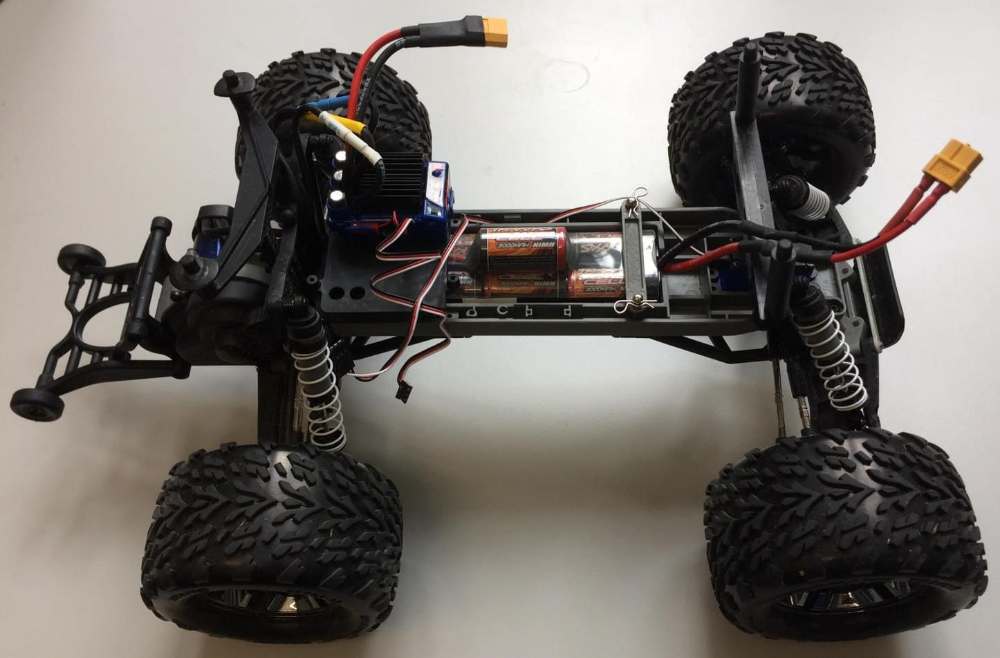
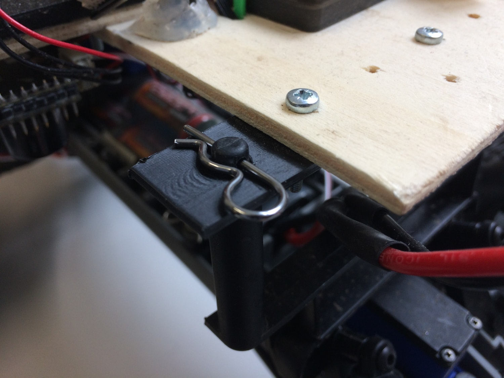

# Traxxas Stampede VXL

이 차량은 Pixhawk가 바퀴가 달린 플랫폼에 어떻게 사용될 수 있는지 이해하기 위해 선택되었습니다. 우리는 Traxxas 차량이 매우 인기 있고 RC 커뮤니티에서 매우 강력한 브랜드이기 때문에 사용하기로 선택하였습니다. 이 아이디어는 자동 조종 장치로 바퀴 달린 UGV를 쉽게 제어 할 수있는 플랫폼을 개발하는 것이었습니다.

## 부품 목록

* [Traxxas Stampede](https://traxxas.com/products/models/electric/stampede-vxl-tsm)의 부품들은 상단 플라스틱 덮개를 제외하고 모두 사용됩니다.
* [Pixhawk Mini (단종)](../flight_controller/pixhawk_mini.md) 
  * 3DR 10S 전원 모듈
  * [3DR 433MHz 텔레메트리 모듈 (EU)
* [Spektrum Dxe 컨트롤러](http://www.spektrumrc.com/Products/Default.aspx?ProdId=SPM1000) 또는 기타 PX4 호환 리모컨
* [Spektrum 쿼드 레이스 직렬 수신기 w/Diversity](http://www.spektrumrc.com/Products/Default.aspx?ProdID=SPM4648)
* [PX4Flow](../sensor/px4flow.md)

## 조립

부품들을 나무판위 부착하여 조립합니다. Tests showed that a better vibration insulation should be used, especially for the Pixhawk and the Flow module.

For this particular mounting we chose to use the clip supplied with the rover to attach the upper plate. For this, two supports were 3D printed. The CAD files are provided [here](https://github.com/PX4/px4_user_guide/raw/master/assets/airframes/rover/traxxas_stampede_vxl/plane_holders.zip).

:::warning
It is **HIGHLY RECOMMENDED** to set the ESC in training mode (see Traxxas Stampede Manual), which reduces power to 50%.
:::

## Output Connections

| PWM Output | Actuator       |
| ---------- | -------------- |
| MAIN2      | Steering servo |
| MAIN4      | ESC input      |

:::note
As documented in the [Airframe reference here](../airframes/airframe_reference.md#rover_rover_traxxas_stampede_vxl_2wd).
:::

## Configuration

Rovers are configured using *QGroundControl* in the same way as any other vehicle.

The main rover-specific configuration is setting the correct frame:

1. Switch to the [Basic Configuration](../config/README.md) section in *QGroundControl*
2. Select the [Airframe](../config/airframe.md) tab. 
3. Scroll down the list to find the **Rover** icon. 
4. Choose **Traxxas stampede vxl 2wd** from the drop down list.

## Usage

At the current time, PX4 only supports [MISSION](../flight_modes/mission.md) and MANUAL modes when a RC remote is connected. To use the mission mode, first upload a new mission to the vehicle with QGC. Then, BEFORE ARMING, select `MISSION` and then arm.

:::warning
It is very important to do a mission composed *only** of normal waypoints (i.e. no takeoff waypoints etc.) and it is crucial to set the waypoint height of **every** waypoint to 0 for correct execution. Failing to do so will cause the rover to continuously spin around a waypoint.
:::

A correct mission setup looks as follows:

## Video <iframe width="740" height="416" src="https://www.youtube.com/embed/N3HvSKS3nCw" frameborder="0" allow="accelerometer; autoplay; clipboard-write; encrypted-media; gyroscope; picture-in-picture" allowfullscreen mark="crwd-mark"></iframe>