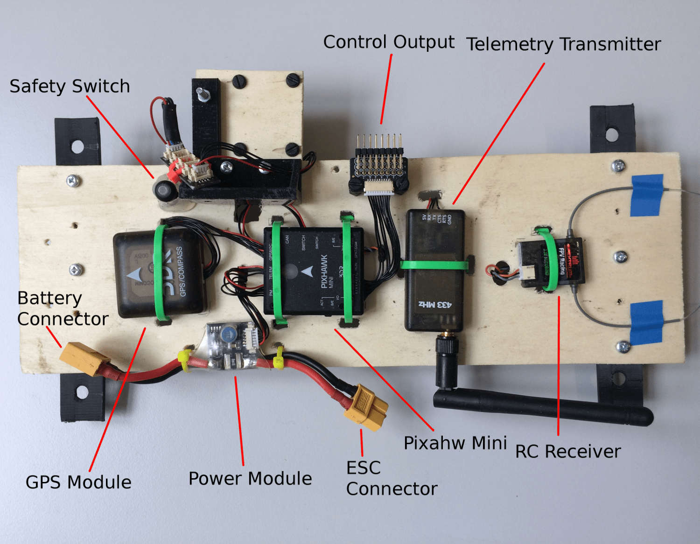
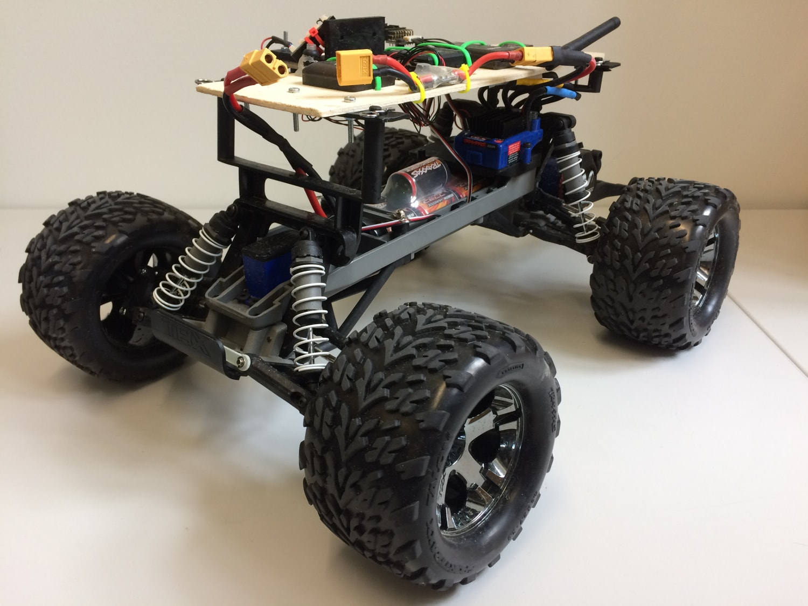

# Traxxas Stampede VXL

이 차량은 Pixhawk가 바퀴가 달린 플랫폼에 어떻게 사용될 수 있는지 이해하기 위해 선택되었습니다. 우리는 Traxxas 차량이 매우 인기 있고 RC 커뮤니티에서 매우 강력한 브랜드이기 때문에 사용하기로 선택하였습니다. 이 아이디어는 자동 조종 장치로 바퀴 달린 UGV를 쉽게 제어 할 수있는 플랫폼을 개발하는 것이었습니다.

## 부품 목록

* [Traxxas Stampede](https://traxxas.com/products/models/electric/stampede-vxl-tsm)의 부품들은 상단 플라스틱 덮개를 제외하고 모두 사용됩니다.
* [Pixhawk Mini (단종)](../flight_controller/pixhawk_mini.md)
  * 3DR 10S 전원 모듈
  * 3DR 433MHz Telemetry Module (EU)
* [Spektrum Dxe 컨트롤러](http://www.spektrumrc.com/Products/Default.aspx?ProdId=SPM1000) 또는 기타 PX4 호환 리모컨
* [Spektrum 쿼드 레이스 직렬 수신기 w/Diversity](http://www.spektrumrc.com/Products/Default.aspx?ProdID=SPM4648)
* [PX4Flow](../sensor/px4flow.md) (Deprecated)

## 조립

부품들을 나무판위 부착하여 조립합니다. Pixhawk 및 Flow 모듈의 경우에는 좋은 진동 방진재를 사용하는 것이 좋습니다.

로버와 함께 제공된 클립을 사용하여 상부 플레이트를 부착하였습니다. 두 개의 지지대가 3D 인쇄되었습니다. CAD 파일은 [여기](https://github.com/PX4/px4_user_guide/raw/master/assets/airframes/rover/traxxas_stampede_vxl/plane_holders.zip)에서 제공됩니다.

:::warning
훈련 모드에서 ESC를 설정하는 것을 **적극 권장**하며 (Traxxas Stampede 매뉴얼 참조) 전력을 50 %로 줄입니다.
:::

## 출력 연결

| PWM 출력 | 액추에이터                |
| ------ | -------------------- |
| MAIN2  | 조향 서보                |
| MAIN4  | Throttle (ESC input) |

:::note
As documented in the Airframe Reference: [Generic ground vehicle (Ackermann)](../airframes/airframe_reference.md#rover_rover_generic_ground_vehicle_(ackermann)).
:::

## 설정

로버는 다른 기체와 같은 방법으로 *QGroundControl*을 사용하여 설정합니다.

중요한 로버 설정은 올바른 프레임을 설정하는 것입니다.
1. *QGroundControl*의 [기본 설정](../config/README.md) 섹션으로 전환합니다.
1. [Airframe](../config/airframe.md) 탭을 선택합니다.
1. 목록을 아래로 스크롤하여 **Rover** 아이콘을 찾습니다.
1. 드롭다운 목록에서 **Traxxas stampede vxl 2wd**를 선택합니다.

## 사용법

현재 PX4는 RC 리모컨이 연결된 경우 [MISSION](../flight_modes/mission.md) 과 MANUAL 모드만을 지원합니다. 미션 모드를 사용하려면 먼저 QGC로 차량에 새 미션을 업로드 하세요. 그런 다음 `MISSION`을 먼저 선택한 다음에 시동을 거십시오.

:::warning
일반 웨이 포인트로 만 구성된 미션을 수행하는 것이 매우 중요하며 (예 : 이륙 웨이포인트 없음 등) 올바른 실행을 위해 **모든** 웨이 포인트의 높이를 0으로 설정하여야 합니다. 그렇게 하지 않으면, 로버가 웨이 포인트 주변을 계속 회전하게 됩니다.
:::

올바른 임무 설정은 다음과 같습니다.

## 비디오

<iframe width="740" height="416" src="https://www.youtube.com/embed/N3HvSKS3nCw" frameborder="0" allow="accelerometer; autoplay; clipboard-write; encrypted-media; gyroscope; picture-in-picture" allowfullscreen></iframe>
