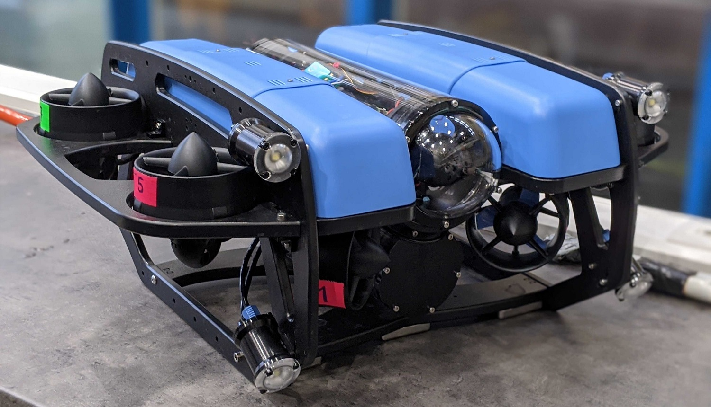
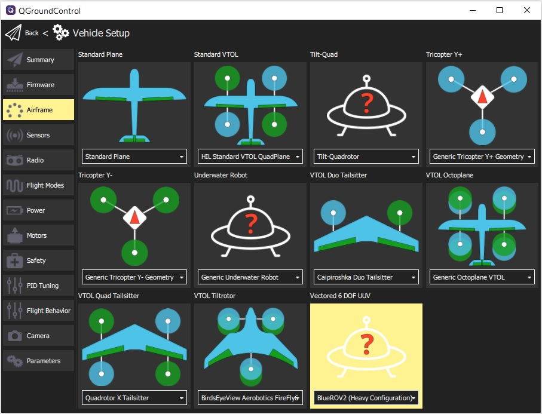

# BlueROV2 (UUV)

[BlueROV2](https://bluerobotics.com/store/rov/bluerov2-upgrade-kits/brov2-heavy-retrofit-r1-rp/BlueROV2)는 검사, 연구와 탐사에 적절한 경제적인 고성능 수중 차량입니다.

PX4는 *BlueROV2 Heavy Configuration*으로 알려진 8 추력 벡터 설정에 대한 [실험적 지원](README.md)을 제공합니다.

## Where to Buy

[BlueROV2](https://bluerobotics.com/store/rov/bluerov2/) + [BlueROV2 Heavy Configuration Retrofit Kit](https://bluerobotics.com/store/rov/bluerov2-upgrade-kits/brov2-heavy-retrofit-r1-rp/)

### 모터 매핑과 배선

모터는 BlueRobotics의 표준 지침에 따라 비행 컨트롤러에 연결되어야 합니다.

그러면 차량이 [기체 정의서](../airframes/airframe_reference.md#vectored-6-dof-uuv)에 문서화된 설정과 일치합니다.

- **MAIN1:** 모터 1 CCW, 선수 우현 수평,, 프로펠러 CCW
- **MAIN2:** 모터 2 CCW, 선수 포트 수평, 프로펠러 CCW
- **MAIN3:** 모터 3 CCW, 선미 우현 수평, 프로펠러 CW
- **MAIN4:** 모터 4 CCW, 스턴 포트 수평, 프로펠러 CW
- **MAIN5:** 모터 5 CCW, 선수 우현 수직, 프로펠러 CCW
- **MAIN6:** 모터 6 CCW, 보우 포트 수직, 프로펠러 CW
- **MAIN7:** 모터 7 CCW, 선미 우현 수직, 프로펠러 CW
- **MAIN8:** 모터 8 CCW, 선미 포트 수직, 프로펠러 CCW

## 기체 설정

BlueROV2는 PX4가 설치된 상태로 제공되지 않습니다. 다음을 수행해야합니다.
1. [Install PX4 Firmware](../config/firmware.md#installing-px4-main-beta-or-custom-firmware) :::note Prior to PX4 v1.12 you will need to install the "master" version.
1. [기체 설정](../config/airframe.md). 다음과 같이 "BlueROV2 Heavy Configuration"을 선택하여야 합니다. 

<!-- what other tuning/testing/ etc? -->

## 비디오

@[유투브](https://www.youtube.com/watch?v=1sUaURmlmT8)

<!-- @DanielDuecker on github is good person to ask about this frame -->
