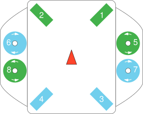

# BlueROV2 (UUV)

[BlueROV2](https://bluerobotics.com/store/rov/bluerov2-upgrade-kits/brov2-heavy-retrofit-r1-rp/BlueROV2)는 검사, 연구와 탐사에 적절한 경제적인 고성능 수중 차량입니다.

PX4는 *BlueROV2 Heavy Configuration*으로 알려진 8 추력 벡터 설정에 대한 [실험적 지원](README.md)을 제공합니다.

## 구매처

[BlueROV2](https://bluerobotics.com/store/rov/bluerov2/) + [BlueROV2 Heavy Configuration Retrofit Kit](https://bluerobotics.com/store/rov/bluerov2-upgrade-kits/brov2-heavy-retrofit-r1-rp/)

### 모터 매핑과 배선

모터는 BlueRobotics의 표준 지침에 따라 비행 컨트롤러에 연결되어야 합니다.

The vehicle will then match the configuration documented in the [Airframe Reference](../airframes/airframe_reference.md#vectored-6-dof-uuv):

- **MAIN1:** motor 1 CCW, bow starboard horizontal, , propeller CCW
- **MAIN2:** motor 2 CCW, bow port horizontal, propeller CCW
- **MAIN3:** motor 3 CCW, stern starboard horizontal, propeller CW
- **MAIN4:** motor 4 CCW, stern port horizontal, propeller CW
- **MAIN5:** motor 5 CCW, bow starboard vertical, propeller CCW
- **MAIN6:** motor 6 CCW, bow port vertical, propeller CW
- **MAIN7:** motor 7 CCW, stern starboard vertical, propeller CW
- **MAIN8:** motor 8 CCW, stern port vertical, propeller CCW

## Airframe Configuration

BlueROV2 does not come with PX4 installed. You will need to:
1. [Install PX4 Firmware](../config/firmware.md#installing-px4-master-beta-or-custom-firmware) :::note Prior to PX4 v1.12 you will need to install the "master" version.
1. [Set the Airframe](../config/airframe.md). You will need to select the "BlueROV2 Heavy Configuration" as shown: 

<!-- what other tuning/testing/ etc? -->

## Video

@[youtube](https://www.youtube.com/watch?v=1sUaURmlmT8)

<!-- @DanielDuecker on github is good person to ask about this frame -->
