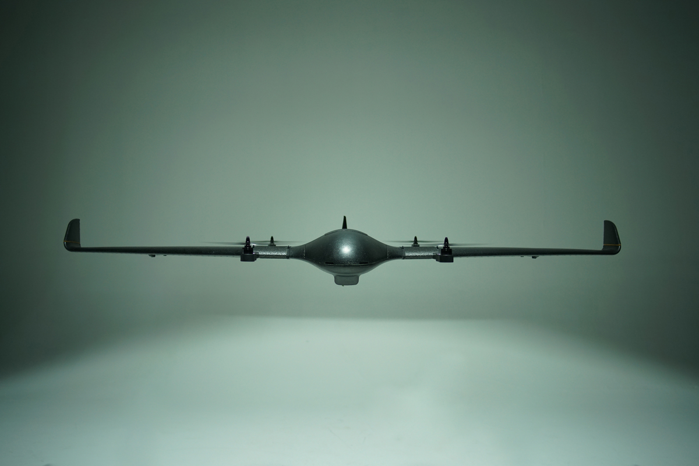
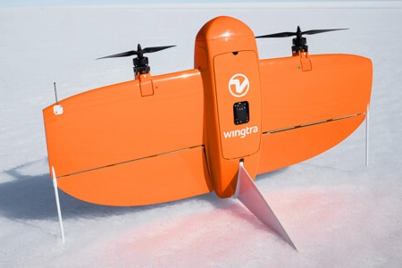

# VTOLs

PX4는 고정익의 전진 비행과 멀티콥터의 수직 이착륙 기능을 모두 가지고 있는 기체를 칭하는 용어는  VTOL입니다.

VTOL은 고정익과 멀티콥터의 장점을 모두 가지고 있습니다.

- **수직 이착륙:** 능숙한 조종사 아니어도 웬만한 장소에서 이착륙이 어렵지 않습니다.
- **Fast and efficient fixed-wing flight:** Faster, further, and longer missions, carrying heavier payloads.
- **호버링:** 사진, 구조 스캔 등을 위한 안정적인 플랫폼

PX4가 지원하는 VTOL 유형, 조립, 구성 및 비행 방법에 대하여 설명합니다.

## VTOL 유형

PX4는 세 가지 중요한 VTOL 유형을 지원합니다.

  

    
<a href="tailsitter.html" title="테일시터"><big>테일시터</big></a>

    

    Rotors permanently in fixed-wing position.
    이륙하고 꼬리로 착륙합니다. 전체 차량이 앞으로 기울어져 전진 비행으로 전환합니다.
    
    <ul>
      <li>간단하고 견고함.</li>
      <li>최소한의 액추에이터 세트</li>
      <li>바람이 불면 제어하기 어려울 수 있음</li>
      <li>동일한 액츄에이터가 사용되므로 호버링과 전진 비행의 효율성간의 균형</li>
    </ul>
    

  

  
<a href="tiltrotor.html" title="틸트로터"><big>틸트로터</big></a>

  로터는 멀티콥터에서 전진 비행 방향으로 전환하기 위하여 90도 회전합니다.
  이륙하고 배로 착지합니다.
  

  
  <ul>
    <li>모터 틸트용 추가 액추에이터</li>
    <li>기계적으로 복잡한 틸팅 메커니즘</li>
    <li>더 많은 제어 권한으로 테일시터보다 호버링이 용이합니다.</li>
  </ul>
  

  
<a href="standardvtol.html" title="표준 VTOL"><big>표준 VTOL</big></a>

  

  멀티콥터와 전진 비행을 위한 별도의 로터 및 비행 제어 장치. 이륙하고 배로 착지합니다.
  
  <ul>
    <li>별도의 호버링 및 전진 비행 추진 시스템으로 인한 중량 증가</li>
    <li>전용 호버링 및 포워드 플라이트 액츄에이터로 제어가 가장 용이 </li>
    <li>호버링 가능</li>
    <li>전진 비행 추진을 위한 연료 엔진 사용 가능</li>
  </ul>
  

 

일반적으로, 기계적 복잡성이 증가함에 따라 기체의 비행이 용이할 수 있지만, 비용과 중량이가 증가합니다. 각 유형에는 장단점이 있으며, 이를 기반으로 성공적인 상업적인 벤처 회사들이 있습니다.

위의 각 주요 유형에는 모터 수, 모터 기하학 및 비행 표면 등과 같은 많은 가능한 변형이 있습니다. PX4 provides _airframe configurations_ for many of the more common vehicle setups. 지원되는 세트는 [Airframes Reference &gt; VTOL](../airframes/airframe_reference.md#vtol)에 설명되어 있습니다.

:::note

- 필요한 차량 설정이 지원되지 않는 경우에는 [기체를 추가](../dev_airframes/adding_a_new_frame.md)하여야 합니다(일부 [PX4 개발](../development/development.md) 전문 지식 필요).
- VTOL 코드베이스는 다른 모든 기체와 동일한 코드베이스이며, 특히 전환 제어 로직을 추가합니다. :::

## 비행 모드

VTOL은 멀티콥터와 고정익의 장점을 모두 가지고 있습니다. Multicopter mode is mainly used for take off and landing while the fixed-wing mode is used for efficient travel and/or mission execution.

VTOL 비행 모드는 멀티콥터 모드에는 [멀티 콥터](../getting_started/flight_modes.md#mc_flight_modes)와 동일하고, 고정익 모드에는 [고정익](../getting_started/flight_modes.md#fw_flight_modes)과 동일합니다.

모드 전환은 RC 스위치를 사용하거나 임무 또는 기타 자동 모드에서 필요시에 PX4에 의해 자동으로 전환됩니다.

## 조립

:::note
For information about commercial and kit VTOL vehicles see: [Complete Vehicles](../complete_vehicles/README.md) :::

PX4로 제어되는 기체는 일반적으로 전원 시스템에 연결된 비행 컨트롤러, GPS, 외부 나침반(권장), 무선 제어 시스템(선택 사항), 텔레메트리(선택 사항) 및 속도 센서(VTOL용으로 강력 권장)와 같은 핵심 부품들을 공유합니다.

비행 컨트롤러 출력은 별도로 전원이 공급되는 차량 모터 ESC 또는 비행 제어 서보 및 액추에이터에 연결됩니다.

비행 컨트롤러 출력과 특정 컨트롤/모터 간의 매핑은 사용된 차량 프레임에 따라 다르며 [기체 정의서 &gt; VTOL](../airframes/airframe_reference.md#vtol)에 지정되어 있습니다.

조립 방법은 여러 섹션에서 설명합니다.

- [기본 조립](../assembly/README.md)에는 인기 있는 [비행 콘트롤러](../flight_controller/README.md)들의 핵심 부품들의 설정을 설명들이 포함되어 있습니다. 가이드가 없는 비행 컨트롤러는 일반적으로 거의 같은 방법으로 설정됩니다(거의 항상 유사한 설정 가이드가 포함됨).
- [주변 장치](../peripherals/README.md)에는 [대기 속도 센서](../sensor/airspeed.md)를 비롯하여 기타 주변 장치에 대한 정보가 포함되어 있습니다.
- [기체 정의서 &gt; VTOL](../airframes/airframe_reference.md#vtol) 각 기체 구성에 대해 다른 비행 콘트롤러에 연결하여야 하는 비행 컨트롤러 출력을 설명합니다.
  - 정의된 기체의 구성을 선택하십시오. 이는 비행을 위하여 사전 튜닝이 충분하기 때문입니다(미세 조정만 필요할 수 있음).
  - 그렇지 않으면, 기체와 일치하는 "일반 기체"를 선택하십시오.

또한 다른 사람들이 다른 유형의 기체 설정 방법을 보여주는 빌드 로그가 하위 주제로 제공됩니다. 예제로 [FunCub QuadPlane](../frames_vtol/vtol_quadplane_fun_cub_vtol_pixhawk.md)을 참고하십시오.

## 설정

VTOL 설정은 여러 섹션에서 다룹니다.

- [기본 설정](../config/README.md) - 모든 차량 유형(센서, 안전 시스템, 배터리 등)에 공통적인 설정입니다.
- [VTOL 특정 구성](../config_vtol/README.md)
- [주변 하드웨어](../peripherals/README.md) - 선택 가능한 하드웨와 및 센서에 대한 설정입니다.
- [고급 설정](../advanced_config/README.md): 공장 조정과 고급 및 선택적 구성을 포함하는 추가 설정입니다.

## 비디오

### 교육

VTOL Control & Airspeed Fault Detection (PX4 Developer Summit 2019)

@[유투브](https://youtu.be/37BIBAzD6fE)

<!-- 20190704 -->

### 테일시터

[UAV Works VALAQ 순찰 테일 시터](https://www.valaqpatrol.com/valaq_patrol_technical_data/)

@[유투브](https://youtu.be/pWt6uoqpPIw)

[TBS Caipiroshka](../frames_vtol/vtol_tailsitter_caipiroshka_pixracer.md)

@[유투브](https://www.youtube.com/watch?v=acG0aTuf3f8&vq=hd720)

### 틸트로터

[컨버전스 틸트로터](../frames_vtol/vtol_tiltrotor_eflite_convergence_pixfalcon.md)

@[유투브](https://youtu.be/E61P2f2WPNU)

### QuadPlane VTOL

[FunCub QuadPlane](../frames_vtol/vtol_quadplane_fun_cub_vtol_pixhawk.md)

@[유투브](https://www.youtube.com/watch?v=4K8yaa6A0ks&vq=hd720)

[Falcon Vertigo QuadPlane](../frames_vtol/vtol_quadplane_falcon_vertigo_hybrid_rtf_dropix.md)

@[유투브](https://youtu.be/h7OHTigtU0s)

[Ranger QuadPlane](../frames_vtol/vtol_quadplane_volantex_ranger_ex_pixhawk.md)

@[유투브](https://www.youtube.com/watch?v=7tGXkW6d3sA&vq=hd720)
