# 단종 : Falcon Vertigo Hybrid VTOL RTF (Dropix)

:::warning

단종되어서 Falcon Venturi FPV Wing 프레임은 더 이상 사용할 수 없습니다.
:::

*Falcon Vertigo Hybrid VTOL*은 PX4와 Dropix (Pixhawk 호환) 비행 컨트롤러와 함께 작동하도록 설계된 쿼드 플레인 VTOL 항공기입니다. 작은 GoPro 카메라를 장착 가능합니다.

RTF 키트에는 RC 수신기와 텔레메트리를 제외하고 시스템에 필요한 부품들이 포함되어 있습니다. 부품들을 별도로 구매할 수 있습니다.

주요 정보:

- **기체:** Falcon Vertigo Hybrid VTOL
- **비행 컨트롤러:** Dropix
- **윙 스팬:** 1.3m

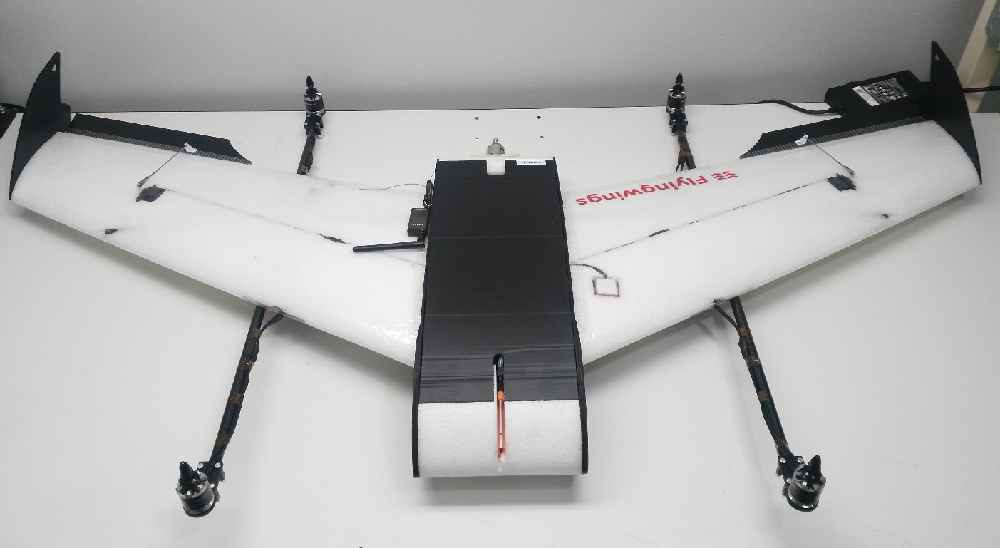

## 부품 명세서

필요한 대부분의 부품들이 RTF 키트에 포함되어 있습니다. 부품을 별도 구매하는 경우에는 아래 부품 목록의 링크를 참고하십시오.

* 사전 적층 EPP 날개
* 윙팁 및 전체 하드웨어
* [Dropix](https://store-drotek.com/888-dropix.html) 아래의 부품들이 포함된 비행 컨트롤러
  * [GPS u-blox M8N](https://store-drotek.com/876-DP0105.html)
  * 전원 센서:
  * [풍속 센서](https://store-drotek.com/793-digital-differential-airspeed-sensor-kit-.html)
* Quad power set  [Tiger Motor MT-2216-11 900kv V2](https://www.getfpv.com/tiger-motor-mt-2216-11-900kv-v2.html) (discontinued)
* 4 x 프로펠러 10”x 5”(쿼드 모터)
* 4 x [ESC 25A](http://www.getfpv.com/tiger-motor-flame-25a-esc.html)
* 프로펠러 10”x 5”1 개 (푸셔 모터)
* 1 x ESC 30A
* 푸셔 모터 전원 시스템
* 탄소 섬유 튜브 및 마운트
* G10 모터 마운트
* 1 x [3700mah 4S 30C 리포 배터리](https://www.overlander.co.uk/batteries/lipo-batteries/power-packs/3700mah-4s-14-8v-25c-lipo-battery-overlander-sport.html)
* [배전 보드 및 케이블](https://store-drotek.com/453-apm-power-source-xt60.html)

이 키트는 라디오 수신기 또는 텔레메트리(선택 사항)는 제공하지 않습니다. 이 조립 방법에서는 다음의 부품을 사용하였습니다.

- Receiver: [FrSSKY D4R-II](https://www.frsky-rc.com/product/d4r-ii/)
- Telemetry: [Holybro 100mW 915MHz modules](https://www.getfpv.com/holybro-100mw-fpv-transceiver-telemetry-radio-set-915mhz.html) (Discontinued)

## 필요 공구

기체를 조립에 아래의 도구들을 사용하였습니다.

* 필립스 스크류드라이버
* 5.5 mm 육각 스크류드라이버
* 전선 커터
* 납땜 인두 및 땜납
* 취미 스테인리스 핀셋
* 고릴라 접착제
* 유리 섬유 강화 테이프

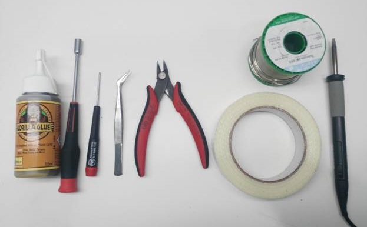

## 조립 단계

RTF 키트는 아래와 같이 조립하여야 합니다.

### 1 단계 : 모터 마운트 부착

1. 그림과 같이 윙 브래킷 내부에 고릴라 접착제를 펴서 바릅니다.

   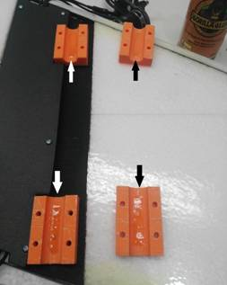

1. 브래킷에 카본 튜브를 부착합니다. 브래킷과 튜브는 흰색 표시를 사용하여 정렬합니다 (그림 참조).

   :::note
흰색 표시가 무게 중심을 나타내기 때문에 매우 중요합니다.
:::

   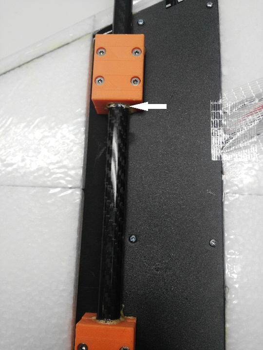

1. 다음 이미지는 다른 관점에서 로드의 정렬을 보여줍니다.

   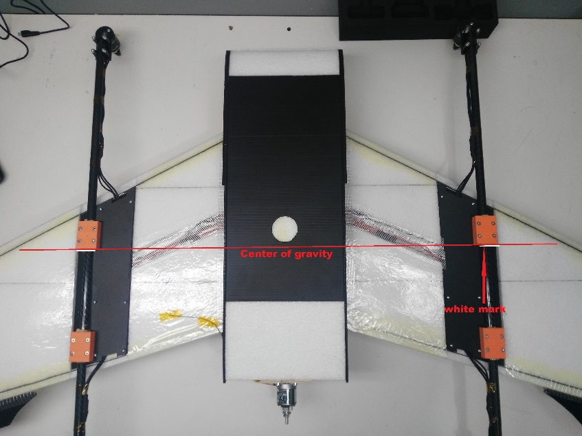 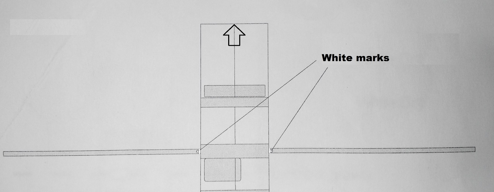

### 2 단계 : 날개 부착

1. 두 탄소 튜브를 동체에 삽입합니다.

   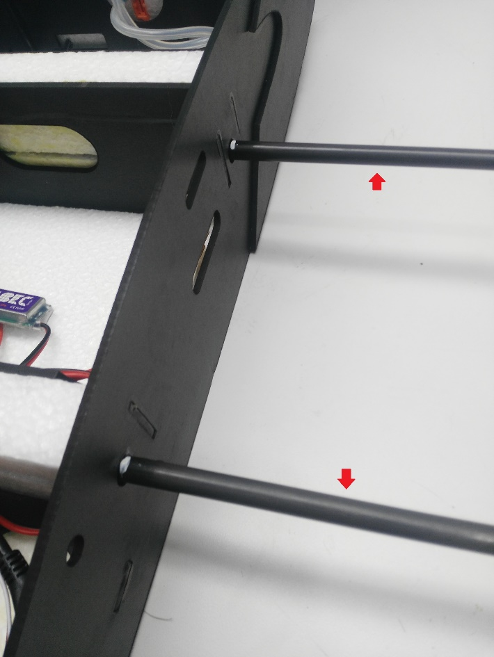

1. 각 튜브에있는 두 개의 흰색 표시 사이에 고릴라 접착제를 바릅니다 (빨간색 화살표로 표시됨). 중앙의 흰색 표시 (파란색 화살표)는 동체 중앙에 배치되고 다른 표시는 측면에 배치됩니다.

   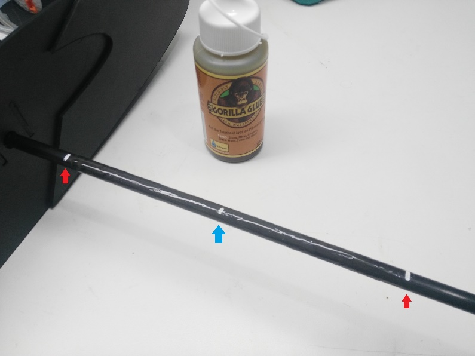

1. 탄소 튜브가 동체 내부에 있으면 튜브의 나머지 부분에 고릴라 접착제를 바르고 날개를 부착하십시오.

1. 동체에는 모터와 서보 케이블을 위한 두 개의 구멍이 있습니다. 구멍을 통해 케이블을 통과시킨 다음 날개를 동체에 연결합니다.

   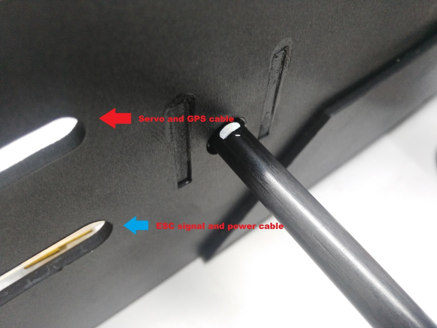

1. 동체 내에서 제공된 커넥터를 사용하여 방금 날개에서 ESC로 통과한 신호 케이블을 연결합니다. ESC는 이미 모터에 연결되어 있으며 올바른 순서로 회전하도록 설정되어 있습니다 (나중 단계에서 ESC PDB를 전원 모듈에 연결해야 함).

   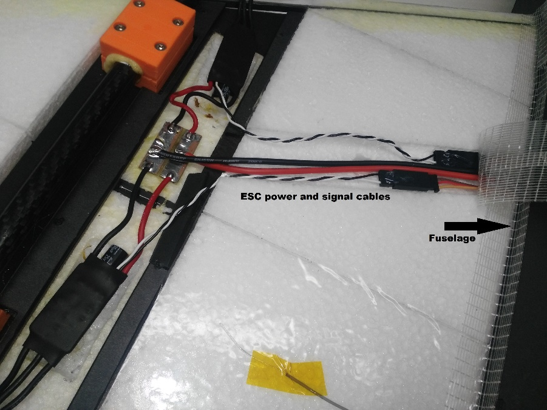

1. ESC와 마찬가지로 서보는 이미 설치되어 있습니다. 날개 (동체를 통과)에서 비행 컨트롤러로 신호 케이블을 연결합니다.

   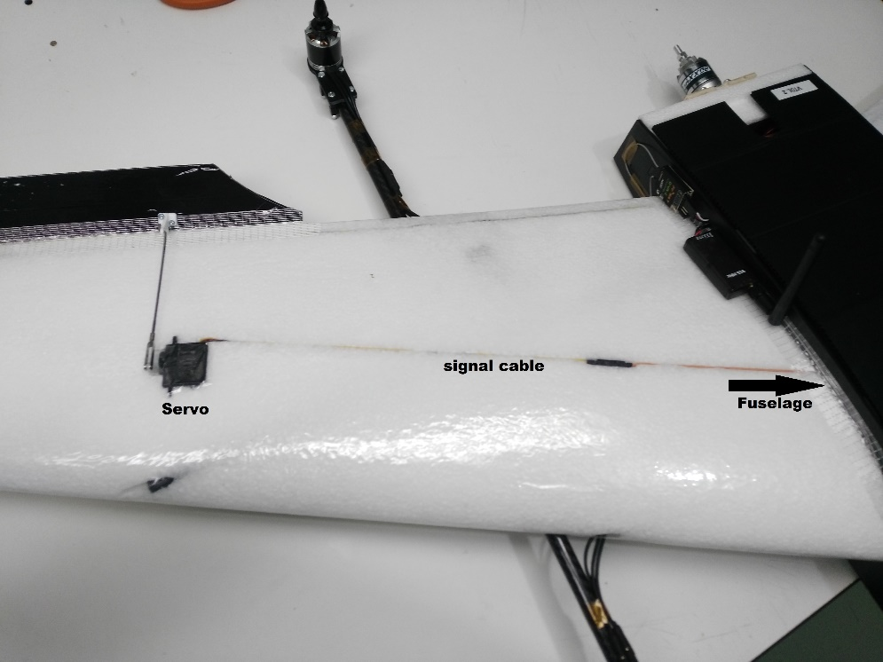

1. 다른 날개에 이 단계를 반복합니다.

### 3 단계 : 전자 장치 연결

이 키트에는 필요한 전자 장치가 대부분 미리 연결된 Dropix 비행 컨트롤러가 포함되어 있습니다 (다른 Pixhawk 호환 비행 컨트롤러를 사용하는 경우 연결이 유사함).

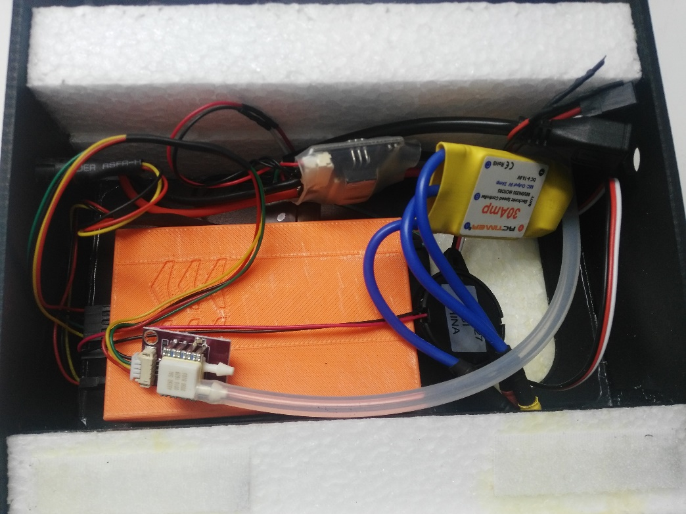

:::note
Dropix 연결에 대한 일반 정보는 [Dropix 비행 컨트롤러](../flight_controller/dropix.md)에서 찾을 수 있습니다. :::

#### ESC 전원 커넥터를 연결하고 신호 케이블을 비행 컨트롤러에 전달합니다.

1. XT60 커넥터를 사용하여 ESC를 전원 모듈에 연결합니다.

   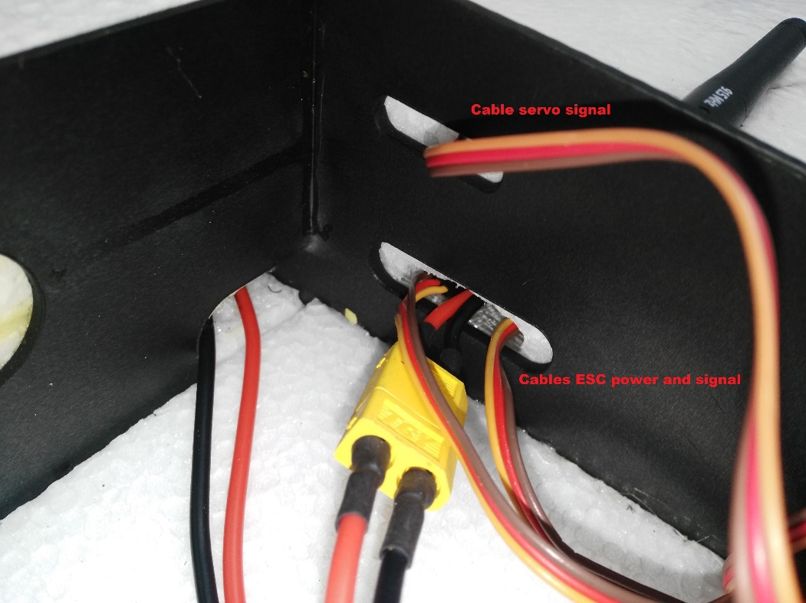

1. 신호 케이블을 비행 컨트롤러로 전달합니다.

   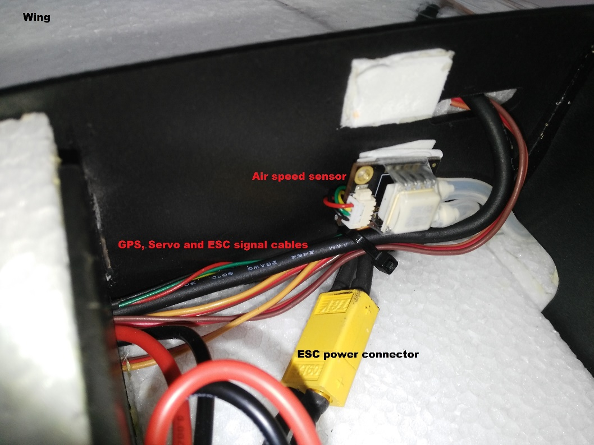

#### 모터 배선

Dropix의 출력은 표준 QuadPlane 구성 ( "평면에 앉아 있는" 방향)을 사용하여 연결하여야합니다.

| 포트     | 연결               |
| ------ | ---------------- |
| MAIN 1 | 전방 우측 모터, 반시계 방향 |
| MAIN 2 | 후방 촤즉 모터, 반시계 방향 |
| MAIN 3 | 전방 좌측 모터, 시계방향   |
| MAIN 4 | 후방 우측 모터, 시계 방향  |
| AUX 1  | 좌측 보조익           |
| AUX 2  | 우측 보조익           |
| AUX 3  | 승강타              |
| AUX 4  | 방향타              |
| AUX 5  | 스로틀              |

#### 비행 컨트롤러 연결 : 모터, 서보, RC 수신기, 전류 센서

아래 이미지는 dropix 비행 컨트롤러의 뒷면을 보여 주며 쿼드 모터 케이블, 에일러론 신호 케이블, 스로틀 모터, 전류 센서 및 수신기 (RC IN) 입력 핀을 연결하기위한 출력 핀을 강조 표시합니다.

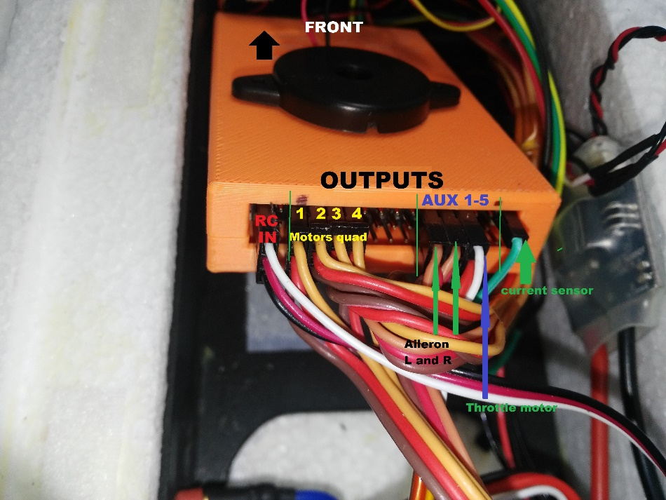

1. 쿼드 모터 신호 케이블을 연결합니다.

1. 보조 출력에 에일러론 케이블과 스로틀 모터를 연결합니다.

1. ESC의 스로틀 모터 신호 케이블을 적절한 비행 컨트롤러 보조 포트에 연결합니다. ESC를 스로틀 모터에 연결합니다.

   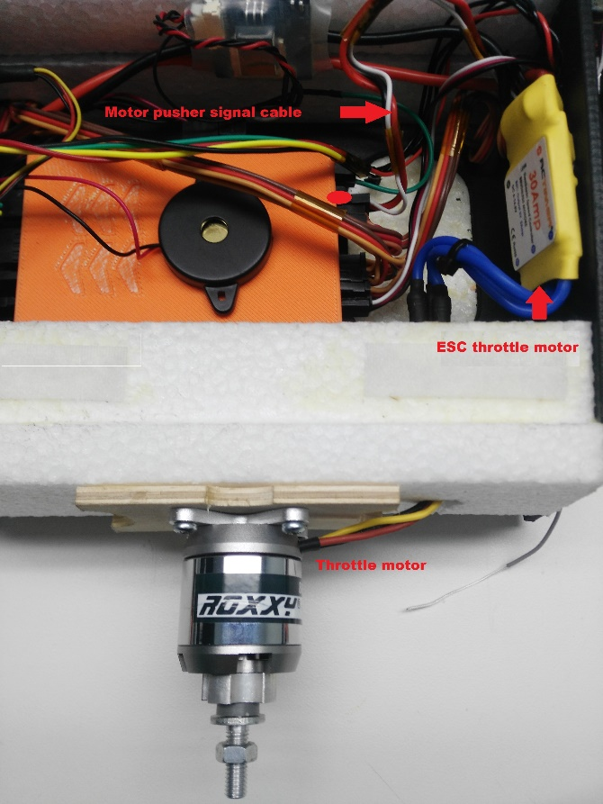

1. 수신기를 RC IN에 연결합니다.

#### 비행 컨트롤러 연결 : 원격 측정, 대기 속도 센서, GPS, 부저 및 안전 스위치

센서 입력, 원격 측정, 부저 및 안전 스위치는 아래 연결 다이어그램과 같이 비행 컨트롤러의 전면에 있습니다.

1. 그림과 같이 원격 측정, 대기 속도 센서, GPS, 부저 및 안전 스위치를 연결합니다.

   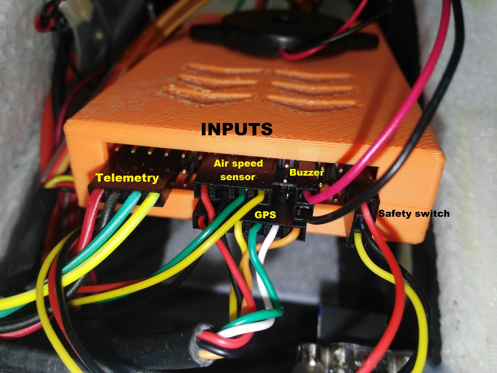

#### 비행 컨트롤러 : 전원 모듈 및 외부 USB 연결

USB 포트, 전원 모듈 및 외부 USB에 대한 입력은 비행 컨트롤러의 오른쪽에 있습니다.

1. 그림과 같이 전원과 USB를 연결합니다.

   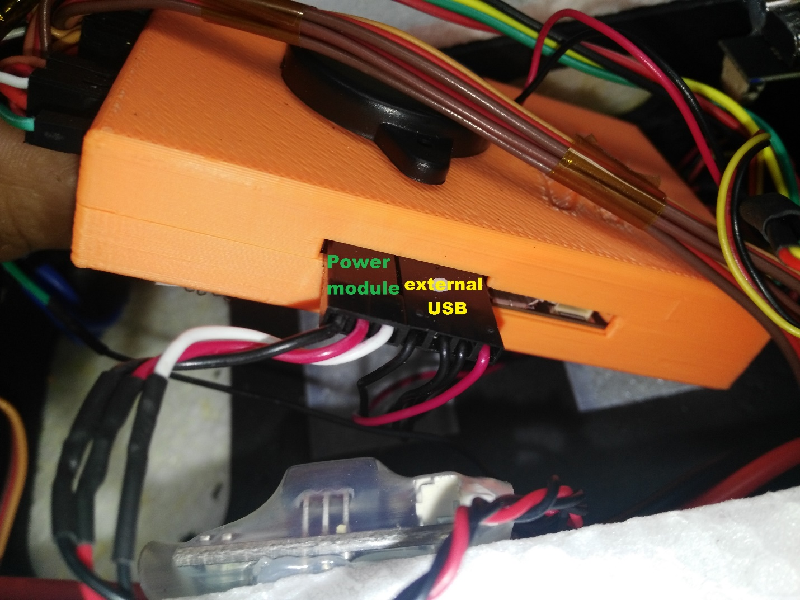

:::tip
외부 USB는 선택 사항입니다.
비행 컨트롤러를 장착 후 USB 포트에 액세스하기 어려운 경우에 사용하여야 합니다.
:::

#### 피토 튜브 (대기 속도 센서) 설치

피토 튜브는 비행기 전면에 설치되며 튜브를 통해 대기 속도 센서에 연결됩니다.

:::caution
피토 튜브 근처에 공기 흐름을 방해하는 것이 없어야합니다. 이것은 고정익 비행과 쿼드에서 비행기로의 전환에 매우 중요합니다.
:::

1. 비행기 전면에 피토 튜브를 설치합니다

   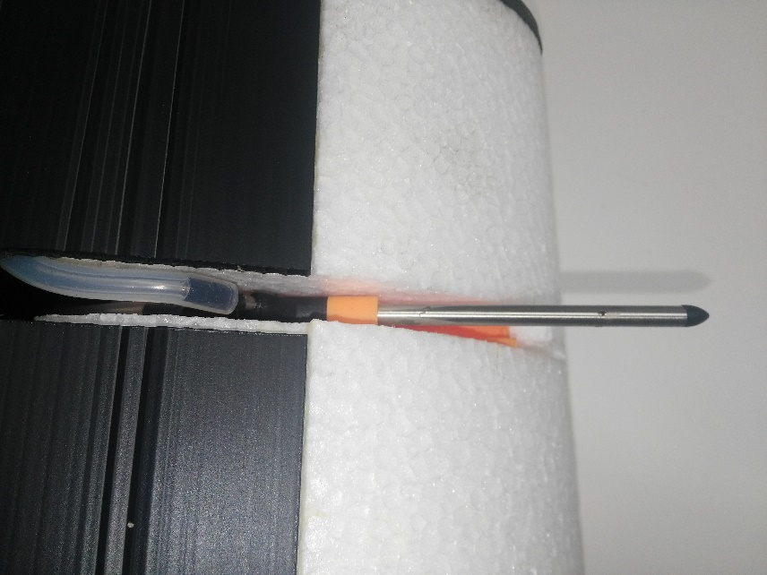

1. 연결 튜브를 고정하고 구부러 지거나 꼬이지 않았는 지 확인합니다.

   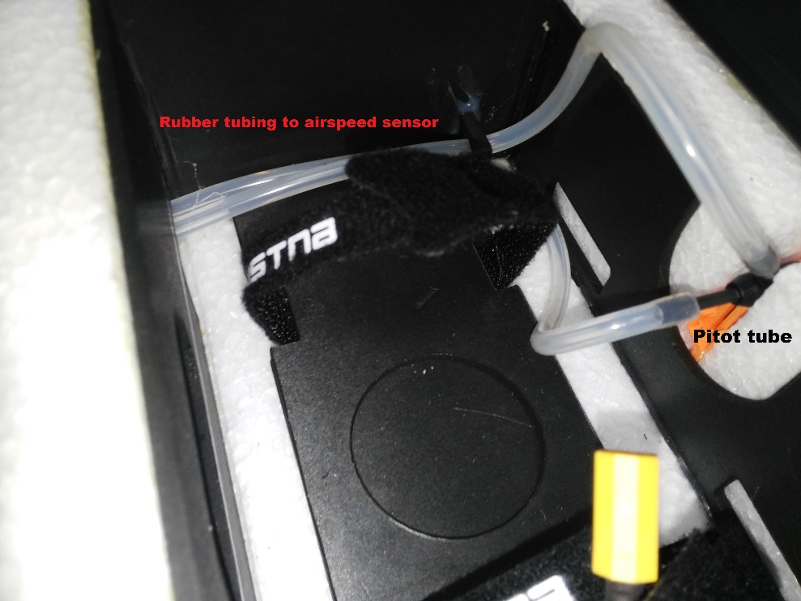

1. 튜브를 대기 속도 센서에 연결합니다.

   

#### 수신기 및 원격 측정 모듈 설치 / 연결

1. 수신기와 원격 측정 모듈을 차량 프레임 외부에 붙여 넣습니다.

   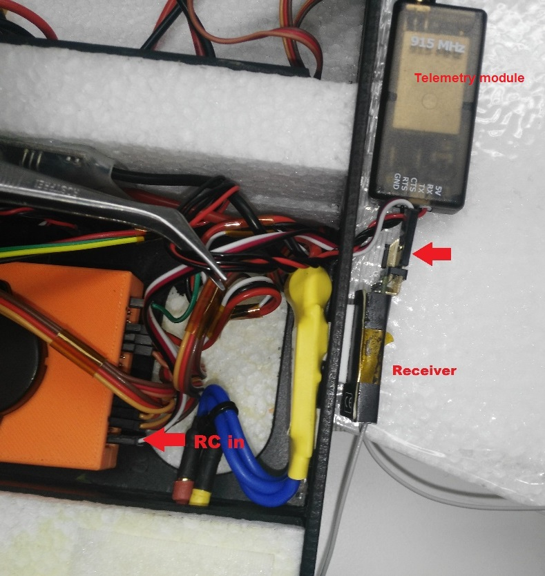

1. 아래 그림과 같이 원격 측정 모듈을 비행 컨트롤러의 *전면*에 연결합니다 (핀에 대한 자세한 내용은 [비행 컨트롤러 지침 ](#dropix_front) 참조).

1. 튜브를 대기 속도 센서에 연결합니다.

   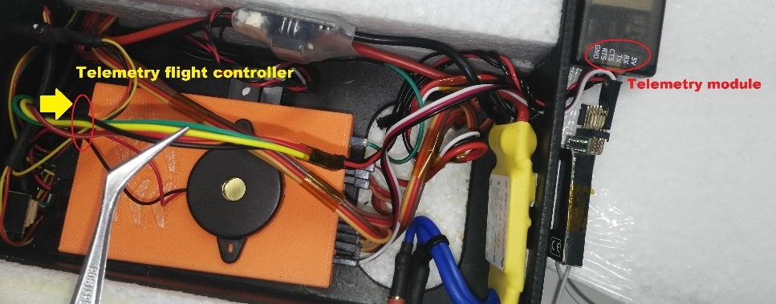

#### GPS / 나침반 모듈

GPS / 나침반 모듈은 기본 방향으로 날개에 이미 장착되어 있습니다. 이를 위해 추가 작업을 할 필요가 없습니다!

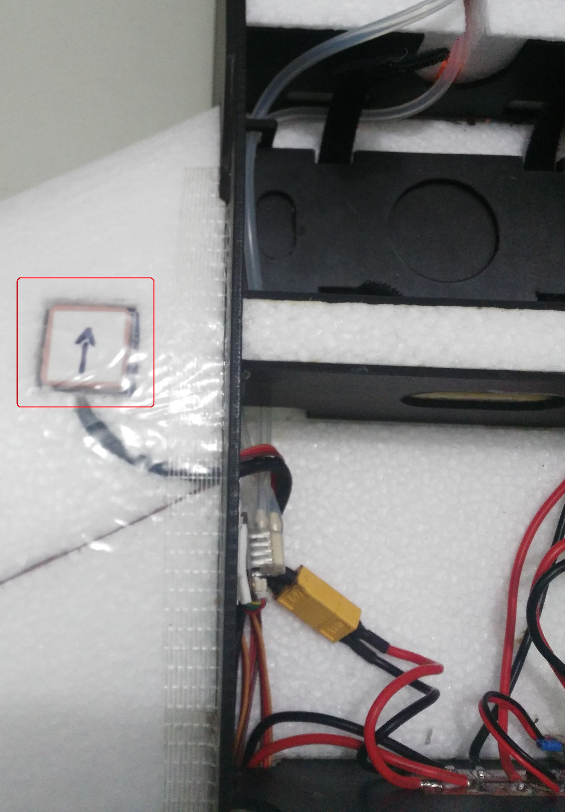

#### 비행 컨트롤러 장착 및 방향 설정

1. 비행 컨트롤러 방향을 270도로 설정합니다.

   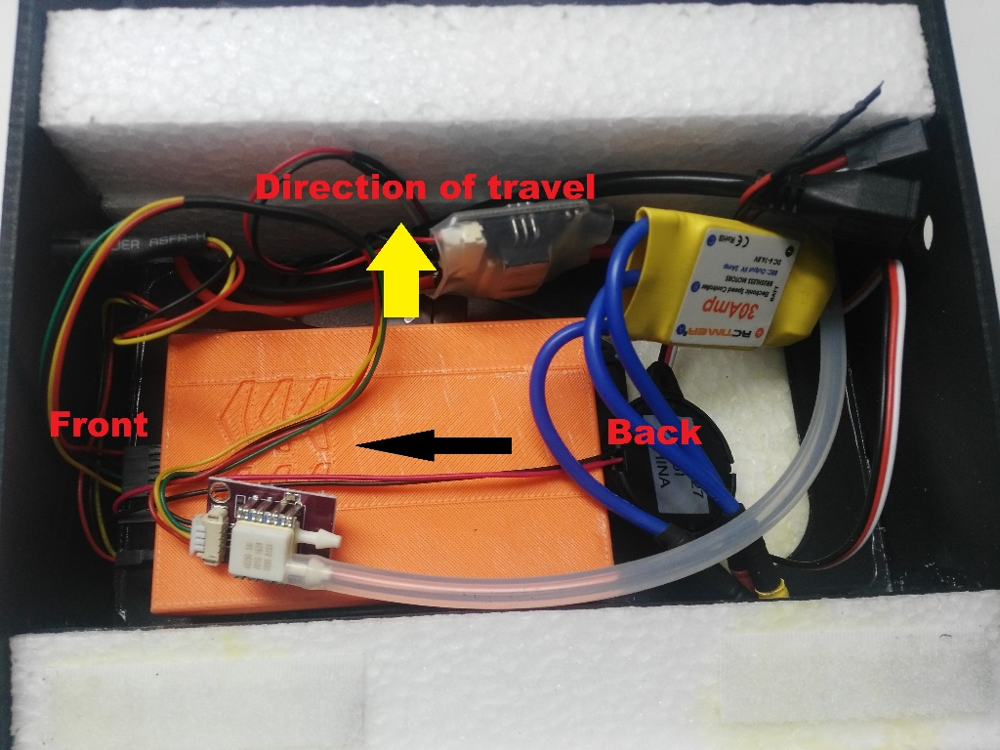

1. 진동 감쇠폼을 사용하여 컨트롤러를 제자리에 고정합니다.

### 4 단계 : 최종 조립 확인

마지막 조립 단계는 차량이 안정적이고 모터가 올바르게 설정되었는 지 확인하는 것입니다.

1. 모터가 올바른 방향으로 회전하는지 확인하십시오 (아래 QuadX 다이어그램 참조).

   

:::note
필요한 경우 QGroundControl의 `PWM_OUTPUT` 그룹에 있는 [PWM_MAIN_REVn](../advanced_config/parameter_reference.md#PWM_MAIN_REV1) 매개변수를 사용하여 서보 방향을 바꿀 수 있습니다(톱니바퀴 탭, 왼쪽 메뉴의 마지막 항목). :::

1. 차량이 예상 무게 중심 주변에서 균형을 이루는 지 확인하십시오.

   * 손가락으로 기체의 무게 중심을 잡고 차량이 안정적인지 확인하십시오.

      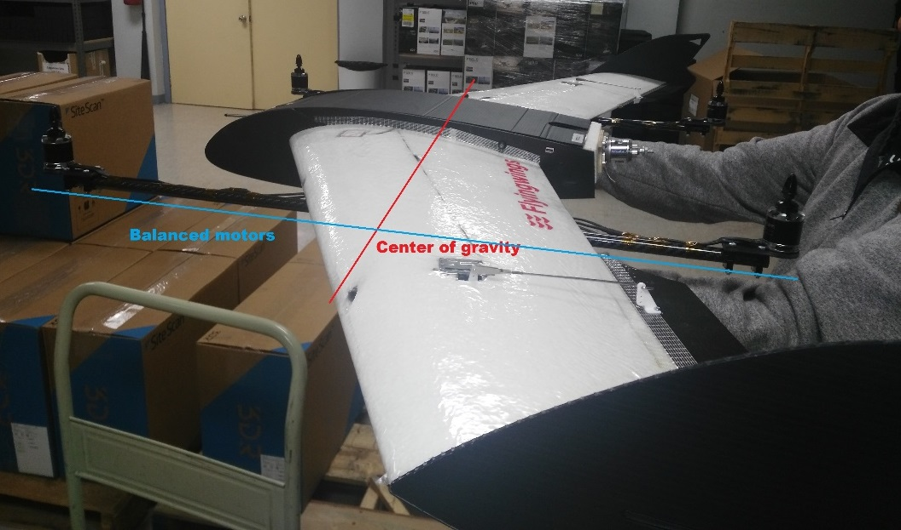](../../assets/airframes/vtol/falcon_vertigo/falcon_vertigo_57_level_centre_of_gravity.jpg)

   * 차량이 앞이나 뒤로 기울면 모터를 움직여 균형을 잡으십시오.

      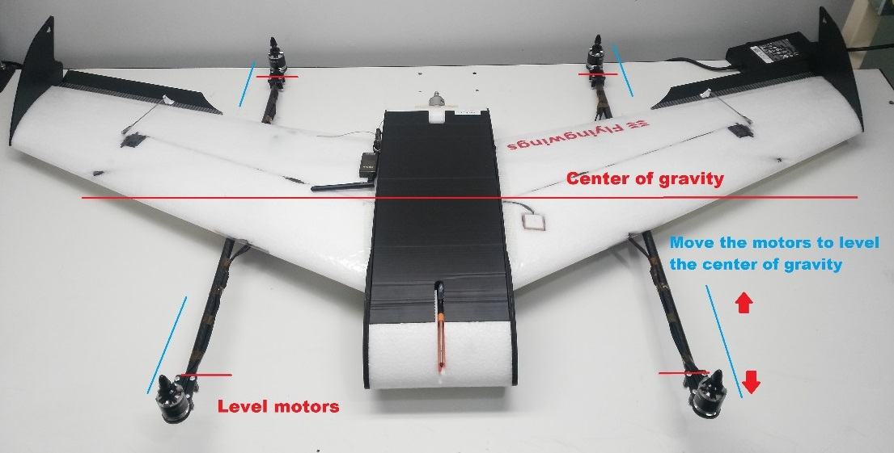

## 설정

일반적인 [기본 설정](../config/README.md)을 작업을 하여야 합니다.

참고:

1. [Airframe](../config/airframe.md)의 경우 차량 그룹/유형을 *Standard VTOL*로 선택하고 특정 차량을 *Generic quad delta VTOL*로 선택합니다.

   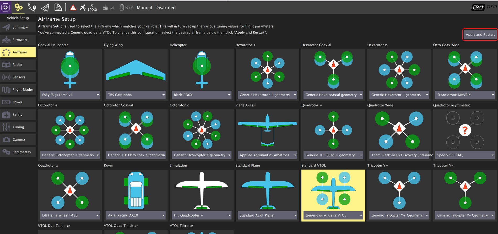

1. 자동 조종 장치가 차량 앞쪽을 기준으로 [옆으로](#flight_controller_orientation) 장착되므로 [자동조종장치 방향 ](../config/flight_controller_orientation.md)을 `ROTATION_YAW_270`으로 설정합니다. 나침반은 앞쪽을 향하므로 기본값 (`ROTATION_NONE`)을 사용합니다.
1. 매개 변수 기본값들은 안정적인 비행에 충분합니다. 자세한 튜닝 정보는 [표준 VTOL 배선 및 구성](../config_vtol/vtol_quad_configuration.md)을 참조하십시오.

보정을 마치면 VTOL이 비행할 준비가 됩니다.

## 비디오

@[유투브](https://youtu.be/h7OHTigtU0s)

## 지원

참고:

