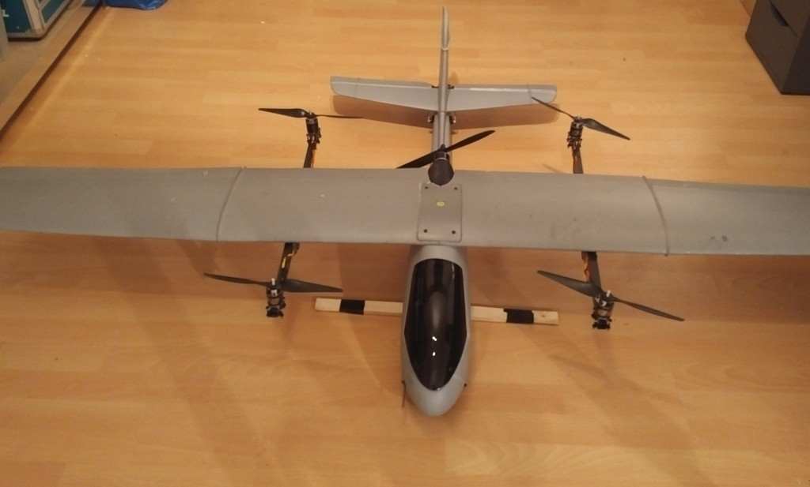
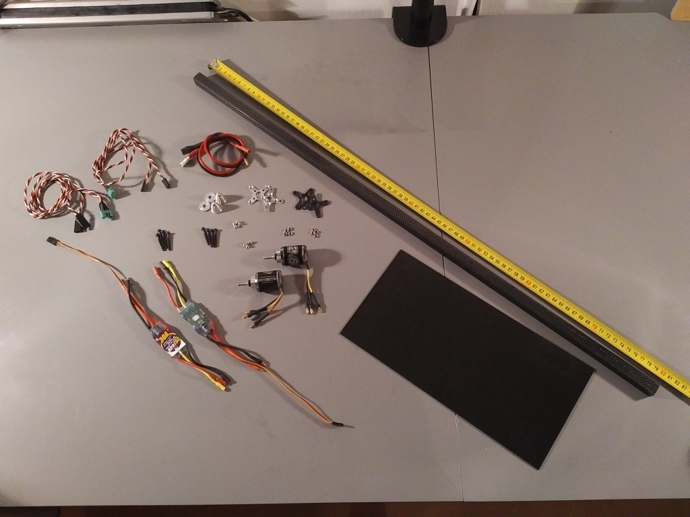
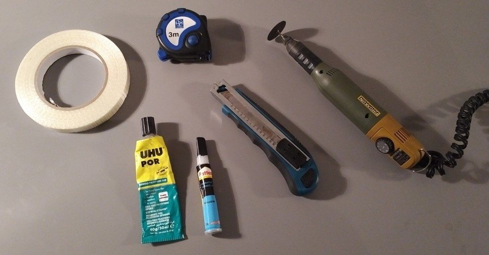
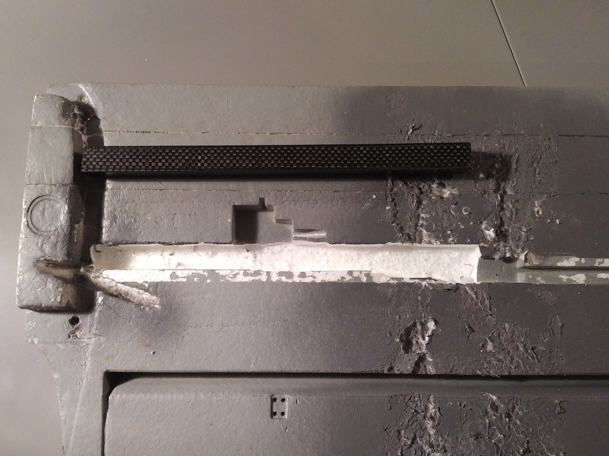
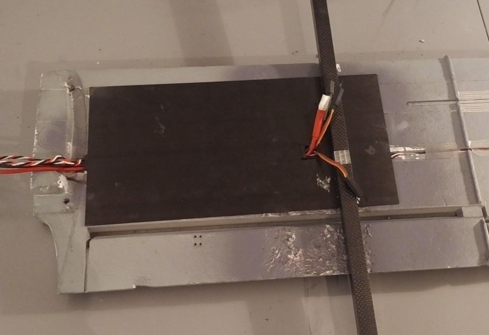
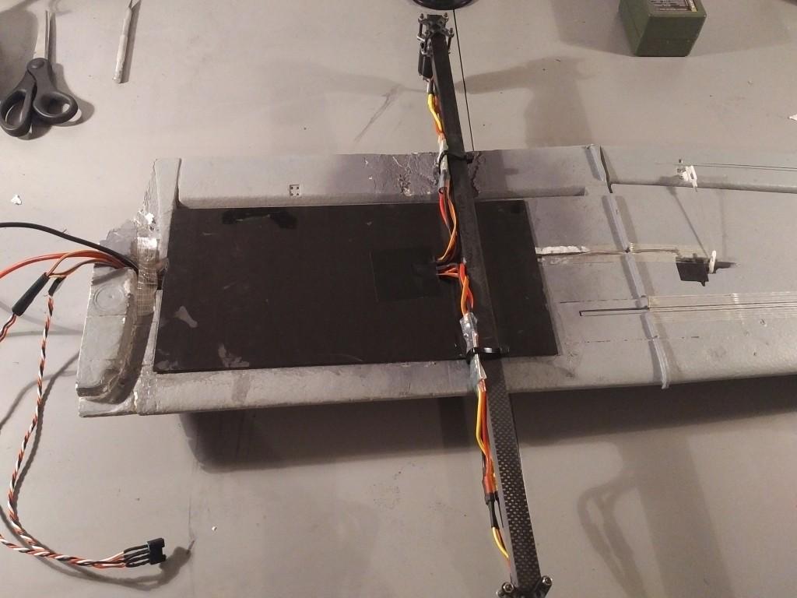

# Volantex Ranger-Ex QuadPlane VTOL (Pixhawk)

QuadRanger VTOL은 QuadCopter 시스템으로 설계된 Volantex Ranger-Ex를 기반의 표준 꼬리 비행기입니다. Ranger-Ex는 비행법이 간편한 범용적인 FPV 플랫폼입니다. HobbyKing에서 구매할 수 있으며, Quanum Observer로 제품명이 변경되었습니다. 플라스틱 동체와 2m EPO 날개는 탑재 하중이 높은 견고한 기체입니다.

주요 정보:

- **기체: ** Volantex Ranger-Ex 또는 *Quanum Observer*
- **비행 컨트롤러:** Pixhawk

VTOL 변환된 비행기의 중량은 LiPo를 포함하여 약 3.5kg 정도 증가합니다. 변환된 비행기는 약 65%의 추진력으로 순항할 수 있습니다. 제안하는 쿼드 설정은 7.5kg의 추력을 제공하며 기체는 약 4.5kg의 총 중량으로 비행할 수 있습니다. FPV 장비와 카메라를 탑재에 충분한 하중 용량이 남아 있습니다.

변환은 공기 역학에 미치는 영향을 최소화하고 추가 강도를 제공하여 날개 굴곡을 최소화하도록 설계되었습니다.

## 부품 명세서

- Volantex Ranger-Ex 혹은 Quanum Observer
- 1200KV 530W 모터
- 30A 속도 컨트롤러
- 4s 배터리
- APC Electric 11x5 프로펠러

## 변환 키트

- 필요한 기본 부품은 다음과 같습니다.
- Pixhawk 호환 제품
- 디지털 풍속 센서
- 3DR 호환 전원 모듈
- GPS

For a full parts list with links to Hobbyking EU and International warehouse see: [QuadRanger-VTOL-partslist](https://px4.io/wp-content/uploads/2016/01/QuadRanger-VTOL-partslist-1.xlsx)

아래 이미지는 한 날개에 필요한 부품을 보여줍니다.

변환에 필요한 도구는 다음과 같습니다.

- Dremel 또는 유사한 회전 도구
- 취미용 칼
- UHU POR 접착제
- CA 접착제
- 줄자
- 테이프

## 날개 변환

전체 조립 방법은 아래 비디오를 참고하십시오.

:::note
이 변환 조립 방법은 이전 변환으로 인한 손상을 보여주는 날개에서 수행됩니다.
:::

@[유투브](https://youtu.be/l_ppJ_HhAUQ)

800mm 사각 탄소 튜브를 570mm와 230mm 길이로 자릅니다.

고정된 깊이를 유지하기 위해 회전 도구를 사용하여 1.5cm 깊이의 스티로폼 날개에 슬롯을 만듭니다. 슬롯은 230mm 정사각형 탄소 튜브 1 개의 길이, 깊이 및 너비를 유지하여야 합니다. 아래 표시된 위치에 있어야합니다.

CA 접착제를 사용하여 300x150x1.5mm 탄소 시트를 230mm 탄소 튜브에 붙이고 전선을 통과할 구멍을 만듭니다. 전원 및 신호용 전선을 ESC에 삽입합니다. UHU POR를 사용하여 시트와 탄소 튜브를 아래 표시된대로 스티로폼 날개에 붙입니다.

CA 접착제를 사용하여 570mm 정사각형 탄소 튜브를 탄소 시트에 붙입니다. 날개가 만나는 지점에서 285mm 떨어진 곳에 위치하여야 합니다. 튜브는 날개의 수직 영역을 기준으로 중앙에 있어야 합니다. 양쪽에서 정확히 165mm 연장되어야합니다.

모터 마운트를 모터에 부착합니다. 다른 모터 장착 플레이트와 4 개의 M3x25mm 나사를 사용하여 아래 표시된대로 사각형 탄소 튜브 끝에 모터를 고정합니다. 타이 랩이있는 ESC를 카본 튜브에 부착합니다. Afro ESC를 사용할 때는 최소한 신호와 접지선을 연결하십시오.

## 배선

Pixhawk의 출력은 다음과 같이 연결되어야합니다 ( "평면에 앉아 있음"과 같은 방향)

| 포트     | 연결            |
| ------ | ------------- |
| MAIN 1 | 전방 우측, 반시계 방향 |
| MAIN 2 | 후방 촤즉, 반시계 방향 |
| MAIN 3 | 전방 좌측, 시계방향   |
| MAIN 4 | 후방 우측, 시계 방향  |
| AUX 1  | 좌측 보조익        |
| AUX 2  | 우측 보조익        |
| AUX 3  | 승강타           |
| AUX 4  | 방향타           |
| AUX 5  | 스로틀           |

:::note
서보 방향은 QGroundControl의 PWM\_OUTPUT 그룹 (톱니 바퀴 탭, 왼쪽 메뉴의 마지막 항목)에서 PWM\_REV 매개 변수를 사용하여 변경할 수 있습니다.
:::

배선 및 설정에 관한 자세한 지침은 다음을 참조하십시오.[표준 VTOL 배선 및 설정](../config_vtol/vtol_quad_configuration.md)

## 설정

아래 QGroundControl에 표시된대로 기체를 설정합니다 (맨 위의 **적용 및 다시 시작**을 클릭하는 것을 잊지 마십시오).

## 지원

VTOL 변환 또는 구성에 대한 질문이 있으시면 <https://discuss.px4.io/c/px4/vtol>을 방문하십시오.