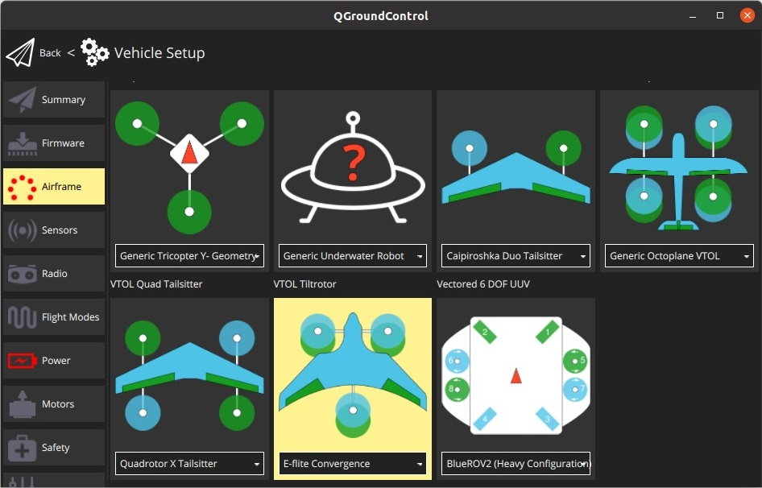

# E-flite Convergence 틸트로터 VTOL (Pixfalcon)

[E-Flite 컨버전스](https://youtu.be/HNedXQ_jhYo) PX4의 자율 비행이 가능한 VTOL로 변환할 수 있습니다. 공간은 충분하지 않지만, GPS, 텔레메트리를 장착하기에는 [Pixfalcon](../flight_controller/pixfalcon.md) 비행 콘트롤러의 공간은 충분합니다.

:::note
오리지널 [Horizon Hobby *E-Flite Convergence*](https://www.modelflight.com.au/e-flite-convergence-vtol-bnf-basic.html) 프레임과 [Pixfalcon](../flight_controller/pixfalcon.md)은 단종되었습니다. 대안은 [구매](#purchase) 섹션을 참고하십시오.
:::

@[유투브](https://youtu.be/E61P2f2WPNU)

## 구매

차량 프레임 옵션:
- **WL Tech XK X450** - [뱅굿](https://usa.banggood.com/XK-X450-VTOL-2_4G-6CH-EPO-450mm-Wingspan-3D-or-6G-Mode-Switchable-Aerobatics-RC-Airplane-RTF-p-1533418.html), [알리익스프레스](https://www.aliexpress.com/item/1005001946025611.html)
- **JJRC M02** - [뱅굿(AU)](https://au.banggood.com/JJRC-M02-2_4G-6CH-450mm-Wingspan-EPO-Brushless-6-axis-Gyro-Aerobatic-RC-Airplane-RTF-3D-or-6G-Mode-Aircraft-p-1588201.html), [알리익스프레스](https://www.aliexpress.com/item/4001031497018.html)

비행 컨트롤러 옵션():
- [픽스호크 4 미니](../flight_controller/pixhawk4_mini.md)
- [홀리브로 픽스호크 미니](../flight_controller/pixhawk_mini.md).
- 충분히 작은 폼 팩터를 가진 다른 호환 가능한 비행 콘트롤러.

## 하드웨어 설정

차량에는 [기체 정의서 &gt; VTOL 틸트로터 &gt; E-flite Convergence](../airframes/airframe_reference.md#vtol_vtol_tiltrotor_e-flite_convergence)에 지정된 대로 비행 콘트롤러 출력에 연결되어야 하는 7개의 PWM 신호가 필요합니다. 출력 매핑은 아래와 같습니다.

| 포트     | 연결       |
| ------ | -------- |
| MAIN 1 | 우측 모터    |
| MAIN 2 | 좌측 모터    |
| MAIN 3 | 후면 모터    |
| MAIN 4 | 없음       |
| MAIN 5 | 우측 틸트 서보 |
| MAIN 6 | 좌측 틸트 서보 |
| MAIN 7 | 우측 엘레본   |
| MAIN 8 | 좌측 엘레본   |

참조에서 왼쪽과 오른쪽은 실제 비행기 내부의 인간 조종사의 관점에서 정의됩니다(또는 아래 표시된 것처럼 위에서 볼 때).

### 비행 콘트롤러

비행 콘트롤러는 원래 자동조종장치가 있던 동일한 위치에 장착할 수 있습니다.

### 텔레메트리

텔레메트리 모듈은 FPV 전송 기어를 고정하기 위한 베이에 장착합니다.

### GPS

GPS 장착을 위하여 "조종실" 내부의 발포 재질 부분을 잘라냈습니다. 그렇게 하면 GPS를 차체 내부에 넣을 수 있고, 차량 외관을 손상시키지 않으면서 멋지게 수납할 수 있습니다.

## PX4 설정

Follow the [Standard Configuration](../config/README.md) in *QGroundControl* (radio, sensors, flight modes, etc.).

이 기체와 관련된 특정 설정은 다음과 같습니다.
- [기체](../config/airframe.md)
  - **VTOL Tiltrotor**에서 기체 구성 **E-flite Convergence**를 선택하고 *QGroundControl*을 다시 시작합니다. 
- [비행 모드/스위치](../config/flight_mode.md)
  - VTOL은 멀티콥터와 고정익을 전환하려면 [RC 컨트롤러 스위치를 할당](../config/flight_mode.md#what-flight-modes-and-switches-should-i-set)하여야 합니다.
