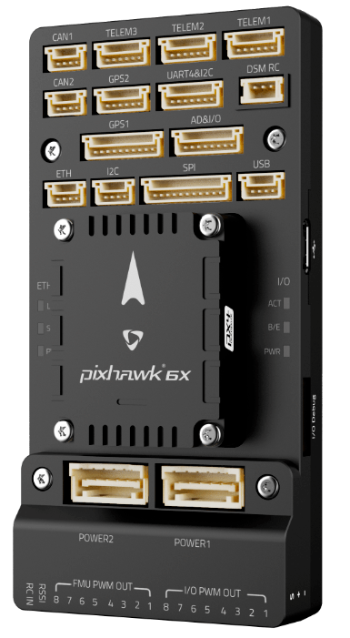

# 비행 콘트롤러 선정

Flight controllers are the "brains" of an unmanned vehicle. PX4 can run on [many flight controller boards](../flight_controller/README.md).

기체의 물리적인 조건, 비행 목적과 비용에 적합한 하드웨어를 선정하여야 합니다.

  

## Pixhawk 시리즈

[Pixhawk시리즈](../flight_controller/pixhawk_series.md)는  NuttX OS 기반의 PX4 오픈 하드웨어 비행 콘트롤러입니다. 다양한 폼 팩터를 기반으로 다양한 적용 사례와 높은 시장 점유율을 자랑합니다.

[Pixhawk Standard Autopilots](../flight_controller/autopilot_pixhawk_standard.md) are used as the PX4 reference platform. They are supported and tested by the PX4 development team, and are highly recommended.

## Manufacturer-supported Controllers

Other flight controllers are [manufacturer-supported](../flight_controller/autopilot_manufacturer_supported.md). This includes FCs that are heavily based on the Pixhawk standard (but which are not fully compliant), and many others.

Note that manufacturer-supported controllers can be just as "good" (or better) than those which are Pixhawk-standard.

## 고성능 컴퓨팅 성능의 자동비행장치

Dedicated flight controllers like Pixhawk are not usually well-suited for general purpose computing or running computationally intensive tasks. For more computing power, the most common approach is to run those applications on a separate onboard [Companion Computer](../companion_computer/README.md).

Integrated companion computer/flight controller solutions include:

- [Holybro Pixhawk RPI CM4 Baseboard](../companion_computer/holybro_pixhawk_rpi_cm4_baseboard.md)
- Other options in [Companion Computer > Integrated Companion/Flight Controller Boards](../companion_computer/README.md#integrated-companion-flight-controller-boards)

PX4 can also run natively on Raspberry Pi (this approach is not generally considered as "robust" as having a separate companion):

- [Raspberry Pi 2/3 Navio2](../flight_controller/raspberry_pi_navio2.md)
- [Raspberry Pi 2/3/4 PilotPi Shield](../flight_controller/raspberry_pi_pilotpi.md)

## PX4를 지원 상용 초소형 드론

PX4는 인기 있는 상업용 드론 제품들에서 사용되고 있습니다. 제품들은 PX4와 함께 제공되거나 PX4로 업데이트할 수 있습니다. PX4를 통하여 차량에 임무 계획이나 기타 비행 모드 적용이 가능합니다.

더 자세한 내용은 [완전품 드론](../complete_vehicles/README.md)편을 참고하십시오

