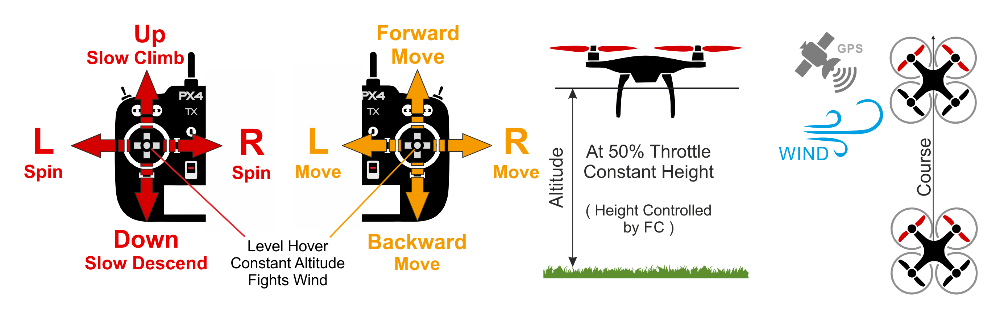

# PX4 비행 모드 개요

비행 모드는 자동 조종 장치가 원격 제어에 응답하는 방법과 자율 비행 중 기체를 관리하는 방법을 정의합니다.

이 모드는 이륙 및 착륙과 같은 일반적인 작업의 자동화에서 다시 수평 비행을 하기 쉽도록 고정된 경로 또는 위치로 기체를 유지하는 메커니즘에 이르기까지 사용자(조종사)에게 다양한 유형/수준의 자동 조종을 도와줍니다.

이 항목에서는 비행 모드에 대한 개요와 MC(multicopter), FW (fixed-wing) 및 VTOL 프레임에서의 기본 동작의 차이점(대부분 사소함)을 설명합니다.

:::tip
특정 비행 모드에 대한 자세한 정보는 [비행 > 비행 모드](../flight_modes/README.md)에서 확인할 수 있습니다.
:::

## 모드 전환

조종사는 원격 조종 장치 또는 지상 통제 장치의 스위치를 사용하여 비행 모드를 전환할 수 있습니다. ([비행 모드 구성](../config/flight_mode.md) 참조).

모든 비행기 유형에서 모든 비행 모드를 사용할 수 있는 것은 아니며 일부 모드는 비행기 유형에 따라 동작 방식의 차이가 있을 수 있습니다.

일부 비행 모드는 특정 비행 전 및 비행 중 상태(예 : GPS 잠금 장치, 속도 센서, 축을 따라 비행기의 자세 감지)에서만 유의미합니다. PX4는 적절한 조건이 충족될 때까지 해당 모드로의 전환을 허용하지 않습니다.

마지막으로, [ 자율 모드 ](#categories)에서 RC 스틱 이동은 멀티 콥터로 비행 할 때 [ 기본적으로 ](../advanced_config/parameter_reference.md#COM_RC_OVERRIDE) 차량을 [ 위치 모드 ](../flight_modes/position_mc.md)로 변경합니다 (중요한 배터리 안전 장치) 고정익 비행에서는 스틱 이동이 무시됩니다.

## 자율 모드와 수동 모드

비행 모드에는 *수동* 모드와 *자동* 모드가 있습니다. 수동 모드는 사용자가 RC 컨트롤 스틱(또는 조이스틱)을 통해 비행기를 제어하며, 자율 모드는 자동 조종 프로그램으로 제어되며 조종사나 원격 제어 입력은 필요하지 않습니다.

::tip 일부 수동 모드에는 자동 조종 보조 기능이 있어 비행 제어을 보다 쉽게할 수 있습니다. 예를 들어, 대부분의 모드는 RC 스틱이 중앙에있을 때 운송체의 수평을 유지합니다.
:::

수동 모드는 "간편" 모드와 "곡예" 모드로 더 나눌 수 있습니다. 간편 모드에서 롤 및 피치 스틱은 차량 각도를 설정하여 *수평면*을 기준으로 각각 좌우 및 전진 이동합니다. 이렇게하면 움직임을 예측할 수있을뿐만 아니라 각도가 제어되기 때문에 차량을 뒤집을 수 없습니다. 곡예 모드에서 RC 스틱은 각 회전 속도를 제어합니다 (각 축 주변). 차량은 뒤집힐 수 있으며 기동성이 더 높지만 비행하기가 더 어렵습니다.

고정익:

* 수동 간편 : [위치](#position_fw), [고도](#altitude_fw), [안정화](#stabilized_fw), [수동](#manual_fw)
* 수동 곡예 : [곡예](#acro_fw)
* 자율 : [Hold](#hold_fw), [복귀](#return_fw), [미션](#mission_fw), [이륙](#takeoff_fw), [착륙](#land_fw), [오프 보드 ](#offboard_fw)

멀티콥터:

* 수동 간편 : [위치](#position_mc), [고도](#altitude_mc), [수동/안정화](#manual_stabilized_mc), [궤도](#orbit_mc)
* 수동 곡예 : [Rattitude](#rattitude_mc), [ Acro ](#acro_mc)
* 자율 : [유지](#hold_mc), [복귀](#return_mc), [미션](#mission_mc), [이륙](#takeoff_mc), [착륙](#land_mc), [나를 따르나](#followme_mc)[오프 보드](#offboard_mc)

## 핵심

아래 아이콘은 문서 내에서 사용됩니다.</td> 

<td>
  수동 모드 원격 제어 필수.
</td></tr> 

<tr>
  <td>
    </td> 
    
    <td>
      자동 모드. RC 제어는 모드 변경을 제외하고 기본적으로 비활성화되어 있습니다.
    </td></tr> 
    
    <tr>
      <td>
        </td> 
        
        <td>
          위치 수정이 필요(예 : GPS, VIO 또는 기타 위치 확인 시스템).
        </td></tr> 
        
        <tr>
          <td>
            
          </td>
          
          <td>
            필요한 고도 (예 : 기압계, 거리계).
          </td>
        </tr>
        
        <tr>
          <td>
            <a href="#key_difficulty">&nbsp;&nbsp;</a></td> 
            
            <td>
              비행 모드 난이도 (초급 ~ 고급)
            </td></tr> </tbody> </table> 
            
            

              

            

            
            <h2>
              멀티콥터
            </h2>
            
            

              

            

            
            <h3>
              위치 모드
            </h3>
            
            

              &nbsp;&nbsp;
            

            
            

              <a href="../flight_modes/position_mc.md">위치 모드</a>는 롤 앤 피치 스틱이지면에서 좌우 방향 및 전후 방향으로 속도를 제어하는 비행하기 쉬운 RC 모드입니다 (차량의 "전방"기준). 스틱을 풀거나 중앙에 놓으면 차량이 능동적으로 제동하고 수평을 맞추고 3D 공간의 위치에 고정되어 바람과 기타 힘을 보상합니다.
            

            
            

              :::tip 위치 모드는 새 전단지를위한 가장 안전한 수동 모드입니다. <a href="#altitude_mc">고도</a> 및 <a href="#manual_stabilized_mc">수동 / 안정화</a> 모드와 달리, 차량은 바람의 저항에 의해 감속 될 때까지 계속되는 대신 스틱이 중앙에있을 때 정지합니다.
:::
            

            
            

              
            

            
            

              

            

            
            <h3>
              고도 모드
            </h3>
            
            

              &nbsp;&nbsp;
            

            
            

              <a href="../flight_modes/altitude_mc.md">고도 모드</ 0>는 <em>상대적으로</em> 비행하기 쉬운 RC 모드로, 롤 및 피치 스틱이 차량 이동을 좌우 및 앞뒤 방향(차량의 "전면" 기준)으로 제어하고, 요 스틱은 수평면에서 회전 속도를 제어하고 스로틀은 상승 하강 속도를 제어합니다.
 
              
              

                스틱을 놓거나 중앙에 놓으면 차량이 수평을 유지하고 현재 <em>고도</em>를 유지합니다. 수평면에서 이동하는 경우 차량은 바람 저항에 의해 모멘텀이 소실 될 때까지 계속됩니다. 바람이 불면 기체는 바람의 방향으로 표류합니다.
              

              
              

                :::tip <em>자세 모드< 0>는 초보 비행자에게 가장 안전한 비 GPS 수동 모드입니다. <a href="#manual_stabilized_mc">수동 / 안정화</a> 모드와 비슷하지만 스틱을 놓으면 차량 고도가 추가로 안정화됩니다. :::
 
                
                

                  
                

                
                

                  

                

                
                <h3>
                  수동/안정화 모드
                </h3>
                
                

                  &nbsp;&nbsp;
                

                
                

                  <a href="../flight_modes/manual_stabilized_mc.md"> 수동 / 안정화 </a>모드는 RC 조종 스틱이 중앙에있을 때 멀티 콥터를 안정화합니다. 기체를 수동으로 움직이거나 조종하려면 스틱을 중앙의 바깥쪽으로 움직입니다.
                

                
                

                  :::note 이 멀티 콥터 모드는 MC 차량에 대해 <em>수동</em> 또는 <em>안정화</em> 모드를 설정하면 활성화됩니다.
:::
                

                
                

                  수동 제어시 롤 및 피치 스틱은 차량의 각도(태도)를 제어하고, 요 스틱은 수평면 위의 회전 속도를 제어하며 스로틀은 고도/속도를 제어합니다.
                

                
                

                  조종 스틱을 놓으면 중앙 데드 존으로 돌아갑니다. 멀티 콥터는 수평을 유지하고 롤 및 피치 스틱이 중앙에 오면 멈추게 됩니다. 차량은 적절한 균형을 유지하고 스로틀이 적절하게 설정되어 있고 외부 힘이 가해지지 않는 경우 (예 : 바람) 제자리에서 호버링(고도 유지) 합니다. 항공기는 바람의 방향으로 표류하고 고도를 유지하기 위해 스로틀을 제어해야합니다.
                

                
                

                  
                

                
                

                  

                

                
                <h3>
                  Rattitude
                </h3>
                
                

                  &nbsp;&nbsp;
                

                
                

                  <a href="../flight_modes/rattitude_mc.md">Rattitude mode</a> allows pilots to fly using <a href="#manual_stabilized_mc">Manual/Stabilized</a> flight most of the time, but still perform <a href="#acro_mc">Acro mode</a>-style flips and tricks when desired.
                

                
                

                  The vehicle behaves as in <em>Manual/Stabilized mode</em> when the Roll/Pitch stick is moved within the central area and like <em>Acro mode</em> when the stick is moved in the outer circumference (by default Manual/Stabilized mode occupies about 80% of the range). When the sticks are centered the multicopter will level out (but will still drift in the direction of any wind and with any pre-existing momentum).
                

                
                <!-- Image missing: https://github.com/PX4/px4_user_guide/issues/189 -->
                
                

                  

                

                
                <h3>
                  Acro Mode
                </h3>
                
                

                  &nbsp;&nbsp;
                

                
                

                  <a href="../flight_modes/acro_mc.md">Acro mode</a> is the RC mode for performing acrobatic maneuvers e.g. rolls and loops.
                

                
                

                  The roll, pitch and yaw sticks control the rate of angular rotation around the respective axes and throttle is passed directly to the output mixer. When sticks are centered the vehicle will stop rotating, but remain in its current orientation (on its side, inverted, or whatever) and moving according to its current momentum.
                

                
                

                  
                

                
                <!-- image above incorrect: https://github.com/PX4/px4_user_guide/issues/182 -->
                
                

                  

                

                
                <h3>
                  Orbit Mode
                </h3>
                
                

                  &nbsp;
                

                
                

                  The <a href="../flight_modes/orbit.md">Orbit mode</a> allows you to command a multicopter (or VTOL in multicopter mode) to fly in a circle, yawing so that it always faces towards the center.
                

                
                

                  A GCS is <em>required</em> to enable the mode, and to set the center position and initial radius of the orbit. By default the vehicle will then perform a slow ongoing orbit around the center position (1m/s) in a clockwise direction. RC control is optional, and can be used to change the orbit altitude, radius, speed, and direction.
                

                
                

                  
                

                
                

                  

                

                
                <h3>
                  Hold Mode
                </h3>
                
                

                  &nbsp;
                

                
                

                  <a href="../flight_modes/hold.md">Hold mode</a> causes the multicopter to stop and hover at its current position and altitude (maintaining position against wind and other forces). The mode can be used to pause a mission or to help regain control of a vehicle in an emergency. It can be activated with a pre-programmed RC switch or the <em>QGroundControl</em> <strong>Pause</strong> button.
                

                
                

                  

                

                
                <h3>
                  Return Mode
                </h3>
                
                

                  &nbsp;
                

                
                

                  <a href="../flight_modes/return.md">Return mode</a> causes the vehicle to fly a clear path to a safe location. The mode may be activated manually (via a pre-programmed RC switch) or automatically (i.e. in the event of a <a href="../config/safety.md">failsafe</a> being triggered).
                

                
                

                  The return behaviour depends on parameter settings, and may follow a mission path and/or mission landing pattern (if defined). By default a mulitcopter will simply ascend to a safe height, fly to its home position, and then land.
                

                
                

                  

                

                
                <h3>
                  Mission Mode
                </h3>
                
                

                  &nbsp;
                

                
                

                  <a href="../flight_modes/mission.md">Mission mode</a> causes the vehicle to execute a predefined autonomous <a href="../flying/missions.md">mission</a> (flight plan) that has been uploaded to the flight controller. The mission is typically created and uploaded with a Ground Control Station (GCS) application.
                

                
                

                  :::tip The PX4 GCS is called <a href="https://docs.qgroundcontrol.com/en/">QGroundControl</a>. <em>QGroundControl</em> is the same application we use for <a href="../config/README.md">configuring PX4</a>.
:::
                

                
                

                  

                

                
                <h3>
                  Takeoff Mode
                </h3>
                
                

                  &nbsp;
                

                
                

                  <a href="../flight_modes/takeoff.md">Takeoff</a> mode causes the multicopter to climb vertically to takeoff altitude and hover in position.
                

                
                

                  

                

                
                <h3>
                  Land Mode
                </h3>
                
                

                  &nbsp;
                

                
                

                  <a href="../flight_modes/land.md">Land mode</a> causes the multicopter to land at the location at which the mode was engaged.
                

                
                

                  

                

                
                <h3>
                  Follow Me Mode
                </h3>
                
                

                  &nbsp;
                

                
                

                  <a href="../flight_modes/follow_me.md">Follow Me mode</a> causes a multicopter to autonomously follow and track a user providing their current position setpoint. Position setpoints might come from an Android phone/tablet running <em>QGroundControl</em> or from a MAVSDK app.
                

                
                

                  

                

                
                <h3>
                  Offboard Mode
                </h3>
                
                

                  &nbsp;
                

                
                

                  <a href="../flight_modes/offboard.md">Offboard mode</a> causes the multicopter to obey a position, velocity or attitude setpoint provided over MAVLink.
                

                
                

                  :::note This mode is intended for companion computers and ground stations!
:::
                

                
                

                  

                

                
                <h2>
                  Fixed-Wing
                </h2>
                
                

                  

                

                
                <h3>
                  Position Mode
                </h3>
                
                

                  &nbsp;&nbsp;
                

                
                

                  <a href="../flight_modes/position_fw.md">Position mode</a> is an easy-to-fly RC mode in which, when the sticks are released/centered, the vehicle will level and fly a straight line ground track in the current direction — compensating for wind and other forces.
                

                
                

                  The throttle determines airspeed (at 50% throttle the aircraft will hold its current altitude with a preset cruise speed). Pitch is used to ascend/descend. Roll, pitch and yaw are all angle-controlled (so it is impossible to roll over or loop the vehicle).
                

                
                

                  :::tip Position mode is the safest fixed-wing manual mode for new fliers.
:::
                

                
                

                  
                

                
                

                  

                

                
                <h3>
                  Altitude Mode
                </h3>
                
                

                  &nbsp;&nbsp;
                

                
                

                  <a href="../flight_modes/altitude_fw.md">Altitude mode</a> makes it easier for users to control vehicle altitude, and in particular to reach and maintain a fixed altitude. The mode will not attempt to hold the vehicle course against wind.
                

                
                

                  The climb/descent rate is controlled via the pitch/elevator stick. Once centered the autopilot latches onto the current altitude and will maintain it during yaw/roll, and at any airspeed. The throttle input controls airspeed. Roll and pitch are angle-controlled (so it is impossible to roll over or loop the vehicle).
                

                
                

                  When all remote control inputs are centered (no roll, pitch, yaw, and ~50% throttle) the aircraft will return to straight, level flight (subject to wind) and keep its current altitude.
                

                
                

                  :::tip <em>Altitude mode</em> is the safest non GPS guided mode appropriate for beginners learning how to fly. It is just like <a href="#manual_fw">Manual</a> mode but additionally stabilizes the vehicle altitude when the pitch stick is released.
:::
                

                
                

                  
                

                
                

                  

                

                
                <h3>
                  Stabilized Mode
                </h3>
                
                

                  &nbsp;&nbsp;
                

                
                

                  <a href="../flight_modes/stabilized_fw.md">Stabilized mode</a> puts the vehicle into straight and level flight when the RC sticks are centered, maintaining the horizontal posture against wind (but not vehicle heading and altitude).
                

                
                

                  The vehicle climb/descends based on pitch input and performs a coordinated turn if the roll/pitch sticks are non-zero. Roll and pitch are angle controlled (you can't roll upside down or loop).
                

                
                

                  :::tip <em>Stabilized mode</em> is much easier to fly than <a href="#manual_fw">Manual mode</a> because you can't roll or flip it, and it is easy to level the vehicle by centering the control sticks.
:::
                

                
                

                  The vehicle will glide if the throttle is lowered to 0% (motor stops). In order to perform a turn the command must beheld throughout the maneuver because if the roll is released the plane will stop turning and level itself (the same is true for pitch and yaw commands).
                

                
                

                  
                

                
                

                  

                

                
                <h3>
                  Acro Mode
                </h3>
                
                

                  &nbsp;&nbsp;
                

                
                

                  <a href="../flight_modes/acro_fw.md">Acro mode</a> is the RC mode for performing acrobatic maneuvers e.g. rolls, flips, stalls and acrobatic figures.
                

                
                

                  The roll, pitch and yaw sticks control the rate of angular rotation around the respective axes and throttle is passed directly to the output mixer. When sticks are centered the vehicle will stop rotating, but remain in its current orientation (on its side, inverted, or whatever) and moving according to its current momentum.
                

                
                

                  
                

                
                

                  

                

                
                <h3>
                  Manual Mode
                </h3>
                
                

                  &nbsp;&nbsp;
                

                
                

                  <a href="../flight_modes/manual_fw.md">Manual mode</a> sends RC stick input directly to the output mixer for "fully" manual control.
                

                
                

                  :::tip This is the hardest mode to fly, because nothing is stabilised. Unlike <a href="#acro_fw">Acro Mode</a> if the RP stick is centered the vehicle will not automatically stop rotating around the axis - the pilot actually has to move the stick to apply force in the other direction.
:::
                

                
                

                  :::note This is the only mode that overrides the FMU (commands are sent via the safety coprocessor). It provides a safety mechanism that allows full control of throttle, elevator, ailerons and rudder via RC in the event of an FMU firmware malfunction.
:::
                

                
                

                  

                

                
                <h3>
                  Hold Mode
                </h3>
                
                

                  &nbsp;
                

                
                

                  <a href="../flight_modes/hold.md">Hold</a> causes a fixed-wing vehicle to start circling around the current position at its current altitude. The mode can be used to pause a mission or to help regain control of a vehicle in an emergency. It can be activated with a pre-programmed RC switch or the <em>QGroundControl</em> <strong>Pause</strong> button.
                

                
                

                  

                

                
                <h3>
                  Return Mode
                </h3>
                
                

                  &nbsp;
                

                
                

                  <a href="../flight_modes/return.md">Return mode</a> causes the vehicle to fly a clear path to a safe location. The mode may be activated manually (via a pre-programmed RC switch) or automatically (i.e. in the event of a <a href="../config/safety.md">failsafe</a> being triggered).
                

                
                

                  The return behaviour depends on parameter settings, and may follow a mission path and/or mission landing pattern (if defined). By default a fixed wing vehicle will ascend to a safe height and use a mission landing pattern if one exists, otherwise it will fly to the home position and circle.
                

                
                

                  

                

                
                <h3>
                  Mission Mode
                </h3>
                
                

                  &nbsp;
                

                
                

                  <a href="../flight_modes/mission.md">Mission mode</a> causes the vehicle to execute a predefined autonomous <a href="../flying/missions.md">mission</a> (flight plan) that has been uploaded to the flight controller. The mission is typically created and uploaded with a Ground Control Station (GCS) application.
                

                
                

                  :::tip The PX4 GCS is called <a href="https://docs.qgroundcontrol.com/en/">QGroundControl</a>. <em>QGroundControl</em> is the same application we use for <a href="../config/README.md">configuring PX4</a>.
:::
                

                
                

                  

                

                
                <h3>
                  Takeoff Mode
                </h3>
                
                

                  &nbsp;
                

                
                

                  <a href="../flight_modes/takeoff.md#fixed_wing">Takeoff mode</a> initiates the vehicle takeoff sequence. The specific launch behaviour depends on the configured takeoff mode (catapult/hand-launch mode or runway takeoff mode).
                

                
                

                  

                

                
                <h3>
                  Land Mode
                </h3>
                
                

                  &nbsp;
                

                
                

                  <a href="../flight_modes/land.md">Land mode</a> causes the vehicle to turn and land at the location at which the mode was engaged. Fixed wing landing logic and parameters are explained in the topic: <a href="../flying/fixed_wing_landing.md">Landing (Fixed Wing)</a>.
                

                
                

                  

                

                
                <h3>
                  Offboard Mode
                </h3>
                
                

                  &nbsp;
                

                
                

                  <a href="../flight_modes/offboard.md">Offboard mode</a> causes the fixed wing vehicle to obey attitude setpoints provided over MAVLink.
                

                
                

                  :::note This mode is intended for companion computers and ground stations!
:::
                

                
                <h2>
                  Vertical Take Off and Landing (VTOL)
                </h2>
                
                

                  A VTOL aircraft can fly as either a multicopter or as fixed-wing vehicle. The multicopter mode is mainly used for take off and landing while the fixed wing mode is used for efficient travel and/or mission execution.
                

                
                

                  Generally the flight modes for VTOL vehicles are the same as for <a href="#mc_flight_modes">multicopter</a> when flying in MC mode and <a href="#fw_flight_modes">fixed-wing</a> when flying in FW mode.
                

                
                

                  The switch between modes is initiated either by the pilot using an RC switch or automatically by PX4 when needed in the Auto modes.
                

                
                

                  A few notes:
                

                
                <ul>
                  <li>
                    VTOL <a href="../flight_modes/return.md">Return mode</a> uses a mission landing by default, if defined.
                  </li>
                </ul>
                
                <h2>
                  Further Information
                </h2>
                
                <ul>
                  <li>
                    <a href="../flight_modes/README.md">Flying > Flight Modes</a> - Detailed technical explanation of all modes
                  </li>
                  <li>
                    <a href="../config/flight_mode.md">Basic Configuration > Flight Modes</a> - How to map RC control switches to specific flight modes
                  </li>
                </ul>