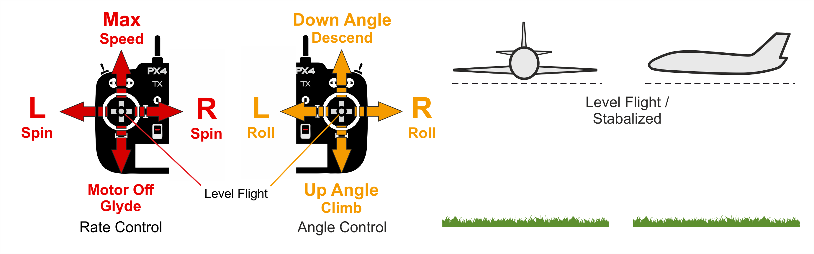

# PX4 비행 모드 개요

비행 모드는 자동 조종 장치가 원격 제어에 응답하는 방법과 자율 비행 중 기체를 관리하는 방법을 정의합니다.

이 모드는 이륙 및 착륙과 같은 일반적인 작업의 자동화에서 다시 수평 비행을 하기 쉽도록 고정된 경로 또는 위치로 기체를 유지하는 메커니즘에 이르기까지 사용자(조종사)에게 다양한 유형/수준의 자동 조종을 도와줍니다.

이 항목에서는 비행 모드에 대한 개요와 MC(Multi-Copter), FW (Fixed-Wing) 및 VTOL(Vertical Take-Off and Landing) 간의 차이점(대부분 사소함)에 대하여 설명합니다.

:::tip
특정 비행 모드에 대한 자세한 정보는 [비행 > 비행 모드](../flight_modes/README.md)에서 확인할 수 있습니다.
:::

## 모드 전환

조종사는 원격 조종 장치 또는 지상 통제 장치의 스위치를 사용하여 비행 모드를 전환할 수 있습니다. ([비행 모드 구성](../config/flight_mode.md) 참조).

모든 비행기 유형에서 모든 비행 모드를 사용할 수 있는 것은 아니며 일부 모드는 비행기 유형에 따라 동작 방식의 차이가 있을 수 있습니다.

일부 비행 모드는 특정 비행 전 및 비행 중 상태(예 : GPS 잠금 장치, 속도 센서, 축을 따라 비행기의 자세 감지)에서만 유의미합니다. PX4는 적절한 조건이 충족될 때까지 해당 모드로의 전환을 허용하지 않습니다.

마지막으로, [ 자율 모드 ](#categories)에서 RC 스틱 이동은 멀티 콥터로 비행 할 때 [ 기본적으로 ](../advanced_config/parameter_reference.md#COM_RC_OVERRIDE) 차량을 [ 위치 모드 ](../flight_modes/position_mc.md)로 변경합니다 (중요한 배터리 안전 장치) 고정익 비행에서는 스틱 이동이 무시됩니다.

## 자율 모드와 수동 모드

비행 모드에는 *수동* 모드와 *자동* 모드가 있습니다. 수동 모드는 사용자가 RC 컨트롤 스틱(또는 조이스틱)을 통해 비행기를 제어하며, 자율 모드는 자동 조종 프로그램으로 제어되며 조종사나 원격 제어 입력은 필요하지 않습니다.

:::tip
일부 수동 모드에는 자동 조종 보조 기능이 있어 비행 제어을 보다 쉽게할 수 있습니다. 예를 들어, 대부분의 모드는 RC 스틱이 중앙에있을 때 운송체의 수평을 유지합니다.
:::

수동 모드는 "간편" 모드와 "곡예" 모드로 더 나눌 수 있습니다. 간편 모드에서 롤 및 피치 스틱은 차량 각도를 설정하여 *수평면*을 기준으로 각각 좌우 및 전진 이동합니다. 이렇게하면 움직임을 예측할 수있을뿐만 아니라 각도가 제어되기 때문에 차량을 뒤집을 수 없습니다. 곡예 모드에서 RC 스틱은 각 회전 속도를 제어합니다 (각 축 주변). 차량은 뒤집힐 수 있으며 기동성이 더 높지만 비행하기가 더 어렵습니다.

고정익

* 수동 간편 : [위치](#position_fw), [고도](#altitude_fw), [안정화](#stabilized_fw), [수동](#manual_fw)
* 수동 곡예 : [곡예](#acro_fw)
* 자율 : [유지](#hold_fw), [복귀](#return_fw), [미션](#mission_fw), [이륙](#takeoff_fw), [착륙](#land_fw), [오프보드](#offboard_fw)

멀티콥터

* 수동 간편 : [위치](#position_mc), [고도](#altitude_mc), [수동/안정화](#manual_stabilized_mc), [궤도](#orbit_mc)
* 수동 곡예 : [Rattitude](#rattitude_mc), [ Acro ](#acro_mc)
* 자율 : [유지](#hold_mc), [복귀](#return_mc), [미션](#mission_mc), [이륙](#takeoff_mc), [착륙](#land_mc), [나를 따르나](#followme_mc), [오프 보드](#offboard_mc)

## 요점

아래 아이콘은 문서 내에서 사용됩니다:</td> 

<td>
  수동 모드 원격 제어 필수.
</td></tr> 

<tr>
  <td>
    </td> 
    
    <td>
      자동 모드. RC 제어는 모드 변경을 제외하고 기본적으로 비활성화되어 있습니다.
    </td></tr> 
    
    <tr>
      <td>
        </td> 
        
        <td>
          위치 수정이 필요(예 : GPS, VIO 또는 기타 위치 확인 시스템).
        </td></tr> 
        
        <tr>
          <td>
            
          </td>
          
          <td>
            필요한 고도 (예 : 기압계, 거리계).
          </td>
        </tr>
        
        <tr>
          <td>
            <a href="#key_difficulty">&nbsp;&nbsp;</a></td> 
            
            <td>
              비행 모드 난이도 (초급 ~ 고급)
            </td></tr> </tbody> </table> 
            
            

              

            

            
            <h2>
              멀티콥터
            </h2>
            
            

              

            

            
            <h3>
              위치 모드
            </h3>
            
            

              &nbsp;&nbsp;
            

            
            

              <a href="../flight_modes/position_mc.md">위치 모드</a>는 롤 앤 피치 스틱이지면에서 좌우 방향 및 전후 방향으로 속도를 제어하는 비행하기 쉬운 RC 모드입니다 (차량의 "전방"기준). 스틱을 풀거나 중앙에 놓으면 차량이 능동적으로 제동하고 수평을 맞추고 3D 공간의 위치에 고정되어 바람과 기타 힘을 보상합니다.
            

            
            

:::tip
위치 모드는 새 전단지를위한 가장 안전한 수동 모드입니다. <a href="#altitude_mc">고도</a> 및 <a href="#manual_stabilized_mc">수동 / 안정화</a> 모드와 달리, 차량은 바람의 저항에 의해 감속 될 때까지 계속되는 대신 스틱이 중앙에있을 때 정지합니다.
:::
            

            
            

              
            

            
            

              

            

            
            <h3>
              고도 모드
            </h3>
            
            

              &nbsp;&nbsp;
            

            
            

              <a href="../flight_modes/altitude_mc.md">고도 모드</ 0>는 <em>상대적으로</em> 비행하기 쉬운 RC 모드로, 롤 및 피치 스틱이 차량 이동을 좌우 및 앞뒤 방향(차량의 "전면" 기준)으로 제어하고, 요 스틱은 수평면에서 회전 속도를 제어하고 스로틀은 상승 하강 속도를 제어합니다.
 
              
              

                스틱을 놓거나 중앙에 놓으면 차량이 수평을 유지하고 현재 <em>고도</em>를 유지합니다. 수평면에서 이동하는 경우 차량은 바람 저항에 의해 모멘텀이 소실 될 때까지 계속됩니다. 바람이 불면 기체는 바람의 방향으로 표류합니다.
              

              
              

:::tip
<em>자세 모드< 0>는 초보 비행자에게 가장 안전한 비 GPS 수동 모드입니다. <a href="#manual_stabilized_mc">수동 / 안정화</a> 모드와 비슷하지만 스틱을 놓으면 차량 고도가 추가로 안정화됩니다. :::
 
                
                

                  
                

                
                

                  

                

                
                <h3>
                  수동/안정화 모드
                </h3>
                
                

                  &nbsp;&nbsp;
                

                
                

                  <a href="../flight_modes/manual_stabilized_mc.md"> 수동 / 안정화 </a>모드는 RC 조종 스틱이 중앙에있을 때 멀티 콥터를 안정화합니다. 기체를 수동으로 움직이거나 조종하려면 스틱을 중앙의 바깥쪽으로 움직입니다.
                

                
                

:::note
이 멀티 콥터 모드는 MC 차량에 대해 <em>수동</em> 또는 <em>안정화</em> 모드를 설정하면 활성화됩니다.
:::
                

                
                

                  수동 제어시 롤 및 피치 스틱은 차량의 각도(태도)를 제어하고, 요 스틱은 수평면 위의 회전 속도를 제어하며 스로틀은 고도/속도를 제어합니다.
                

                
                

                  조종 스틱을 놓으면 중앙 데드 존으로 돌아갑니다. 멀티 콥터는 수평을 유지하고 롤 및 피치 스틱이 중앙에 오면 멈추게 됩니다. 차량은 적절한 균형을 유지하고 스로틀이 적절하게 설정되어 있고 외부 힘이 가해지지 않는 경우 (예 : 바람) 제자리에서 호버링(고도 유지) 합니다. 항공기는 바람의 방향으로 표류하고 고도를 유지하기 위해 스로틀을 제어해야합니다.
                

                
                

                  
                

                
                

                  

                

                
                <h3>
                  Rattitude
                </h3>
                
                

                  &nbsp;&nbsp;
                

                
                

                  <a href="../flight_modes/rattitude_mc.md">Rattitude 모드</a>를 사용하면 조종사가 대부분 <a href="#manual_stabilized_mc">수동 / 안정</a> 비행을 사용하여 비행 할 수 있지만 원하는 경우 <a href="#acro_mc">Acro 모드</a> 스타일의 플립과 트릭을 수행 할 수 있습니다.
                

                
                

                  롤/피치 스틱이 중앙 영역 내에서 움직일 때 차량은 <em>수동/안정화 모드</em>에서와 같이 작동하고 스틱이 기본적으로 외주에서 움직일 때 <em>Acro 모드</em>처럼 작동합니다. 수동/안정화 모드는 약 80%를 차지합니다. 스틱이 중앙에 오면 멀티 콥터가 수평을 이룹니다 (하지만 바람의 방향과 기존의 모멘텀으로 계속 표류합니다).
                

                
                <!-- Image missing: https://github.com/PX4/px4_user_guide/issues/189 -->
                
                

                  

                

                
                <h3>
                  Acro 모드
                </h3>
                
                

                  &nbsp;&nbsp;
                

                
                

                  <a href="../flight_modes/acro_mc.md"> 아크로 모드 </a>는 곡예 비행을 수행하기위한 RC 모드입니다. 롤, 플립, 노점 및 곡예 인물.
                

                
                

                  롤, 피치 및 요 스틱은 각 축을 중심으로 한 각도 회전 속도를 제어하고 조절판은 직접 출력 믹서로 전달됩니다. 스틱이 중앙에 놓여지면 기체는 회전을 멈추지만 현재 방향 (측면, 반전 등) 과 현재 모멘텀에 따라 움직입니다.
                

                
                

                  
                

                
                <!-- image above incorrect: https://github.com/PX4/px4_user_guide/issues/182 -->
                
                

                  

                

                
                <h3>
                  궤도 모드
                </h3>
                
                

                  &nbsp;
                

                
                

                  <a href="../flight_modes/orbit.md">궤도 모드</a>를 사용하면 멀티 콥터 (또는 멀티 콥터 모드의 VTOL)가 원을 그리며 날아 가며 항상 중심을 향하도록 요잉할 수 있습니다.
                

                
                

                  이 모드를 활성화하고 궤도의 중심 위치와 초기 반경을 설정하려면 GCS(지상제어 프로그램)가 <em> 필요합니다 </em>. 기본적으로 차량은 시계 방향으로 중앙 위치 (1 m/s)를 중심으로 천천히 진행하는 궤도를 수행합니다. RC 제어는 선택 사항이며 궤도 고도, 반경, 속도 및 방향을 변경하는 데 사용할 수 있습니다.
                

                
                

                  
                

                
                

                  

                

                
                <h3>
                  유지 모드
                </h3>
                
                

                  &nbsp;
                

                
                

                  <a href="../flight_modes/hold.md"> 유지 모드 </a>는 멀티 콥터가 현재 위치와 고도에서 멈추고 호버링하도록합니다 (바람과 다른 힘에 대한 위치 유지). 유지 모드를 사용하여 임무를 일시 중지하거나 비상시 기체를 다시 제어할 수 있습니다. 사전 프로그래밍 된 RC 스위치 또는 <em> QGroundControl </em> <strong>일시 정지</strong> 버튼으로 활성화 할 수 있습니다.
                

                
                

                  

                

                
                <h3>
                  복귀 모드
                </h3>
                
                

                  &nbsp;
                

                
                

                  <a href="../flight_modes/return.md">복귀 모드</a>는 차량이 안전한 위치로 명확한 경로를 비행하도록합니다. 이 모드는 수동 (사전 프로그래밍 된 RC 스위치를 통해) 또는 자동 (즉, <a href="../config/safety.md">사고 방지</a>가 트리거되는 경우)으로 활성화 될 수 있습니다.
                

                
                

                  반환 동작은 매개 변수 설정에 따라 다르며 임무 경로나 임무 착륙 패턴 (정의 된 경우)을 따라서 동작합니다. 기본적으로 멀티 콥터는 안전한 높이로 상승하고 홈 위치로 날아간 다음 착륙합니다.
                

                
                

                  

                

                
                <h3>
                  임무 모드
                </h3>
                
                

                  &nbsp;
                

                
                

                  <a href="../flight_modes/mission.md">임무 모드</a>는 비행 제어기에 업로드 된 사전 정의 된 자율 <a href="../flying/missions.md">임무</a> (비행 계획)을 실행합니다. 임무는 일반적으로 지상 관제소 (GCS) 애플리케이션으로 생성 및 업로드됩니다.
                

                
                

                  :::tip PX4의 GCS는 <a href="https://docs.qgroundcontrol.com/en/">QGroundControl </a>입니다. <em>QGroundControl</em>은 <a href="../config/README.md">PX4 설정</a>에 사용하는 것과 동일한 프로그램입니다.
:::
                

                
                

                  

                

                
                <h3>
                  이륙 모드
                </h3>
                
                

                  &nbsp;
                

                
                

                  <a href="../flight_modes/takeoff.md">이륙</a> 모드는 멀티 콥터가 이륙 고도까지 수직으로 올라가 제자리에서 호버링합니다.
                

                
                

                  

                

                
                <h3>
                  착륙 모드
                </h3>
                
                

                  &nbsp;
                

                
                

                  <a href="../flight_modes/land.md">착륙 모드</a>는 멀티 콥터가 모드가 작동 된 위치로 착륙하도록합니다.
                

                
                

                  

                

                
                <h3>
                  추적 모드
                </h3>
                
                

                  &nbsp;
                

                
                

                  <a href="../flight_modes/follow_me.md">추적 모드 </a>는 멀티 콥터가 현재 위치 설정 값을 제공하는 사용자를 자율적으로 추적합니다. 위치 설정 값은 <em>QGroundControl</em>을 실행하는 Android 휴대 전화/태블릿 또는 MAVSDK 앱에서 가져올 수 있습니다.
                

                
                

                  

                

                
                <h3>
                  오프보드(Offboard) 모드
                </h3>
                
                

                  &nbsp;
                

                
                

                  <a href="../flight_modes/offboard.md">오프 보드 모드</a>는 멀티 콥터가 MAVLink를 통해 제공되는 위치, 속도 또는 자세 설정 값을 따르도록합니다.
                

                
                

:::note
이 모드는 보조 컴퓨터와 지상관제소 픅로그램을 위한 것입니다!
:::
                

                
                

                  

                

                
                <h2>
                  고정익
                </h2>
                
                

                  

                

                
                <h3>
                  위치 모드
                </h3>
                
                

                  &nbsp;&nbsp;
                

                
                

                  <a href="../flight_modes/position_fw.md">포지션 모드</a>는 스틱을 놓거나 중앙에 놓을 때 기체가 바람 등의 외부 요인에도 지면 트랙에 대하여 수평과 직진 방향의 비행이 용이한 RC 모드입니다.
                

                
                

                  스로틀은 대기 속도를 결정합니다 (스로틀 50 %에서 기체는 사전 설정된 순항 속도로 현재 고도를 유지합니다). 피치는 상승/하강하는 데 사용됩니다. 롤, 피치 및 요는 모두 각도로 제어됩니다 (따라서 차량을 롤오버하거나 루프 할 수 없음).
                

                
                

:::tip
자세 모드< 0>는 초보 비행자에게 가장 안전한 비 GPS 수동 모드입니다.
:::
                

                
                

                  
                

                
                

                  

                

                
                <h3>
                  고도 모드
                </h3>
                
                

                  &nbsp;&nbsp;
                

                
                

                  <a href="../flight_modes/altitude_fw.md">고도</a> 비행모드는 사용자가 기체의 고도를 제어 및 특정 고도를 유지가 용이합니다. 이 모드에서는 바람이 불 때는 기체는 방향을 유지하지 않습니다.
                

                
                

                  기체의 상승/하강률을 피치/엘리베이터 스틱을 이용하여 제어합니다. 일단 중앙에 위치하면 자동 조종 장치가 현재 고도에 고정되고 요/롤 및 모든 대기 속도에서이를 유지합니다. 스로틀 입력은 대기 속도를 제어합니다. 롤과 피치는 각도로 제어됩니다 (따라서 차량을 롤오버하거나 루프 할 수 없습니다).
                

                
                

                  모든 원격 제어 입력이 중앙에있을 때 (롤, 피치, 요 및 ~ 50 % 스로틀 없음) 기체는 직선, 수평 비행 (바람에 따라)으로 돌아가 현재 고도를 유지합니다.
                

                
                

:::tip
<em>고도 모드</em>는 비행 방법을 배우는 초보자에게 적합한 가장 안전한 비 GPS 가이드 모드입니다. <a href="#manual_fw">수동</a> 모드와 비슷하지만 피치 스틱을 놓으면 차량 고도가 추가로 안정화됩니다.
:::
                

                
                

                  
                

                
                

                  

                

                
                <h3>
                  안정화 모드
                </h3>
                
                

                  &nbsp;&nbsp;
                

                
                

                  <a href="../flight_modes/stabilized_fw.md"> 안정화 모드 </a>는 RC 스틱이 중앙에있을 때 차량을 똑바로 수평 비행으로 전환하여 바람에 대한 수평 자세를 유지합니다 (차량 방향 및 고도 제외).
                

                
                

                  기체는 피치 입력을 기반으로 상승/하강하며, 롤/피치 스틱이 0이 아닌 경우 회전합니다. 롤과 피치는 각도가 제어됩니다 (거꾸로 굴리거나 반복 할 수 없음).
                

                
                

:::tip
<em>안정화 모드</em>는 굴리거나 뒤집을 수 없기 때문에 <a href="#manual_fw">수동 모드</a>보다 비행하기 훨씬 쉽고 조종 스틱을 중앙에 배치하여 차량의 수평을 맞추기가 쉽습니다.
:::
                

                
                

                  스로틀을 0%로 낮추면 기체가 미끄러집니다 (모터 정지). 회전을 수행하기 위해 명령은 기동 내내 지켜 져야합니다. 롤이 풀리면 비행기는 회전을 멈추고 스스로 수평을 맞출 것입니다 (피치 및 요 명령도 마찬가지입니다).
                

                
                

                  
                

                
                

                  

                

                
                <h3>
                  Acro 모드
                </h3>
                
                

                  &nbsp;&nbsp;
                

                
                

                  <a href="../flight_modes/acro_fw.md"> 아크로 모드 </a>는 곡예 비행을 수행하기위한 RC 모드입니다. 롤, 플립, 노점 및 곡예 인물.
                

                
                

                  롤, 피치 및 요 스틱은 각 축을 중심으로 한 각도 회전 속도를 제어하고 조절판은 직접 출력 믹서로 전달됩니다. 스틱이 중앙에 놓여지면 기체는 회전을 멈추지만 현재 방향 (측면, 반전 등)과 현재 모멘텀에 따라 움직입니다.
                

                
                

                  
                

                
                

                  

                

                
                <h3>
                  수동 모드
                </h3>
                
                

                  &nbsp;&nbsp;
                

                
                

                  <a href="../flight_modes/manual_fw.md">수동 모드</a>은 RC 스틱 입력을 출력 믹서에 직접 전송하여 수동 제어를 제공합니다
                

                
                

:::tip
이 모드는 안정되는 것이 없기 때문에 가장 어려운 모드입니다 <a href="#acro_fw">Acro 모드</a>와 달리, RP 스틱이 중심일 경우 기체가 축 주위에서 자동으로 회전을 멈추지 않습니다. 조종사는 실제로 스틱을 이동하여 다른 방향으로 힘을 가해야 합니다.
:::
                

                
                

:::note
이 모드는 FMU를 재정의하는 유일한 모드입니다(명령어는 코프로세서를 통해 전송됩니다). FMU 펌웨어 오작동시 RC를 통해 스로틀, 엘리베이터, 에일러론 및 방향타를 완전히 제어 할 수있는 안전 메커니즘을 제공합니다.
:::
                

                
                

                  

                

                
                <h3>
                  유지 모드
                </h3>
                
                

                  &nbsp;
                

                
                

                  <a href="../flight_modes/hold.md">유지</a>는 고정익이 현재 고도에서 현재 위치를 중심으로 선회합니다. 이 모드는 임무를 일시 중지하거나 긴급 상황에서 차량을 제어하는 데 사용할 수 있습니다. 사전 프로그래밍 된 RC 스위치 또는 <em>QGroundControl</em> <strong>일시 정지</strong> 버튼으로 활성화 할 수 있습니다.
                

                
                

                  

                

                
                <h3>
                  복귀 모드
                </h3>
                
                

                  &nbsp;
                

                
                

                  <a href="../flight_modes/return.md">복귀 모드</a>는 차량이 안전한 위치로 명확한 경로를 비행하도록합니다. 이 모드는 수동 (사전 프로그래밍 된 RC 스위치를 통해) 또는 자동 (즉, <a href="../config/safety.md">사고 방지</a>가 트리거되는 경우)으로 활성화 될 수 있습니다.
                

                
                

                  반환 동작은 매개 변수 설정에 따라 다르며 임무 경로나 임무 착륙 패턴 (정의 된 경우)을 따라서 동작합니다. 기본적으로 고정익은 안전한 높이로 상승하고 미션 착륙 패턴이 있으면 이를 수행합니다. 그렇지 않으면 홈 위치로 돌아와 원주 비행을 합니다.
                

                
                

                  

                

                
                <h3>
                  임무 모드
                </h3>
                
                

                  &nbsp;
                

                
                

                  <a href="../flight_modes/mission.md">임무 모드</a>는 비행 제어기에 업로드 된 사전 정의 된 자율 <a href="../flying/missions.md">임무</a> (비행 계획)을 실행합니다. 임무는 일반적으로 지상 관제소 (GCS) 애플리케이션으로 생성 및 업로드됩니다.
                

                
                

                  :::tip PX4 GCS는 <a href="https://docs.qgroundcontrol.com/en/">QGroundControl </a>이라고합니다. <em>QGroundControl</em>은 <a href="../config/README.md">PX4 구성</a>에 사용하는 것과 동일한 프로그램입니다.
:::
                

                
                

                  

                

                
                <h3>
                  이륙 모드
                </h3>
                
                

                  &nbsp;
                

                
                

                  <a href="../flight_modes/takeoff.md#fixed_wing">이륙 모드</a>는 기체 이륙에 필요한 일련의 작업들을 수행합니다. 구체적인 발사 동작은 구성된 이륙 모드 (투석기/수동 발사 모드 또는 활주로 이륙 모드)에 따라 다릅니다.
                

                
                

                  

                

                
                <h3>
                  착륙 모드
                </h3>
                
                

                  &nbsp;
                

                
                

                  <a href="../flight_modes/land.md">착륙 모드</a>는 멀티 콥터가 모드가 이륙한 위치에 착륙합니다. 고정익의 착륙 원리와 설정 매개변수는 다음 항목에서 설명합니다.
                

                
                

                  

                

                
                <h3>
                  오프보드 모드
                </h3>
                
                

                  &nbsp;
                

                
                

                  <a href="../flight_modes/offboard.md">오프 보드 모드</a>는 멀티 콥터가 MAVLink를 통해 제공되는 위치, 속도 또는 자세 설정 값을 따르도록합니다.
                

                
                

:::note
이 모드는 보조 컴퓨터와 지상관제소 프로그램을 위한 것입니다!
:::
                

                
                <h2>
                  수직이착륙기(VTOL)
                </h2>
                
                

                  VTOL 항공기는 멀티 콥터와 고정익의 장점을 모두 가지고 있습니다. 멀티 콥터 모드는 주로 이착륙에 사용되는 반면 고정 날개 모드는 효율적인 이동 및 임무 수행을 위해 사용됩니다.
                

                
                

                  일반적으로 VTOL 차량의 비행 모드는 MC 모드에서 비행 할 때 <a href="#mc_flight_modes">멀티 콥터</a>와 FW 모드에서 비행 할 때 <a href="#fw_flight_modes">고정 날개</a>와 동일합니다.
                

                
                

                  모드 전환은 RC 스위치를 사용하는 파일럿에 의해 시작되거나 자동 모드에서 필요할 때 PX4에 의해 자동으로 시작됩니다.
                

                
                

                  몇 가지 참고 사항 :
                

                
                <ul>
                  <li>
                    VTOL <a href="../flight_modes/return.md">귀환 모드</a>는 정의된 경우 기본적으로 미션 착륙을 사용합니다.
                  </li>
                </ul>
                
                <h2>
                  추가 정보
                </h2>
                
                <ul>
                  <li>
                    <a href="../flight_modes/README.md">비행> 비행 모드< 0> - 모든 모드에 대한 자세한 기술 설명</li> 
                    
                    <li>
                      <a href="../config/flight_mode.md">기본 구성> 비행 모드</a> - RC 제어 스위치를 특정 비행 모드에 매핑하는 방법
                    </li></ul>