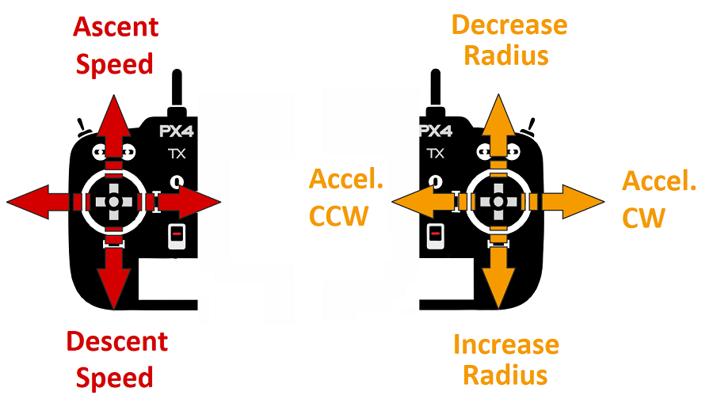

# PX4 비행 모드 개요

비행 모드는 자동조종장치가 원격 제어에 응답하는 방법과 자율 비행 기체를 관리하는 방법을 정의합니다.

이 모드는 이륙 및 착륙과 같은 일반적인 작업의 자동화에서 다시 수평 비행을 하기 쉽도록 고정된 경로 또는 위치로 기체를 유지하는 메커니즘에 이르기까지 사용자(조종사)에게 다양한 유형과 수준의 자동 조종을 도와줍니다.

이 항목에서는 다양한 기체 유형에 적용되는 비행 모드의 개요를 설명합니다 : [멀티콥터](#multicopter) (MC), [고정익](#fixed-wing) (FW), [VTOL](#vertical-take-off-and-landing-vtol) , [로버/보트](#rover-boat).

:::tip
특정 비행 모드에 대한 자세한 정보는 [비행 > 비행 모드](../flight_modes/README.md)를 참고하십시오.
:::

## 모드 전환

조종사는 원격 조종 장치 또는 지상 통제 장치의 스위치를 사용하여 비행 모드를 전환할 수 있습니다. ([비행 모드 구성](../config/flight_mode.md) 참조).

모든 비행기 유형에서 모든 비행 모드를 사용할 수 있는 것은 아니며 일부 모드는 비행기 유형에 따라 동작 방식의 차이가 있을 수 있습니다.

일부 비행 모드는 특정 비행 전 및 비행 중 상태(예 : GPS 잠금 장치, 속도 센서, 축을 따라 비행기의 자세 감지)에서만 유의미합니다. PX4는 적절한 조건이 충족될 때까지 해당 모드로의 전환을 허용하지 않습니다.

마지막으로, 멀티콥터 [자율 모드](#categories)에서 RC 스틱 이동은 [기본적으로](../advanced_config/parameter_reference.md#COM_RC_OVERRIDE) 기체를 [위치 모드](../flight_modes/position_mc.md)로 변경합니다 (중요한 배터리 안전 장치를 처리하지 않는 한). 고정익 비행에서는 스틱 이동이 무시됩니다.

## 자율 모드와 수동 모드 

비행 모드에는 *수동* 모드와 *자동* 모드가 있습니다. 수동 모드는 사용자가 RC 컨트롤 스틱(또는 조이스틱)을 통해 비행기를 제어하며, 자율 모드는 자동조종 프로그램으로 제어되며 조종사나 원격 제어는 필요하지 않습니다.

:::tip
일부 수동 모드에는 자동 조종 보조 기능이 있어 비행 제어을 보다 용이하게합니다. 예를 들어, 대부분의 모드는 RC 스틱이 중앙에 있을 때 운송체의 수평을 유지합니다.
:::

수동 모드는 "간편" 모드와 "곡예(Acro)" 모드로 더 나눌 수 있습니다. 간편 모드에서 롤 및 피치 스틱은 차량 각도를 설정하여 *수평면*을 기준으로 좌우로 앞으로 이동합니다. 이렇게 하면 움직임이 예측가능하고, 각도가 제어되기 때문에 기체가 뒤집히지 않습니다. 곡예 모드에서 RC 스틱은 각축을 중심으로 회전 속도를 제어합니다. 기체는 뒤집힐 수 있으며, 기동성이 높아 지는 반면에 비행 조종은 어려워집니다.

고정익: 

* 수동 간편 : [위치](#position-mode-fw), [고도](#altitude-mode-fw), [안정화](#stabilized-mode-fw), [수동](#manual-mode-fw)
* 수동 곡예 : [곡예](#acro-mode-fw)
* 자율 : [유지](#hold_fw), [복귀](#return-mode-fw), [미션](#mission-mode-fw), [이륙](#takeoff-mode-fw), [착륙](#land-mode-fw), [오프보드](#offboard-mode-fw)

멀티콥터: 

* 수동 간편 : [위치](#position-mode-mc), [고도](#altitude-mode-fcmc), [수동/안정화](#manual-stabilized-mode-mc), [궤도](#orbit-mode-mc)
* 수동 곡예 : [곡예](#acro-mode-mc)
* 자율 : [유지](#hold-mode-mc), [복귀](#return-mode-mc), [미션](#mission-mode-mc), [이륙](#takeoff-mode-mc), [착륙](#land-mode-mc), [나를 따르나](#follow-me-mode-mc), [오프 보드](#offboard-mode-mc)

로보/보트:

* 수동-간편 : [수동](#manual-mode-ugv)
* 자율: [임무](#mission-mode-ugv)

:::note
수동 및 이무 모드만 지원됩니다. 다른 모드로 전환할 수 있지만, 동작은 수동 모드와 동일합니다.
:::

## 요점 

아래 아이콘은 문서 내에서 사용됩니다: 

| 아이콘                                                                                                                                                                                                                                                                                                                                 | 설명                                           |
| ----------------------------------------------------------------------------------------------------------------------------------------------------------------------------------------------------------------------------------------------------------------------------------------------------------------------------------- | -------------------------------------------- |
|                                                                                                                                                                                       | 수동 모드 원격 제어 필수.                              |
|                                                                                                                                                                                                    | 자동 모드. RC 제어는 모드 변경을 제외하고 기본적으로 비활성화되어 있습니다. |
|                                                                                                                                                                             | 위치 수정이 필요(예 : GPS, VIO 또는 기타 위치 확인 시스템).     |
|                                                                                                                                                                                                                | 필요한 고도 (예 : 기압계, 거리계).                       |
| [&nbsp;&nbsp;](#key_difficulty) | 비행 모드 난이도 (초급 ~ 고급)                          |

## 멀티콥터

### 위치 모드 (멀티콥터)

&nbsp;&nbsp;

[위치 모드](../flight_modes/position_mc.md)는 롤 앤 피치 스틱이지면에서 좌우 방향 및 전후 방향으로 속도를 제어하는 비행하기 쉬운 RC 모드입니다 (차량의 "전방"기준). 스틱을 풀거나 중앙에 놓으면 차량이 능동적으로 제동하고 수평을 맞추고 3D 공간의 위치에 고정되어 바람과 기타 힘을 보상합니다.

:::tip
위치 모드는 새 전단지를위한 가장 안전한 수동 모드입니다. [고도](#altitude_mc) 및 [수동/안정화](#manual_stabilized_mc) 모드와 달리, 기체는 바람의 저항에 의해 감속할 때 까지 계속되는 대신 스틱이 중앙에 있을 때 정지합니다.
:::

### 고도 모드 (멀티콥터)

&nbsp;&nbsp;

[고도 모드](../flight_modes/altitude_mc.md)에서는 *상대적으로* 비행하기 용이한 RC 모드로, 롤 및 피치 스틱이 차량 이동을 좌우 및 앞뒤 방향(차량의 "전면" 기준)으로 제어하고, 요 스틱은 수평면에서 회전 속도를 제어하고 스로틀은 상승 하강 속도를 제어합니다.

스틱을 놓거나 중앙에 놓으면 기체의 수평을 유지하고, 현재 *고도*를 유지합니다. 수평면에서 이동하는 경우 기체는 바람 저항에 의해 모멘텀이 소실될 때까지 계속됩니다. 바람이 불면 기체는 바람 따라 표류합니다.

:::tip
*자세 모드*는 초보 비행자에게 가장 안전한 비 GPS 수동 모드입니다. [수동/안정화](#manual_stabilized_mc) 모드와 유사하지만, 스틱을 놓으면 차량 고도가 안정화됩니다.
:::

### 수동/안정화 모드 (멀티콥터)

&nbsp;&nbsp;

[수동/안정화](../flight_modes/manual_stabilized_mc.md)모드는 RC 조종 스틱이 중앙에 있을 때 멀티콥터를 안정화합니다. 기체를 수동으로 움직이거나 조종하려면 스틱을 중앙의 바깥쪽으로 제어합니다.

:::note
이 멀티콥터 모드는 *수동* 또는 *안정화* 모드를 설정하여 활성화됩니다.
:::

수동 제어에서 롤과 피치 스틱이 각 축을 중심으로 기체 (자세)을 각도로 제어하면 요 스틱이 수평면 위의 회전 속도를 제어하고 스로틀은 고도/속도를 제어합니다 .

컨트롤 스틱을 놓으면 센터 데드 존으로 돌아갑니다. 멀티 콥터는 수평을 유지하고 롤 및 피치 스틱이 중앙에 오면 멈추게 됩니다. 기체는 적절하게 균형을 잡고, 스로틀이 적절하게 설정되고, 외력이 가해지지 않으면 (예 : 바람), 위치와 고도를 유지합니다. 기체는는 바람 방향으로 표류하게 되며, 고도를 유지하기 위해서는 스로틀을 제어하여야 합니다.

### 곡예 모드 (멀티콥터)

&nbsp;&nbsp;

[곡에 모드](../flight_modes/acro_mc.md)는 롤과 루프등의 곡예 비행을 위한 RC 모드입니다.

롤, 피치 및 요 스틱은 각 축을 중심으로 한 각도 회전 속도를 제어하고 각 축과 출력은 직접 출력 믹서로 전달됩니다. 스틱이 중앙에 놓여지면 기체는 회전을 멈추지만 현재 방향 (측면, 반전 등)과 현재 모멘텀에 따라 움직입니다.

<!-- image above incorrect: https://github.com/PX4/px4_user_guide/issues/182 -->

### 궤도 모드 (멀티콥터)

&nbsp;

[궤도 모드](../flight_modes/orbit.md)를 사용하면 멀티 콥터 (또는 멀티 콥터 모드의 VTOL)가 원을 그리며 날아 가며 항상 중심을 향하도록 요잉할 수 있습니다.

이 모드를 활성화하고 궤도의 중심 위치와 초기 반경을 설정하려면 GCS(지상제어 프로그램)가 *필요*합니다. 기본적으로 기체는 시계 방향으로 특정 위치를 중심으로 저속(1 m/s)의 궤도 비행을 수행합니다. RC 제어는 선택 사항이며 궤도 고도, 반경, 속도와 방향 제어합니다.

### 유지 모드 (멀티콥터)

&nbsp;

[유지 모드](../flight_modes/hold.md)는 멀티콥터가 현재 위치와 고도에서 호버링합니다 (바람과 다른 힘에 대한 현 위치 유지). 유지 모드를 사용하여 임무를 일시 중지하거나 비상시 기체를 다시 제어할 수 있습니다. It can be activated with a pre-programmed RC switch or the *QGroundControl* **Pause** button.

### Return Mode (MC)

&nbsp;

[Return mode](../flight_modes/return.md) causes the vehicle to fly a clear path to a safe location. The mode may be activated manually (via a pre-programmed RC switch) or automatically (i.e. in the event of a [failsafe](../config/safety.md) being triggered).

The return behaviour depends on parameter settings, and may follow a mission path and/or mission landing pattern (if defined). By default a mulitcopter will simply ascend to a safe height, fly to its home position, and then land.

### Mission Mode (MC)

&nbsp;

[Mission mode](../flight_modes/mission.md) causes the vehicle to execute a predefined autonomous [mission](../flying/missions.md) (flight plan) that has been uploaded to the flight controller. The mission is typically created and uploaded with a Ground Control Station (GCS) application.

:::tip
The PX4 GCS is called [QGroundControl](https://docs.qgroundcontrol.com/en/). *QGroundControl* is the same application we use for [configuring PX4](../config/README.md).
:::

### Takeoff Mode (MC)

&nbsp;

[Takeoff](../flight_modes/takeoff.md) mode causes the multicopter to climb vertically to takeoff altitude and hover in position.

### Land Mode (MC)

&nbsp;

[Land mode](../flight_modes/land.md) causes the multicopter to land at the location at which the mode was engaged.

### Follow Me Mode (MC)

&nbsp;

[Follow Me mode](../flight_modes/follow_me.md) causes a multicopter to autonomously follow and track a user providing their current position setpoint. Position setpoints might come from an Android phone/tablet running *QGroundControl* or from a MAVSDK app.

### Offboard Mode (MC)

&nbsp;

[Offboard mode](../flight_modes/offboard.md) causes the multicopter to obey a position, velocity or attitude setpoint provided over MAVLink.

:::note
This mode is intended for vehicle control from companion computers and ground stations!
:::

## 고정익

### Position Mode (FW)

&nbsp;&nbsp;

[Position mode](../flight_modes/position_fw.md) is an easy-to-fly RC mode in which, when the sticks are released/centered, the vehicle will level and fly a straight line ground track in the current direction — compensating for wind and other forces.

The throttle determines airspeed (at 50% throttle the aircraft will hold its current altitude with a preset cruise speed). Pitch is used to ascend/descend. Roll, pitch and yaw are all angle-controlled (so it is impossible to roll over or loop the vehicle).

:::tip
Position mode is the safest fixed-wing manual mode for new fliers.
:::

### Altitude Mode (FW)

&nbsp;&nbsp;

[Altitude mode](../flight_modes/altitude_fw.md) makes it easier for users to control vehicle altitude, and in particular to reach and maintain a fixed altitude. The mode will not attempt to hold the vehicle course against wind.

The climb/descent rate is controlled via the pitch/elevator stick. Once centered the autopilot latches onto the current altitude and will maintain it during yaw/roll, and at any airspeed. The throttle input controls airspeed. Roll and pitch are angle-controlled (so it is impossible to roll over or loop the vehicle).

When all remote control inputs are centered (no roll, pitch, yaw, and ~50% throttle) the aircraft will return to straight, level flight (subject to wind) and keep its current altitude.

:::tip
*Altitude mode* is the safest non GPS guided mode appropriate for beginners learning how to fly. It is just like [Manual](#manual_fw) mode but additionally stabilizes the vehicle altitude when the pitch stick is released.
:::

### Stabilized Mode (FW)

&nbsp;&nbsp;

[Stabilized mode](../flight_modes/stabilized_fw.md) puts the vehicle into straight and level flight when the RC sticks are centered, maintaining the horizontal posture against wind (but not vehicle heading and altitude).

The vehicle climb/descends based on pitch input and performs a coordinated turn if the roll/pitch sticks are non-zero. Roll and pitch are angle controlled (you can't roll upside down or loop).

:::tip
*Stabilized mode* is much easier to fly than [Manual mode](#manual_fw) because you can't roll or flip it, and it is easy to level the vehicle by centering the control sticks.
:::

The vehicle will glide if the throttle is lowered to 0% (motor stops). In order to perform a turn the command must beheld throughout the maneuver because if the roll is released the plane will stop turning and level itself (the same is true for pitch and yaw commands).

### Acro Mode (FW)

&nbsp;&nbsp;

[Acro mode](../flight_modes/acro_fw.md) is the RC mode for performing acrobatic maneuvers e.g. rolls, flips, stalls and acrobatic figures.

The roll, pitch and yaw sticks control the rate of angular rotation around the respective axes and throttle is passed directly to the output mixer. When sticks are centered the vehicle will stop rotating, but remain in its current orientation (on its side, inverted, or whatever) and moving according to its current momentum.

### Manual Mode (FW)

&nbsp;&nbsp;

[Manual mode](../flight_modes/manual_fw.md) sends RC stick input directly to the output mixer for "fully" manual control.

:::tip
This is the hardest mode to fly, because nothing is stabilised. Unlike [Acro Mode](#acro_fw) if the RP stick is centered the vehicle will not automatically stop rotating around the axis - the pilot actually has to move the stick to apply force in the other direction.
:::

:::note
This is the only mode that overrides the FMU (commands are sent via the safety coprocessor). It provides a safety mechanism that allows full control of throttle, elevator, ailerons and rudder via RC in the event of an FMU firmware malfunction.
:::

### Hold Mode (FW)

&nbsp;

[Hold](../flight_modes/hold.md) causes a fixed-wing vehicle to start circling around the current position at its current altitude. The mode can be used to pause a mission or to help regain control of a vehicle in an emergency. It can be activated with a pre-programmed RC switch or the *QGroundControl* **Pause** button.

### Return Mode (FW)

&nbsp;

[Return mode](../flight_modes/return.md) causes the vehicle to fly a clear path to a safe location. The mode may be activated manually (via a pre-programmed RC switch) or automatically (i.e. in the event of a [failsafe](../config/safety.md) being triggered).

The return behaviour depends on parameter settings, and may follow a mission path and/or mission landing pattern (if defined). By default a fixed wing vehicle will ascend to a safe height and use a mission landing pattern if one exists, otherwise it will fly to the home position and circle.

### Mission Mode (FW)

&nbsp;

[Mission mode](../flight_modes/mission.md) causes the vehicle to execute a predefined autonomous [mission](../flying/missions.md) (flight plan) that has been uploaded to the flight controller. The mission is typically created and uploaded with a Ground Control Station (GCS) application.

:::tip
The PX4 GCS is called [QGroundControl](https://docs.qgroundcontrol.com/en/). *QGroundControl* is the same application we use for [configuring PX4](../config/README.md).
:::

### Takeoff Mode (FW)

&nbsp;

[Takeoff mode](../flight_modes/takeoff.md#fixed_wing) initiates the vehicle takeoff sequence. The specific launch behaviour depends on the configured takeoff mode (catapult/hand-launch mode or runway takeoff mode).

### Land Mode (FW)

&nbsp;

[Land mode](../flight_modes/land.md) causes the vehicle to turn and land at the location at which the mode was engaged. Fixed wing landing logic and parameters are explained in the topic: [Landing (Fixed Wing)](../flying/fixed_wing_landing.md).

### Offboard Mode (FW)

&nbsp;

[Offboard mode](../flight_modes/offboard.md) causes the fixed wing vehicle to obey attitude setpoints provided over MAVLink.

:::note
This mode is intended for vehicle control from companion computers and ground stations!
:::

## 수직이착륙기(VTOL)

A VTOL aircraft can fly as either a multicopter or as fixed-wing vehicle. The multicopter mode is mainly used for take off and landing while the fixed wing mode is used for efficient travel and/or mission execution.

Generally the flight modes for VTOL vehicles are the same as for [multicopter](#mc_flight_modes) when flying in MC mode and [fixed-wing](#fw_flight_modes) when flying in FW mode.

The switch between modes is initiated either by the pilot using an RC switch or automatically by PX4 when needed in the Auto modes.

A few notes:

* VTOL [Return mode](../flight_modes/return.md) uses a mission landing by default, if defined.

## Rover/Boat

Ground vehicles and boats only support [manual mode](#manual-mode-ugv) and [mission mode](#mission-mode-ugv) (while you can switch to other modes, these all behave just like manual mode).

### Manual Mode (UGV)

&nbsp;&nbsp;

:::note
This mode is enabled unless mission mode is set.
:::

*Manual mode*<!-- [Manual](../flight_modes/manual_ugv.md) --> stops motors when RC control sticks are centered. To move the vehicle you move the sticks outside of the center.

<!--
When under manual control the roll and pitch sticks control the angle of the vehicle (attitude), the yaw stick controls the rate of rotation above the horizontal plane, and the throttle controls altitude/speed.
-->

As soon as you release the control sticks they will return to the center deadzone. This will turn off the motors and center the wheels/rudder. There is no active braking, so the vehicle may continue to move until its momentum dissipates (and for a boat, continue to drift).

<!--

-->

### Mission Mode (UGV)

&nbsp;

*Mission mode* <!-- [Mission mode](../flight_modes/mission.md) --> causes the vehicle to execute a predefined autonomous 

[mission](../flying/missions.md) (flight plan) that has been uploaded to the flight controller. The mission is typically created and uploaded with a Ground Control Station (GCS) application.

:::tip
The PX4 GCS is called [QGroundControl](https://docs.qgroundcontrol.com/en/). *QGroundControl* is the same application we use for [configuring PX4](../config/README.md).
:::

## Further Information

* [Flying > Flight Modes](../flight_modes/README.md) - Detailed technical explanation of all modes
* [Basic Configuration > Flight Modes](../config/flight_mode.md) - How to map RC control switches to specific flight modes