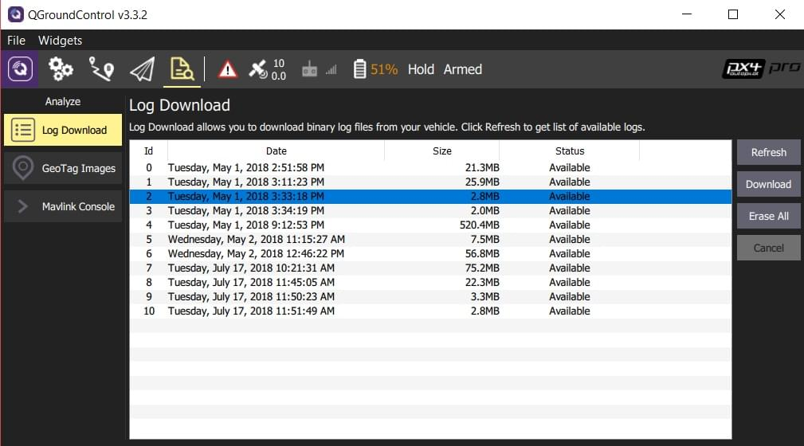

# 비행 기록

PX4는 성능 분석을 위하여 상세한 항공기 상태 데이터와 센서 데이터를 로그 파일에 기록합니다. 로그 파일 다운로드, 분석, 검토 및 개발 팀과 공유하는 방법을 설명합니다.

:::tip
비행 기록을 보관하는 것은 일부 국가와 지역에서는 법률적으로 필수 사항일 수 있습니다.
:::

## 비행 콘트롤러에서 로그 다운로드

[QGroundControl](http://qgroundcontrol.com/)에서 **[분석보기 &gt; 로그 다운로드](https://docs.qgroundcontrol.com/en/analyze_view/log_download.html)**를 클릭하여 로그를 다운로드합니다.

## 로그 분석

온라인 [Flight Review](http://logs.px4.io) 프로그램에 로그 파일을 먼저 업로드합니다. 업로드 후 로그 분석 페이지 링크를 이메일로 전송됩니다.

[비행 검토를 위한 로그 분석](../log/flight_review.md)은 챠트 해석 방법을 설명하고, 과도한 진동, 불량한 PID 튜닝, 포화된 콘트롤러, 불균형 차량, GPS 잡음 등의 일반적인 문제의 원인을 확인할 수 있습니다.

:::note PX4 로그의 시각화 및 분석을 위한 도구들은 많이 있습니다. 자세한 내용은 [비행 분석](../dev_log/flight_log_analysis.md)을 참고하십시오.
:::

:::tip
차량에 고속의 MAVLink 연결이 있는 경우에는(원격 분석 링크뿐만 아니라) *QGroundControl*을 사용하여 로그를 *Flight Review*에 자동으로 업로드할 수 있습니다. 자세한 내용은 [설정 &gt; MAVLink 설정 &gt; MAVLink 2 로깅 (PX4만 해당)](https://docs.qgroundcontrol.com/en/SettingsView/MAVLink.html#logging)을 참고하십시오.
:::

## PX4 개발자가 검토할 로그 파일 공유

[Flight Review](http://logs.px4.io) 로그 파일 링크는 [지원 포럼](../contribute/support.md#forums-and-chat) 또는 [Github 문제](../README.md#reporting-bugs-issues)에서 공유하여 토론할 수 있습니다.

## 로그 설정

로그 시스템은 기본적으로 [Flight Review](http://logs.px4.io)에서 사용하기 위하여 최적화된 로그를 수집합니다.

로그는 [SD 로깅](../advanced_config/parameter_reference.md#sd-logging) 매개변수를 사용하거나 SD 카드의 파일을 사용도록 설정합니다. 자세한 정보는 [로그 설정](../dev_log/logging.md#configuration)을 참고하십시오.

## 주요 링크

- [비행 검토](http://logs.px4.io)
- [비행 검토 프로그램을 이용한 로그 분석](../log/flight_review.md)
- [비행 로그 분석](../dev_log/flight_log_analysis.md)
