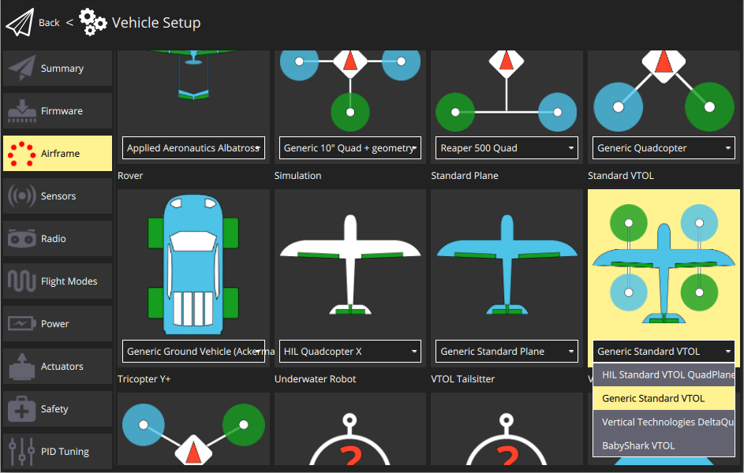

# 기체 프레임 선택

## 항공기 기체

PX4를 사용하여 비행체 제어시에 가장 중요한 질문은 "용도가 무엇인가?" 입니다. 취미용, 업무용에 따라서 계획 비행 시간과 비행 반경을 좌우합니다.

- 정밀한 호버링과 장시간 비행이 필요하지 않으면, **멀티콥터**을 선택하는 것이 좋습니다.
- 장거리 광역 비행에는 고정익이 적합합니다(예: **비행기**).
- **VTOL** - 수직 이착륙인 비행기입니다. 멀티콥터의 수직 이착륙과 호버링의 장점과, 고정익의 전방 비행 효율성의 장점도 있습니다.

[기체 참조](../airframes/airframe_reference.md)에서 PX4와 호환 가능한 프레임 목록을 참고할 수 있습니다.

기체를 선택/구입/조립하면, [초기 설정 과정](../config/README.md)중에 *QGroundControl*에서 사전 설정으로 미리 설정해야 합니다.

<!-- 
### Types of VTOL

Depending on the way the VTOL flies in copter mode or how it makes the transition there are three main types of VTOL aircraft.

**Multicopter - Airplane** - Generic airplane with pusher/puller motor and separate motors for vertical thrust. The VTOL hovers with its vertical motors. The transition is done when the forward motors are enabled and after the plane reaches cruising speed the hover motors are disabled in horizontal flight.

**Tail-sitter** - Airplane with two or more motors that sits on its tail while landed, then in vertical flight it balances in vertical frame orientation. The transition is made when the whole airplane changes its orientation from vertical to horizontal.

**Tilt-rotor** - Airplane with two or more motors that mechanical swing around an Y axis. The transition is done when gradually the motors change the thrust vector from vertical to horizontal.

-->

## 지상 기체

## 해양 기체