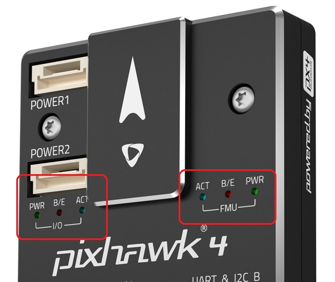

# LED 신호 설명 (Pixhawk 시리즈)

[Pixhawk 비행 콘트롤러 시리즈](../flight_controller/pixhawk_series.md)는  기체의 현재 상태를 LED에 표시합니다.
- [UI LED](#ui_led)는 *비행 준비*와 관련된 상태 정보를 사용자에게 제공합니다.
- [상태 LED](#status_led)는 PX4IO와 FMU SoC에 대한 상태 정보를 제공합니다. 전원, 부트 로더 모드, 활동 및 오류에 관련된 정보를 표시합니다.

## UI LED

RGB *UI LED*는 차량의 *비행 준비* 상태를 표시합니다. RGB LED는 일반적으로 비행 콘트롤러에도 장착할 수 있는 초고휘도 I2C 주변장치입니다. FMUv4에는 보드에는 장착되어 있지 않고 GPS에 장착된 LED를 사용합니다.

아래 이미지는 LED와 차량 상태의 관계를 나타냅니다.

:::warning PX4가 아직 [비행 사전 점검을 통과](../flying/pre_flight_checks.md) 하지 않았기 때문에, GPS 잠금 장치(녹색 LED)가 있어도 기체에 시동을 걸 수 없습니다. **이륙하려면 전역 위치 추정자가 필요합니다.**
:::

:::tip
오류(적색 깜박임) 또는 차량이 GPS 잠금을 할 수없는 경우(파란색에서 녹색으로 변경)에는 보정 상태와 오류를 포함하여 *QGroundControl*에서 자세한 상태 정보를 확인할 수 있습니다. [사전 비행 점검(내부)](../flying/pre_flight_checks.md)에서 보고된 메시지입니다. 또한 GPS 모듈이 연결 여부, Pixhawk와 GPS 연동 여부, 정확한 GPS 위치를 전송 여부를 확인하십시오.
:::

* **[파란색 단색] 무장, GPS 잠금 없음:** 차량 시동 완료 및 GPS 위치 잠금이 없음을 나타냅니다. 기체에 시동을 걸면, PX4는 모터를 제어하여 드론을 조종합니다. 고속 회전하는 프로펠러는 항상 위험하므로, 시동시에 조심하여야 합니다. 이 모드에서는 차량이 안내 임무를 수행 할 수 없습니다.

* ** [파란색 깜박임] 무장 해제, GPS 잠금 없음: ** 위와 유사하지만 기체의 시동이 꺼져있습니다. 모터를 제어할 수 없지만, 다른 하위 시스템들은 작동한다는 것을 의미합니다.

* ** [녹색으로 켜짐] 무장 됨, GPS 잠금: ** 차량의 시동이 걸렸으며, GPS 장치에서 유효한 위치 정보를 획득하였음을 의미합니다. 기체에 시동을 걸면, PX4는 모터를 제어하여 드론을 조종합니다. 고속 회전하는 프로펠러는 항상 위험하므로, 시동시에 조심하여야 합니다. 이 모드에서 기체는 안내 임무를 수행할 수 있습니다.

* ** [녹색 깜박임] 무장 해제, GPS 잠금: ** 위와 유사하지만 차량의 시동이 꺼져있습니다. 모터는 제어할 수 없지만, GPS 위치 잠금을 포함한 다른 하위 시스템들은 작동합니다.

* ** [진한 보라색] 사고 방지 모드: **이 모드는 비행중 기체에 문제 발생시에 활성화됩니다. 사고 방지 모드에서는 기체는 이륙 위치로 복귀하거나, 현재 위치에 착륙할 수 있습니다.

* **[주황색 고정] 배터리 부족 경고: ** 기체의 배터리가 부족하여 위험한 상태임을 나타냅니다. 특정 시점이 지나면, 차량은 안전 방지 모드로 전환됩니다. 그러나, 이 모드는 종료시점에는 경고 메시지를 표시합니다.

* ** [빨간색 깜박임] 오류/설정 필요: ** 비행전에 자동조종장치를 설정이나 보정이 필요한 상태입을 표시합니다. 자동조종장치를 지상관제국에 연결하여 무슨 문제인지를 확인하십시오. 설정 프로세스를 완료후에도, 자동조종장치가 여전히 빨간색으로 깜박이면 다른 오류가 있음을 나타냅니다.

## LED 상태

3개의 *상태 LED*는 FMU SoC에 대한 상태를 표시하고, 3개는 PX4IO (있는 경우)에 대한 상태를 표시합니다. 전원, 부트 로더 모드, 활동 및 오류에 관련된 정보를 표시합니다.

전원이 켜지면 FMU와 PX4IO CPU는 먼저 부트로더를 실행후 응용 프로그램을 실행합니다. 아래 표는 부트로더와 앱의 LED를 상태를 표시 방법을 설명합니다.

| 색상    | 라벨      | 부트로더 사용법           | 앱 사용법    |
| ----- | ------- | ------------------ | -------- |
| 청색    | 활동      | 부트로더가 데이터를 수신시 깜빡임 | 시동 상태 표시 |
| 적색/황색 | 부트로더 에러 | 부트로더에서 깜빡임         | 에러 표시    |
| 녹색    | 파워      | 부트로더에서 사용되지 않음     | 시동 상태 표시 |

:::note
위에 표시된 LED 레이블은 일반적인 사항이며, 일부 보드에서는 차이가 날 수 있습니다.
:::

LED가 의미하는 메시지에 관한  자세한 정보는 아래에서 설명합니다( "x"는 "모든 상태"를 의미).

| 적색/황색 | 청색  | 녹색    | 설명                                                     |
| ----- | --- | ----- | ------------------------------------------------------ |
| 10Hz  | x   | x     | 오버로드 CPU 부하 &gt; 80 % 또는 RAM 사용량 &gt; 98 % |
| OFF   | x   | x     | CPU 과부하<= 80%, or RAM usage <= 98%                     |
| NA    | OFF | 4 Hz  | Actuator_armed -> 시동 && 사고방지                           |
| NA    | ON  | 4 Hz  | Actuator_armed -> 시동 && 사고방지                           |
| NA    | OFF | 1 Hz  | !actuator_armed -> 시동 && actuator_armed ->시동 준비      |
| NA    | OFF | 10 Hz | !actuator_armed -> 시동 && actuator_armed ->시동 준비      | 
